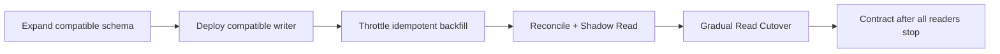

> **검수 기준 — 2026-09-27**
>
> “무중단”은 DDL 한 줄의 보장이 아니라 혼합 애플리케이션 버전·트래픽·복제·백필·롤백을 포함한 운영 목표다. Lock과 default/NOT NULL의 동작은 DBMS·버전·테이블 크기로 확인한다.
> 참고: [PostgreSQL ALTER TABLE](https://www.postgresql.org/docs/17/sql-altertable.html), [PostgreSQL CREATE INDEX CONCURRENTLY](https://www.postgresql.org/docs/17/sql-createindex.html#SQL-CREATEINDEX-CONCURRENTLY), [MySQL Online DDL](https://dev.mysql.com/doc/refman/8.4/en/innodb-online-ddl-operations.html)

## 1. 배포 한 번에 의미를 바꾸지 않는다

먼저 호환 가능한 새 컬럼·테이블·Index를 추가한다. 구버전과 신버전이 동시에 실행되는 기간을 가정해 읽기·쓰기 계약을 유지하고, 새 경로가 관측과 대사를 통과한 뒤 읽기를 전환한다. 마지막에 모든 Writer·배치·CDC 소비자가 구 경로를 사용하지 않는지 확인하고 Contract를 수행한다.



| 단계 | 보호 장치 | 롤백 |
|---|---|---|
| Expand | Lock·rewrite·disk 확인 | 미사용 구조 유지 |
| Write 전환 | 동일 트랜잭션/CDC·멱등 변환 | 구 Writer 또는 dual-read 유지 |
| Backfill | 작은 Batch·throttle·checkpoint | 중단 후 재개 |
| Read 전환 | shadow diff·canary·freshness | 구 읽기로 즉시 복귀 |
| Contract | 구 버전 0·배치 중단 확인 | 삭제 전 유예·백업 |

```sql
UPDATE orders
SET normalized_code = normalize(legacy_code),
    normalized_version = :migration_version
WHERE id > :cursor AND id <= :end
  AND normalized_code IS NULL
  AND legacy_code = :expected_legacy_code;
```

Cursor만으로 최신 쓰기를 보호할 수 없다. Backfill 시점의 기대값·row version·updated_at을 조건에 넣고 영향 행 수를 기록한다. Dual Write를 두 번의 독립 요청으로 보내면 불일치가 생길 수 있으므로 같은 DB 트랜잭션·생성 컬럼·Outbox/CDC 중 어떤 원천에서 파생할지 정한다.

## 2. 완료를 데이터로 증명한다

Null 수, 구·신 값 불일치, 변환 실패, Backfill 속도, 재시작 checkpoint, 복제 지연, Lock 대기를 관측한다. 읽기 전환은 전체 평균이 아니라 표본·고위험 행·Tenant별 shadow diff와 freshness를 확인한 뒤 단계적으로 진행한다. Contract는 모든 실행 버전·배치·CDC consumer가 구 필드를 읽거나 쓰지 않는다는 증거가 있을 때만 수행한다.

### 실패 입력 → 판단 → 복구

큰 테이블에 새 `NOT NULL` 컬럼과 default를 한 번에 추가했더니 긴 Lock 대기와 Replica Lag이 발생했다고 하자. 즉시 DDL을 반복하지 말고 해당 DBMS가 metadata-only인지 table rewrite인지, 현재 transaction·Lock holder·디스크·Replica 상태를 확인한다. Expand는 nullable로 작게 진행하고, 애플리케이션 호환 Writer를 배포한 뒤 idempotent Backfill과 검증을 수행한다. Backfill 중 최신 Writer가 값을 바꾸면 expected version 조건에서 제외해 재조회·대사 Queue로 보내고, 읽기 회귀가 발생하면 구 읽기로 Rollback한다.

> **면접 포인트** — DDL 문법보다 혼합 버전 기간, Lock/rewrite 차이, 데이터 대사, 재시작 가능한 Cursor, 최신 쓰기 보호, 읽기 전환과 삭제의 비가역성을 설명한다.
