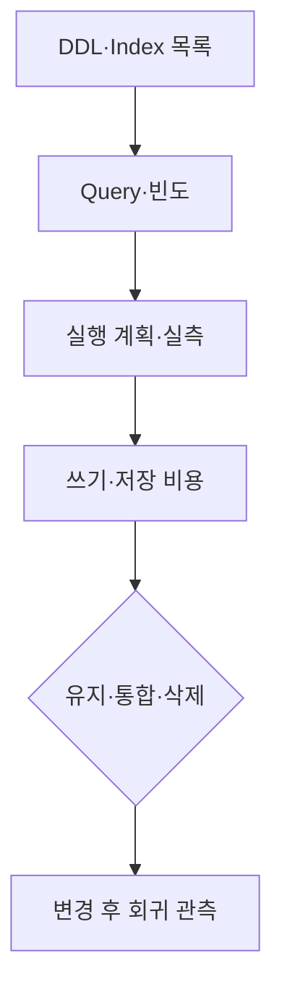

## 1. 인덱스 목록만 보지 않는다

실제 Query 형태, 조건 분포, 정렬, 반환 행 수와 실행 계획을 연결한다. 복합 인덱스의 Prefix가 단일 인덱스를 대체할 수 있어도 크기, Covering, 엔진 동작과 다른 Query를 확인해야 한다.



| 리뷰 냄새 | 확인할 반례 | 개선 후보 |
|---|---|---|
| 모든 컬럼 인덱스 | 쓰기 많은 테이블 | 핵심 Query만 유지 |
| 낮은 선택도 단독 | Partial Index 가능성 | 조건부·복합 인덱스 |
| 중복 Prefix | Covering·크기 차이 | 통합 후 검증 |
| 미사용 통계 | 관측 기간·Failover 역할 | 숨김/비활성 후 삭제 |

```sql
EXPLAIN (ANALYZE, BUFFERS)
SELECT id, created_at
FROM orders
WHERE user_id = :user
ORDER BY created_at DESC
LIMIT 20;
```

> **리뷰 주의** — 운영에서 `ANALYZE`는 Query를 실제 실행한다. 변경 Query의 부작용과 부하를 확인하고 안전한 환경·값으로 측정한다.

## 2. 삭제도 단계적으로 한다

충분한 관측 기간과 배치·월말 Query를 포함해 사용 여부를 확인한다. 지원하면 먼저 Invisible/비활성 상태로 회귀를 관찰하고, 삭제 뒤 Lock과 복제 지연도 감시한다.

> **면접 포인트** — 인덱스는 읽기 최적화 구조이자 모든 쓰기가 유지해야 할 복제 데이터라는 양면을 설명한다.
