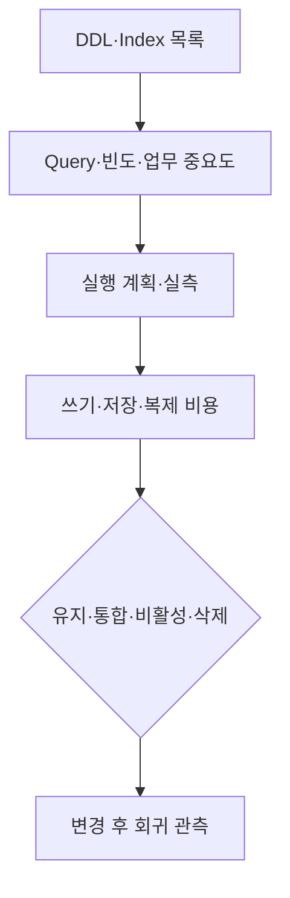

> **검수 기준 — 2026-09-27**
>
> 인덱스 사용 통계·숨김·삭제 기능은 DBMS별로 다르다. `EXPLAIN ANALYZE`는 일반적으로 Query를 실제 실행하지만, PostgreSQL의 `ANALYZE` 명령은 통계를 수집한다. 두 명령을 혼동하지 않고 운영 부하와 부작용을 확인한다.
> 참고: [PostgreSQL EXPLAIN](https://www.postgresql.org/docs/17/using-explain.html), [PostgreSQL pg_stat_user_indexes](https://www.postgresql.org/docs/17/monitoring-stats.html), [MySQL Invisible Indexes](https://dev.mysql.com/doc/refman/8.4/en/invisible-indexes.html)

## 1. 인덱스 목록만 보지 않는다

실제 Query 형태, 조건 분포, 정렬, 반환 행 수와 실행 계획을 연결한다. 복합 인덱스의 Prefix가 단일 인덱스를 대체할 수 있어도 covering 여부·키 순서·크기·DBMS access method·다른 Query의 정렬 요구를 확인한다.


```mermaid
flowchart TD
    D[DDL·Index 목록] --> Q[Query·빈도·업무 중요도]
    Q --> P[실행 계획·실측]
    P --> W[쓰기·저장·복제 비용]
    W --> C{유지·통합·비활성·삭제}
    C --> M[변경 후 회귀 관측]
```

| 리뷰 냄새 | 확인할 반례 | 개선 후보 |
|---|---|---|
| 모든 컬럼 인덱스 | 쓰기 많은 테이블·낮은 사용률 | 핵심 Query와 제약만 유지 |
| 낮은 선택도 단독 | 특정 값만 희소·Partial/filtered 가능 | 조건부·복합 인덱스 |
| 중복 Prefix | Covering·정렬·크기 차이 | 통합 전 계획 회귀 검증 |
| 미사용 통계 | 짧은 관측 기간·배치·Failover 역할 | 숨김/비활성 후 삭제 |

```sql
EXPLAIN (ANALYZE, BUFFERS)
SELECT id, created_at
FROM orders
WHERE user_id = :user
ORDER BY created_at DESC
LIMIT 20;
```

`EXPLAIN ANALYZE`는 부작용 Query가 실제 실행될 수 있으므로 읽기 Query라도 운영 부하와 개인정보를 고려한다. PostgreSQL `ANALYZE`는 통계 수집 명령이며 Query를 실행한다는 뜻이 아니다. MySQL의 invisible index와 PostgreSQL의 가능한 대체 실험 도구도 기능 범위가 같지 않다.

## 2. 삭제도 단계적으로 한다

충분한 관측 기간에 배치·월말·장애 복구 Query와 제약 역할을 포함해 사용 여부를 확인한다. 지원하는 엔진에서는 먼저 invisible/비활성 상태로 optimizer 회귀를 관찰하고, 그렇지 않으면 별도 환경에서 계획을 재현한다. 삭제 뒤 Lock·복제 지연·재생성 시간·디스크를 감시하고 즉시 복구 가능한 DDL 절차를 준비한다.

### 실패 입력 → 판단 → 복구

사용 통계가 0인 `idx_orders_status`를 삭제하려고 하자. 먼저 통계가 수집된 기간과 failover/월말 Query, Unique·FK 보조 역할을 확인한다. MySQL에서 invisible로 바꾼 뒤 p95와 오류율이 악화되면 즉시 되돌리고, PostgreSQL이라면 동일한 기능이 있다고 가정하지 말고 테스트 환경에서 계획을 비교한다. 삭제 후 장애 Query가 발견되면 원래 DDL·대체 인덱스·복제 상태를 확인해 재생성하며, 단순히 “사용 횟수 0”을 근거로 영구 삭제하지 않는다.

> **면접 포인트** — 인덱스는 읽기 최적화 구조이자 모든 쓰기가 유지해야 할 복제 데이터다. 통계의 관측 한계와 DBMS별 비활성/삭제·복구 절차까지 설명한다.
