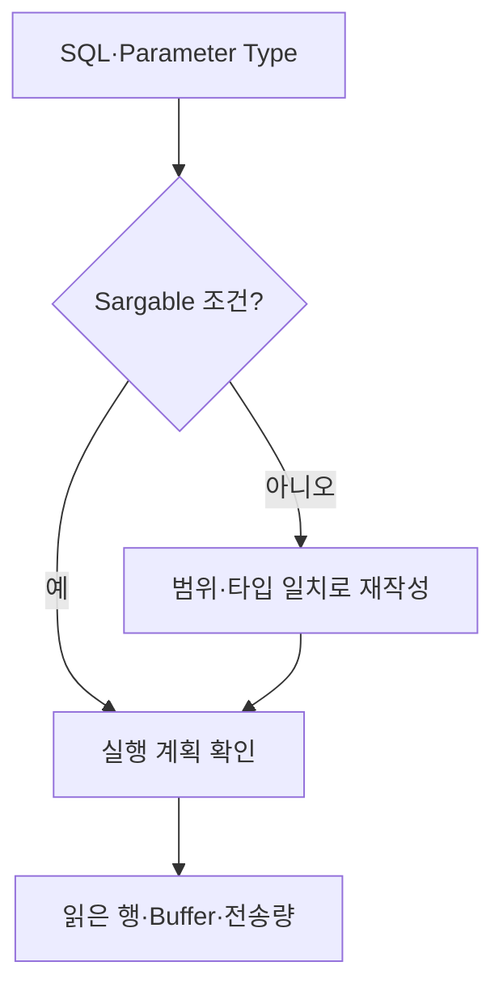

## 1. Index가 답할 수 있는 조건인지 본다

인덱스 컬럼에 함수를 적용하면 원래 정렬 순서로 범위를 찾기 어려울 수 있다. 날짜 전체를 찾을 때는 시작 이상·다음 날 미만의 반열린 구간이 경계와 정밀도를 명확히 한다.



| 리뷰 냄새 | 위험 | 개선 후보 |
|---|---|---|
| `date(column)=?` | 전체 Scan 가능 | 반열린 시간 범위 |
| 타입 불일치 | 컬럼 변환·추정 오류 | Parameter 타입 정렬 |
| 거대한 `IN` | Parse·계획·전송 비용 | 임시 집합 Join·Batch |
| `SELECT *` | I/O·네트워크·Covering 방해 | 필요한 열 명시 |

```sql
WHERE created_at >= :day_start
  AND created_at < :next_day_start
```

> **리뷰 함정** — 규칙만으로 함수를 금지하지 않는다. 함수 기반 Index가 의도적으로 있거나 데이터가 작을 수 있으므로 실행 계획과 부하로 우선순위를 정한다.

## 2. 의미 보존을 먼저 검증한다

재작성 전 Timezone, Null, 중복, Collation 의미가 같은지 테스트한다. 성능 개선은 실제 읽은 Page, 반환 행, 지연 분포와 쓰기 비용까지 확인한다.

> **면접 포인트** — SQL 모양을 고치는 데서 끝내지 말고 데이터 타입, 분포, Index 순서와 실행 계획을 연결한다.
