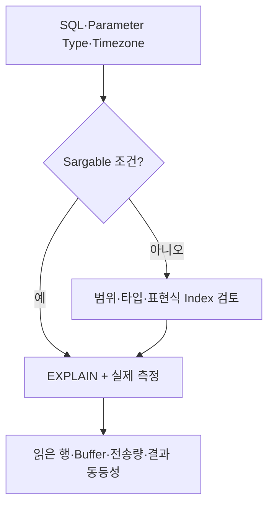

> **검수 기준 — 2026-09-27**
>
> Sargability와 암묵 형변환은 DBMS·타입·collation·함수 인덱스 지원에 따라 동작이 다르다. SQL을 기계적으로 고치지 말고 결과 의미와 실제 계획을 함께 비교한다.
> 참고: [PostgreSQL Indexes on Expressions](https://www.postgresql.org/docs/17/indexes-expressional.html), [MySQL Range Optimization](https://dev.mysql.com/doc/refman/8.4/en/range-optimization.html), [PostgreSQL Type Conversion](https://www.postgresql.org/docs/17/typeconv.html)

## 1. Index가 답할 수 있는 조건인지 본다

인덱스 컬럼에 함수를 적용하면 원래 정렬 순서로 범위를 찾기 어려울 수 있다. 날짜 전체를 찾을 때는 시작 이상·다음 날 미만의 반열린 구간이 경계와 정밀도를 명확히 한다. 단, 함수 기반/표현식 Index가 의도적으로 있거나 데이터가 작으면 함수 조건도 합리적일 수 있으므로 실행계획을 확인한다.


```mermaid
flowchart TD
    Q[SQL·Parameter Type·Timezone] --> S{Sargable 조건?}
    S -->|아니오| R[범위·타입·표현식 Index 검토]
    S -->|예| P[EXPLAIN + 실제 측정]
    R --> P
    P --> D[읽은 행·Buffer·전송량·결과 동등성]
```

| 리뷰 냄새 | 위험 | 개선 후보 |
|---|---|---|
| `date(column)=?` | 범위 Index 활용 저하 가능 | 반열린 시간 범위 또는 표현식 Index |
| 타입 불일치 | 컬럼 변환·추정·비교 의미 변화 | Parameter 타입 정렬 |
| 거대한 `IN` | Parse·계획·전송·메모리 비용 | 임시 집합 Join·Batch·배치 기준 |
| `SELECT *` | I/O·네트워크·Covering 방해 | 필요한 열 명시 |

```sql
WHERE created_at >= :day_start
  AND created_at < :next_day_start
```

## 2. 의미 보존을 먼저 검증한다

재작성 전 Timezone·DST, Null, 중복, Collation·대소문자, Parameter 타입과 inclusive/exclusive 경계가 같은지 확인한다. 수천 개 `IN` 목록도 항상 나쁜 것은 아니며 집합 크기·임시 테이블 통계·재사용·네트워크 비용과 실행계획으로 판단한다. `SELECT *`도 짧은 내부 Query에서는 문제가 작을 수 있지만 API 계약과 스키마 변경에 취약하다.

### 실패 입력 → 판단 → 복구

`DATE(created_at)=:day`를 반열린 범위로 바꿨는데 애플리케이션 timezone이 UTC이고 사용자의 day가 KST였다고 하자. 먼저 두 쿼리의 결과 집합을 동일 기준 시각으로 비교하고 DST·Null·경계값을 확인한다. 결과가 다르면 Index 성능보다 의미 회귀를 우선 Rollback하고 명시적인 timezone 변환·저장 규칙을 정한다.

문자열 `tracking_no`에 숫자 Parameter를 넘겨 implicit cast가 발생하면 실제 DBMS가 어느 쪽을 변환하는지, collation과 Index 사용을 EXPLAIN으로 확인한다. 수천 개 ID를 `IN`에서 임시 테이블 Join으로 바꿀 때도 중복 제거·트랜잭션 수명·통계와 임시 테이블 정리 비용을 포함해 p95·Buffer·전송량을 비교한다.

> **면접 포인트** — SQL 모양을 고치는 데서 끝내지 말고 데이터 타입, timezone·collation 의미, 분포, Index 순서, 실행계획, 반환 행과 쓰기 비용을 연결한다.
