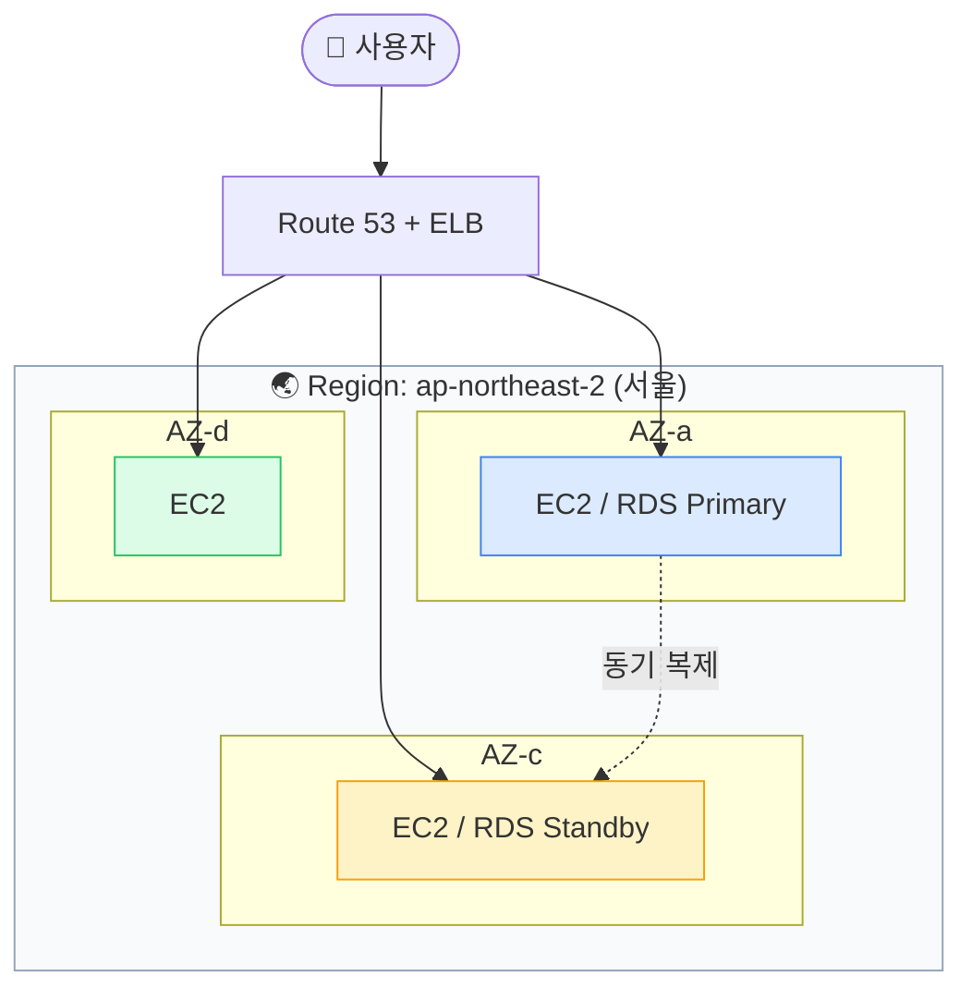
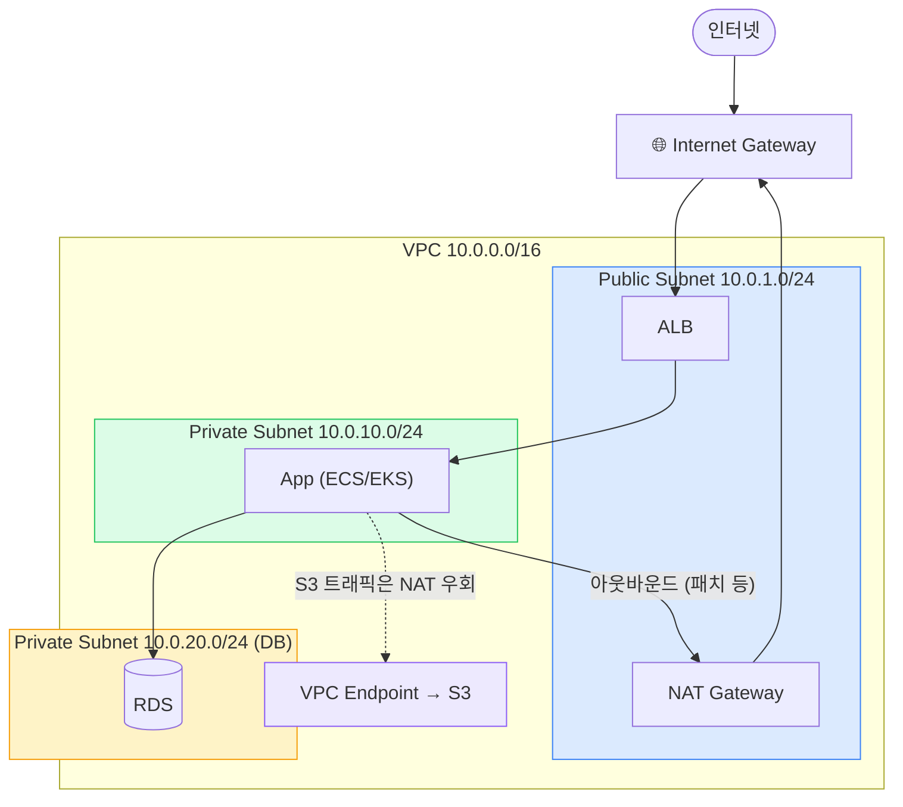
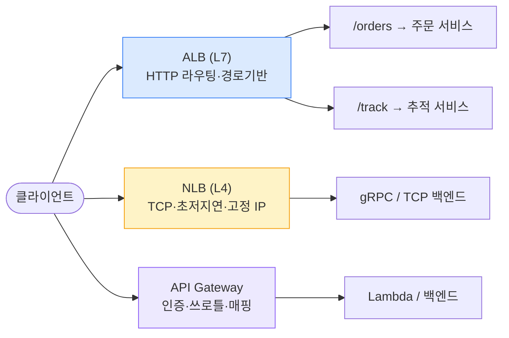
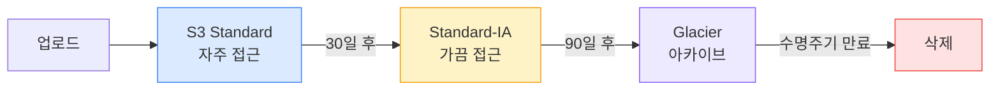
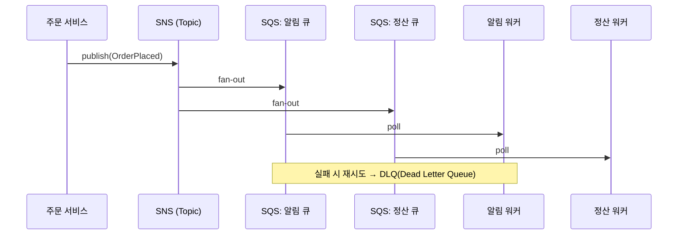
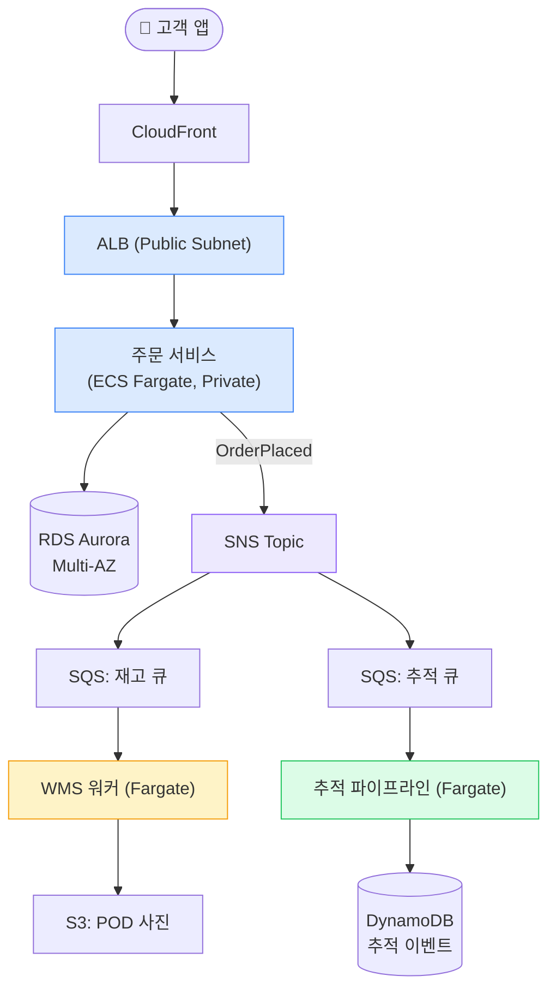

## 1. Region(리전) / Availability Zone(가용영역)

> **한 줄 정의** — Region(리전) = 지리적 위치(서울 ap-northeast-2), AZ(가용영역) = 리전 안의 *물리적으로 격리된* 데이터센터 묶음.

AZ는 서로 수 km~수십 km 떨어진 별개 건물·전원·네트워크로 구성된다. 한 AZ가 정전·화재로 죽어도 다른 AZ는 살아있다. 그래서 **가용성 설계의 출발점은 "최소 2개 AZ에 분산"**이다.

*단일 리전 / Multi-AZ 구성 — 면접 단골: "왜 Multi-AZ가 기본인가"*

### Multi-AZ vs Multi-Region — RTO/RPO 로 결정

무작정 Multi-Region(다중 리전)으로 가면 비용·복잡도가 폭발한다. **RTO(Recovery Time Objective, 복구 목표 시간)**와 **RPO(Recovery Point Objective, 복구 목표 시점=허용 데이터 손실)**를 숫자로 정해야 한다.

| 전략 | RTO | RPO | 월 비용 배수 | 적합 워크로드 |
| --- | --- | --- | --- | --- |
| 단일 AZ | 수 시간 | 마지막 백업 시점 | 1.0x | 개발/스테이징, 비핵심 배치 |
| Multi-AZ | 1~2분 (자동 Failover) | ≈ 0 (동기 복제) | 1.5~2x | 대부분의 프로덕션 (주문/결제 DB) |
| Multi-Region Active-Passive | 수 분~수십 분 | 초~분 (비동기) | 2.5~3x | 리전 장애까지 견뎌야 하는 핵심 |
| Multi-Region Active-Active | ≈ 0 | 초 (충돌 해결 필요) | 3x+ | 글로벌 서비스, 토스/쿠팡 결제 코어 일부 |

> **🎯 면접 포인트**
>
> "고가용성 어떻게 설계?"에 **"서버 2대 띄운다"** 는 미흡. 두 서버가 **같은 AZ면 의미 없다** . "최소 2 AZ, RDS는 Multi-AZ, ELB가 AZ별 헬스체크 후 라우팅"까지 말해야 시니어 눈높이. 그리고 "리전 장애까지 막을지는 RTO/RPO와 비용으로 판단한다"로 마무리. 🔥(Deep-dive)

## 2. VPC / Subnet / Security Group

> **한 줄 정의** — VPC(Virtual Private Cloud, 가상 사설망) = AWS 안에 내가 만드는 격리된 네트워크. 그 안을 Public/Private *Subnet(서브넷)*으로 쪼갠다.

*표준 3-tier VPC — ALB만 Public, App/DB는 Private. S3는 VPC Endpoint로 NAT 비용 회피*

### Public Subnet vs Private Subnet

- **Public**: Route table(라우팅 테이블)에 `0.0.0.0/0 → IGW` 경로가 있는 서브넷. 여기엔 ALB, NAT Gateway, Bastion만 둔다.
- **Private**: IGW 직결 경로가 없다. 외부에서 직접 접근 불가. App 서버·DB는 전부 여기. 아웃바운드가 필요하면 **NAT Gateway**를 경유.

### Security Group(보안그룹) vs NACL — 가장 헷갈리는 비교

| 관점 | Security Group(보안그룹) | NACL(Network ACL) |
| --- | --- | --- |
| 적용 레벨 | ENI(인스턴스 단위) | Subnet(서브넷 단위) |
| Stateful 여부 | **Stateful(상태 추적)** — 인바운드 허용하면 응답 아웃바운드 자동 허용 | **Stateless(상태 비저장)** — 인/아웃 각각 규칙 필요 |
| 규칙 종류 | Allow만 가능 | Allow + Deny 가능 |
| 평가 순서 | 전체 규칙 평가 | 번호 순 (낮은 번호 우선) |
| 주 용도 | 일상 방화벽 (이걸 주력으로) | 특정 IP 블랙리스트, 서브넷 경계 보강 |

> **⚠️ 실무 함정**
>
> **NAT Gateway를 통한 S3/DynamoDB 트래픽** → 데이터 전송 요금이 GB당 부과돼 비용 폭탄. S3는 **Gateway VPC Endpoint(무료)** , 그 외 AWS API는 **Interface Endpoint(PrivateLink)** 로 빼면 NAT를 우회한다. Security Group을 `0.0.0.0/0` 로 열어두는 것 — 면접에서 "보안 어떻게?" 질문에 즉시 감점. 최소 권한(Least privilege)으로 SG 간 참조(SG를 source로 지정)를 써라. 🔥(Deep-dive)

## 3. EC2 / ECS / EKS — 컴퓨트 선택

"컨테이너 띄우려면 EKS 쓰세요"로 끝내면 안 된다. 팀 규모·운영 역량·워크로드 특성에 따라 **단일 EC2 → ECS Fargate → EKS** 스펙트럼에서 선택한다.

| 옵션 | 운영 부담 | 유연성 | 비용 | 적합한 팀/상황 |
| --- | --- | --- | --- | --- |
| **EC2 (직접)** | 높음 (OS 패치·스케일 직접) | 최고 | 저렴 (Spot/RI 활용 시) | 특수 워크로드, 레거시, GPU |
| **ECS on Fargate** | **낮음 (서버리스 컨테이너)** | 중 | 중상 (vCPU·메모리 단위 과금) | K8s 운영 인력 없는 중소 팀, 대부분의 웹 API |
| **ECS on EC2** | 중 | 중상 | 저렴 (노드 직접 관리) | 비용 민감 + 컨테이너 밀도 높이고 싶을 때 |
| **EKS** | 높음 (K8s 자체 운영) | 최고 (CNCF 생태계) | 중상 (+ 컨트롤플레인 시간당 요금) | 대규모, 멀티팀, K8s 표준 필요 |
| **Lambda** | 최저 | 낮음 (15분·콜드스타트 제약) | 요청 단위 (트래픽 적으면 매우 저렴) | 이벤트 처리, 간헐적 워크로드 |

> **💡 실무 의사결정**
>
> 국내 스타트업·중견 백엔드 팀은 **ECS Fargate** 가 가성비 스윗스팟인 경우가 많다. K8s를 운영할 SRE 인력이 2~3명 이상 확보되고, 멀티팀이 한 클러스터를 공유해야 할 때 비로소 EKS가 정당화된다. 토스·당근 등은 EKS를 쓰지만 전담 플랫폼팀이 있다.

### Lambda 운영 함정

- **Cold start(콜드 스타트)**: 유휴 후 첫 호출 시 컨테이너 기동 지연(수백 ms~수 초). 지연 민감 API엔 Provisioned Concurrency로 완화.
- **VPC 연결 비용**: Lambda를 VPC에 붙이면 ENI 생성·과거엔 콜드스타트 가중. RDS 접근 등 꼭 필요할 때만.
- **15분 실행 제한**: 장시간 배치는 ECS Task나 Step Functions로.

## 4. ELB — ALB vs NLB vs API Gateway

*로드밸런서 3종 선택 — L7 라우팅이면 ALB, L4 초저지연이면 NLB, API 관리 기능이면 API Gateway*

| 관점 | ALB (Application LB) | NLB (Network LB) | API Gateway |
| --- | --- | --- | --- |
| OSI 레벨 | L7 (HTTP/HTTPS) | L4 (TCP/UDP) | L7 (관리형) |
| 라우팅 | 경로/호스트/헤더 기반 | 없음 (단순 분배) | 리소스·메서드 단위 |
| 지연 | 수 ms 오버헤드 | **초저지연·고정 IP** | 높음 (기능 풍부 대가) |
| 강점 | WAF·SSL 종료·콘텐츠 라우팅 | 극단적 처리량, gRPC | 인증·쓰로틀·요청 변환·사용량 플랜 |
| 비용 | 중 (LCU 단위) | 중 | 요청당 (트래픽 크면 비쌈) |

> **⚠️ 실무 함정**
>
> API Gateway는 편하지만 **요청당 과금** 이라 수천만 req/일 규모(예: 배송 추적 폴링)에선 ALB 대비 비용이 수 배로 뛴다. 트래픽이 크고 단순하면 ALB + 자체 인증 미들웨어가 더 싸다.

## 5. RDS / Aurora / S3 — 데이터 계층

### RDS Multi-AZ vs Read Replica — 자주 혼동

| 관점 | Multi-AZ Standby | Read Replica(읽기 복제본) |
| --- | --- | --- |
| 목적 | **가용성** (장애 시 Failover) | **읽기 확장** (조회 부하 분산) |
| 복제 방식 | 동기 (Synchronous) | 비동기 (Asynchronous, 지연 존재) |
| 트래픽 수용 | Standby는 평소 트래픽 안 받음 | 읽기 쿼리 직접 받음 |
| 승격 | 자동 Failover (1~2분) | 수동 승격 가능 |

### Aurora — 공유 스토리지 아키텍처

Aurora는 컴퓨트(인스턴스)와 스토리지를 분리해, **6중 복제 분산 스토리지**를 여러 인스턴스가 공유한다. 그래서 Read Replica 추가가 빠르고(스토리지 복제 불필요), Failover가 수십 초로 짧다. MySQL/PostgreSQL 호환. 다만 일반 RDS보다 비싸다.

### S3 — 스토리지 클래스 수명주기

*S3 Lifecycle(수명주기) — 접근 빈도에 따라 자동 전환해 GB당 비용을 1/10 이하로*

> **💡 물류 연결 — 배송 사진(POD) 보관**
>
> 라스트마일 배송 증빙(Proof of Delivery, 배송완료 사진)은 업로드 직후엔 CS 조회로 자주 열리지만 30일 지나면 거의 안 열린다. **Standard → IA → Glacier** 수명주기를 걸면 수억 장 누적 시 스토리지 비용이 극적으로 준다. 단, Glacier는 꺼내는 데 시간·요금이 드니 "법적 보관 의무 vs 조회 빈도"로 정책을 정한다.

## 6. SQS / SNS — 메시징 / 비동기

*SNS Fan-out + SQS — 한 이벤트를 여러 소비자에게. Pub/Sub + 버퍼링의 표준 조합*

| 관점 | SQS | SNS |
| --- | --- | --- |
| 모델 | Queue (1:1 소비, 풀) | Pub/Sub Topic (1:N, 푸시) |
| 순서/중복 | Standard(순서X) / FIFO(순서·중복제거) | FIFO Topic 지원 |
| 버퍼링 | O (소비자 다운돼도 메시지 보존) | X (구독자에게 즉시 전달) |
| 대표 용도 | 작업 큐, 부하 평탄화 | 이벤트 팬아웃 |

> **🎯 면접 포인트**
>
> "SQS와 Kafka 차이?" → SQS는 **완전관리형 작업 큐** (메시지 소비 후 삭제, 운영 부담 없음). Kafka(MSK)는 **로그 기반 스트림** (오프셋으로 재처리·다중 컨슈머 그룹, 높은 처리량·순서 보장 강력하나 운영 복잡). 수천만 TrackingEvent/일을 여러 소비자가 재처리해야 하면 Kafka, 단순 작업 분배·버퍼면 SQS. 🔥(Deep-dive)

## 7. CloudFront — CDN / 엣지

**CloudFront(CDN, Content Delivery Network)**는 전 세계 엣지 로케이션에 콘텐츠를 캐싱해 사용자 가까이서 응답한다. 정적 자원(이미지·JS·CSS)은 물론 동적 API도 캐시 키 설정으로 일부 캐싱 가능.

- **오리진 보호(OAC, Origin Access Control)**: S3 버킷을 직접 공개하지 말고 CloudFront만 접근하게. S3는 비공개 유지.
- **Cache key(캐시 키)**: 어떤 헤더·쿼리스트링을 캐시 분리 기준으로 쓸지. 잘못 잡으면 캐시 히트율 폭락 또는 사용자별 콘텐츠가 섞임.
- **Lambda@Edge / CloudFront Functions**: 엣지에서 헤더 조작·AB 테스트·리다이렉트.

> **⚠️ 실무 함정**
>
> 캐시 키에 `Authorization` 헤더나 사용자 토큰을 무심코 넣으면 **캐시 히트율이 0에 수렴** 해 CDN 의미가 사라진다. 반대로 사용자별로 달라야 할 응답을 공용 캐싱하면 **다른 사람 데이터 노출** 이라는 보안 사고. 캐시 가능 여부를 응답 헤더( `Cache-Control` )로 명확히 분리하라.

## 8. 물류 시스템을 AWS로 — 종합 매핑

*주문→재고→추적 파이프라인의 AWS 매핑 — Multi-AZ Aurora + SNS/SQS 팬아웃 + DynamoDB 추적*

> **💡 정량 근거 — 주문 폭주 대응**
>
> 블랙프라이데이·새벽 오픈 같은 주문 폭주(평소 500 QPS → 피크 5,000 QPS)에서, OMS를 ECS Fargate로 두면 **Target Tracking 오토스케일** 로 CPU 70% 기준 수 분 내 Task를 4~10배로 늘린다. 그 사이 SNS/SQS가 다운스트림(재고·추적)의 **버퍼** 역할을 해 워커가 천천히 따라잡아도 주문 접수는 안 막힌다. 동기 호출 체인이었다면 한 곳 느려질 때 전체가 타임아웃으로 무너진다.
