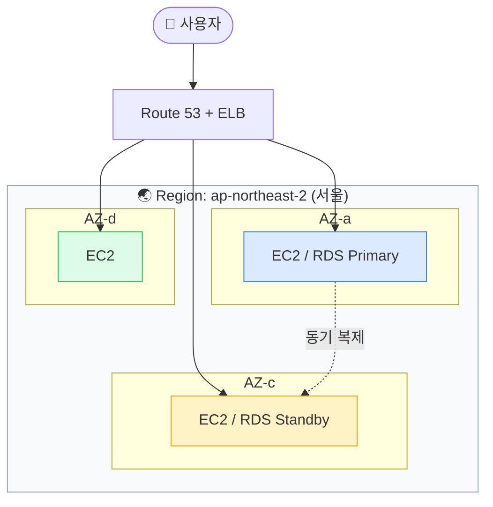
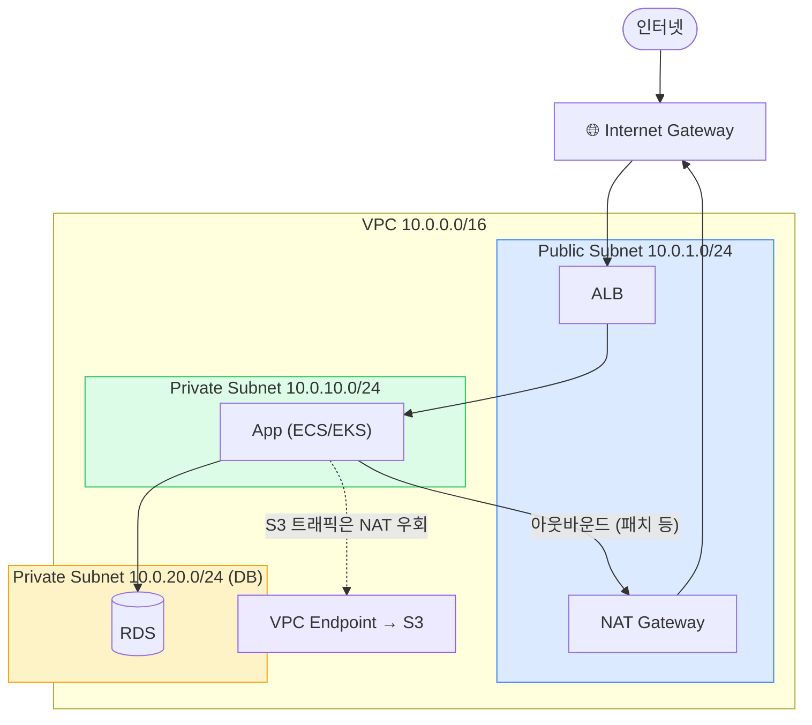
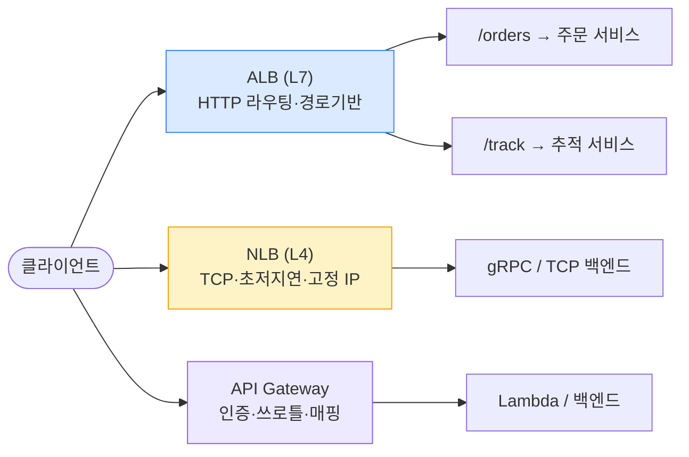
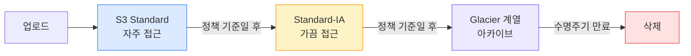
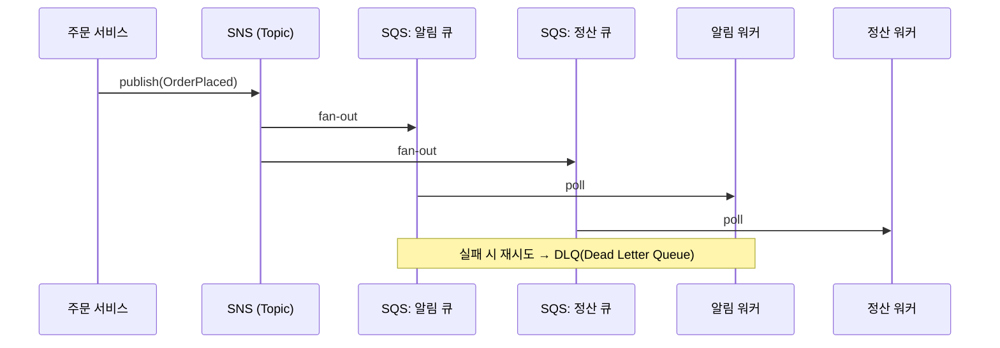
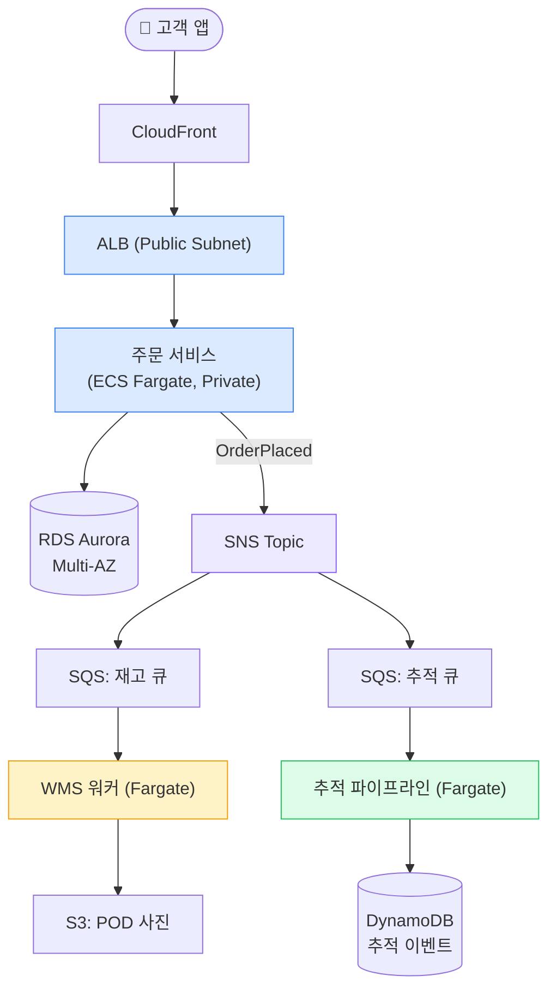

## 1. Region(리전) / Availability Zone(가용영역)

> **한 줄 정의** — Region(리전) = 지리적 위치(서울 ap-northeast-2), AZ(가용영역) = 리전 안의 *물리적으로 격리된* 데이터센터 묶음.

AZ는 리전 안에서 독립적인 전원·네트워크 장애 도메인으로 운영된다. AZ 간 연결성과 실제 장애 범위는 리전·서비스별 문서를 확인해야 한다. 따라서 **가용성 설계의 출발점은 단일 장애 도메인에 핵심 경로를 몰아넣지 않는 것**이며, 필요한 AZ 수는 RTO/RPO와 서비스별 배치 제약으로 결정한다.


```mermaid
flowchart TB
    subgraph Region["🌏 Region: ap-northeast-2 (서울)"]
        subgraph AZa["AZ-a"]
            A1["EC2 / RDS Primary"]
        end
        subgraph AZc["AZ-c"]
            A2["EC2 / RDS Standby"]
        end
        subgraph AZd["AZ-d"]
            A3["EC2"]
        end
    end
    Users(["👤 사용자"]) --> R53["Route 53 + ELB"]
    R53 --> A1
    R53 --> A2
    R53 --> A3
    A1 -. "동기 복제" .-> A2

    style Region fill:#f8fafc,stroke:#94a3b8
    style A1 fill:#dbeafe,stroke:#3b82f6
    style A2 fill:#fef3c7,stroke:#f59e0b
    style A3 fill:#dcfce7,stroke:#22c55e
```

*단일 리전 / Multi-AZ 구성 — 면접 단골: "왜 Multi-AZ가 기본인가"*

### Multi-AZ vs Multi-Region — RTO/RPO 로 결정

무작정 Multi-Region(다중 리전)으로 가면 비용·복잡도가 폭발한다. **RTO(Recovery Time Objective, 복구 목표 시간)**와 **RPO(Recovery Point Objective, 복구 목표 시점=허용 데이터 손실)**를 숫자로 정해야 한다.

| 전략 | RTO | RPO | 비용·복잡도 | 적합 워크로드 |
| --- | --- | --- | --- | --- |
| 단일 AZ | 백업·복구 절차에 의존 | 마지막 백업 또는 복제 지점 | 기준 비용은 서비스별 산정 | 개발/스테이징, 비핵심 배치 |
| Multi-AZ | 서비스별 자동 전환 시간 | 복제 방식에 따라 다름 | 추가 리소스·전송·운영 복잡도 | AZ 장애를 견뎌야 하는 프로덕션 |
| Multi-Region Active-Passive | 복구 자동화 수준에 의존 | 보통 비동기 복제 지연의 영향을 받음 | 두 리전 리소스와 페일오버 절차 | 리전 장애까지 요구되는 핵심 경로 |
| Multi-Region Active-Active | 트래픽 전환·충돌 해결 설계에 의존 | 쓰기 모델과 복제 방식에 의존 | 가장 높은 데이터·운영 복잡도 | 글로벌 지연 또는 리전 연속성이 요구되는 경우 |

> **🎯 면접 포인트**
>
> "고가용성 어떻게 설계?"에 **"서버 2대 띄운다"** 는 미흡. 두 서버가 **같은 AZ면 의미 없다** . "최소 2 AZ, RDS는 Multi-AZ, ELB가 AZ별 헬스체크 후 라우팅"까지 말해야 시니어 눈높이. 그리고 "리전 장애까지 막을지는 RTO/RPO와 비용으로 판단한다"로 마무리. 🔥(Deep-dive)

## 2. VPC / Subnet / Security Group

> **한 줄 정의** — VPC(Virtual Private Cloud, 가상 사설망) = AWS 안에 내가 만드는 격리된 네트워크. 그 안을 Public/Private *Subnet(서브넷)*으로 쪼갠다.


```mermaid
flowchart TB
    IGW["🌐 Internet Gateway"]
    subgraph VPC["VPC 10.0.0.0/16"]
        subgraph Pub["Public Subnet 10.0.1.0/24"]
            ALB["ALB"]
            NAT["NAT Gateway"]
        end
        subgraph Priv["Private Subnet 10.0.10.0/24"]
            APP["App (ECS/EKS)"]
        end
        subgraph Data["Private Subnet 10.0.20.0/24 (DB)"]
            RDS[("RDS")]
        end
        VEP["VPC Endpoint → S3"]
    end
    Internet(["인터넷"]) --> IGW --> ALB --> APP
    APP --> RDS
    APP -->|"아웃바운드 (패치 등)"| NAT --> IGW
    APP -.->|"S3 트래픽은 NAT 우회"| VEP

    style Pub fill:#dbeafe,stroke:#3b82f6
    style Priv fill:#dcfce7,stroke:#22c55e
    style Data fill:#fef3c7,stroke:#f59e0b
    style VEP fill:#ede9fe,stroke:#8b5cf6
```

*표준 3-tier VPC — ALB만 Public, App/DB는 Private. S3는 VPC Endpoint로 NAT 비용 회피*

### Public Subnet vs Private Subnet

- **Public**: Route table(라우팅 테이블)에 `0.0.0.0/0 → IGW` 경로가 있는 서브넷. 여기엔 ALB, NAT Gateway, Bastion만 둔다.
- **Private**: IGW 직결 경로가 없다. 외부에서 직접 접근 불가. App 서버·DB는 전부 여기. 아웃바운드가 필요하면 **NAT Gateway**를 경유.

### Security Group(보안그룹) vs NACL — 가장 헷갈리는 비교

| 관점 | Security Group(보안그룹) | NACL(Network ACL) |
| --- | --- | --- |
| 적용 레벨 | ENI(인스턴스 단위) | Subnet(서브넷 단위) |
| Stateful 여부 | **Stateful(상태 추적)** — 인바운드 허용하면 응답 아웃바운드 자동 허용 | **Stateless(상태 비저장)** — 인/아웃 각각 규칙 필요 |
| 규칙 종류 | Allow만 가능 | Allow + Deny 가능 |
| 평가 순서 | 전체 규칙 평가 | 번호 순 (낮은 번호 우선) |
| 주 용도 | 일상 방화벽 (이걸 주력으로) | 특정 IP 블랙리스트, 서브넷 경계 보강 |

> **⚠️ 실무 함정**
>
> S3·DynamoDB처럼 VPC endpoint 경로를 지원하는 서비스는 NAT를 우회하는 Gateway Endpoint를 후보로 둔다. 그 밖의 AWS API는 Interface Endpoint 또는 NAT가 필요할 수 있으며, endpoint·NAT·리전·트래픽 요금은 현재 가격표와 경로별 데이터 처리량으로 계산한다. `0.0.0.0/0` 허용은 목적·포트·소스가 불명확한 규칙이므로 최소 권한 SG와 라우팅 검토를 우선한다. 🔥(Deep-dive)

## 3. EC2 / ECS / EKS — 컴퓨트 선택

"컨테이너 띄우려면 EKS 쓰세요"로 끝내면 안 된다. 팀 규모·운영 역량·워크로드 특성에 따라 **단일 EC2 → ECS Fargate → EKS** 스펙트럼에서 선택한다.

| 옵션 | 운영 부담 | 유연성 | 비용 | 적합한 팀/상황 |
| --- | --- | --- | --- | --- |
| **EC2 (직접)** | 높음 (OS 패치·스케일 직접) | 최고 | 인스턴스·라이선스·운영비를 별도 산정 | 특수 워크로드, 레거시, GPU |
| **ECS on Fargate** | **낮음 (서버리스 컨테이너)** | 중 | 중상 (vCPU·메모리 단위 과금) | K8s 운영 인력 없는 중소 팀, 대부분의 웹 API |
| **ECS on EC2** | 중 | 중상 | 노드 용량·예약·운영비를 별도 산정 | 컨테이너 밀도와 노드 제어가 중요한 경우 |
| **EKS** | 높음 (K8s 자체 운영) | 최고 (CNCF 생태계) | 중상 (+ 컨트롤플레인 시간당 요금) | 대규모, 멀티팀, K8s 표준 필요 |
| **Lambda** | 최저 | 낮음 (실행·동시성·패키지 제약) | 요청·실행 시간·옵션별 산정 | 이벤트 처리, 간헐적 워크로드 |

> **💡 실무 의사결정**
>
> ECS Fargate와 EKS의 선택은 팀의 Kubernetes 운영 역량, 요구하는 제어면 기능, 워크로드 제약, 현재 가격표를 함께 비교한다. 특정 인원 수나 회사 사례를 기준으로 일반화하지 말고, 운영 소유권과 장애 대응 능력을 결정 근거로 남긴다.

### Lambda 운영 함정

- **Cold start(콜드 스타트)**: 실행 환경 생성 시간이 요청 지연에 영향을 줄 수 있다. 지연 목표가 있으면 초기화 코드·패키지 크기·동시성 설정을 측정하고 Provisioned Concurrency 같은 선택지를 검토한다.
- **VPC 연결**: VPC 리소스에 접근해야 할 때만 연결하고, 서브넷·보안그룹·DNS·네트워크 경로를 함께 검증한다.
- **실행 한도**: 장시간 작업은 Lambda의 현재 서비스 한도와 워크로드 시간을 비교하고, 초과하면 ECS Task·Step Functions 등 다른 실행 모델을 검토한다.

## 4. ELB — ALB vs NLB vs API Gateway


```mermaid
flowchart LR
    C(["클라이언트"]) --> ALB["ALB (L7)\nHTTP 라우팅·경로기반"]
    C --> NLB["NLB (L4)\nTCP·초저지연·고정 IP"]
    C --> APIGW["API Gateway\n인증·쓰로틀·매핑"]
    ALB --> S1["/orders → 주문 서비스"]
    ALB --> S2["/track → 추적 서비스"]
    NLB --> S3["gRPC / TCP 백엔드"]
    APIGW --> L["Lambda / 백엔드"]

    style ALB fill:#dbeafe,stroke:#3b82f6
    style NLB fill:#fef3c7,stroke:#f59e0b
    style APIGW fill:#ede9fe,stroke:#8b5cf6
```

*로드밸런서 3종 선택 — L7 라우팅이면 ALB, L4 초저지연이면 NLB, API 관리 기능이면 API Gateway*

| 관점 | ALB (Application LB) | NLB (Network LB) | API Gateway |
| --- | --- | --- | --- |
| OSI 레벨 | L7 (HTTP/HTTPS) | L4 (TCP/UDP) | L7 (관리형) |
| 라우팅 | 경로/호스트/헤더 기반 | 없음 (단순 분배) | 리소스·메서드 단위 |
| 지연 | 네트워크·TLS·규칙 구성에 의존 | 네트워크·프로토콜에 의존 | 기능·통합 구성에 의존 |
| 강점 | WAF·SSL 종료·콘텐츠 라우팅 | 극단적 처리량, gRPC | API 유형별 인증·쓰로틀·요청 변환·사용량 플랜 |
| 비용 | 중 (LCU 단위) | 중 | 요청당 (트래픽 크면 비쌈) |

API Gateway의 기능은 API 유형(REST API·HTTP API·WebSocket API)에 따라 다르다. 특히 **usage plan과 API key 기반 사용량·클라이언트별 throttling은 REST API 기능**으로 분류해 확인하고, HTTP API를 같은 기능 집합으로 가정하지 않는다. 선택 전 [REST API와 HTTP API 비교 문서](https://docs.aws.amazon.com/apigateway/latest/developerguide/http-api-vs-rest.html)와 [usage plan 문서](https://docs.aws.amazon.com/apigateway/latest/developerguide/api-gateway-api-usage-plans.html)를 현재 리전·요구사항에 맞춰 확인한다.

> **⚠️ 실무 함정**
>
> API Gateway와 ALB의 비용은 요청 수, 데이터 처리량, 기능, 리전, 인증·WAF 구성에 따라 달라진다. 고빈도 폴링이라면 현재 가격표와 예상 요청·응답량으로 두 경로를 계산하고, API Gateway의 인증·쓰로틀·정책 기능을 직접 구현·운영할 비용까지 포함해 결정한다.

## 5. RDS / Aurora / S3 — 데이터 계층

### RDS Multi-AZ vs Read Replica — 자주 혼동

아래 표는 **RDS Multi-AZ DB instance 배포의 단일 standby**와 Read Replica를 비교한 것이다. RDS의 Multi-AZ DB cluster는 별도 모델로, writer와 두 개의 readable reader 인스턴스 및 reader endpoint를 제공할 수 있으므로 같은 “standby는 읽지 못한다” 규칙으로 일반화하지 않는다. 실제 엔진·리전·배포 유형은 [Multi-AZ DB instance 문서](https://docs.aws.amazon.com/AmazonRDS/latest/UserGuide/Concepts.MultiAZSingleStandby.html)와 [Multi-AZ DB cluster 문서](https://docs.aws.amazon.com/AmazonRDS/latest/UserGuide/multi-az-db-clusters-concepts.html)에서 확인한다.

| 관점 | Multi-AZ Standby | Read Replica(읽기 복제본) |
| --- | --- | --- |
| 목적 | **가용성** (장애 시 Failover) | **읽기 확장** (조회 부하 분산) |
| 복제 방식 | 동기 (Synchronous) | 비동기 (Asynchronous, 지연 존재) |
| 트래픽 수용 | Standby는 평소 트래픽 안 받음 | 읽기 쿼리 직접 받음 |
| 승격 | 서비스·엔진 구성에 따른 자동 전환 | 읽기 복제본을 승격하는 별도 절차 |

| 별도 배포 모델 | Multi-AZ DB cluster | 기존 Multi-AZ DB instance standby와 구분 |
| --- | --- | --- |
| 읽기 경로 | reader 인스턴스·reader endpoint를 사용할 수 있음 | 단일 standby가 평소 애플리케이션 트래픽을 받는 모델로 보지 않음 |
| 복제·전환 | 세부 동작·지원 엔진은 공식 문서와 배포 유형을 확인 | 서비스·엔진 구성에 따라 자동 전환 |

### Aurora — 공유 스토리지 아키텍처

Aurora는 컴퓨트와 분산 스토리지 계층을 분리하고, 여러 DB 인스턴스가 클러스터 스토리지를 공유하는 구조다. 복제·장애 전환·지원 엔진의 세부 동작과 한도는 엔진·리전·현재 공식 문서를 확인한다. RDS와 Aurora의 비용·기능 차이는 워크로드와 현재 가격표로 비교한다.

### S3 — 스토리지 클래스 수명주기


```mermaid
flowchart LR
    Up["업로드"] --> Std["S3 Standard\n자주 접근"]
    Std -->|"정책 기준일 후"| IA["Standard-IA\n가끔 접근"]
    IA -->|"정책 기준일 후"| Gla["Glacier 계열\n아카이브"]
    Gla -->|"수명주기 만료"| Del["삭제"]

    style Std fill:#dbeafe,stroke:#3b82f6
    style IA fill:#fef3c7,stroke:#f59e0b
    style Gla fill:#ede9fe,stroke:#8b5cf6
    style Del fill:#fee2e2,stroke:#ef4444
```

*S3 Lifecycle(수명주기) — 접근 패턴·보존 정책에 따라 저장 클래스를 전환*

> **💡 물류 연결 — 배송 사진(POD) 보관**
>
> 배송 증빙(Proof of Delivery, 배송완료 사진)은 보존 기간, 조회 빈도, 법적·계약상 삭제 요구를 먼저 정의한다. 그 뒤 Standard·Infrequent Access·Glacier 계열과 복원 시간·요금을 현재 S3 문서와 가격표로 비교해 Lifecycle 규칙을 만든다.

## 6. SQS / SNS — 메시징 / 비동기


```mermaid
sequenceDiagram
    participant Prod as 주문 서비스
    participant SNS as SNS (Topic)
    participant SQS1 as SQS: 알림 큐
    participant SQS2 as SQS: 정산 큐
    participant W1 as 알림 워커
    participant W2 as 정산 워커

    Prod->>SNS: publish(OrderPlaced)
    SNS->>SQS1: fan-out
    SNS->>SQS2: fan-out
    SQS1->>W1: poll
    SQS2->>W2: poll
    Note over SQS1,W1: 실패 시 재시도 → DLQ(Dead Letter Queue)
```

*SNS Fan-out + SQS — 한 이벤트를 여러 소비자에게. Pub/Sub + 버퍼링의 표준 조합*

| 관점 | SQS | SNS |
| --- | --- | --- |
| 모델 | Queue (1:1 소비, 풀) | Pub/Sub Topic (1:N, 푸시) |
| 순서/중복 | Standard(순서X) / FIFO(순서·중복제거) | FIFO Topic 지원 |
| 버퍼링 | O (소비자 다운돼도 메시지 보존) | X (구독자에게 즉시 전달) |
| 대표 용도 | 작업 큐, 부하 평탄화 | 이벤트 팬아웃 |

> **🎯 면접 포인트**
>
> "SQS와 Kafka 차이?" → SQS는 **완전관리형 작업 큐** (메시지 소비 후 삭제, 운영 부담 없음). Kafka(MSK)는 **로그 기반 스트림** (오프셋으로 재처리·다중 컨슈머 그룹, 높은 처리량·순서 보장 강력하나 운영 복잡). 수천만 TrackingEvent/일을 여러 소비자가 재처리해야 하면 Kafka, 단순 작업 분배·버퍼면 SQS. 🔥(Deep-dive)

## 7. CloudFront — CDN / 엣지

**CloudFront(CDN, Content Delivery Network)**는 전 세계 엣지 로케이션에 콘텐츠를 캐싱해 사용자 가까이서 응답한다. 정적 자원(이미지·JS·CSS)은 물론 동적 API도 캐시 키 설정으로 일부 캐싱 가능.

- **오리진 보호(OAC, Origin Access Control)**: S3 버킷을 직접 공개하지 말고 CloudFront만 접근하게. S3는 비공개 유지.
- **Cache key(캐시 키)**: 어떤 헤더·쿼리스트링을 캐시 분리 기준으로 쓸지. 잘못 잡으면 캐시 히트율 폭락 또는 사용자별 콘텐츠가 섞임.
- **Lambda@Edge / CloudFront Functions**: 엣지에서 헤더 조작·AB 테스트·리다이렉트.

> **⚠️ 실무 함정**
>
> 캐시 키에 `Authorization` 헤더나 사용자 토큰을 무심코 넣으면 **캐시 히트율이 0에 수렴** 해 CDN 의미가 사라진다. 반대로 사용자별로 달라야 할 응답을 공용 캐싱하면 **다른 사람 데이터 노출** 이라는 보안 사고. 캐시 가능 여부를 응답 헤더( `Cache-Control` )로 명확히 분리하라.

## 8. 물류 시스템을 AWS로 — 종합 매핑


```mermaid
flowchart TB
    U(["📱 고객 앱"]) --> CF["CloudFront"]
    CF --> ALB["ALB (Public Subnet)"]
    ALB --> OMS["주문 서비스\n(ECS Fargate, Private)"]
    OMS --> RDS[("RDS Aurora\nMulti-AZ")]
    OMS -->|"OrderPlaced"| SNS["SNS Topic"]
    SNS --> Q1["SQS: 재고 큐"]
    SNS --> Q2["SQS: 추적 큐"]
    Q1 --> WMS["WMS 워커 (Fargate)"]
    Q2 --> TRK["추적 파이프라인 (Fargate)"]
    TRK --> DDB[("DynamoDB\n추적 이벤트")]
    WMS --> S3["S3: POD 사진"]

    style ALB fill:#dbeafe,stroke:#3b82f6
    style OMS fill:#dbeafe,stroke:#3b82f6
    style WMS fill:#fef3c7,stroke:#f59e0b
    style TRK fill:#dcfce7,stroke:#22c55e
    style SNS fill:#ede9fe,stroke:#8b5cf6
```

*주문→재고→추적 파이프라인의 AWS 매핑 — Multi-AZ Aurora + SNS/SQS 팬아웃 + DynamoDB 추적*

> 예고된 주문 폭주에서는 실제 QPS·요청 크기·DB 커넥션·워커 처리량을 부하 모델로 검증한다. ECS 오토스케일의 감지·기동 시간은 구성과 용량에 따라 달라지므로 사전 확장과 큐의 보존·재시도·DLQ 정책을 함께 설계한다. SNS/SQS가 지연을 흡수해도 재고·결제의 지속 가능 처리량을 늘리지는 않는다.

```text
VPC
├─ public subnet: ALB, NAT Gateway
├─ private app subnet: ECS/EKS workload
└─ isolated data subnet: RDS/ElastiCache
```

## 9. 실패 흐름과 검증 순서

- Private Subnet의 외부 API 호출이 실패하면 라우팅 테이블, NAT 경로, 보안그룹·NACL, DNS, 외부 API의 허용 IP를 순서대로 확인한다. S3 요청이 예상치 않게 NAT를 타면 endpoint 정책·라우팅·버킷 정책을 함께 확인하고, 경로를 바꾼 뒤 비용만으로 성공을 판단하지 않는다.
- Multi-AZ 장애 전환 중 DB 연결이 끊길 수 있으므로 애플리케이션은 연결 재수립, 지수 백오프, 요청 멱등성을 갖춘다. Read Replica의 지연을 무시하고 즉시 읽으면 최신성 요구를 위반할 수 있어 읽기 일관성 정책을 분리한다.
- SQS 표준 큐의 중복 전달과 순서 비보장을 전제로 소비자는 멱등키, visibility timeout, DLQ, 재처리 관찰 지표를 갖춘다. FIFO를 선택할 때는 메시지 그룹과 중복 제거 범위를 요구사항과 맞춘다.
- CloudFront 캐시가 잘못된 대상을 공유하면 사용자 데이터가 노출될 수 있다. 캐시 정책·origin request policy·응답 `Cache-Control`을 함께 검토하고, 개인정보 응답은 캐시 금지 또는 사용자별 키를 명시한다.

## 10. 참고 자료

- [AWS Global Infrastructure: Regions and Availability Zones](https://docs.aws.amazon.com/global-infrastructure/latest/regions/aws-regions.html)
- [Amazon VPC endpoints](https://docs.aws.amazon.com/vpc/latest/privatelink/vpc-endpoints.html) 및 [NAT gateways](https://docs.aws.amazon.com/vpc/latest/userguide/vpc-nat-gateway.html)
- [Amazon ECS on AWS Fargate](https://docs.aws.amazon.com/AmazonECS/latest/developerguide/AWS_Fargate.html) 및 [AWS Lambda quotas](https://docs.aws.amazon.com/lambda/latest/dg/gettingstarted-limits.html)
- [Elastic Load Balancing](https://docs.aws.amazon.com/elasticloadbalancing/latest/userguide/what-is-load-balancing.html)
- [Amazon RDS Multi-AZ deployments](https://docs.aws.amazon.com/AmazonRDS/latest/UserGuide/Concepts.MultiAZ.html)
- [Amazon RDS Multi-AZ DB instance deployments](https://docs.aws.amazon.com/AmazonRDS/latest/UserGuide/Concepts.MultiAZSingleStandby.html)
- [Amazon RDS Multi-AZ DB cluster deployments](https://docs.aws.amazon.com/AmazonRDS/latest/UserGuide/multi-az-db-clusters-concepts.html)
- [Amazon API Gateway REST APIs and HTTP APIs](https://docs.aws.amazon.com/apigateway/latest/developerguide/http-api-vs-rest.html)
- [Amazon API Gateway usage plans](https://docs.aws.amazon.com/apigateway/latest/developerguide/api-gateway-api-usage-plans.html)
- [Amazon S3 object Lifecycle Management](https://docs.aws.amazon.com/AmazonS3/latest/userguide/object-lifecycle-mgmt.html)
- [Amazon SQS at-least-once delivery](https://docs.aws.amazon.com/AWSSimpleQueueService/latest/SQSDeveloperGuide/standard-queues-at-least-once-delivery.html)
- [CloudFront Origin Access Control](https://docs.aws.amazon.com/AmazonCloudFront/latest/DeveloperGuide/private-content-restricting-access-to-s3.html)
