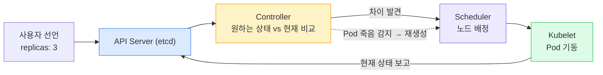
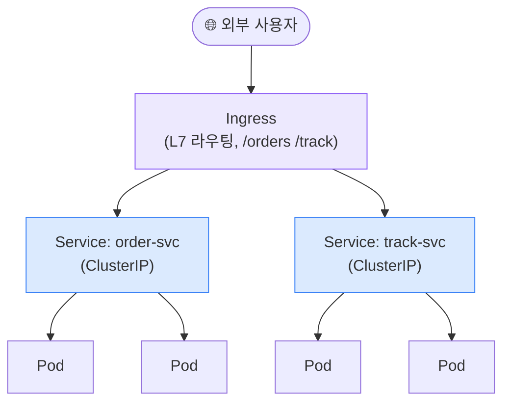
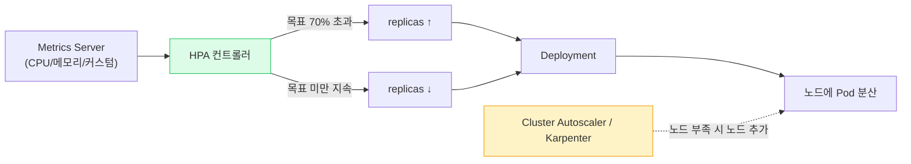
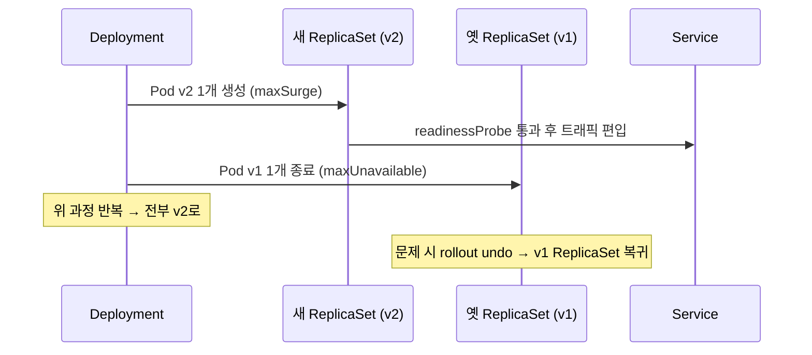
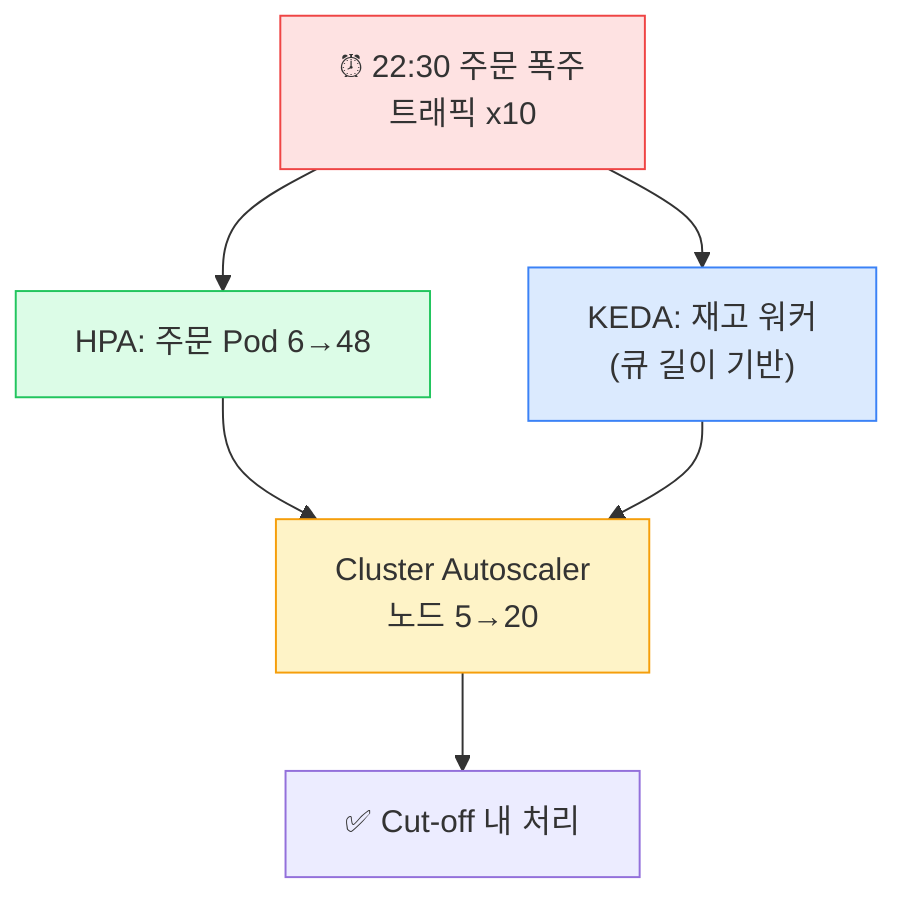

## 1. 왜 Kubernetes인가 — 제어 루프(Reconciliation Loop)

> **핵심 멘탈 모델** — "원하는 상태(Desired State)"를 선언하면 K8s가 "현재 상태(Current State)"와 끊임없이 비교해 *차이를 메운다*. Pod이 죽으면 다시 띄우는 것도 이 루프.

*K8s 제어 루프 — 명령형(서버에 직접 명령)이 아니라 선언형(상태를 선언하고 수렴 맡김)*

> **🎯 면접 포인트**
>
> "K8s가 self-healing(자가 치유)된다는 게 무슨 뜻?" → "Pod이 죽으면 ReplicaSet 컨트롤러가 원하는 replica 수와 현재 수의 차이를 감지해 자동 재생성한다"는 **제어 루프** 로 답해야 한다. "알아서 살려준다"는 표현은 원리를 모른다는 신호.

## 2. Pod / ReplicaSet / Deployment

| 오브젝트 | 책임 | 비유 |
| --- | --- | --- |
| **Pod** | 컨테이너 1개 이상을 묶은 **최소 배포 단위**. 같은 네트워크·볼륨 공유 | 실행 중인 프로세스 한 묶음 |
| **ReplicaSet** | 지정한 수만큼 Pod을 유지 (죽으면 재생성) | "항상 N개 켜둬" |
| **Deployment** | ReplicaSet을 관리하며 **롤링 업데이트·롤백** 제공 | 버전 배포 관리자 |

실무에선 Pod이나 ReplicaSet을 직접 만들지 않고 **Deployment**를 선언한다. Deployment가 새 버전 ReplicaSet을 만들고 옛 것을 줄이며 무중단 전환한다.

> **💡 Pod 안에 컨테이너 여러 개? (Sidecar)**
>
> 한 Pod = 한 컨테이너가 기본이지만, **Sidecar(사이드카) 패턴** 으로 로그 수집기·프록시(Envoy)·메트릭 익스포터를 같이 둔다. 같은 `localhost` 로 통신하고 생명주기를 공유한다. Service Mesh가 이 방식.

## 3. Service / Ingress — 트래픽 들어오는 길

*Ingress → Service → Pod. Service는 변하는 Pod IP들 앞의 안정적 가상 IP + 로드밸런싱*

| Service 타입 | 노출 범위 | 용도 |
| --- | --- | --- |
| **ClusterIP** | 클러스터 내부만 | 서비스 간 내부 통신 (기본) |
| **NodePort** | 노드 IP:포트 | 간단 외부 노출 (실무엔 잘 안 씀) |
| **LoadBalancer** | 클라우드 LB 프로비저닝 | 외부 노출 (AWS면 ELB 자동 생성) |
| **Ingress** | L7 경로/호스트 라우팅 | 여러 서비스를 1개 LB로 (비용↓) |

> **⚠️ 실무 함정**
>
> 서비스마다 `type: LoadBalancer` 를 쓰면 **서비스 개수만큼 ELB가 생성** 돼 비용이 폭증한다. Ingress 하나로 묶어 단일 ALB에서 경로 라우팅하는 게 표준.

## 4. ConfigMap / Secret — 설정 분리

**12-Factor App** 원칙: 설정은 코드에서 분리해 환경에 주입한다. K8s는 `ConfigMap`(비민감 설정)과 `Secret`(민감 정보)으로 이를 제공.

- **ConfigMap**: 환경변수·설정파일 (예: 로그 레벨, 외부 URL).
- **Secret**: DB 비밀번호·API 키. 기본은 **base64 인코딩일 뿐 암호화 아님**. etcd 암호화(KMS) + RBAC로 접근 제한 필요.

> **⚠️ 실무 함정**
>
> Secret을 Git에 평문/base64로 커밋 → 유출 사고 1순위. **Sealed Secrets, External Secrets Operator(AWS Secrets Manager 연동), Vault** 로 관리하라. 또한 Secret을 환경변수로 주입하면 프로세스 덤프·로그로 새기 쉬워, 파일 마운트가 더 안전한 경우가 있다. 🔥(Deep-dive)

## 5. Requests / Limits — 스케줄링과 OOM의 핵심

> **정의** — **requests** = 스케줄러가 노드 배치 시 보장하는 최소 자원. **limits** = 초과 시 제한(CPU는 throttle, 메모리는 *OOMKill*).

### QoS Class — 노드 압박 시 누가 먼저 죽나

| QoS Class | 조건 | 제거(Evict) 우선순위 |
| --- | --- | --- |
| **Guaranteed** | requests = limits (CPU·메모리 모두) | 가장 늦게 (가장 안전) |
| **Burstable** | requests < limits | 중간 |
| **BestEffort** | requests·limits 미설정 | **가장 먼저 죽음** |

> **🎯 면접 포인트**
>
> "Pod이 자꾸 OOMKilled 되는데 원인은?" → 컨테이너 메모리 사용이 `limits.memory` 를 초과해 커널 OOM Killer가 죽인 것. 해결: ① 실제 사용량을 메트릭으로 측정해 limit 상향 ② 메모리 누수 점검 ③ JVM이면 `-Xmx` 를 limit보다 낮게(헤드룸 확보). **limit을 아예 안 걸면 Pod 하나가 노드 전체 메모리를 먹어 노드가 죽는다** — 더 위험. 🔥(Deep-dive)

## 6. HPA — Horizontal Pod Autoscaler (수평 오토스케일)

*HPA(Pod 수 조절) + Cluster Autoscaler(노드 수 조절) — 두 층이 함께 동작해야 진짜 탄력*

### 스케일링 3종 비교

| 스케일러 | 무엇을 조절 | 기준 |
| --- | --- | --- |
| **HPA** | Pod **개수** (수평) | CPU·메모리·커스텀 메트릭(QPS·큐 길이) |
| **VPA** | Pod의 **requests/limits** (수직) | 실사용량 학습 |
| **Cluster Autoscaler / Karpenter** | **노드** 개수 | 스케줄 못 된 Pending Pod 존재 여부 |

> **💡 커스텀 메트릭으로 진짜 부하 반영**
>
> CPU 기반 HPA는 I/O 바운드 워크로드(배송 추적 폴링 등)에선 부하를 못 잡는다. **큐 길이(SQS 메시지 수)·초당 요청(QPS)** 같은 커스텀 메트릭(KEDA 활용)으로 스케일하면 사용자 체감과 일치한다.

## 7. 롤링 업데이트 + Probe — 무중단 배포

*롤링 업데이트 — maxSurge/maxUnavailable로 무중단 보장. readinessProbe 통과 전엔 트래픽 안 줌*

### 3종 Probe 구분 — 가장 많이 틀리는 부분

| Probe | 질문 | 실패 시 |
| --- | --- | --- |
| **livenessProbe** | "이 Pod 살아있나? (데드락 아닌가)" | 컨테이너 **재시작** |
| **readinessProbe** | "트래픽 받을 준비 됐나?" | Service에서 **트래픽 제외** (재시작 X) |
| **startupProbe** | "기동 완료됐나? (느린 시작)" | 완료까지 liveness 유예 |

> **⚠️ 실무 함정 — Probe 혼동이 장애를 만든다**
>
> **livenessProbe를 공격적으로** (짧은 timeout·threshold) 설정하면, 일시적 부하로 응답이 느려질 때 Pod이 계속 재시작되는 **재시작 루프(CrashLoop)** 에 빠진다. 부하가 더 심해지는 악순환. 살아있는지(liveness)와 준비됐는지(readiness)는 별개 엔드포인트로 분리하고, liveness는 관대하게 잡아라. 🔥(Deep-dive)

## 8. 물류 연결 — 새벽 주문 폭주 오토스케일

> **💡 정량 시나리오**
>
> 컬리·쿠팡류의 **Cut-off(마감) 직전 주문 폭주** : 22:30~23:00 사이 트래픽이 평소의 8~10배로 치솟는다. 주문 API Deployment에 **HPA(목표 CPU 60%, min 6 / max 60)** 설정 → 피크 진입 2~3분 내 Pod 6→48개로 확장. 동시에 **Cluster Autoscaler/Karpenter**가 Pending Pod을 감지해 노드를 5→20대로 증설. 재고 워커는 CPU가 아닌 **SQS 큐 길이 기반(KEDA)**으로 스케일 — 쌓인 메시지에 비례해 컨슈머 증설. **Trade-off** : 노드 증설엔 EC2 기동 시간(1~2분) 지연이 있으니, 예측 가능한 피크엔 **스케줄 기반 선제 스케일(predictive)** 로 22:00에 미리 워밍업한다. 비용은 들지만 Cut-off 실패(=주문 유실)보다 싸다.

*Cut-off 폭주 대응 — Pod 오토스케일 + 큐 기반 워커 스케일 + 노드 오토스케일 3층 협력*

## 9. 자주 나오는 함정 정리

| 함정 | 증상 | 해결 |
| --- | --- | --- |
| liveness/readiness 혼동 | 재시작 루프 또는 미준비 Pod에 트래픽 | 역할 분리, liveness는 관대하게 |
| memory limit 미설정 | 노드 전체 OOM, 연쇄 Eviction | requests/limits 항상 설정 |
| `latest` 태그 사용 | 어떤 이미지인지 불명, 롤백 불가 | 불변 태그(커밋 SHA) 사용 |
| graceful shutdown 누락 | 배포 중 진행 요청 끊김 | `preStop` + `terminationGracePeriod` |
| PVC를 Deployment에 | 여러 Pod이 같은 볼륨 경합 | 상태 있으면 StatefulSet |
