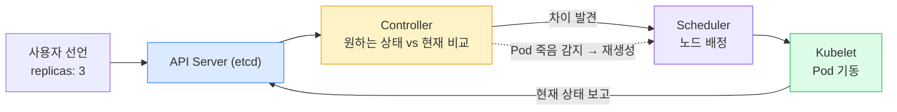
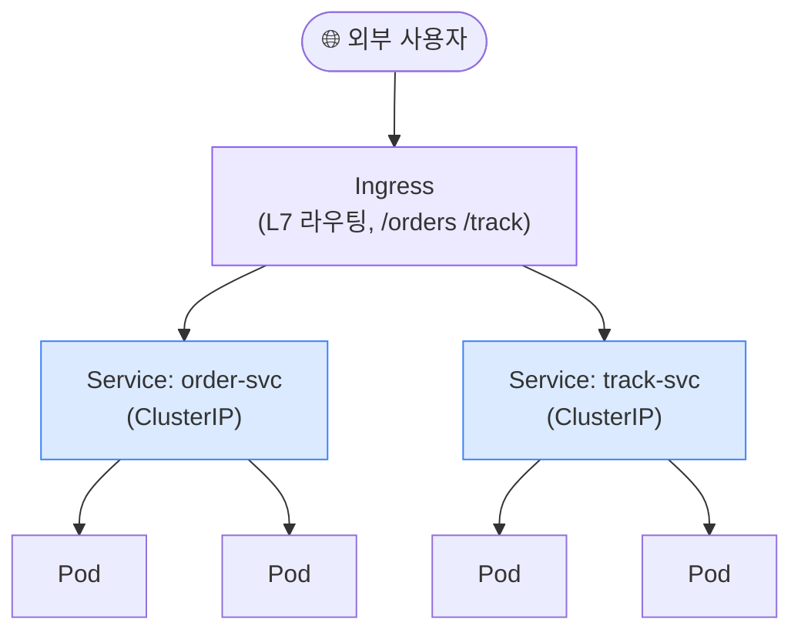
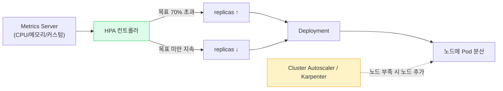
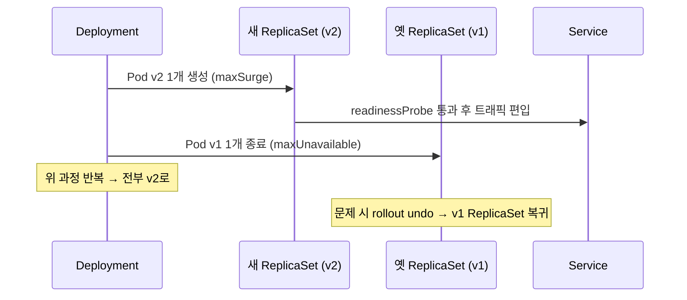
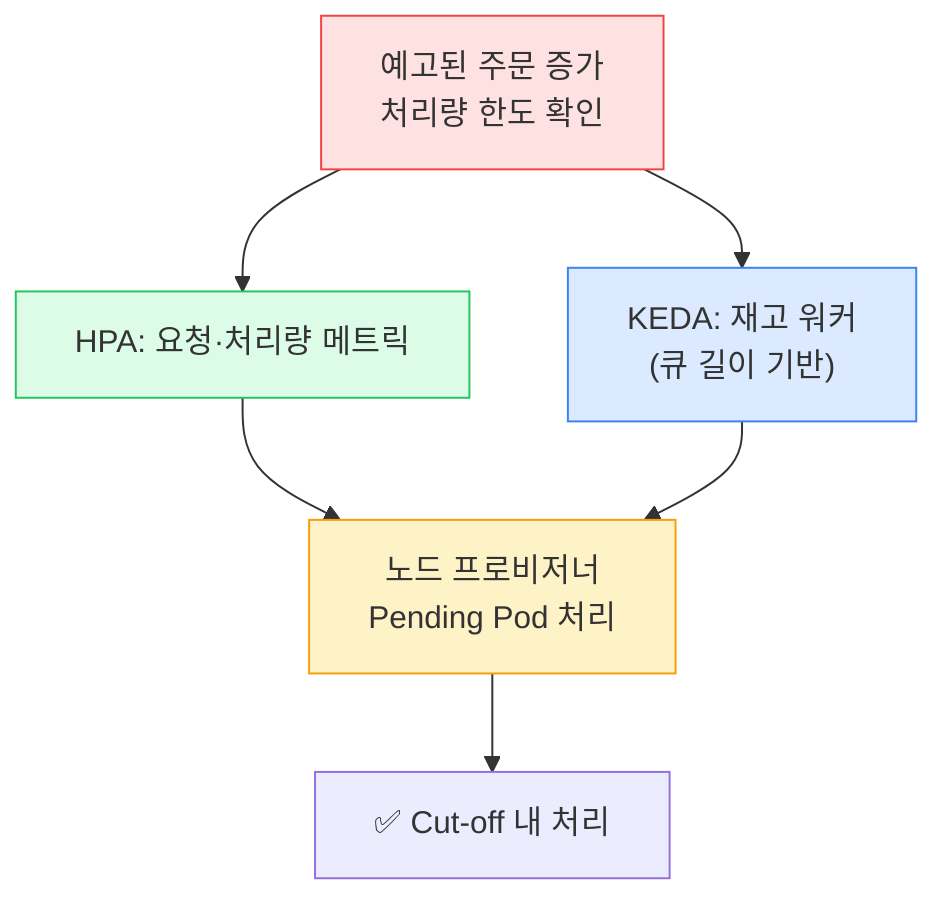

## 1. 왜 Kubernetes인가 — 제어 루프(Reconciliation Loop)

> **핵심 멘탈 모델** — "원하는 상태(Desired State)"를 선언하면 K8s가 "현재 상태(Current State)"와 끊임없이 비교해 *차이를 메운다*. Pod이 죽으면 다시 띄우는 것도 이 루프.


```mermaid
flowchart LR
    Spec["사용자 선언\nreplicas: 3"] --> API["API Server (etcd)"]
    API --> CM["Controller\n원하는 상태 vs 현재 비교"]
    CM -->|"차이 발견"| Sched["Scheduler\n노드 배정"]
    Sched --> Kubelet["Kubelet\nPod 기동"]
    Kubelet -->|"현재 상태 보고"| API
    CM -.->|"Pod 죽음 감지 → 재생성"| Sched

    style API fill:#dbeafe,stroke:#3b82f6
    style CM fill:#fef3c7,stroke:#f59e0b
    style Sched fill:#ede9fe,stroke:#8b5cf6
    style Kubelet fill:#dcfce7,stroke:#22c55e
```

*K8s 제어 루프 — 명령형(서버에 직접 명령)이 아니라 선언형(상태를 선언하고 수렴 맡김)*

> **🎯 면접 포인트**
>
> "K8s가 self-healing(자가 치유)된다는 게 무슨 뜻?" → "Pod이 죽으면 ReplicaSet 컨트롤러가 원하는 replica 수와 현재 수의 차이를 감지해 자동 재생성한다"는 **제어 루프** 로 답해야 한다. "알아서 살려준다"는 표현은 원리를 모른다는 신호.

## 2. Pod / ReplicaSet / Deployment

| 오브젝트 | 책임 | 비유 |
| --- | --- | --- |
| **Pod** | 컨테이너 1개 이상을 묶은 **최소 배포 단위**. 같은 네트워크·볼륨 공유 | 실행 중인 프로세스 한 묶음 |
| **ReplicaSet** | 지정한 수만큼 Pod을 유지 (죽으면 재생성) | "항상 N개 켜둬" |
| **Deployment** | ReplicaSet을 관리하며 **롤링 업데이트·롤백** 제공 | 버전 배포 관리자 |

실무에선 Pod이나 ReplicaSet을 직접 만들지 않고 **Deployment**를 선언한다. Deployment가 새 버전 ReplicaSet을 만들고 옛 것을 줄이며 무중단 전환한다.

> **💡 Pod 안에 컨테이너 여러 개? (Sidecar)**
>
> 한 Pod = 한 컨테이너가 기본이지만, **Sidecar(사이드카) 패턴** 으로 로그 수집기·프록시(Envoy)·메트릭 익스포터를 같이 둔다. 같은 `localhost` 로 통신하고 생명주기를 공유한다. Service Mesh가 이 방식.

## 3. Service / Ingress — 트래픽 들어오는 길


```mermaid
flowchart TB
    U(["🌐 외부 사용자"]) --> ING["Ingress\n(L7 라우팅, /orders /track)"]
    ING --> SVC1["Service: order-svc\n(ClusterIP)"]
    ING --> SVC2["Service: track-svc\n(ClusterIP)"]
    SVC1 --> P1["Pod"]
    SVC1 --> P2["Pod"]
    SVC2 --> P3["Pod"]
    SVC2 --> P4["Pod"]

    style ING fill:#ede9fe,stroke:#8b5cf6
    style SVC1 fill:#dbeafe,stroke:#3b82f6
    style SVC2 fill:#dbeafe,stroke:#3b82f6
```

*Ingress → Service → Pod. Service는 변하는 Pod IP들 앞의 안정적 가상 IP + 로드밸런싱*

| Service 타입 | 노출 범위 | 용도 |
| --- | --- | --- |
| **ClusterIP** | 클러스터 내부만 | 서비스 간 내부 통신 (기본) |
| **NodePort** | 노드 IP:포트 | 간단 외부 노출 (실무엔 잘 안 씀) |
| **LoadBalancer** | 클라우드 LB 프로비저닝 | 외부 노출; 구현은 클라우드·컨트롤러에 의존 |
| **Ingress** | L7 경로/호스트 라우팅 | 여러 서비스를 공통 진입점으로 연결; Ingress controller 필요 |

> **⚠️ 실무 함정**
>
> 서비스마다 `type: LoadBalancer`를 만들면 클라우드 컨트롤러가 여러 외부 로드밸런서를 만들 수 있다. Ingress를 선택할 때는 지원하는 IngressClass, 장애 도메인, TLS·라우팅 정책, 로드밸런서 비용을 현재 클라우드 문서와 함께 검토한다.

## 4. ConfigMap / Secret — 설정 분리

**12-Factor App** 원칙: 설정은 코드에서 분리해 환경에 주입한다. K8s는 `ConfigMap`(비민감 설정)과 `Secret`(민감 정보)으로 이를 제공.

- **ConfigMap**: 환경변수·설정파일 (예: 로그 레벨, 외부 URL).
- **Secret**: DB 비밀번호·API 키. 기본은 **base64 인코딩일 뿐 암호화 아님**. etcd 암호화(KMS) + RBAC로 접근 제한 필요.

> **⚠️ 실무 함정**
>
> Secret을 Git에 평문/base64로 커밋하면 누구나 원문을 복원할 수 있다. Kubernetes Secret 자체의 저장·전송 보호, RBAC, 외부 secret manager 연동, 키 회전 절차를 환경에 맞게 설계한다. 환경변수와 파일 마운트 중 어떤 방식이 안전한지는 애플리케이션·런타임의 로그와 덤프 처리까지 확인해 결정한다. 🔥(Deep-dive)

## 5. Requests / Limits — 스케줄링과 OOM의 핵심

> **정의** — **requests** = 스케줄러가 노드 배치 시 보장하는 최소 자원. **limits** = 초과 시 제한(CPU는 throttle, 메모리는 *OOMKill*).

### QoS Class — 노드 압박 시 제거될 가능성

| QoS Class | 조건 | 일반적인 제거(Evict) 경향 |
| --- | --- | --- |
| **Guaranteed** | 모든 컨테이너의 CPU·메모리 requests와 limits가 설정되고 서로 같음 | 사용량이 requests를 넘지 않으면 상대적으로 뒤로 밀릴 수 있음 |
| **Burstable** | requests 또는 limits가 일부 설정되거나 서로 다름 | 사용량이 requests를 넘는 정도·Priority 등에 따라 달라짐 |
| **BestEffort** | requests·limits 미설정 | 사용량이 requests를 넘는 것으로 취급되어 먼저 대상이 되기 쉬움 |

QoS Class만으로 고정된 eviction 순서를 정할 수 없다. 노드 압박 eviction은 Pod의 실제 자원 사용량이 requests를 넘는지, Pod Priority, requests 대비 사용량 등을 함께 보고 순위를 정하며, **Guaranteed도 노드 압박이나 다른 종료 원인에서 면제되지 않는다**. 따라서 이 표는 일반적인 경향으로만 사용하고 [node-pressure eviction 공식 문서](https://kubernetes.io/docs/concepts/scheduling-eviction/node-pressure-eviction/)의 현재 kubelet 동작을 확인한다.

> **🎯 면접 포인트**
>
> "Pod이 자꾸 OOMKilled 되는데 원인은?" → 컨테이너 메모리 사용이 `limits.memory` 를 초과해 커널 OOM Killer가 죽인 것. 해결: ① 실제 사용량을 메트릭으로 측정해 limit 상향 ② 메모리 누수 점검 ③ JVM이면 `-Xmx` 를 limit보다 낮게(헤드룸 확보). **limit을 아예 안 걸면 Pod 하나가 노드 전체 메모리를 먹어 노드가 죽는다** — 더 위험. 🔥(Deep-dive)

## 6. HPA — Horizontal Pod Autoscaler (수평 오토스케일)


```mermaid
flowchart LR
    M["Metrics Server\n(CPU/메모리/커스텀)"] --> HPA["HPA 컨트롤러"]
    HPA -->|"목표 70% 초과"| Up["replicas ↑"]
    HPA -->|"목표 미만 지속"| Down["replicas ↓"]
    Up --> Dep["Deployment"]
    Down --> Dep
    Dep --> Nodes["노드에 Pod 분산"]
    CA["Cluster Autoscaler / Karpenter"] -.->|"노드 부족 시 노드 추가"| Nodes

    style HPA fill:#dcfce7,stroke:#22c55e
    style CA fill:#fef3c7,stroke:#f59e0b
```

*HPA(Pod 수 조절) + Cluster Autoscaler(노드 수 조절) — 두 층이 함께 동작해야 진짜 탄력*

### 스케일링 3종 비교

| 스케일러 | 무엇을 조절 | 기준 |
| --- | --- | --- |
| **HPA** | Pod **개수** (수평) | CPU·메모리·커스텀 메트릭(QPS·큐 길이) |
| **VPA** | Pod의 **requests/limits** (수직) | 실사용량 학습 |
| **Cluster Autoscaler / Karpenter** | **노드** 개수 | 스케줄 못 된 Pending Pod 존재 여부 |

> **💡 커스텀 메트릭으로 진짜 부하 반영**
>
> CPU 기반 HPA만으로는 I/O 대기나 큐 backlog를 충분히 표현하지 못할 수 있다. **처리해야 할 큐의 age·backlog, 요청률, 동시 작업 수** 같은 워크로드 메트릭을 서비스 처리량과 연결해 선택한다. KEDA를 쓰면 외부·이벤트 메트릭으로 스케일할 수 있지만, 메트릭 수집 지연·0까지 축소·인증 실패·하위 시스템 포화까지 함께 검증해야 한다.

## 7. 롤링 업데이트 + Probe — 무중단 배포


```mermaid
sequenceDiagram
    participant D as Deployment
    participant RSnew as 새 ReplicaSet (v2)
    participant RSold as 옛 ReplicaSet (v1)
    participant SVC as Service

    D->>RSnew: Pod v2 1개 생성 (maxSurge)
    RSnew->>SVC: readinessProbe 통과 후 트래픽 편입
    D->>RSold: Pod v1 1개 종료 (maxUnavailable)
    Note over D: 위 과정 반복 → 전부 v2로
    Note over RSold: 문제 시 rollout undo → v1 ReplicaSet 복귀
```

*롤링 업데이트 — maxSurge/maxUnavailable과 readiness 상태로 전환 폭을 제어한다. readiness 통과 전에는 일반적으로 Service 엔드포인트에서 제외된다.*

### 3종 Probe 구분 — 가장 많이 틀리는 부분

| Probe | 질문 | 실패 시 |
| --- | --- | --- |
| **livenessProbe** | "이 Pod 살아있나? (데드락 아닌가)" | 컨테이너 **재시작** |
| **readinessProbe** | "트래픽 받을 준비 됐나?" | Service에서 **트래픽 제외** (재시작 X) |
| **startupProbe** | "기동 완료됐나? (느린 시작)" | 완료까지 liveness 유예 |

> **⚠️ 실무 함정 — Probe 혼동이 장애를 만든다**
>
> **livenessProbe를 공격적으로** 설정하면 일시적 부하나 하위 시스템 지연에도 Pod이 계속 재시작되는 재시작 루프가 생길 수 있다. liveness는 프로세스가 복구 불가능한 상태인지, readiness는 현재 트래픽을 받을 수 있는지를 구분하고, 느린 초기화는 startupProbe로 보호한다. probe가 실패할 때 재시작·트래픽 제외·배포 중단이 어떻게 연쇄되는지 관찰한다. 🔥(Deep-dive)

## 8. 물류 연결 — 새벽 주문 폭주 오토스케일

> **💡 시나리오**
>
> 예고된 마감 직전 주문 증가를 평균 배율로만 표현하지 말고, 관측된 요청률·큐 backlog·처리량·DB 연결 상한을 입력으로 삼는다. 주문 API는 반응형 HPA와 사전 capacity를 비교하고, 재고 워커는 CPU보다 큐 age/backlog 기반 메트릭을 검토한다. 새 노드가 준비되기 전까지 Pending Pod이 쌓일 수 있으므로 Cluster Autoscaler 또는 다른 노드 프로비저너의 지연·실패 경로를 포함한다. 스케일 아웃이 하위 DB·결제·재고의 처리량을 초과하면 큐잉·rate limit·load shedding으로 입장을 제한한다.


```mermaid
flowchart TB
    Peak["예고된 주문 증가\n처리량 한도 확인"] --> HPA["HPA: 요청·처리량 메트릭"]
    Peak --> KEDA["KEDA: 재고 워커\n(큐 길이 기반)"]
    HPA --> CA["노드 프로비저너\nPending Pod 처리"]
    KEDA --> CA
    CA --> Done["✅ Cut-off 내 처리"]

    style Peak fill:#fee2e2,stroke:#ef4444
    style HPA fill:#dcfce7,stroke:#22c55e
    style KEDA fill:#dbeafe,stroke:#3b82f6
    style CA fill:#fef3c7,stroke:#f59e0b
```

*Cut-off 폭주 대응 — Pod 오토스케일 + 큐 기반 워커 스케일 + 노드 오토스케일 3층 협력*

## 9. 자주 나오는 함정 정리

| 함정 | 증상 | 해결 |
| --- | --- | --- |
| liveness/readiness 혼동 | 재시작 루프 또는 미준비 Pod에 트래픽 | 역할 분리, liveness는 관대하게 |
| memory limit 미설정 | 노드 전체 OOM, 연쇄 Eviction | requests/limits 항상 설정 |
| `latest` 태그 사용 | 어떤 이미지인지 불명, 롤백 불가 | 불변 태그(커밋 SHA) 사용 |
| graceful shutdown 누락 | 배포 중 진행 요청 끊김 | `preStop` + `terminationGracePeriod` |
| PVC를 Deployment에 | 여러 Pod이 같은 볼륨 경합 | 상태 있으면 StatefulSet |

```yaml
resources:
  requests: { cpu: "250m", memory: "256Mi" }
limits: { memory: "512Mi" }
readinessProbe:
  httpGet: { path: /api/v1/health, port: 8080 }
```

## 10. 실패 흐름과 운영 경계

- 새 ReplicaSet의 이미지 pull 또는 startupProbe가 실패하면 readiness를 통과하지 못한 Pod이 Service에 들어가지 않도록 하고, Deployment 진행이 멈추는 조건과 이전 ReplicaSet 유지 조건을 확인한다. `maxUnavailable`을 무리하게 올리면 정상 용량까지 줄어들 수 있다.
- readiness가 통과한 뒤 애플리케이션이 즉시 종료되면 진행 중 요청이 끊길 수 있다. `preStop`, `terminationGracePeriodSeconds`, 애플리케이션의 drain 신호, Service endpoint 전파 지연을 함께 측정한다.
- HPA가 외부 메트릭을 읽지 못하면 마지막 desired replica를 유지하거나 축소 정책이 예상과 달라질 수 있다. 메트릭 어댑터·KEDA 인증 실패, backlog 감소 지연, 노드 부족을 별도 알람으로 둔다.
- limit 초과로 OOMKilled 된 Pod은 limit만 올리면 메모리 누수와 노드 포화를 숨길 수 있다. requests·limits·QoS·노드 여유·heap 설정을 같이 확인하고, 변경 전후의 재시작과 eviction을 관찰한다.
- Secret 또는 이미지 자격증명 오류는 Pod가 `Pending`·`ImagePullBackOff`에 머무르게 할 수 있다. RBAC와 registry 접근권한을 확인하면서 비밀값을 로그에 출력하지 않는다.

## 11. 참고 자료

- [Kubernetes Concepts](https://kubernetes.io/docs/concepts/overview/)
- [Services and Ingress](https://kubernetes.io/docs/concepts/services-networking/service/) 및 [Ingress](https://kubernetes.io/docs/concepts/services-networking/ingress/)
- [Resource Management for Pods and Containers](https://kubernetes.io/docs/concepts/configuration/manage-resources-containers/) 및 [Pod QoS](https://kubernetes.io/docs/concepts/workloads/pods/pod-qos/)
- [Liveness, Readiness, and Startup Probes](https://kubernetes.io/docs/concepts/configuration/liveness-readiness-startup-probes/)
- [Horizontal Pod Autoscaling](https://kubernetes.io/docs/tasks/run-application/horizontal-pod-autoscale/)
- [Kubernetes Secrets](https://kubernetes.io/docs/concepts/configuration/secret/)
- [KEDA concepts](https://keda.sh/docs/latest/concepts/)
