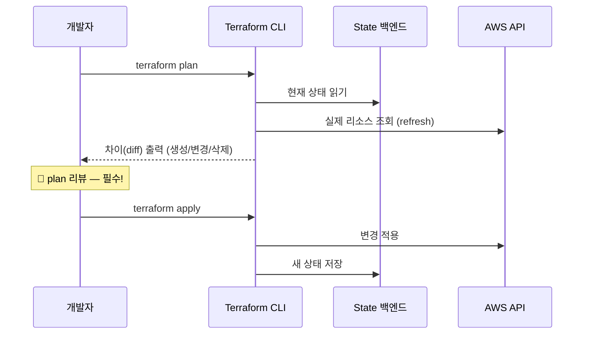
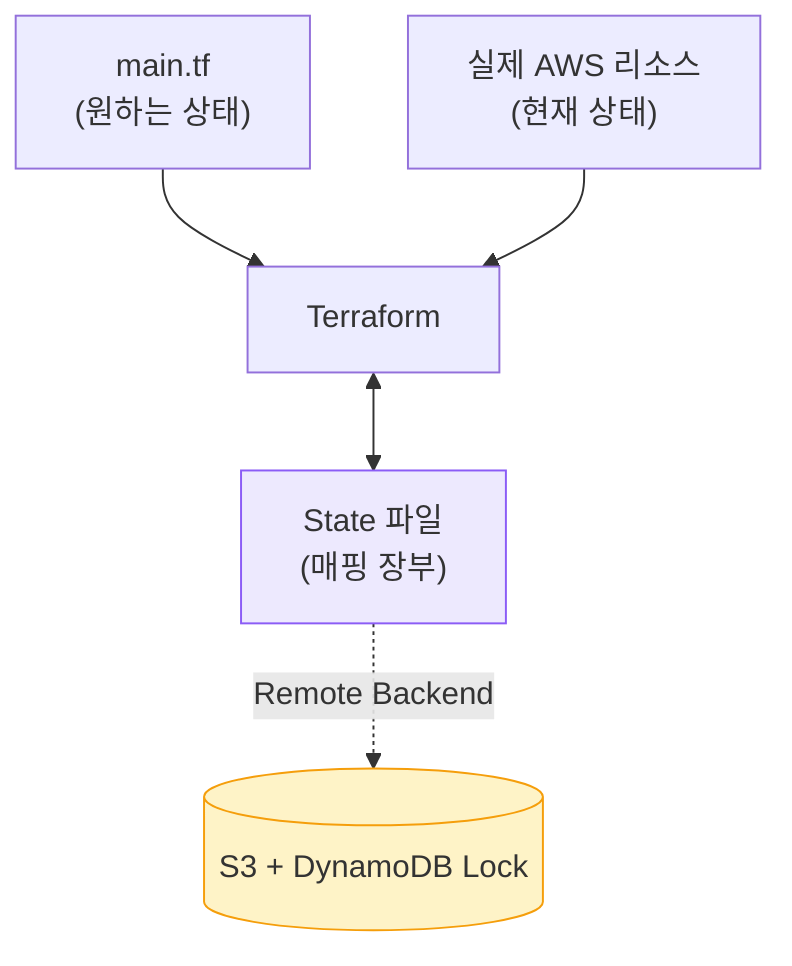
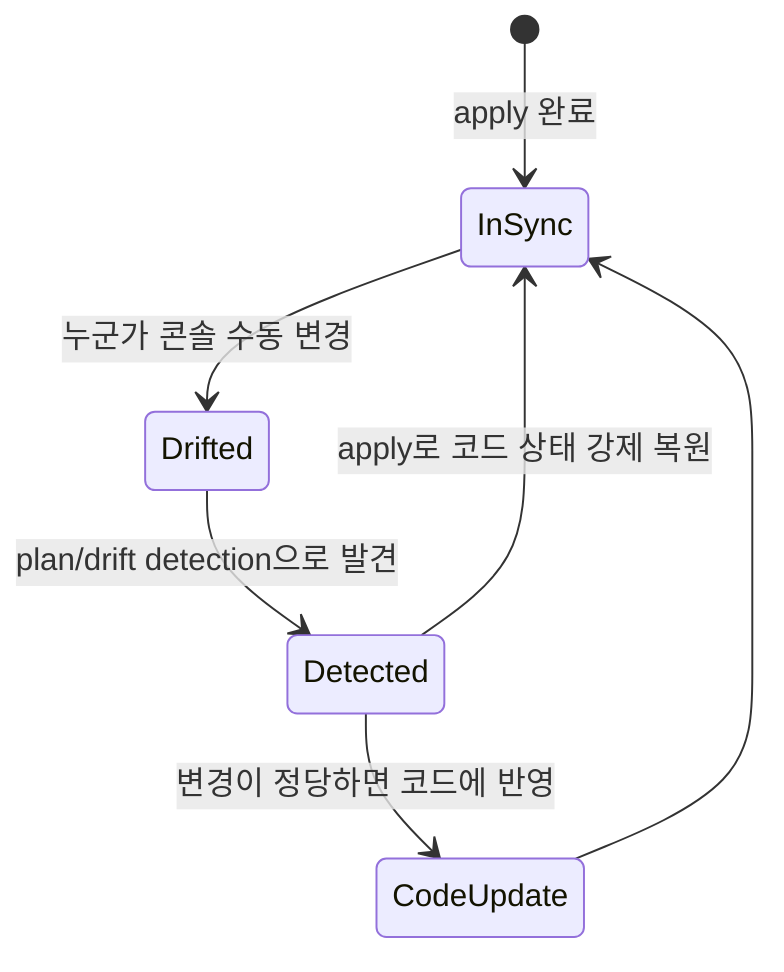
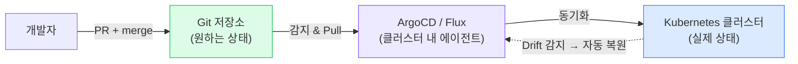

## 1. 왜 IaC(Infrastructure as Code, 코드형 인프라)인가

> **한 줄 정의** — 인프라(VPC·서버·DB·보안그룹)를 *코드로 선언*해, 버전관리·리뷰·재현·자동화 대상으로 만든다.

| 관점 | 콘솔 수동(ClickOps) | IaC (Terraform) |
| --- | --- | --- |
| 재현성 | "누가 뭘 클릭했는지" 모름 | 코드로 동일 환경 재생성 |
| 변경 추적 | 없음 (감사 불가) | Git 히스토리 = 변경 이력 |
| 리뷰 | 불가 | PR 리뷰로 사전 검증 |
| 장애 복구 | 기억에 의존 | `apply`로 재구축 |
| 휴먼 에러 | 잦음 | `plan`으로 사전 차단 |

> **🎯 면접 포인트**
>
> "왜 콘솔로 안 하고 Terraform을 쓰나?" → 핵심 키워드는 **재현성·버전관리·코드 리뷰·감사 추적** . 한 단계 더: "DR(재해 복구) 리전을 코드 재사용으로 빠르게 구성할 수 있고, 변경을 `plan` 으로 미리 검토해 휴먼 에러를 막는다"까지.

## 2. plan / apply 워크플로



*plan(미리보기) → 리뷰 → apply(적용). plan 없이 apply하면 사고 — 면접에서 강조할 것*

```bash
# 표준 워크플로
terraform init      # 백엔드·프로바이더 초기화
terraform plan      # 변경 미리보기 (생성 +, 변경 ~, 삭제 -)
terraform apply     # 실제 적용 (plan 결과 재확인 후 yes)
terraform destroy   # 리소스 정리
```

> **⚠️ 실무 함정 — plan의 함정 신호**
>
> `plan` 출력에서 **destroy/recreate(삭제 후 재생성)** 표시( `-/+` )를 무심코 지나치면, RDS·EBS가 통째로 날아갈 수 있다. 어떤 속성 변경은 in-place가 아니라 **리소스 교체** 를 유발한다. plan을 반드시 읽고, 위험 리소스엔 `prevent_destroy` lifecycle을 건다. 🔥(Deep-dive)

## 3. State(상태) — Terraform의 심장

> **왜 중요한가** — State 파일은 "코드가 선언한 리소스 ↔ 실제 클라우드 리소스 ID"의 *매핑 장부*. 이게 깨지면 Terraform이 현실을 못 본다.



*State는 코드·실제·장부 3자 간 진실. 팀 작업이면 반드시 Remote Backend + Lock*

### Local State vs Remote Backend

| 관점 | Local (로컬 파일) | Remote Backend (S3 + DynamoDB) |
| --- | --- | --- |
| 협업 | 불가 (각자 다른 상태) | 공유 상태 |
| 동시 실행 | 충돌 위험 | **State Lock**으로 직렬화 |
| 민감정보 | 로컬 디스크 노출 | 암호화 저장 + 접근 제어 |
| 권장도 | 개인 실습만 | **팀/프로덕션 필수** |

> **⚠️ 실무 함정 — State 충돌**
>
> **Remote backend + lock 없이 팀이 동시 작업** 하면, 두 사람이 동시에 apply해 State가 깨지고 리소스가 꼬인다. S3에 State를 두고 **DynamoDB로 Lock** 을 걸면 동시 apply가 직렬화된다. 또한 State 파일엔 DB 비밀번호 등 평문이 들어갈 수 있으니 절대 Git에 커밋 금지. 🔥(Deep-dive)

## 4. 모듈(Module) — 재사용

**Module(모듈)**은 리소스 묶음을 함수처럼 재사용하는 단위. 같은 VPC 구조를 dev/staging/prod에 반복하지 말고 모듈로 추출한다.

```
module "vpc" {
  source = "./modules/vpc"
  cidr   = "10.0.0.0/16"
  azs    = ["ap-northeast-2a", "ap-northeast-2c"]
  env    = "prod"
}
```

- **Workspace**: 같은 코드로 여러 환경 상태를 분리 (단, 복잡 환경엔 디렉토리 분리가 더 명확).
- **Terragrunt**: Terraform 위 래퍼. DRY(반복 제거)·backend 설정 자동화·환경별 변수 관리에 유리.

> **💡 실무 권장**
>
> 모듈을 너무 잘게 쪼개면 추상화 비용이 커진다. **"네트워크 / 컴퓨트 / 데이터"** 정도의 굵은 경계로 모듈화하고, 환경별 차이는 변수로 흡수하는 게 유지보수에 좋다.

## 5. 멱등성(Idempotency) / 불변 인프라(Immutable Infrastructure)

> **멱등성이란** — **같은 코드를 몇 번 apply해도 결과가 동일**하다. 이미 원하는 상태면 아무것도 안 바꾼다("No changes").

Terraform이 멱등한 이유: 매번 명령을 쌓는 게 아니라 **"원하는 상태"와 "현재 상태"의 차이만 계산**해 적용하기 때문. 이것이 명령형 셸 스크립트(append-only)와의 결정적 차이다.

### 불변 인프라 원칙

- 서버를 **수정(mutate)하지 말고 교체(replace)**한다. 패치는 새 AMI/이미지를 굽고 인스턴스를 갈아끼운다.
- 장점: 환경 드리프트 제거, 롤백이 "이전 이미지로 교체"로 단순, 재현성↑.

> **🎯 면접 포인트**
>
> "멱등성이 왜 중요?" → 재시도 안전성. CI 파이프라인이 같은 apply를 중복 실행해도 인프라가 망가지지 않는다. 불변 인프라와 엮으면: "서버를 고치는 대신 교체하니 '내 서버에선 됐는데' 문제(드리프트)가 사라진다."

## 6. Drift(드리프트) 관리

**Drift** = 코드(State)와 실제 리소스가 어긋난 상태. 보통 누군가 콘솔에서 수동 변경해 발생한다.



*Drift 라이프사이클 — 수동 변경 금지 + 주기적 탐지 + 코드로 수렴*

> **⚠️ 실무 함정**
>
> "급해서 콘솔에서 SG 규칙 하나만 손댐" → 다음 apply 때 Terraform이 그걸 **되돌려버려** 장애 재발. 원칙은 **"콘솔 수동 변경 금지"** . 부득이하면 즉시 코드에 반영하거나, 주기적 drift detection(예: Atlantis, terraform plan 정기 실행)으로 잡는다.

## 7. Terraform vs CDK vs Pulumi

| 도구 | 언어 | 강점 | 약점/선택 기준 |
| --- | --- | --- | --- |
| **Terraform** | HCL (선언형 DSL) | 멀티클라우드, 생태계·모듈 풍부, 표준 | 복잡 로직엔 표현력 한계 |
| **AWS CDK** | TS/Python/Java | AWS 깊은 통합, 친숙한 언어·추상화 | AWS 종속 (CloudFormation 기반) |
| **Pulumi** | TS/Python/Go | 범용 언어 + 멀티클라우드 | 생태계가 Terraform보다 작음 |

> **💡 선택 기준**
>
> 멀티클라우드·팀 표준·인프라 전담이면 **Terraform** . AWS 단일 + 개발자가 직접 인프라 코드를 쓰고 친숙한 언어를 원하면 **CDK** . "쿨하다고 Pulumi" 같은 결정은 생태계 성숙도·팀 역량을 먼저 따져라.

## 8. GitOps 개요

> **한 줄 정의** — **Git을 단일 진실 원천(Single Source of Truth)**으로 삼아, 선언된 상태를 자동 동기화(주로 Pull 기반)한다.



*GitOps — Git에 머지하면 ArgoCD가 클러스터를 그 상태로 수렴. 배포가 곧 Git 커밋*

### Push 배포 vs Pull(GitOps) 배포

| 관점 | Push (CI가 클러스터에 kubectl apply) | Pull (GitOps, ArgoCD) |
| --- | --- | --- |
| 자격증명 | CI가 클러스터 접근 권한 보유 (위험) | 에이전트가 클러스터 안에서 Pull (외부 노출↓) |
| Drift 처리 | 수동 | 자동 감지·복원 |
| 롤백 | 스크립트 | **Git revert**로 자동 |
| 감사 | 분산 | Git 히스토리 일원화 |

> **🎯 면접 포인트**
>
> "GitOps가 일반 CI/CD 배포와 뭐가 다른가?" → **선언적 + Pull 기반 + Git이 진실** . 롤백이 `git revert` 로 단순화되고, 클러스터 자격증명을 CI에 안 줘도 돼 보안이 낫다. 단, IaC(Terraform)와 GitOps(ArgoCD)는 계층이 다름 — 인프라 프로비저닝은 Terraform, 앱/매니페스트 배포는 ArgoCD로 역할 분담하는 게 일반적.
