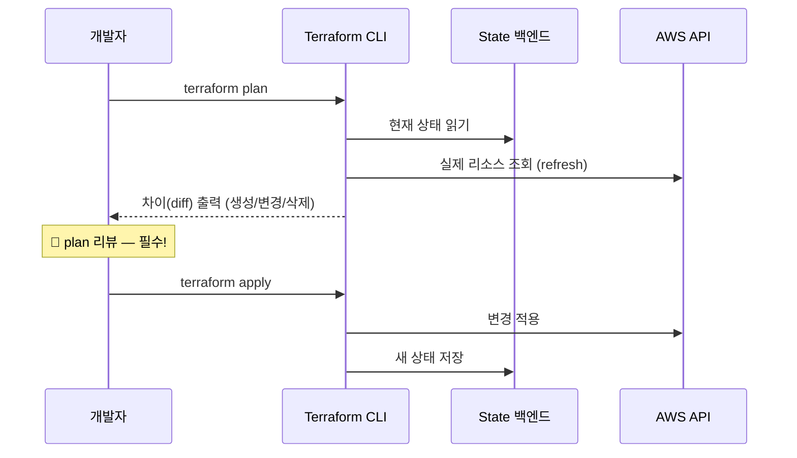
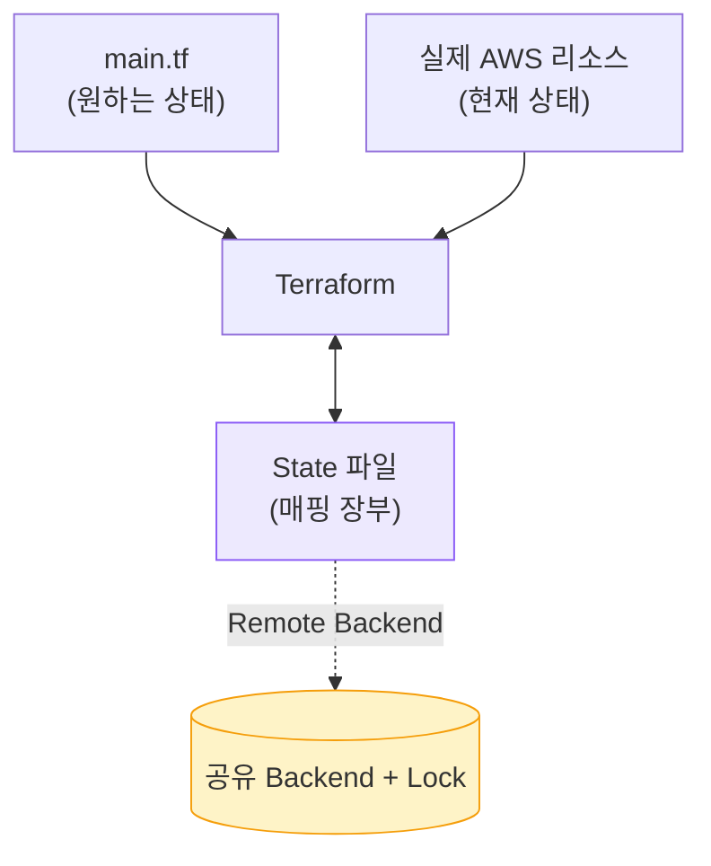
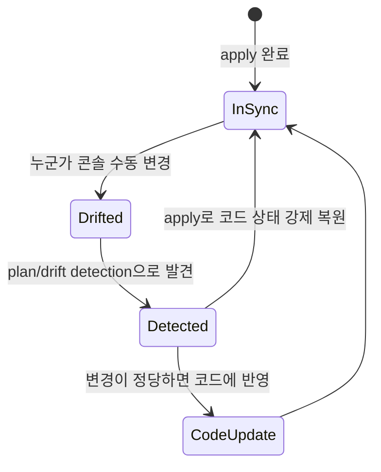

## 1. 왜 IaC(Infrastructure as Code, 코드형 인프라)인가

> **한 줄 정의** — 인프라(VPC·서버·DB·보안그룹)를 *코드로 선언*해, 버전관리·리뷰·재현·자동화 대상으로 만든다.

| 관점 | 콘솔 수동(ClickOps) | IaC (Terraform) |
| --- | --- | --- |
| 재현성 | "누가 뭘 클릭했는지" 모름 | 코드로 동일 환경 재생성 |
| 변경 추적 | 없음 (감사 불가) | Git 히스토리 = 변경 이력 |
| 리뷰 | 불가 | PR 리뷰로 사전 검증 |
| 장애 복구 | 기억에 의존 | `apply`로 재구축 |
| 휴먼 에러 | 잦음 | `plan`으로 사전 차단 |

> **🎯 면접 포인트**
>
> "왜 콘솔로 안 하고 Terraform을 쓰나?" → 핵심 키워드는 **재현성·버전관리·코드 리뷰·감사 추적** . 한 단계 더: "DR(재해 복구) 리전을 코드 재사용으로 빠르게 구성할 수 있고, 변경을 `plan` 으로 미리 검토해 휴먼 에러를 막는다"까지.

## 2. plan / apply 워크플로


```mermaid
sequenceDiagram
    participant Dev as 개발자
    participant TF as Terraform CLI
    participant State as State 백엔드
    participant AWS as AWS API

    Dev->>TF: terraform plan
    TF->>State: 현재 상태 읽기
    TF->>AWS: 실제 리소스 조회 (refresh)
    TF-->>Dev: 차이(diff) 출력 (생성/변경/삭제)
    Note over Dev: 👀 plan 리뷰 — 필수!
    Dev->>TF: terraform apply
    TF->>AWS: 변경 적용
    TF->>State: 새 상태 저장
```

*plan(미리보기) → 리뷰 → apply(적용). plan 없이 apply하면 사고 — 면접에서 강조할 것*

```bash
# 표준 워크플로
terraform init      # 백엔드·프로바이더 초기화
terraform plan      # 변경 미리보기 (생성 +, 변경 ~, 삭제 -)
terraform apply     # 실제 적용 (plan 결과 재확인 후 yes)
terraform destroy   # 리소스 정리
```

> **⚠️ 실무 함정 — plan의 함정 신호**
>
> `plan` 출력에서 **destroy/recreate(삭제 후 재생성)** 표시( `-/+` )를 무심코 지나치면, 데이터가 있는 리소스가 교체될 수 있다. 어떤 속성 변경이 교체를 유발하는지는 provider와 리소스 문서를 확인한다. plan을 리뷰하고, 정말 삭제되면 안 되는 리소스에는 `prevent_destroy`를 보조 안전장치로 둔다. 이 설정도 모든 삭제 경로를 막는 것은 아니므로 백업·복구 절차를 함께 검증한다. 🔥(Deep-dive)

## 3. State(상태) — Terraform의 심장

> **왜 중요한가** — State 파일은 "코드가 선언한 리소스 ↔ 실제 클라우드 리소스 ID"의 *매핑 장부*. 이게 깨지면 Terraform이 현실을 못 본다.


```mermaid
flowchart TB
    Code["main.tf\n(원하는 상태)"] --> TF["Terraform"]
    AWS["실제 AWS 리소스\n(현재 상태)"] --> TF
    TF <--> State["State 파일\n(매핑 장부)"]
    State -.->|"Remote Backend"| S3[("공유 Backend + Lock")]

    style State fill:#ede9fe,stroke:#8b5cf6
    style S3 fill:#fef3c7,stroke:#f59e0b
```

*State는 코드·실제·장부 3자 간 진실. 팀 작업이면 반드시 Remote Backend + Lock*

### Local State vs Remote Backend

| 관점 | Local (로컬 파일) | Remote Backend (공유 저장소 + Lock) |
| --- | --- | --- |
| 협업 | 불가 (각자 다른 상태) | 공유 상태 |
| 동시 실행 | 충돌 위험 | **State Lock**으로 직렬화 |
| 민감정보 | 로컬 디스크 노출 | 암호화 저장 + 접근 제어 |
| 권장도 | 개인 실습만 | **팀/프로덕션 필수** |

> **⚠️ 실무 함정 — State 충돌**
>
> 공유 backend에 동시 실행 제어가 없으면 두 사람이 동시에 apply해 상태 저장과 실제 리소스 변경이 엇갈릴 수 있다. 사용 중인 backend의 공식 locking 방식을 활성화하고, backend의 버전 관리·암호화·접근 제어·복구를 별도로 설정한다. AWS S3 backend에서는 현재 문서의 `use_lockfile` 방식과 기존 DynamoDB locking 지원·폐기 일정을 확인해 적용한다. State에는 민감한 값이 포함될 수 있으므로 Git에 커밋하지 않고, 읽기 권한도 최소화한다. 🔥(Deep-dive)

## 4. 모듈(Module) — 재사용

**Module(모듈)**은 리소스 묶음을 함수처럼 재사용하는 단위. 같은 VPC 구조를 dev/staging/prod에 반복하지 말고 모듈로 추출한다.

```
module "vpc" {
  source = "./modules/vpc"
  cidr   = "10.0.0.0/16"
  azs    = ["ap-northeast-2a", "ap-northeast-2c"]
  env    = "prod"
}
```

- **Workspace**: 같은 코드로 여러 환경 상태를 분리 (단, 복잡 환경엔 디렉토리 분리가 더 명확).
- **Terragrunt**: Terraform 위 래퍼. DRY(반복 제거)·backend 설정 자동화·환경별 변수 관리에 유리.

> **💡 실무 권장**
>
> 모듈을 너무 잘게 쪼개면 추상화 비용이 커진다. **"네트워크 / 컴퓨트 / 데이터"** 정도의 굵은 경계로 모듈화하고, 환경별 차이는 변수로 흡수하는 게 유지보수에 좋다.

## 5. 멱등성(Idempotency) / 불변 인프라(Immutable Infrastructure)

> **멱등성이란** — 같은 구성과 실제 입력을 반복 적용했을 때 의도하지 않은 추가 리소스나 변경이 생기지 않도록 선언 상태로 수렴하는 성질이다. provider의 외부 변경·시간·랜덤 값·순서 의존성이 있으면 반복 실행 결과가 달라질 수 있다.

Terraform은 구성·state·provider가 읽은 실제 상태의 차이를 계산해 적용한다. 따라서 "원하는 상태와 현재 상태가 항상 자동으로 같아진다"고 가정하지 말고, provider의 refresh 오류·부분 실패·외부 변경을 plan과 운영 절차로 다룬다.

### 불변 인프라 원칙

- 서버를 **수정(mutate)하지 말고 교체(replace)**한다. 패치는 새 AMI/이미지를 굽고 인스턴스를 갈아끼운다.
- 장점: 환경 드리프트 제거, 롤백이 "이전 이미지로 교체"로 단순, 재현성↑.

> **🎯 면접 포인트**
>
> "멱등성이 왜 중요?" → 재시도 안전성. CI 파이프라인이 같은 apply를 중복 실행해도 인프라가 망가지지 않는다. 불변 인프라와 엮으면: "서버를 고치는 대신 교체하니 '내 서버에선 됐는데' 문제(드리프트)가 사라진다."

## 6. Drift(드리프트) 관리

**Drift** = 코드(State)와 실제 리소스가 어긋난 상태. 보통 누군가 콘솔에서 수동 변경해 발생한다.


```mermaid
stateDiagram-v2
    [*] --> InSync : apply 완료
    InSync --> Drifted : 누군가 콘솔 수동 변경
    Drifted --> Detected : plan/drift detection으로 발견
    Detected --> InSync : apply로 코드 상태 강제 복원
    Detected --> CodeUpdate : 변경이 정당하면 코드에 반영
    CodeUpdate --> InSync
```

*Drift 라이프사이클 — 수동 변경 금지 + 주기적 탐지 + 코드로 수렴*

> **⚠️ 실무 함정**
>
> "급해서 콘솔에서 SG 규칙 하나만 손댐" → 다음 apply 때 Terraform이 구성대로 되돌리거나, 반대로 코드가 실제 변경을 덮어써 장애가 날 수 있다. 변경 경로를 한 곳으로 정하고, 긴급 변경은 승인·기록 후 코드와 state에 반영한다. 주기적 plan이나 별도 drift detection은 탐지 수단이지 자동 복구의 안전성을 보장하지 않으므로 변경 영향과 롤백을 먼저 검토한다.

## 7. Terraform vs CDK vs Pulumi

| 도구 | 언어 | 강점 | 약점/선택 기준 |
| --- | --- | --- | --- |
| **Terraform** | HCL (선언형 DSL) | 멀티클라우드, 생태계·모듈 풍부, 표준 | 복잡 로직엔 표현력 한계 |
| **AWS CDK** | TS/Python/Java | AWS 깊은 통합, 친숙한 언어·추상화 | AWS 종속 (CloudFormation 기반) |
| **Pulumi** | TS/Python/Go | 범용 언어 + 멀티클라우드 | 생태계가 Terraform보다 작음 |

> **💡 선택 기준**
>
> 멀티클라우드·팀 표준·인프라 전담이면 **Terraform** . AWS 단일 + 개발자가 직접 인프라 코드를 쓰고 친숙한 언어를 원하면 **CDK** . "쿨하다고 Pulumi" 같은 결정은 생태계 성숙도·팀 역량을 먼저 따져라.

## 8. GitOps 개요

> **한 줄 정의** — **Git을 단일 진실 원천(Single Source of Truth)**으로 삼아, 선언된 상태를 동기화(주로 Pull 기반)한다. 자동 동기화는 controller와 정책에서 선택적으로 켠다.


```mermaid
flowchart LR
    Dev["개발자"] -->|"PR + merge"| Git["Git 저장소\n(원하는 상태)"]
    Git -->|"감지 & Pull"| Agent["ArgoCD / Flux\n(클러스터 내 에이전트)"]
    Agent -->|"동기화"| K8s["Kubernetes 클러스터\n(실제 상태)"]
    K8s -.->|"Drift 감지 → (self-heal 설정 시) 자동 복원"| Agent

    style Git fill:#dcfce7,stroke:#22c55e
    style Agent fill:#ede9fe,stroke:#8b5cf6
    style K8s fill:#dbeafe,stroke:#3b82f6
```

*GitOps — 자동 sync 정책이 켜진 ArgoCD/Flux에서는 Git 변경을 감지해 클러스터를 그 상태로 수렴. 배포가 Git 커밋을 입력으로 삼을 수 있음*

### Push 배포 vs Pull(GitOps) 배포

| 관점 | Push (CI가 클러스터에 kubectl apply) | Pull (GitOps, ArgoCD) |
| --- | --- | --- |
| 자격증명 | CI가 클러스터 접근 권한 보유 (위험) | 에이전트가 클러스터 안에서 Pull (외부 노출↓) |
| Drift 처리 | 수동 | 감지는 가능하며 복원은 controller·sync/self-heal 정책에 따름 |
| 롤백 | 스크립트 | **Git revert 후 자동 sync가 켜져 있으면** 원하는 상태로 수렴 |
| 감사 | 분산 | Git 히스토리 일원화 |

> **🎯 면접 포인트**
>
> "GitOps가 일반 CI/CD 배포와 뭐가 다른가?" → 선언적 구성과 Git 변경 이력을 배포의 입력으로 삼고, pull agent가 실제 상태를 수렴시키는 운영 모델이다. 자격증명 노출이 줄어들 수 있지만 agent 권한·저장소 신뢰·비밀값 전달·drift 정책을 별도로 설계해야 한다. Terraform과 Kubernetes GitOps의 경계는 조직과 도구에 따라 정하되, 같은 리소스를 두 시스템이 동시에 소유하지 않게 한다.

Argo CD는 수동 sync가 기본이며 자동 sync, self-heal, prune을 별도 정책으로 설정한다. 예를 들어 다음은 자동 sync와 drift 복원·고아 리소스 정리를 모두 켠 예시일 뿐, 모든 환경에 적용할 기본값은 아니다.

```yaml
spec:
  syncPolicy:
    automated:
      enabled: true
      selfHeal: true
      prune: true
```

## 9. 실패 흐름과 복구 경계

- `plan`이 provider 조회 오류로 불완전한 결과를 만들거나 refresh 중 권한 오류가 난 경우에는 결과를 승인하지 않는다. provider 버전·자격증명·대상 계정·state lock을 확인하고 정상 plan을 다시 생성한다.
- apply가 일부 리소스만 만든 뒤 실패할 수 있다. 즉시 `destroy`를 실행하지 말고 state와 실제 리소스를 조회해 이미 반영된 변경, 재시도 가능 작업, 수동 조정이 필요한 작업을 구분한다.
- `-/+` 교체가 표시되면 백업·복구·대체 리소스·트래픽 전환을 확인한 뒤 별도 승인한다. `prevent_destroy`는 보호 장치이며, state를 삭제하거나 다른 workspace를 적용하는 사고까지 막아주지 않는다.
- state lock을 획득하지 못하면 lock을 강제로 지우기 전에 해당 apply가 실제로 종료됐는지 확인한다. stale lock을 잘못 해제하면 동시 apply가 가능해진다.
- 콘솔 drift를 코드로 되돌릴지 코드에 반영할지 결정하지 않은 채 apply하지 않는다. 보안그룹·라우팅·데이터베이스 같은 리소스는 현재 트래픽과 데이터 영향부터 확인한다.

## 10. 참고 자료

- [Terraform plan command](https://developer.hashicorp.com/terraform/cli/commands/plan)
- [Terraform state](https://developer.hashicorp.com/terraform/language/state)
- [Terraform S3 backend and locking](https://developer.hashicorp.com/terraform/language/backend/s3)
- [Terraform lifecycle meta-arguments](https://developer.hashicorp.com/terraform/language/meta-arguments/lifecycle)
- [Terraform backends](https://developer.hashicorp.com/terraform/language/backend)
- [OpenGitOps principles](https://opengitops.dev/)
- [Argo CD automated sync policy](https://argo-cd.readthedocs.io/en/stable/user-guide/auto_sync/)
