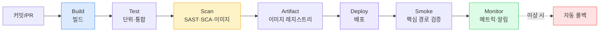
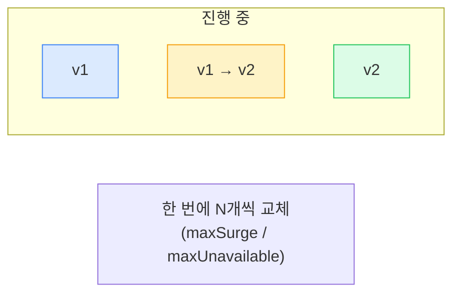
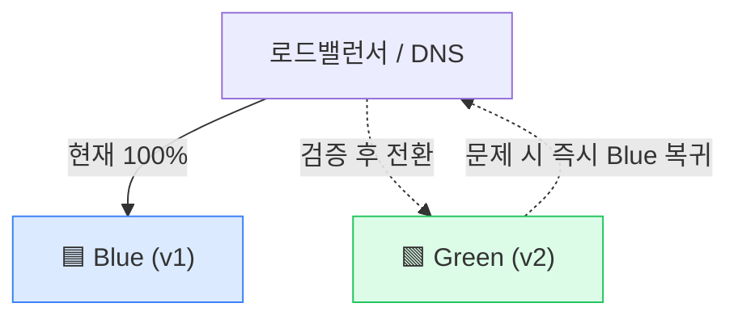
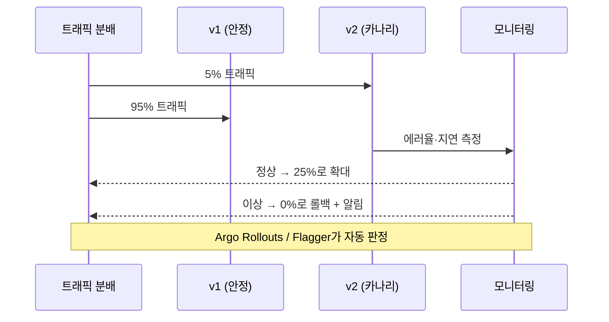
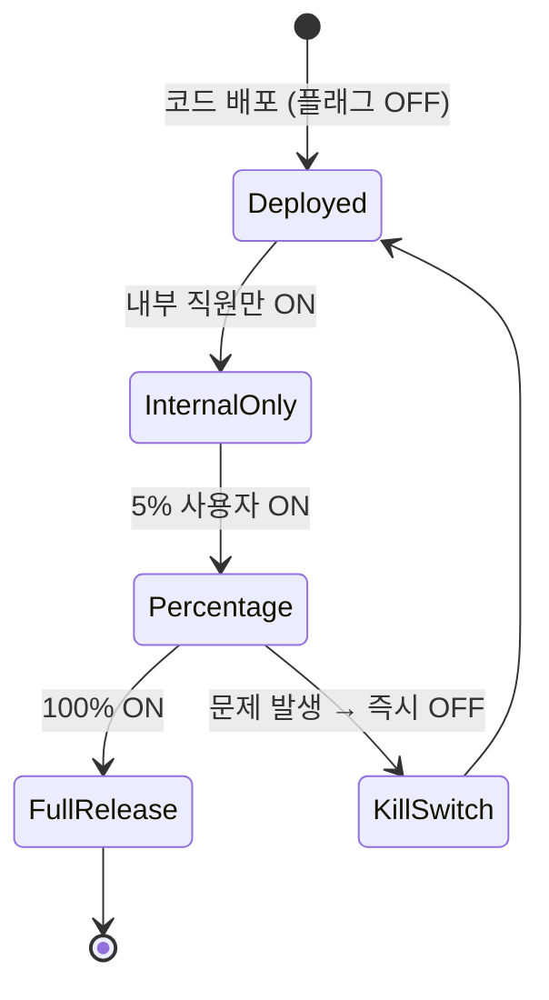
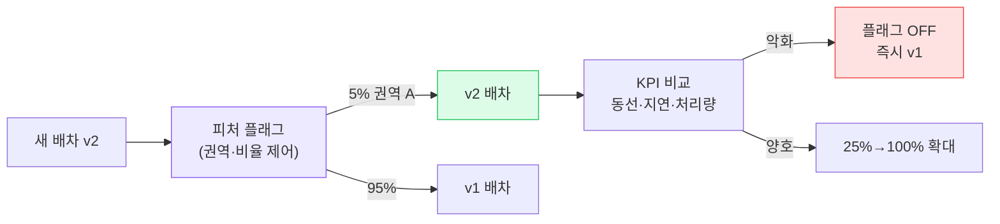

## 1. CI/CD 파이프라인 — 전체 흐름

*표준 파이프라인 — Build → Test → Scan → Artifact → Deploy → Smoke → Monitor. 마지막 Monitor가 롤백 트리거*

- **SAST(Static Application Security Testing, 정적 분석)**: 소스코드 취약점.
- **SCA(Software Composition Analysis)**: 의존 라이브러리 취약점(CVE).
- **Container scan**: 베이스 이미지 OS 패키지 취약점.

> **⚠️ 실무 함정**
>
> Smoke test(배포 후 핵심 경로 자동 검증)와 모니터링이 없으면, 배포는 "성공"인데 실제 서비스는 죽어있는 상황을 한참 뒤에야 안다. **Deploy의 마지막 게이트는 항상 "관측"** 이어야 한다.

## 2. CI / Continuous Delivery / Continuous Deployment

| 용어 | 의미 | 사람 개입 |
| --- | --- | --- |
| **CI (Continuous Integration, 지속적 통합)** | 커밋마다 빌드·테스트 자동화 | — |
| **Continuous Delivery (지속적 전달)** | 언제든 배포 가능한 상태 유지, **배포 버튼은 사람이** | 승인 1회 |
| **Continuous Deployment (지속적 배포)** | 테스트 통과 시 **자동으로 프로덕션까지** | 없음 (완전 자동) |

> **💡 DORA 4 지표로 성숙도 측정**
>
> **Deployment Frequency(배포 빈도), Lead Time(변경 리드타임), Change Failure Rate(변경 실패율), MTTR(Mean Time To Restore, 평균 복구 시간)** . 엘리트 조직은 하루 여러 번 배포하면서 실패율은 낮고 복구는 1시간 이내. "자주·작게·안전하게" 배포가 핵심.

## 3. Rolling Update(롤링 업데이트)

구버전 인스턴스를 **조금씩 신버전으로 교체**. K8s Deployment 기본 전략.

*Rolling — 점진 교체. 추가 인프라 비용 거의 없음. 단, 배포 중 v1·v2 공존*

- **장점**: 추가 비용 적음, 자연스러운 무중단.
- **단점**: 배포 중 **두 버전 공존** → API 하위호환·DB 스키마 호환 필수. 롤백이 또 다른 롤링이라 느림.

## 4. Blue-Green Deployment(블루-그린 배포)

현재(Blue)와 똑같은 신버전 환경(Green)을 **통째로 띄운 뒤, 트래픽을 한 번에 전환**.

*Blue-Green — 트래픽 스위치 한 번. 롤백이 "다시 Blue로" 라 즉각적*

- **장점**: 즉각적 전환·롤백, 배포 중 단일 버전만 노출, Green에서 충분히 검증 가능.
- **단점**: 일시적으로 **인프라 2배** 비용. DB는 공유하므로 스키마 호환 여전히 필요.

## 5. Canary Deployment(카나리 배포)

신버전에 **소수 트래픽(1%→5%→25%→100%)만 점진적으로** 흘리며 메트릭을 보고 확대/중단.

*Canary — 폭발 반경(Blast radius)을 5%로 제한. 자동 분석으로 확대/중단 결정*

> **🎯 면접 포인트**
>
> "Canary와 Blue-Green 차이?" → Blue-Green은 **0% 또는 100%** (전부 전환), Canary는 **점진 비율 + 실시간 메트릭 기반 자동 판정** . Canary는 폭발 반경을 최소화하지만 트래픽 라우팅·메트릭 분석 인프라(Argo Rollouts/Flagger, Service Mesh)가 필요해 복잡하다. 🔥(Deep-dive)

## 6. 배포 전략 비교표

| 전략 | 추가 비용 | 롤백 속도 | 폭발 반경 | 버전 공존 | 적합 상황 |
| --- | --- | --- | --- | --- | --- |
| **Rolling** | 거의 없음 | 느림 (역롤링) | 중 | O | 일반 무상태 서비스 기본 |
| **Recreate** | 없음 | 느림 | 전체 (다운타임) | X | 다운타임 허용·동시 버전 불가 |
| **Blue-Green** | **2배 (일시)** | **즉시** | 전체(전환 후) | X (단일 노출) | 즉각 롤백 중요, 비용 여유 |
| **Canary** | 소폭 | 빠름 (비율 0%) | **최소 (1~5%)** | O | 고트래픽·고위험 변경 |

## 7. 롤백(Rollback) 전략

> **⚠️ 실무 함정 — "앞으로만 가는" 배포**
>
> 롤백 전략 없이 배포하면, 장애 시 "급하게 핫픽스 또 배포"라는 도박을 한다. **모든 배포는 롤백 경로가 먼저 정의** 돼야 한다. K8s면 `kubectl rollout undo` , GitOps면 `git revert` , Blue-Green이면 트래픽 스위치 복귀.

### DB 마이그레이션과 롤백 — 가장 위험한 지점

> **🎯 면접 포인트 (최상위 단골)**
>
> "배포 롤백했는데 DB는 이미 마이그레이션됐다면?" → 코드는 되돌려도 **스키마 변경은 비가역** 일 수 있다. 해법은 **Expand-Contract(확장-수축) 패턴** : ① 컬럼 추가는 nullable로(구버전 호환) ② 신버전 배포·안정화 ③ 그 다음 배포에서 구컬럼 제거. **"배포와 동시에 파괴적 마이그레이션 실행"은 절대 금지** — 롤백 불가 상태를 만든다. 🔥(Deep-dive)

## 8. Feature Flag(피처 플래그) — 배포 ≠ 릴리스

> **핵심 개념** — **Deploy(배포)**는 코드를 서버에 올리는 것, **Release(릴리스)**는 사용자에게 기능을 켜는 것. 피처 플래그가 이 둘을 *분리*한다.

*피처 플래그 — 배포된 코드를 점진 노출. 문제 시 재배포 없이 즉시 끄는 Kill Switch*

- **장점**: 배포 리스크 분리, A/B 테스트, 즉시 끄기(Kill Switch), 점진 노출.
- **도구**: LaunchDarkly, Unleash, 자체 구현.
- **주의**: 플래그가 쌓이면 기술 부채. 수명 다한 플래그는 제거(flag debt 관리).

## 9. 물류 연결 — 라스트마일 배차 로직 무중단 배포

> **💡 시나리오 — 새 배차 알고리즘 출시**
>
> 라스트마일 배차(기사에게 주문 할당) 로직을 새 알고리즘(v2)으로 바꾼다. 잘못되면 **기사 동선이 꼬여 배송 지연·기사 불만** 이 즉시 터진다. **Canary + 피처 플래그 조합**: 특정 캠프(예: 1개 권역) 트래픽 5%에만 v2 배차 적용. 핵심 메트릭(평균 배차 거리, 기사당 처리 건수, 배송 지연율)을 v1 대비 비교. 지표 악화 시 **플래그 OFF로 즉시 v1 복귀** (재배포 불필요). 양호하면 권역을 25%→100%로 확대. **Trade-off** : 배차는 상태가 있는(기사-주문 매핑) 로직이라, 전환 순간 진행 중인 배차의 일관성을 어떻게 유지할지(새 주문만 v2 / 기존은 v1 유지)를 설계해야 한다. 단순 무상태 API보다 까다롭다.

*배차 로직 Canary + 피처 플래그 — 폭발 반경을 권역·비율로 이중 제한*
