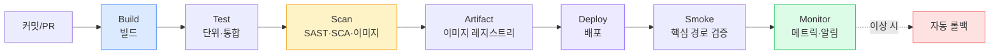
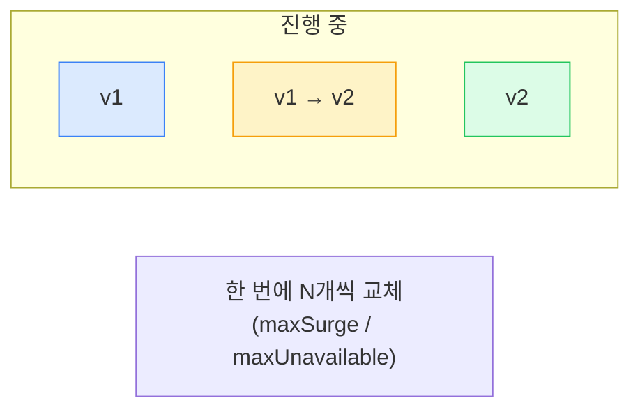
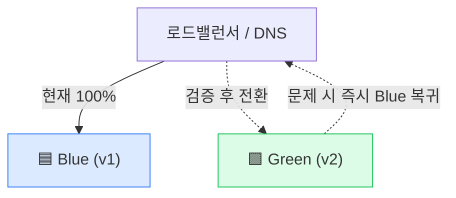
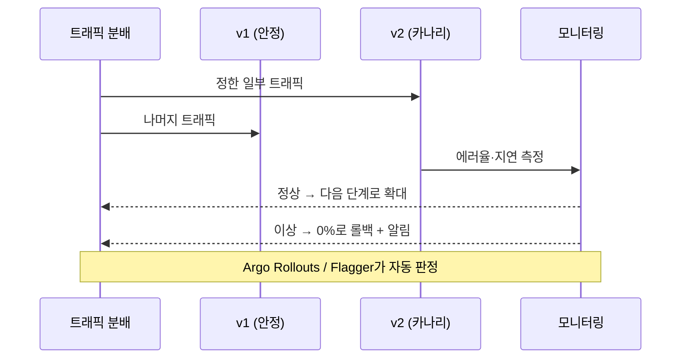
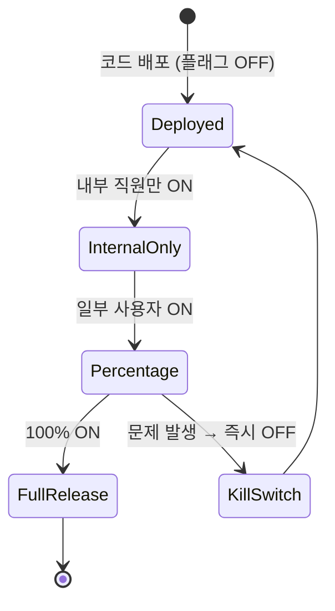
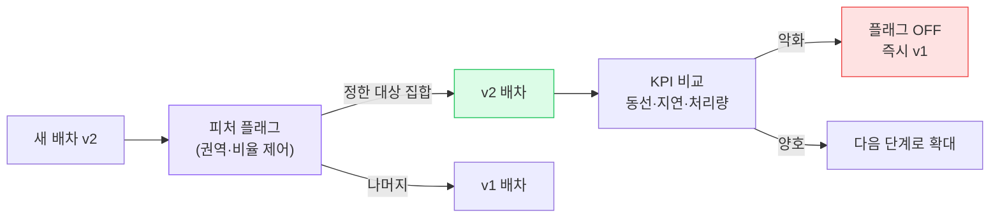

## 1. CI/CD 파이프라인 — 전체 흐름


```mermaid
flowchart LR
    Code["커밋/PR"] --> Build["Build\n빌드"]
    Build --> Test["Test\n단위·통합"]
    Test --> Scan["Scan\nSAST·SCA·이미지"]
    Scan --> Art["Artifact\n이미지 레지스트리"]
    Art --> Deploy["Deploy\n배포"]
    Deploy --> Smoke["Smoke\n핵심 경로 검증"]
    Smoke --> Mon["Monitor\n메트릭·알림"]
    Mon -.->|"이상 시"| RB["자동 롤백"]

    style Build fill:#dbeafe,stroke:#3b82f6
    style Scan fill:#fef3c7,stroke:#f59e0b
    style Deploy fill:#ede9fe,stroke:#8b5cf6
    style Mon fill:#dcfce7,stroke:#22c55e
    style RB fill:#fee2e2,stroke:#ef4444
```

*표준 파이프라인 — Build → Test → Scan → Artifact → Deploy → Smoke → Monitor. 마지막 Monitor가 롤백 트리거*

- **SAST(Static Application Security Testing, 정적 분석)**: 소스코드 취약점.
- **SCA(Software Composition Analysis)**: 의존 라이브러리 취약점(CVE).
- **Container scan**: 베이스 이미지 OS 패키지 취약점.

> **⚠️ 실무 함정**
>
> Smoke test(배포 후 핵심 경로 자동 검증)와 모니터링이 없으면, 배포는 "성공"인데 실제 서비스는 죽어있는 상황을 한참 뒤에야 안다. **Deploy의 마지막 게이트는 항상 "관측"** 이어야 한다.

## 2. CI / Continuous Delivery / Continuous Deployment

| 용어 | 의미 | 사람 개입 |
| --- | --- | --- |
| **CI (Continuous Integration, 지속적 통합)** | 커밋마다 빌드·테스트 자동화 | — |
| **Continuous Delivery (지속적 전달)** | 언제든 배포 가능한 상태 유지, **배포 버튼은 사람이** | 승인 1회 |
| **Continuous Deployment (지속적 배포)** | 테스트 통과 시 **자동으로 프로덕션까지** | 없음 (완전 자동) |

> **💡 DORA 4 지표로 변화 관찰**
>
> **Deployment Frequency(배포 빈도), Lead Time(변경 리드타임), Change Failure Rate(변경 실패율), MTTR(Mean Time To Restore, 평균 복구 시간)**를 팀의 기간·서비스 범위·측정 정의와 함께 기록한다. 특정 조직의 목표 수치를 그대로 복사하지 말고, 변경 크기와 복구 가능성을 낮추는 방향으로 개선한다.

## 3. Rolling Update(롤링 업데이트)

구버전 인스턴스를 **조금씩 신버전으로 교체**. K8s Deployment 기본 전략.


```mermaid
flowchart LR
    subgraph Before["진행 중"]
        A1["v1"]
        A2["v1 → v2"]
        A3["v2"]
    end
    Note["한 번에 N개씩 교체\n(maxSurge / maxUnavailable)"]

    style A1 fill:#dbeafe,stroke:#3b82f6
    style A2 fill:#fef3c7,stroke:#f59e0b
    style A3 fill:#dcfce7,stroke:#22c55e
```

*Rolling — 점진 교체. 용량 여유와 정책에 따라 추가 인스턴스가 필요할 수 있다. 배포 중 v1·v2가 공존한다.*

- **장점**: 트래픽을 점진적으로 옮기고 용량 정책에 맞춰 자원을 조절할 수 있음.
- **단점**: 배포 중 **두 버전 공존** → API 하위호환·DB 스키마 호환 필수. 롤백이 또 다른 롤링이라 느림.

## 4. Blue-Green Deployment(블루-그린 배포)

현재(Blue)와 똑같은 신버전 환경(Green)을 **통째로 띄운 뒤, 트래픽을 한 번에 전환**.


```mermaid
flowchart TB
    LB["로드밸런서 / DNS"]
    LB -->|"현재 100%"| Blue["🟦 Blue (v1)"]
    LB -.->|"검증 후 전환"| Green["🟩 Green (v2)"]
    Green -.->|"문제 시 즉시 Blue 복귀"| LB

    style Blue fill:#dbeafe,stroke:#3b82f6
    style Green fill:#dcfce7,stroke:#22c55e
```

*Blue-Green — 트래픽 스위치 한 번. 롤백이 "다시 Blue로" 라 즉각적*

- **장점**: 즉각적 전환·롤백, 배포 중 단일 버전만 노출, Green에서 충분히 검증 가능.
- **단점**: 두 환경을 동시에 유지하는 동안 추가 자원이 필요할 수 있음. DB는 공유하거나 분리할 수 있으므로 스키마·데이터 전환 호환성을 별도로 설계해야 한다.

## 5. Canary Deployment(카나리 배포)

신버전에 **정한 비율 또는 대상 집합의 일부 트래픽만 점진적으로** 흘리며 메트릭을 보고 확대/중단한다. 단계와 관찰 시간은 서비스 위험도·트래픽·판정 신뢰도에 맞춰 설정한다.


```mermaid
sequenceDiagram
    participant LB as 트래픽 분배
    participant V1 as v1 (안정)
    participant V2 as v2 (카나리)
    participant Mon as 모니터링

    LB->>V2: 정한 일부 트래픽
    LB->>V1: 나머지 트래픽
    V2->>Mon: 에러율·지연 측정
    Mon-->>LB: 정상 → 다음 단계로 확대
    Mon-->>LB: 이상 → 0%로 롤백 + 알림
    Note over LB,Mon: Argo Rollouts / Flagger가 자동 판정
```

*Canary — 폭발 반경을 정한 대상 집합으로 제한하고, 분석 결과에 따라 확대·중단을 결정*

> **🎯 면접 포인트**
>
> "Canary와 Blue-Green 차이?" → Blue-Green은 두 환경 사이의 전환을 중심으로 하고, Canary는 대상 집합·비율을 나눠 점진적으로 노출한다. Canary의 안전성은 트래픽 라우팅, 메트릭 분석, 세션·캐시·데이터 호환성에 달려 있으며 Argo Rollouts·Flagger·Service Mesh 같은 도구 사용 여부는 환경에 따라 정한다. 🔥(Deep-dive)

## 6. 배포 전략 비교표

| 전략 | 추가 비용 | 롤백 속도 | 폭발 반경 | 버전 공존 | 적합 상황 |
| --- | --- | --- | --- | --- | --- |
| **Rolling** | 거의 없음 | 느림 (역롤링) | 중 | O | 일반 무상태 서비스 기본 |
| **Recreate** | 없음 | 느림 | 전체 (다운타임) | X | 다운타임 허용·동시 버전 불가 |
| **Blue-Green** | 두 환경 유지 비용·용량 필요 | 트래픽 전환 방식에 의존 | 전환 범위 전체 | 구현에 따라 공존 | 즉각 전환 중요, 추가 용량 확보 가능 |
| **Canary** | 라우팅·관측·일부 용량 필요 | 대상 비율을 줄이는 방식 | 정한 대상 집합 | O | 고트래픽·고위험 변경 |

## 7. 롤백(Rollback) 전략

> **⚠️ 실무 함정 — "앞으로만 가는" 배포**
>
> 롤백 전략 없이 배포하면, 장애 시 "급하게 핫픽스 또 배포"라는 도박을 한다. **모든 배포는 롤백 경로가 먼저 정의** 돼야 한다. K8s면 `kubectl rollout undo` , GitOps면 `git revert` , Blue-Green이면 트래픽 스위치 복귀.

### DB 마이그레이션과 롤백 — 가장 위험한 지점

> **🎯 면접 포인트 (최상위 단골)**
>
> "배포 롤백했는데 DB는 이미 마이그레이션됐다면?" → 코드는 되돌려도 **스키마 변경은 비가역** 일 수 있다. 해법은 **Expand-Contract(확장-수축) 패턴** : ① 컬럼 추가는 nullable로(구버전 호환) ② 신버전 배포·안정화 ③ 그 다음 배포에서 구컬럼 제거. **"배포와 동시에 파괴적 마이그레이션 실행"은 절대 금지** — 롤백 불가 상태를 만든다. 🔥(Deep-dive)

## 8. Feature Flag(피처 플래그) — 배포 ≠ 릴리스

> **핵심 개념** — **Deploy(배포)**는 코드를 서버에 올리는 것, **Release(릴리스)**는 사용자에게 기능을 켜는 것. 피처 플래그가 이 둘을 *분리*한다.


```mermaid
stateDiagram-v2
    [*] --> Deployed : 코드 배포 (플래그 OFF)
    Deployed --> InternalOnly : 내부 직원만 ON
    InternalOnly --> Percentage : 일부 사용자 ON
    Percentage --> FullRelease : 100% ON
    Percentage --> KillSwitch : 문제 발생 → 즉시 OFF
    KillSwitch --> Deployed
    FullRelease --> [*]
```

*피처 플래그 — 배포된 코드를 점진 노출. 문제 시 재배포 없이 즉시 끄는 Kill Switch*

- **장점**: 배포 리스크 분리, A/B 테스트, 즉시 끄기(Kill Switch), 점진 노출.
- **도구**: LaunchDarkly, Unleash, 자체 구현.
- **주의**: 플래그가 쌓이면 기술 부채. 수명 다한 플래그는 제거(flag debt 관리).

## 9. 물류 연결 — 라스트마일 배차 로직 무중단 배포

> **💡 시나리오 — 새 배차 알고리즘 출시**
>
> 라스트마일 배차(기사에게 주문 할당) 로직을 새 알고리즘(v2)으로 바꾼다. 잘못되면 **기사 동선이 꼬여 배송 지연**이 발생할 수 있다. **Canary + 피처 플래그 조합**으로 정한 권역·고객·주문 집합에 v2를 적용하고, 배차 성공률·재할당·지연·취소 같은 업무 지표를 v1과 같은 정의로 비교한다. 지표가 악화되면 플래그를 끄되 이미 기록된 기사-주문 매핑을 자동으로 재계산하지 않는다. 진행 중 배차는 버전·결정 ID를 기록하고, 신규 주문만 전환할지 기존 건도 보상할지 정책을 둔다.


```mermaid
flowchart LR
    New["새 배차 v2"] --> Flag["피처 플래그\n(권역·비율 제어)"]
    Flag -->|"정한 대상 집합"| V2["v2 배차"]
    Flag -->|"나머지"| V1["v1 배차"]
    V2 --> KPI["KPI 비교\n동선·지연·처리량"]
    KPI -->|"악화"| Off["플래그 OFF\n즉시 v1"]
    KPI -->|"양호"| Up["다음 단계로 확대"]

    style Flag fill:#ede9fe,stroke:#8b5cf6
    style V2 fill:#dcfce7,stroke:#22c55e
    style Off fill:#fee2e2,stroke:#ef4444
```

*배차 로직 Canary + 피처 플래그 — 폭발 반경을 권역·비율로 이중 제한*

```yaml
release-gates:
  error_rate: "서비스 SLO·기준선과 비교"
  p99_latency: "서비스 SLO·기준선과 비교"
  canary_duration: "트래픽·위험도에 맞춘 관찰 창"
  rollback: automatic
```

## 10. 실패 흐름과 복구 경계

- 새 버전이 readiness를 통과했어도 기능·데이터 호환성 오류가 있을 수 있다. 에러율뿐 아니라 대상별 성공률, 지연, 비즈니스 불변식과 로그·트레이스를 함께 확인한다.
- 롤백 중에도 구버전과 신버전이 잠시 공존할 수 있다. 요청·이벤트·DB 스키마가 양쪽에서 읽히고 쓰이는지 확인한 뒤 트래픽을 줄인다. 파괴적 스키마 변경은 코드 롤백만으로 되돌리지 말고 롤 포워드 또는 보상 절차를 사용한다.
- Canary 분석기가 메트릭 수집 실패를 정상으로 오판하면 확대 사고가 난다. 관측 데이터가 없거나 기준선이 불완전하면 확대를 중단하고 수동 검토 상태로 둔다.
- 피처 플래그 저장소가 지연·장애를 일으킬 때의 기본값, 캐시 수명, 긴급 kill switch, 권한 변경을 명시한다. 플래그 OFF가 이미 생성된 작업·예약·배차 상태를 되돌리는 것은 아니므로 후속 정합성 절차가 필요하다.
- 배포 파이프라인의 artifact digest, 환경, 승인자, 판정 근거를 기록한다. 태그 재사용으로 롤백 대상을 잃지 않도록 불변 식별자를 사용한다.

## 11. 참고 자료

- [DORA metrics](https://dora.dev/guides/dora-metrics-four-keys/)
- [Kubernetes Deployments](https://kubernetes.io/docs/concepts/workloads/controllers/deployment/)
- [Kubernetes rollout status and undo](https://kubernetes.io/docs/reference/kubectl/generated/kubectl_rollout/)
- [Kubernetes probes](https://kubernetes.io/docs/concepts/configuration/liveness-readiness-startup-probes/)
- [Martin Fowler: Blue-Green Deployment](https://martinfowler.com/bliki/BlueGreenDeployment.html)
- [Martin Fowler: Canary Release](https://martinfowler.com/bliki/CanaryRelease.html)
