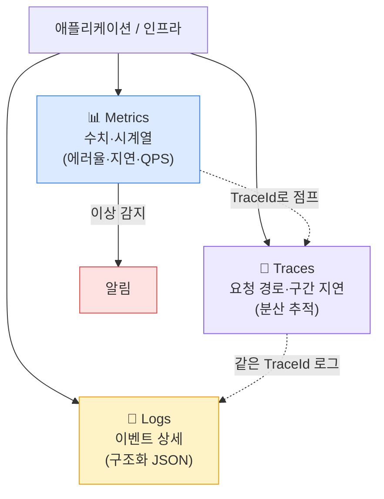
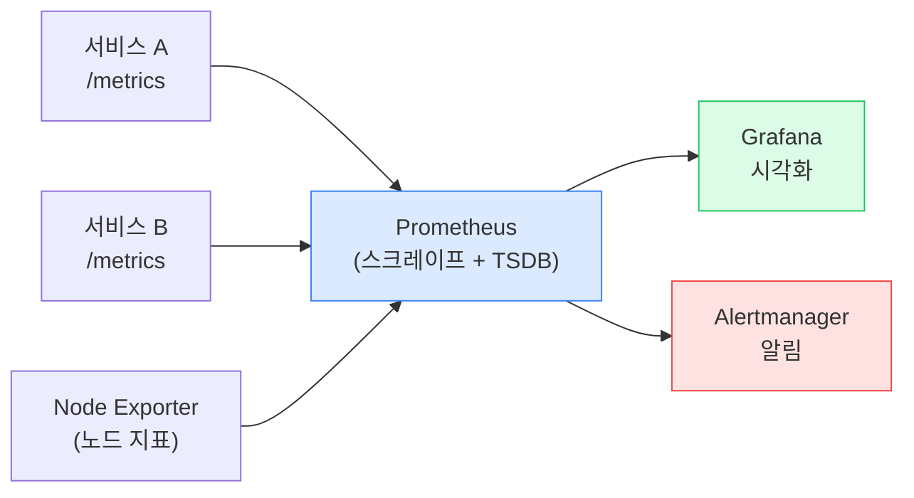
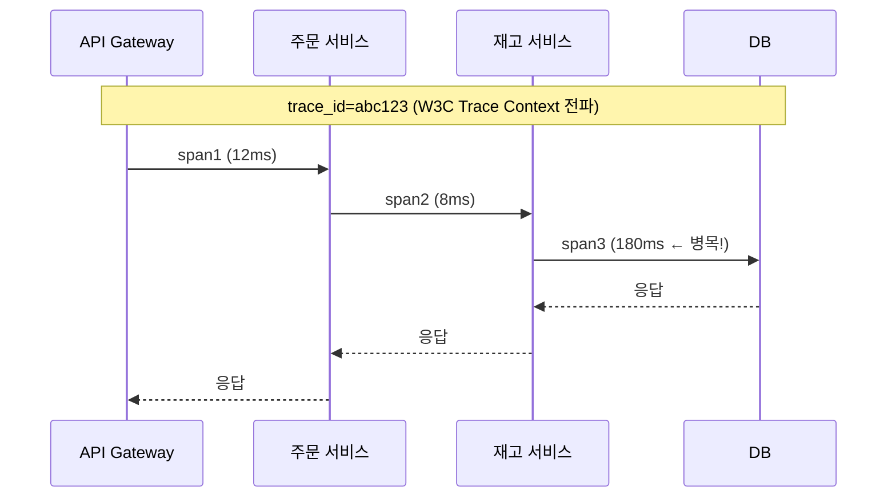
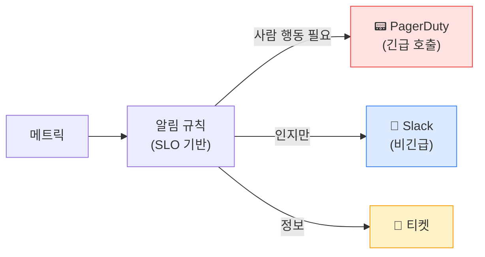
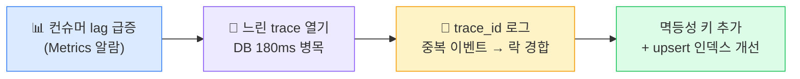

## 1. 왜 관측성(Observability)인가 — 3 Pillars

> **멘탈 모델** — Metrics(무엇이 잘못됐나) → Logs(왜 그랬나) → Traces(어디서 그랬나). 세 기둥을 *연결*해야 진짜 디버깅이 된다.

*3 Pillars — Metrics가 알람을 울리면 TraceId로 Trace와 Log를 연결해 근본 원인까지*

| Pillar | 답하는 질문 | 대표 도구 | 비용 민감 포인트 |
| --- | --- | --- | --- |
| **Metrics** | "지금 정상인가? 추세는?" | Prometheus + Grafana | 고cardinality 라벨(폭증) |
| **Logs** | "무슨 일이 있었나?" | Loki / ELK / OpenSearch | 로그 양·보존 기간 |
| **Traces** | "요청이 어디서 느렸나?" | OTel + Tempo / Jaeger | 샘플링 비율 |

## 2. Metrics — Prometheus (Pull 기반)

**Prometheus**는 각 타깃의 `/metrics` 엔드포인트를 주기적으로 **Pull(긁어오기)**한다. 시계열 DB에 저장하고 PromQL로 질의.

*Prometheus Pull 모델 — 서비스가 메트릭을 노출하면 Prometheus가 주기적으로 수집*

> **⚠️ 실무 함정 — Cardinality(카디널리티) 폭발**
>
> 메트릭 라벨에 **user_id·order_id·trace_id처럼 값이 무한한 것** 을 넣으면 시계열 수가 폭증해 Prometheus 메모리·비용이 터진다. 라벨은 **유한한 차원** (서비스명·HTTP 상태·엔드포인트 패턴)만. 고유 식별자는 Logs/Traces로. 🔥(Deep-dive)

## 3. Logs — Loki vs ELK

| 관점 | Loki | ELK / OpenSearch |
| --- | --- | --- |
| 인덱싱 | 라벨만 인덱싱 (본문 미인덱싱) | 전문(full-text) 인덱싱 |
| 비용 | **저렴** (저장 위주) | 높음 (인덱스 부담) |
| 검색력 | 라벨 + grep식 | **강력한 전문 검색·집계** |
| Grafana 통합 | 네이티브 (Prometheus와 한 화면) | Kibana 별도 |

> **🎯 면접 포인트 — 구조화 로그 + TraceId**
>
> "장애 시 로그로 디버깅이 안 됐던 경험?" → 원인은 보통 **비구조화 평문 로그 + TraceId 누락** . 해법: ① **구조화 JSON 로그** (필드로 질의 가능) ② 모든 로그에 `trace_id` 포함 → Trace에서 클릭 한 번으로 관련 로그 전부 모임. 🔥(Deep-dive)

## 4. Traces — OpenTelemetry + Tempo

분산 시스템에서 한 요청이 여러 서비스를 거치며 어디서 느렸는지 보려면 **분산 추적(Distributed Tracing)**이 필요하다.

*분산 추적 — 같은 trace_id로 span을 엮어 어느 구간이 느린지(DB 180ms) 시각화*

- **OpenTelemetry(OTel)**: 벤더 중립 표준. 계측(instrumentation)을 한 번 하면 Tempo/Jaeger/Datadog 등 어디로든 보낼 수 있다.
- **W3C Trace Context**: 서비스 간 `traceparent` 헤더로 trace_id를 전파해야 끊기지 않는다.
- **샘플링**: 전수 추적은 비싸다. 보통 1~10% 샘플링 + 에러는 전수(tail-based sampling).

## 5. RED / USE 메서드 — 무엇을 측정할까

| 메서드 | 대상 | 측정 항목 |
| --- | --- | --- |
| **RED** (서비스 관점) | 요청 단위 서비스 | **R**ate(요청률) · **E**rrors(에러율) · **D**uration(지연) |
| **USE** (자원 관점) | 인프라 자원 | **U**tilization(사용률) · **S**aturation(포화) · **E**rrors(에러) |

> **💡 면접에서 바로 쓰기**
>
> "어떤 메트릭을 대시보드에 둘까?"에 막연히 답하지 말고, "서비스는 **RED** (요청률·에러율·지연 p50/p95/p99), 자원은 **USE** (CPU·메모리 사용률, 큐 포화, 디스크 에러)"로 체계적으로 답하면 시니어 인상을 준다.

## 6. 대시보드 — Grafana

Grafana는 Prometheus(메트릭)·Loki(로그)·Tempo(트레이스)를 **한 화면에서 연결**한다. 지연 그래프에서 스파이크를 클릭 → 해당 시간대 로그 → trace_id로 트레이스까지 한 흐름으로 내려간다.

> **⚠️ 실무 함정 — 대시보드 묘지**
>
> 패널 100개짜리 대시보드는 장애 때 아무도 안 본다. **"이 서비스 정상인가?"에 30초 안에 답하는 핵심 대시보드** (RED 4~6개 패널) + 드릴다운용 상세를 분리하라. 측정만 하고 행동 못 하는 메트릭은 노이즈.

## 7. 알림 — SLO 기반 (Alert fatigue 방지)

*알림 라우팅 — 사람을 깨우는 페이지는 "지금 행동이 필요한 것"만. 나머지는 비긴급 채널*

> **🎯 면접 포인트 — CPU 알람 vs SLO 알람**
>
> "알람을 어떻게 설계?" → **"CPU 80% 넘으면 알람"은 안티패턴** . CPU가 높아도 사용자가 멀쩡하면 깨울 이유 없고, CPU가 낮아도 에러율이 치솟으면 장애다. **SLO(사용자 체감 지표) 기반 + Error Budget 소진 속도** 로 알람을 건다. 그래야 Alert fatigue(알람 피로 — 너무 많아 무시하게 됨)를 막는다. 🔥(Deep-dive)

> **⚠️ Observability 비용 폭주**
>
> 관측성 자체가 비용 폭탄이 될 수 있다. **로그 양·고cardinality 라벨·전수 트레이싱** 이 주범. 로그 샘플링·보존 기간 정책·라벨 통제로 관리하라. "측정 비용 > 측정 가치"가 되면 본말전도.

## 8. 물류 연결 — 배송 추적 파이프라인 디버깅

> **💡 시나리오 — "고객 앱에 배송 상태가 안 뜬다"**
>
> 라스트마일 추적 이벤트(스캔 → Kafka → 추적 서비스 → 앱)가 일부 지연된다는 CS 인입. **Metrics**: 추적 서비스의 RED 대시보드에서 컨슈머 처리 지연(consumer lag)이 평소 0 → 수만으로 치솟음 확인. **Traces**: 느린 요청의 trace를 열어 DB upsert 구간이 180ms로 병목임을 발견. **Logs**: 같은 trace_id 로그에서 특정 운송장의 중복 이벤트가 락 경합을 유발한 것 확인. **결론** : 3 Pillars를 trace_id로 엮었기에 "메트릭 이상 → 트레이스 병목 → 로그 근본원인"으로 10분 내 진단. 만약 평문 로그에 trace_id가 없었다면 수억 건 추적 이벤트 중 범인을 못 찾는다. 이게 관측성 설계가 곧 운영 가능성인 이유.

*3 Pillars 연계 디버깅 — trace_id가 메트릭·트레이스·로그를 하나로 꿰뚫는다*
