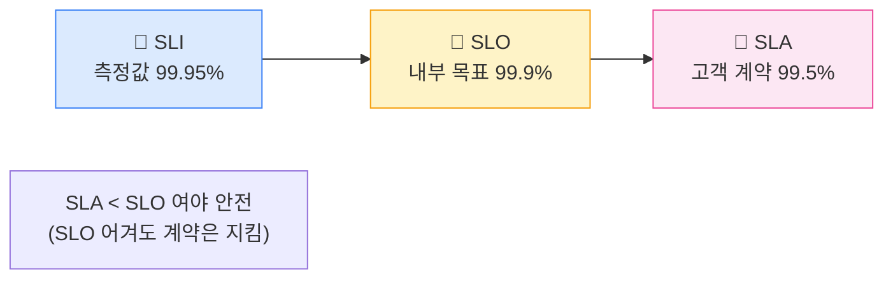
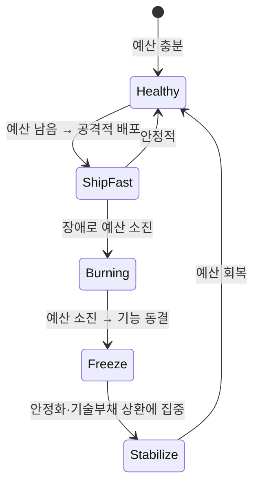
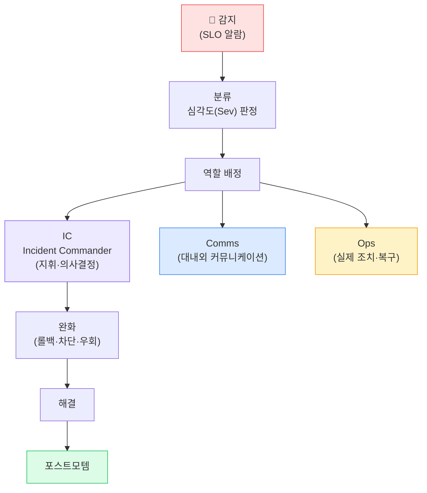
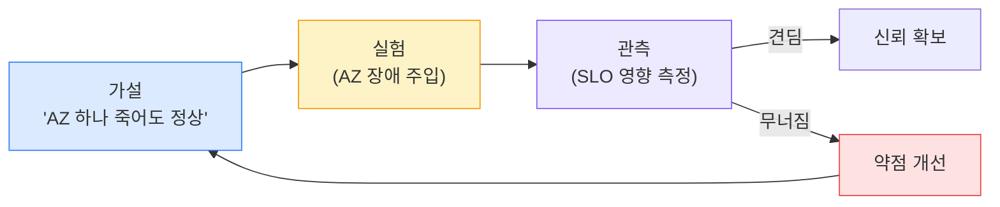

## 1. SRE(Site Reliability Engineering)란

> **한 줄 정의** — 신뢰성(Reliability)을 *측정 가능한 목표*로 정의하고, 그 목표를 충족하는 한도 내에서 *최대한 빨리 기능을 출시*하도록 운영을 자동화한다.

핵심 철학: **100% 가용성은 목표가 아니다**. 99.999%를 만드는 비용은 99.9%의 수십 배인데 사용자는 체감 못 한다. "적절한 신뢰성 목표"를 정하고, 남는 여유(Error Budget)는 기능 출시에 쓴다.

## 2. SLI / SLO / SLA — 셋의 관계

| 용어 | 정의 | 예시 | 주체 |
| --- | --- | --- | --- |
| **SLI** (Service Level Indicator, 지표) | 실제 측정한 신뢰성 수치 | "성공 요청 비율 99.95%" | 측정값 |
| **SLO** (Service Level Objective, 목표) | SLI의 **내부 목표치** | "99.9% 이상" | 팀 내부 약속 |
| **SLA** (Service Level Agreement, 협약) | 고객과의 **계약 + 위약 패널티** | "99.5% 미달 시 환불" | 대외 계약 |

*SLA < SLO < SLI 관계 — 내부 목표(SLO)를 계약(SLA)보다 빡세게 잡아 버퍼 확보*

> **🎯 면접 포인트**
>
> 세 용어를 섞어 쓰면 감점. **SLI는 측정값, SLO는 내부 목표, SLA는 대외 계약** . 그리고 "SLO를 SLA보다 엄격하게 잡아야, SLO를 어겨도 고객 계약 위반(패널티)은 막을 버퍼가 생긴다"까지 말하면 실무 이해도 인증.

## 3. Error Budget(오류 예산)

> **정의** — **Error Budget = 1 − SLO**. SLO가 99.9%면, 0.1%만큼은 "고장 나도 되는 예산". 이 예산을 *신기능 출시 리스크*에 쓴다.

월 SLO 99.9% → 한 달(약 43,200분) 중 **약 43분**의 다운타임이 허용 예산. 이 숫자가 개발팀과 운영팀의 갈등을 객관적 규칙으로 바꾼다.

*Error Budget 정책 — 예산 남으면 빠르게 출시, 소진되면 기능 동결하고 안정화*

> **💡 갈등을 규칙으로**
>
> "개발은 빨리 출시하려 하고 운영은 막으려 한다"는 고질병을, Error Budget은 **"예산 남으면 출시 OK, 소진되면 자동으로 기능 동결"** 이라는 공유 규칙으로 해소한다. 누구의 감정이 아니라 숫자가 결정한다.

## 4. Toil(토일, 반복 운영 업무) 감소

**Toil** = 수동적·반복적·자동화 가능하지만 안 한·서비스 성장에 비례해 늘어나는 운영 업무. (예: 매번 손으로 하는 배포, 수동 인증서 갱신, 반복 알람 대응)

- Google SRE 기준: **Toil이 업무의 50%를 넘으면 위험 신호**. 자동화에 투자해야 한다.
- 자동화 투자 판단: "이 반복 작업을 자동화하는 비용 vs 앞으로 절약할 시간"으로 정량 비교.

> **⚠️ 실무 함정**
>
> Toil을 "원래 운영은 그런 것"이라며 방치하면, 팀이 불 끄기에만 매달려 개선·자동화에 쓸 시간이 사라지는 악순환에 빠진다. Toil 비율을 측정하고 상한선을 정하라.

## 5. Incident(장애) 대응 — Runbook & 역할 분리

*Incident Command — IC/Comms/Ops 역할 분리. 한 사람이 다 하면 지휘가 무너진다*

> **🎯 면접 포인트 — 복구가 원인 규명보다 먼저**
>
> "장애 나면 뭐부터?" → **"원인부터 찾는다"는 흔한 오답** . 우선순위는 ① **완화(Mitigation) — 일단 사용자 영향 멈추기** (롤백·트래픽 차단·우회), ② 그 다음 원인 규명. 근본 원인은 복구 후 포스트모템에서. 면접에선 "MTTR(평균 복구 시간)을 줄이려면 원인 규명보다 완화를 먼저"라고 답하라. 🔥(Deep-dive)

### Graceful Degradation / Back-pressure / Shed load

- **Graceful degradation(우아한 성능 저하)**: 추천 서비스 죽으면 추천 없이라도 주문은 받기.
- **Back-pressure(배압)**: 다운스트림이 못 따라오면 상류에 "천천히" 신호.
- **Shed load(부하 차단)**: 과부하 시 일부 요청을 빠르게 거절해 전체 붕괴 방지.

## 6. Postmortem(포스트모템) — Blameless

> **핵심 원칙** — **Blameless(비난 없는)** — "누가 잘못했나"가 아니라 "어떤 시스템·프로세스가 그 실수를 가능하게 했나"를 묻는다.

### 포스트모템 표준 구성

| 섹션 | 내용 |
| --- | --- |
| **Summary** | 무슨 일이, 얼마나 영향(사용자·시간·매출) |
| **Timeline** | 감지→완화→해결까지 시각별 사건 |
| **Root Cause** | 근본 원인 (5 Whys 등) |
| **Action Items** | 재발 방지 — **담당자·기한 명시** |
| **Lessons Learned** | 잘된 점·아쉬운 점·운 좋았던 점 |

> **⚠️ 실무 함정**
>
> 포스트모템이 **"담당자 문책"으로 끝나면** , 다음부터 사람들이 장애를 숨긴다 → 더 큰 사고. Action Item이 "조심하자" 같은 추상론이면 무의미 — **구체적·검증 가능·담당자/기한 있는** 개선만 유효하다.

## 7. Chaos Engineering(카오스 엔지니어링) 개요

장애를 **일부러 주입**해 시스템이 견디는지 사전에 검증한다. "장애는 일어난다"를 전제로, 통제된 환경에서 약점을 미리 찾는다.

*Chaos Engineering — 가설→실험→관측→개선. Netflix Chaos Monkey가 원조*

> **💡 성급히 뛰어들기 전에**
>
> 카오스 엔지니어링은 **관측성·SLO·롤백이 먼저 갖춰진 뒤** 에 의미 있다. 측정 못 하는 시스템에 장애를 주입하면 그냥 장애를 만드는 것. Gameday(통제된 모의 장애 훈련)부터 시작해 점진 확대하라.

## 8. 물류 연결 — Cut-off 직전 주문 서비스 장애

> **💡 시나리오 — 새벽배송 마감 10분 전 주문 API 지연**
>
> 22:50, Cut-off(23:00) 10분 전에 주문 API p99 지연이 5초로 치솟고 에러율 급증. 사용자가 주문을 못 넣으면 **곧바로 매출 손실 + 익일 배송 실패** . **완화 우선**: 원인 규명 전, 직전 배포를 즉시 롤백(혹은 피처 플래그 OFF). MTTR 단축이 최우선. **Graceful degradation**: 추천·쿠폰 추천 같은 비핵심 호출을 차단(Shed load)해 주문 핵심 경로 자원 확보. **역할**: IC가 "Cut-off를 10분 연장할지"를 비즈니스와 즉시 결정(Comms), Ops는 복구 집행. **Error Budget**: 이번 장애로 이달 예산이 소진되면, 다음 스프린트는 기능 동결하고 주문 경로 안정화(부하 테스트·Shed load 정교화)에 투자. **Postmortem**: Blameless로 "왜 Cut-off 직전 배포가 가능했나"를 묻고, Action Item으로 **피크 시간대 배포 동결(freeze window)**을 규칙화. **Trade-off** : Cut-off 연장은 고객 경험을 지키지만 창고·간선·기사 스케줄 전체를 밀어 비용이 든다. SLO·매출 영향·운영 비용을 IC가 저울질해 결정한다.
