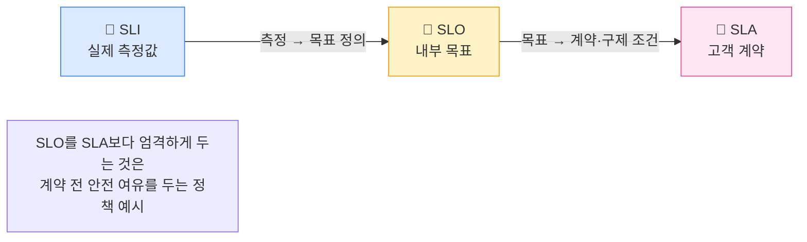
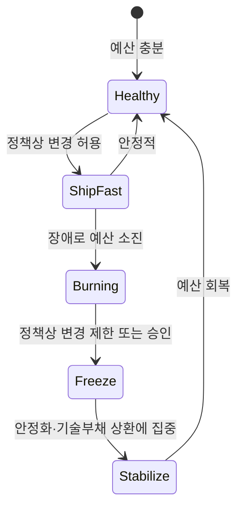
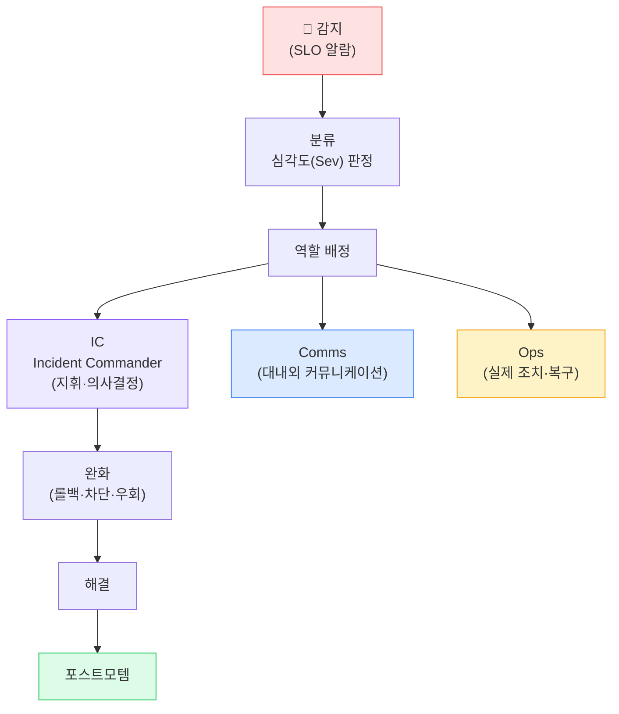
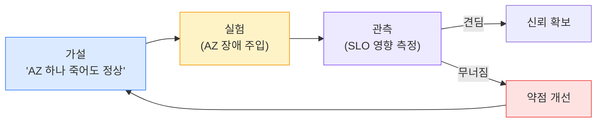

## 1. SRE(Site Reliability Engineering)란

> **한 줄 정의** — 신뢰성(Reliability)을 *측정 가능한 목표*로 정의하고, 그 목표를 충족하는 한도 내에서 *최대한 빨리 기능을 출시*하도록 운영을 자동화한다.

핵심 철학: **100% 가용성은 보통 현실적인 운영 목표가 아니다**. 신뢰성 목표가 높아질수록 설계·운영·복구 비용과 변경 제약이 커질 수 있으므로, 사용자 영향·규제·비즈니스 요구에 맞는 SLO를 정한다. 남는 여유(Error Budget)는 변경과 학습에 사용할 수 있다.

## 2. SLI / SLO / SLA — 셋의 관계

| 용어 | 정의 | 예시 | 주체 |
| --- | --- | --- | --- |
| **SLI** (Service Level Indicator, 지표) | 실제 측정한 신뢰성 수치 | "성공 요청 비율 99.95%" | 측정값 |
| **SLO** (Service Level Objective, 목표) | SLI의 **내부 목표치** | "99.9% 이상" | 팀 내부 약속 |
| **SLA** (Service Level Agreement, 협약) | 고객과의 **계약 + 위약 패널티** | "99.5% 미달 시 환불" | 대외 계약 |


```mermaid
flowchart LR
    SLI["📏 SLI\n실제 측정값"] -->|"측정 → 목표 정의"| SLO["🎯 SLO\n내부 목표"]
    SLO -->|"목표 → 계약·구제 조건"| SLA["📜 SLA\n고객 계약"]
    Note["SLO를 SLA보다 엄격하게 두는 것은\n계약 전 안전 여유를 두는 정책 예시"]

    style SLI fill:#dbeafe,stroke:#3b82f6
    style SLO fill:#fef3c7,stroke:#f59e0b
    style SLA fill:#fce7f3,stroke:#ec4899
```

*SLI는 측정값이고 SLO·SLA는 목표·계약의 역할이다. SLO를 SLA보다 엄격하게 두는 것은 내부 안전 여유를 확보하려는 정책 예시*

> **🎯 면접 포인트**
>
> 세 용어를 섞어 쓰면 감점. **SLI는 측정값, SLO는 내부 목표, SLA는 대외 계약** . 그리고 "SLO를 SLA보다 엄격하게 잡아야, SLO를 어겨도 고객 계약 위반(패널티)은 막을 버퍼가 생긴다"까지 말하면 실무 이해도 인증.

## 3. Error Budget(오류 예산)

> **정의** — 가용성처럼 성공 비율로 표현한 SLO라면 **Error Budget = 1 − SLO target**으로 계산한다. SLO가 99.9%면 허용 실패 비율은 0.1%다. 지연시간·가중치·요청 기반 SLO는 해당 서비스가 정의한 분모와 허용 miss 비율로 계산해야 하며, 모든 SLO에 같은 식을 기계적으로 적용하지 않는다.

예를 들어 30일 동안 항상 측정 가능한 가용성 SLO가 99.9%라면, 허용 오류 예산은 전체 관측 시간의 0.1%다. 30일을 분 단위로 계산할 때 약 43.2분이지만, 실제 예산은 요청 기반·가중치·제외 시간·유지보수 정책에 따라 달라진다. 계산식을 고정하고 측정 범위를 문서화해야 개발팀과 운영팀이 같은 숫자를 본다.


```mermaid
stateDiagram-v2
    [*] --> Healthy : 예산 충분
    Healthy --> ShipFast : 정책상 변경 허용
    ShipFast --> Healthy : 안정적
    ShipFast --> Burning : 장애로 예산 소진
    Burning --> Freeze : 정책상 변경 제한 또는 승인
    Freeze --> Stabilize : 안정화·기술부채 상환에 집중
    Stabilize --> Healthy : 예산 회복
```

*Error Budget 정책 예시 — 예산과 burn rate에 따라 출시·안정화 규칙을 사전에 정할 수 있음*

> **💡 갈등을 규칙으로**
>
> "개발은 빨리 출시하려 하고 운영은 막으려 한다"는 갈등을, Error Budget은 **예산과 burn rate를 기준으로 출시·완화·안정화 규칙을 합의하는 방식**으로 다룬다. 예산 소진 시 변경 동결이나 추가 승인을 요구할 수 있지만, 예외·완화·승인 절차는 조직 정책이므로 자동 동결을 보편 규칙으로 가정하지 않는다.

## 4. Toil(토일, 반복 운영 업무) 감소

**Toil** = 수동적·반복적·자동화 가능하지만 안 한·서비스 성장에 비례해 늘어나는 운영 업무. (예: 매번 손으로 하는 배포, 수동 인증서 갱신, 반복 알람 대응)

- Toil의 양이 팀의 개선·복구 역량을 잠식하는지 추적하고, 자동화 투자 판단은 반복 빈도·오류 위험·자동화 비용·절감 시간을 함께 비교한다.

> **⚠️ 실무 함정**
>
> Toil을 "원래 운영은 그런 것"이라며 방치하면, 팀이 불 끄기에만 매달려 개선·자동화에 쓸 시간이 사라지는 악순환에 빠진다. Toil 비율을 측정하고 상한선을 정하라.

## 5. Incident(장애) 대응 — Runbook & 역할 분리


```mermaid
flowchart TB
    Detect["🚨 감지\n(SLO 알람)"] --> Triage["분류\n심각도(Sev) 판정"]
    Triage --> Roles["역할 배정"]
    Roles --> IC["IC\nIncident Commander\n(지휘·의사결정)"]
    Roles --> Comms["Comms\n(대내외 커뮤니케이션)"]
    Roles --> Ops["Ops\n(실제 조치·복구)"]
    IC --> Mitigate["완화\n(롤백·차단·우회)"]
    Mitigate --> Resolve["해결"]
    Resolve --> PM["포스트모템"]

    style Detect fill:#fee2e2,stroke:#ef4444
    style IC fill:#ede9fe,stroke:#8b5cf6
    style Comms fill:#dbeafe,stroke:#3b82f6
    style Ops fill:#fef3c7,stroke:#f59e0b
    style PM fill:#dcfce7,stroke:#22c55e
```

*Incident Command — IC/Comms/Ops 역할 분리. 한 사람이 다 하면 지휘가 무너진다*

> **🎯 면접 포인트 — 복구가 원인 규명보다 먼저**
>
> "장애 나면 뭐부터?" → **"원인부터 찾는다"는 흔한 오답** . 우선순위는 ① **완화(Mitigation) — 일단 사용자 영향 멈추기** (롤백·트래픽 차단·우회), ② 그 다음 원인 규명. 근본 원인은 복구 후 포스트모템에서. 면접에선 "MTTR(평균 복구 시간)을 줄이려면 원인 규명보다 완화를 먼저"라고 답하라. 🔥(Deep-dive)

### Graceful Degradation / Back-pressure / Shed load

- **Graceful degradation(우아한 성능 저하)**: 추천 서비스 죽으면 추천 없이라도 주문은 받기.
- **Back-pressure(배압)**: 다운스트림이 못 따라오면 상류에 "천천히" 신호.
- **Shed load(부하 차단)**: 과부하 시 일부 요청을 빠르게 거절해 전체 붕괴 방지.

## 6. Postmortem(포스트모템) — Blameless

> **핵심 원칙** — **Blameless(비난 없는)** — "누가 잘못했나"보다 "어떤 시스템·프로세스가 그 실수를 가능하게 했나"를 묻는다. 개인의 고의·보안 위반과 시스템 개선을 같은 절차로 처리하지 않도록 조직 정책을 명확히 한다.

### 포스트모템 표준 구성

| 섹션 | 내용 |
| --- | --- |
| **Summary** | 무슨 일이, 얼마나 영향(사용자·시간·매출) |
| **Timeline** | 감지→완화→해결까지 시각별 사건 |
| **Root Cause** | 근본 원인 (5 Whys 등) |
| **Action Items** | 재발 방지 — **담당자·기한 명시** |
| **Lessons Learned** | 잘된 점·아쉬운 점·운 좋았던 점 |

> **⚠️ 실무 함정**
>
> 포스트모템이 **"담당자 문책"으로 끝나면** , 다음부터 사람들이 장애를 숨긴다 → 더 큰 사고. Action Item이 "조심하자" 같은 추상론이면 무의미 — **구체적·검증 가능·담당자/기한 있는** 개선만 유효하다.

## 7. Chaos Engineering(카오스 엔지니어링) 개요

장애를 **일부러 주입**해 시스템이 견디는지 사전에 검증한다. "장애는 일어난다"를 전제로, 통제된 환경에서 약점을 미리 찾는다.


```mermaid
flowchart LR
    H["가설\n'AZ 하나 죽어도 정상'"] --> E["실험\n(AZ 장애 주입)"]
    E --> O["관측\n(SLO 영향 측정)"]
    O -->|"견딤"| Conf["신뢰 확보"]
    O -->|"무너짐"| Fix["약점 개선"]
    Fix --> H

    style H fill:#dbeafe,stroke:#3b82f6
    style E fill:#fef3c7,stroke:#f59e0b
    style O fill:#ede9fe,stroke:#8b5cf6
    style Fix fill:#fee2e2,stroke:#ef4444
```

*Chaos Engineering — 가설→실험→관측→개선*

> **💡 성급히 뛰어들기 전에**
>
> 카오스 엔지니어링은 **관측성·SLO·중단 기준·롤백이 먼저 갖춰진 뒤** 의미 있다. 측정하지 못하는 시스템에 장애를 주입하면 통제되지 않은 장애가 된다. 작은 범위의 Gameday(통제된 모의 장애 훈련)부터 시작하고, 실험 중단 조건과 영향 범위를 사전에 승인한다.

## 8. 물류 연결 — Cut-off 직전 주문 서비스 장애

> **💡 시나리오 — 새벽배송 마감 10분 전 주문 API 지연**
>
> 22:50, Cut-off(23:00) 10분 전에 주문 API p99 지연이 5초로 치솟고 에러율 급증. 사용자가 주문을 못 넣으면 **곧바로 매출 손실 + 익일 배송 실패** . **완화 우선**: 원인 규명 전, 직전 배포를 즉시 롤백(혹은 피처 플래그 OFF). MTTR 단축이 최우선. **Graceful degradation**: 추천·쿠폰 추천 같은 비핵심 호출을 차단(Shed load)해 주문 핵심 경로 자원 확보. **역할**: IC가 "Cut-off를 10분 연장할지"를 비즈니스와 즉시 결정(Comms), Ops는 복구 집행. **Error Budget**: 이번 장애로 이달 예산이 소진되면, 다음 스프린트는 기능 동결하고 주문 경로 안정화(부하 테스트·Shed load 정교화)에 투자. **Postmortem**: Blameless로 "왜 Cut-off 직전 배포가 가능했나"를 묻고, Action Item으로 **피크 시간대 배포 동결(freeze window)**을 규칙화. **Trade-off** : Cut-off 연장은 고객 경험을 지키지만 창고·간선·기사 스케줄 전체를 밀어 비용이 든다. SLO·매출 영향·운영 비용을 IC가 저울질해 결정한다.

```text
SEV-1 타임라인
22:50 감지·Incident Commander 지정
22:53 직전 배포 롤백
22:56 비핵심 경로 차단
23:02 오류율 정상화·모니터링
```

## 9. 실패 흐름과 운영 경계

- SLI가 측정되지 않거나 분모가 바뀌면 error budget을 계산할 수 없다. 성공·실패 정의, 요청 제외 규칙, 집계 창, 데이터 지연을 문서화하고 대시보드와 알람이 같은 정의를 쓰게 한다.
- 알람이 울려도 담당자·Runbook·권한·연락 경로가 없으면 완화가 지연된다. page는 즉시 행동이 필요한 조건으로 제한하고, 비긴급 신호는 티켓·대시보드로 분리한다.
- 롤백이 데이터 변경을 되돌리지 못할 수 있다. 완화 단계에서 트래픽 차단·기능 플래그·읽기 전용 전환·롤 포워드 가능성을 검토하고, 복구 후 데이터 대사와 재처리를 별도 작업으로 추적한다.
- 장애 중 재시도와 자동 확장이 하위 시스템을 더 압박할 수 있다. deadline·지수 백오프·재시도 예산·서킷 브레이커·큐 용량을 확인하고, 포화 시 우선순위가 낮은 작업부터 차단한다.
- 포스트모템 Action Item은 소유자·기한·검증 방법을 갖추고, 완료 여부를 다시 확인한다. 같은 장애가 재발하면 개인의 주의가 아니라 탐지·배포·권한·복구 설계의 결함을 다시 본다.

## 10. 참고 자료

- [Google SRE: Service Level Objectives](https://sre.google/sre-book/service-level-objectives/)
- [Google SRE: Error Budgets](https://sre.google/workbook/error-budget-policy/)
- [Google SRE: Being On-Call](https://sre.google/sre-book/being-on-call/)
- [Google SRE: Postmortem Culture](https://sre.google/sre-book/postmortem-culture/)
- [NIST SP 800-61 Rev. 2: Computer Security Incident Handling Guide](https://csrc.nist.gov/pubs/sp/800/61/r2/final)
- [Principles of Chaos Engineering](https://principlesofchaos.org/)
