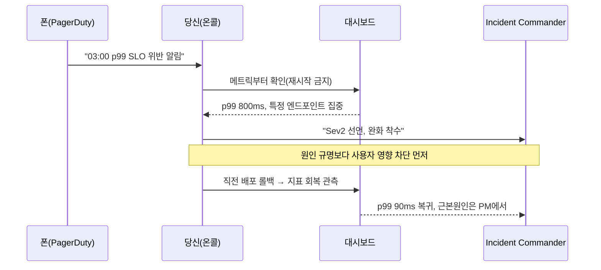
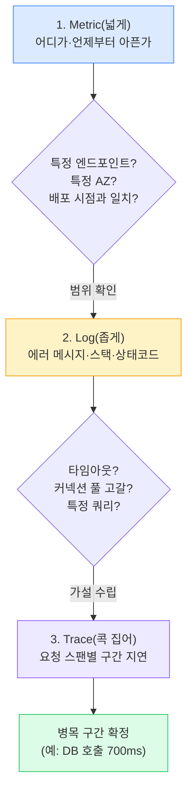
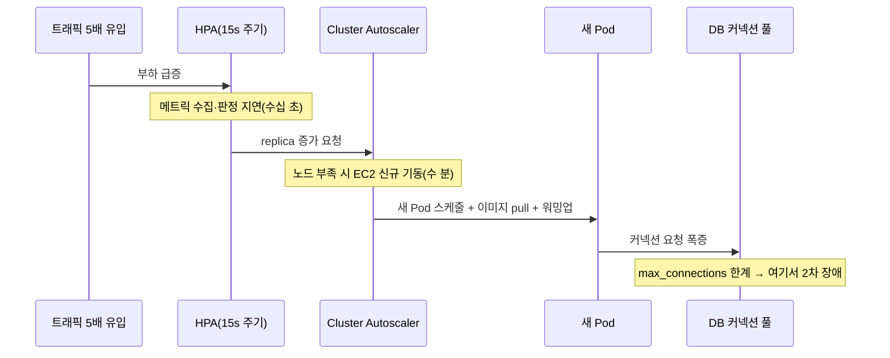
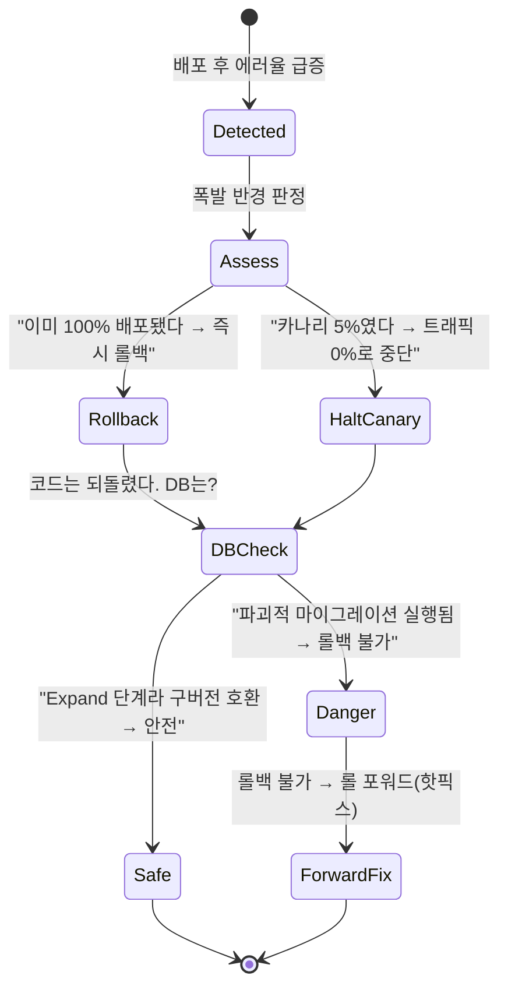
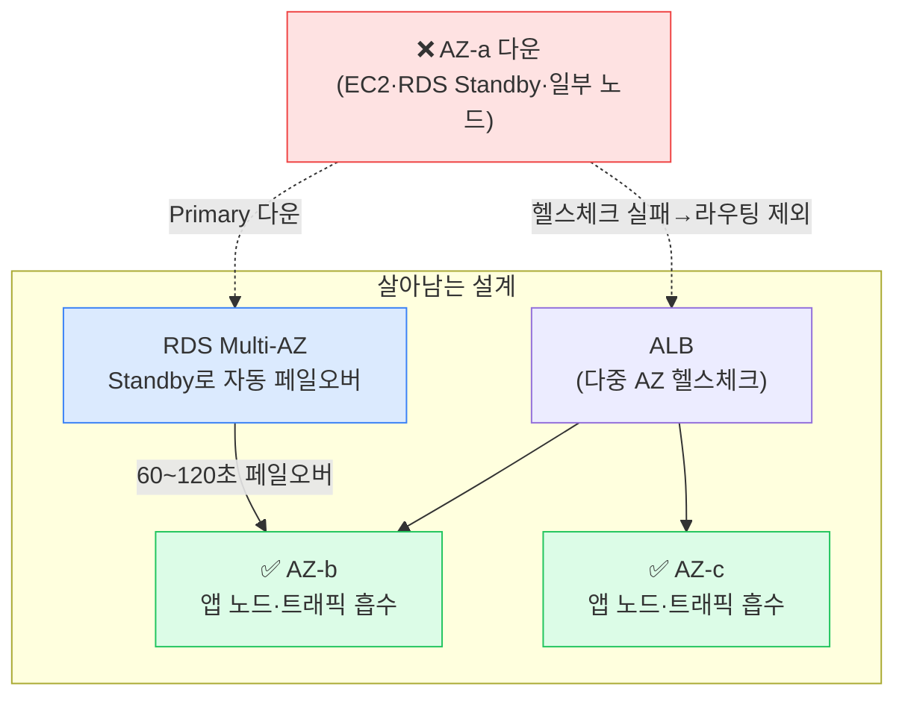

## 1. 면접 시나리오 개요 — "새벽 3시, 당신의 폰이 울렸다"

이 카드는 개념 암기가 아니라 **압박 속 판단 순서**를 본다. 시니어 인프라/SRE 면접은 대부분 시나리오 롤플레이다. 면접관이 상황을 던지고, 당신이 조치를 말하면 **바로 그 조치가 부른 새로운 문제**를 다시 던진다.

> **🎯 면접 포인트 — 이 롤플레이가 진짜로 채점하는 것**
>
> 지식의 양이 아니라 **의사결정의 순서**다. "원인 규명 vs 사용자 영향 완화" 중 무엇을 먼저 하는가, "재시작 vs 관측" 중 무엇을 먼저 하는가. 시니어는 **불확실성 속에서도 안전한 되돌릴 수 있는 조치부터** 집는다. 개념(SLO·HPA·Canary)은 이미 안다고 가정하고, 그걸 **언제 어떤 순서로 꺼내는지**를 본다.



*온콜 타임라인 — 알림→관측→완화→회복. 원인 규명은 회복 이후*

이번 세션은 4라운드. 각 라운드마다 **모범 답변 포인트**와 **흔한 오답**을 함께 제시한다. 실제 면접에선 답을 말한 뒤 후속 압박이 들어온다고 생각하고 읽어라.

---

## 2. Round 1 — "p99 지연이 갑자기 10배 튀었다. 어디부터 보나?"

> **면접관** — "평소 p99 80ms이던 주문 조회 API가 800ms로 뛰었다. 아직 원인은 모른다. 지금 5분 줄 테니 어디부터 볼 건지 순서대로 말해봐."

### 모범 답변 포인트 — 관측성 삼각측량(Observability Triangulation)

메트릭(Metric) → 로그(Log) → 트레이스(Trace)의 **깔때기** 순서로 좁힌다. 넓게 보고 점점 좁힌다.



*삼각측량 — Metric으로 범위 좁히고, Log로 가설 세우고, Trace로 병목 구간 확정*

1. **Metric 먼저(RED 메서드)** — Rate(요청량)·Errors(에러율)·Duration(지연). 대시보드에서 확인할 것:
   - **언제부터?** 급등 시각을 배포/설정 변경/트래픽 급증 이벤트와 대조 → 대개 여기서 범인의 8할이 잡힌다.
   - **어디가?** 전체 엔드포인트인가 특정 하나인가. 전체 AZ인가 한 AZ인가.
   - **상류인가 하류인가?** 앱 CPU는 멀쩡한데 지연만 늘면 → 하류(DB·캐시·외부 API) 의심.
2. **Log** — 좁혀진 범위의 구조화 로그에서 에러 메시지·상태코드·`traceId` 확인. "connection pool exhausted", "context deadline exceeded" 같은 문구가 바로 가설이 된다.
3. **Trace** — 느린 요청 하나를 골라 스팬별로 본다. `app 20ms → db 700ms → app 30ms`처럼 **어느 구간이 먹었는지** 콕 집는다.

```bash
# 진단 순서 예시 (K8s + Prometheus + Loki)
# 1) 메트릭: p99 급등이 특정 pod/AZ에 몰렸나
kubectl top pods -n order --sort-by=cpu
# PromQL: 엔드포인트별 p99
# histogram_quantile(0.99, sum(rate(http_request_duration_seconds_bucket[5m])) by (le, route))

# 2) 로그: 좁혀진 pod의 에러 패턴 (traceId 포함 구조화 로그 전제)
kubectl logs -n order deploy/order-api --since=10m | grep -E "timeout|pool|deadline"

# 3) 최근 배포/변경 상관관계 — 급등 시각과 대조
kubectl rollout history deploy/order-api -n order
```

> **⚠️ 실무 함정 — "일단 재시작"과 "일단 스케일 아웃"**
>
> 압박받으면 나오는 최악의 두 반사행동. **① Pod 재시작**은 증거(메모리 상태·연결 상태)를 날리고, 원인이 트래픽/하류면 재시작해도 곧바로 재발한다. **② 무지성 스케일 아웃**은 DB 커넥션만 더 늘려 하류를 더 죽인다. 관측으로 "상류 문제인지 하류 문제인지" 판별하기 전엔 손대지 마라. 단, 관측 결과 명백히 특정 pod만 병든 상태(메모리 릭)면 **그 pod만 격리(cordon/drain)**하는 건 정당한 완화다.

> **면접관의 후속 압박** — "메트릭 봤더니 CPU는 정상인데 p99만 튀고, 로그에 `connection pool exhausted`가 찍혀. 이제 뭐?"
>
> → 하류(DB) 병목 확정. 완화: ① 커넥션 풀 사이즈보다 **느린 쿼리/락**을 의심(DB 쪽 slow query·lock wait 확인), ② 방금 배포가 원인이면 롤백, ③ 특정 N+1 쿼리가 원인이면 해당 기능 피처 플래그 OFF. **풀 사이즈를 무작정 늘리는 건 오답** — DB max_connections를 넘기면 DB 자체가 죽는다.

### 흔한 오답 vs 모범 답변

| 구분 | 흔한 오답 | 모범 답변 |
| --- | --- | --- |
| 첫 행동 | "서버 재시작 / 스케일 아웃" | "메트릭으로 범위·상류/하류 판별 먼저" |
| 순서 | 트레이스부터 열어 헤맴 | 메트릭(넓게)→로그→트레이스(좁게) |
| 배포 상관 | 언급 안 함 | "급등 시각을 배포 이력과 대조" 최우선 |
| 하류 판단 | CPU만 보고 스케일 아웃 | "CPU 정상+지연만 상승 → 하류 병목" |

---

## 3. Round 2 — "트래픽 5배 이벤트가 예고됐다. HPA만 믿으면 되나?"

> **면접관** — "다음 주 프로모션으로 평소 대비 5배 트래픽이 예고됐다. 'HPA(Horizontal Pod Autoscaler) 켜놨으니 알아서 늘겠죠'라고 하면 나 실망할 텐데. HPA로 **못 막는 것**을 말해봐."

### 모범 답변 포인트 — HPA는 만병통치약이 아니다

HPA는 **반응형(reactive)**이라 트래픽이 튄 **다음에** 늘어난다. 스파이크에는 항상 늦다.



*HPA 스케일 아웃 지연 사슬 — 판정→노드 기동→이미지 pull→워밍업. 그 사이 사용자는 이미 에러를 본다*

**HPA로 못 막는 것 3가지 (면접 핵심):**

| 한계 | 왜 문제인가 | 대책 |
| --- | --- | --- |
| **스케일 아웃 지연** | 메트릭 판정~새 Pod ready까지 수십 초~수 분. 스파이크엔 늦음 | 이벤트 전 **사전 예열(pre-warming)**, `minReplicas` 상향 |
| **노드 부족** | Pod는 늘려도 얹을 노드가 없으면 Pending | Cluster Autoscaler/**Karpenter**로 노드도 사전 확보 |
| **DB 커넥션 풀 고갈** | 앱은 무한 확장돼도 DB `max_connections`는 유한 → 하류가 먼저 죽음 | **Stateful 계층은 스케일 아웃 안 됨**, 커넥션 풀·읽기 복제본·캐시로 대비 |

**사전 예열 체크리스트 (예고된 피크의 정석):**
- `minReplicas`를 이벤트 전에 상향(예: 10 → 50)해 콜드 스타트 회피.
- Cluster Autoscaler/Karpenter로 **노드를 미리 확보**(over-provisioning pause pod 트릭).
- CDN·캐시 워밍, DB 읽기 복제본(Read Replica) 추가, ElastiCache 워밍.
- **부하 테스트(Load test)로 병목을 미리 발견** — k6/Locust로 5배 트래픽 리허설.
- **Shed load(부하 차단)·큐잉** 준비 — 한계 초과 시 우아하게 거절.

```yaml
# HPA + PodDisruptionBudget — 스케일은 하되, 축소 시 급락 방지
apiVersion: autoscaling/v2
kind: HorizontalPodAutoscaler
metadata:
  name: order-api
  namespace: order
spec:
  scaleTargetRef:
    apiVersion: apps/v1
    kind: Deployment
    name: order-api
  minReplicas: 50          # 이벤트 전 사전 상향 (평소 10)
  maxReplicas: 200
  metrics:
    - type: Resource
      resource:
        name: cpu
        target:
          type: Utilization
          averageUtilization: 60   # 70~80은 스파이크에 이미 늦다
  behavior:
    scaleUp:
      stabilizationWindowSeconds: 0    # 늘릴 땐 즉시
      policies:
        - type: Percent
          value: 100                   # 15초마다 최대 2배
          periodSeconds: 15
    scaleDown:
      stabilizationWindowSeconds: 300  # 줄일 땐 천천히 (플래핑 방지)
```

> **⚠️ 실무 함정 — HPA `averageUtilization: 80`**
>
> CPU 목표를 80%로 잡으면, 트래픽이 튀어 80%를 찍은 **뒤에야** 스케일이 시작되고 그 사이 요청은 이미 큐에 쌓여 지연이 터진다. 예고된 피크엔 **목표치를 낮추고(60%) `minReplicas`를 미리 올려** 헤드룸을 확보하라. HPA는 완만한 증가엔 좋지만 **계단식 스파이크엔 사전 예열이 정답**이다.

> **💡 팁 — "5배"를 숫자로 되받아쳐라**
>
> 면접관이 "5배"라고 하면 시니어는 되묻는다. "평소 QPS(Queries Per Second)가 얼마고, 그래서 피크 QPS는? DB 쓰기 QPS는 몇으로 오르나? 커넥션 풀은 pod당 10, pod 50개면 500 커넥션인데 RDS max_connections가 그걸 감당하나?" **정량으로 병목을 지목**하면 바로 시니어 신호다. 물류로 치면 명절·프로모션 주문 피크는 "평균의 5배"가 아니라 "특정 3시간에 집중된 10배"라 **평균이 아닌 피크 분포**로 산정해야 한다.

> **면접관의 후속 압박** — "노드도 미리 늘리고 minReplicas도 올렸어. 근데 새벽에 DB가 커넥션 한계로 죽었어. 왜?"
>
> → 앱 계층만 스케일 아웃한 전형적 함정. **Stateful 계층(DB)은 수평 확장이 안 된다.** 대책: 읽기는 Read Replica로 분산, 커넥션은 **RDS Proxy/PgBouncer** 같은 커넥션 풀러로 다중화, 쓰기 폭증은 큐로 버퍼링. "앱만 늘리면 하류가 죽는다"를 알고 있으면 통과.

---

## 4. Round 3 — "배포 직후 에러율 급증. 롤백? 카나리?"

> **면접관** — "정기 배포 5분 뒤 에러율이 0.1%에서 7%로 튀었다. Error Budget은 이달 30% 남았어. 롤백할래, 카나리로 계속 지켜볼래? 그리고 이미 실행된 DB 마이그레이션은 어쩔 거야?"

### 모범 답변 포인트 — 완화 우선, 그다음 원인



*배포 실패 의사결정 — 배포 방식(전면 vs 카나리)과 DB 상태(호환 vs 파괴적)에 따라 갈린다*

**답변의 뼈대:**
1. **완화 먼저.** 원인 분석은 나중. 사용자가 7% 에러를 계속 맞고 있으면 Error Budget이 분 단위로 타들어간다. 30% 남았어도 7% 에러율이면 **몇 시간이면 소진**된다.
   - 전면(Rolling/Blue-Green 100%) 배포였다면 → **즉시 롤백**(`kubectl rollout undo`, Blue-Green이면 트래픽 스위치 복귀).
   - 카나리 5%였다면 → **트래픽 0%로 중단**. 애초에 카나리였으면 폭발 반경이 5%로 제한돼 있었다는 점을 어필.
2. **"이런 위험한 배포는 애초에 카나리였어야"** — 배포 방식 선택 자체가 평가 대상. 되돌릴 수 있게 설계했느냐.
3. **DB 마이그레이션이 결정적 분기.** 코드는 롤백돼도 스키마는 비가역일 수 있다.
   - **Expand 단계**(컬럼 추가·nullable)로만 나갔다면 구버전이 그대로 호환 → 롤백 안전.
   - **Contract(컬럼 삭제)가 배포와 동시에** 나갔다면 → 구버전 코드가 없는 컬럼을 찾다 죽어 **롤백 불가** → 어쩔 수 없이 **롤 포워드(roll forward, 앞으로 핫픽스)**.

> **🎯 면접 포인트 — Error Budget으로 결정을 정당화하라**
>
> "롤백할까요?"를 감으로 답하지 마라. **"에러율 7% × 남은 시간을 곱해 Error Budget 소진 속도를 계산하면 몇 시간 내 이달 예산이 바닥난다. 그러므로 즉시 완화한다"**처럼 숫자로 정당화한다. SLO 99.9%면 월 허용 다운타임은 약 43분. 7% 에러가 10분만 지속돼도 이미 상당 부분을 태운다. 시니어는 결정에 **정량 근거**를 붙인다. 🔥(Deep-dive)

> **⚠️ 실무 함정 — "롤백했으니 끝"이라 답하는 순간**
>
> 롤백은 **완화**지 **해결**이 아니다. 면접관은 반드시 "근본 원인은?"과 "재발 방지는?"을 묻는다. 답: Blameless Postmortem에서 5 Whys로 근본 원인 규명 → Action Item(구체·담당자·기한). 그리고 **"왜 이 배포가 카나리 없이 100%로 나갔나", "왜 파괴적 마이그레이션이 배포와 동시에 실행됐나"**라는 프로세스 결함까지 파고들어야 시니어다.

### 좋은 답변 vs 나쁜 답변

| 상황 | 나쁜 답변 (감점) | 좋은 답변 (시니어) |
| --- | --- | --- |
| 첫 조치 | "원인부터 로그 분석" | "완화 먼저 — 롤백/카나리 중단으로 사용자 영향 차단" |
| 결정 근거 | "일단 롤백이 안전하니까" | "에러율×시간으로 Budget 소진 속도 계산해 즉시 결정" |
| DB 고려 | 언급 없음 | "Expand-Contract 상태 확인, 파괴적이면 롤 포워드" |
| 마무리 | "롤백 완료" | "완화 후 Blameless PM + 배포 방식/마이그레이션 프로세스 개선" |

> **💡 팁** — Round 3의 진짜 함정은 **"롤백 = 항상 안전"**이라는 착각이다. DB 상태에 따라 롤백이 더 큰 장애를 부를 수 있음을 아는지가 미들/시니어를 가른다. `infra-04` 카드의 Expand-Contract를 여기서 **압박 상황의 실시간 판단**으로 꺼내 쓸 수 있어야 한다.

---

## 5. Round 4 — "AZ 하나가 통째로 죽었다"

> **면접관** — "AWS ap-northeast-2a AZ(Availability Zone, 가용 영역)가 통째로 죽었다는 상태 페이지가 떴다. 네 서비스는 어떻게 되고, 뭘 해야 하나?"

### 모범 답변 포인트 — "이미 대비돼 있어야 한다"

이 라운드의 정답은 **장애 시점의 영웅적 조치가 아니라, 사전 설계**다. Multi-AZ면 대부분 자동 처리되고, 단일 AZ였다면 이미 늦었다.



*AZ 장애 격리 — ALB가 죽은 AZ를 헬스체크로 제외, RDS Multi-AZ가 Standby로 페일오버. 나머지 AZ가 트래픽 흡수*

**답변 뼈대:**
1. **설계가 방어한다** — Multi-AZ 전제라면:
   - **ALB**가 죽은 AZ의 타깃을 헬스체크로 자동 제외 → 트래픽이 살아있는 AZ로.
   - **RDS Multi-AZ**의 동기 Standby가 60~120초 내 자동 페일오버.
   - Cluster Autoscaler가 살아있는 AZ에 부족분 노드 보충.
2. **당신이 할 일** — 자동 복구를 **관측·검증**하고, 남은 AZ가 트래픽을 감당하는지 확인.
3. **결정적 함정 — 용량 헤드룸(capacity headroom).** 3-AZ에 각 33%로 딱 맞게 돌렸다면, 1개 AZ가 죽는 순간 남은 2개가 각 50%씩 받아야 한다. **여유 없이 운영했으면 남은 AZ도 연쇄 과부하로 죽는다.** N+1 여유(각 AZ가 다른 하나의 몫까지 감당할 헤드룸)를 미리 확보해야 한다.

> **🎯 면접 포인트 — RTO/RPO로 답하라**
>
> "AZ 죽으면 어떻게 되냐"에 "괜찮아요 Multi-AZ라서"는 부족하다. **RTO(Recovery Time Objective, 목표 복구 시간)와 RPO(Recovery Point Objective, 목표 복구 시점)**로 답하라. "RDS Multi-AZ 페일오버 RTO는 약 60~120초, RPO는 동기 복제라 0(데이터 손실 없음). 그 사이 진행 중이던 트랜잭션은 실패하니 앱은 **재시도(retry)와 멱등성(Idempotency)**으로 대비돼 있어야 한다." 여기까지 오면 시니어 통과.

> **⚠️ 실무 함정 — "Multi-AZ면 무조건 안전"**
>
> 세 가지 구멍: **① 용량 헤드룸 없음** — 남은 AZ가 과부하로 도미노. **② 상태 저장소가 단일 AZ** — 앱은 Multi-AZ인데 Redis/Kafka가 단일 AZ면 거기서 끊긴다. **③ 페일오버 미검증** — Gameday로 실제 AZ 장애를 주입해본 적 없으면 "될 거야"는 희망사항. Chaos Engineering으로 **평소에 AZ 하나를 일부러 죽여봐야** 진짜 방어된다.

> **면접관의 최종 압박** — "그럼 Multi-Region은? AZ로 부족하니 리전 이중화 하자고 하면?"
>
> → **성급하면 감점.** "먼저 RTO/RPO 요구가 뭔지 확인하겠다. Multi-Region은 비용이 배 이상, 데이터 동기화·일관성·페일오버 복잡도가 급증한다. **금융·결제급 RPO≈0, RTO 수 분** 요구가 아니라면 대개 Multi-AZ로 충분하다. 리전 장애는 AZ 장애보다 훨씬 드물다. 요구사항(SLA·규제·재해 시나리오) 없이 Multi-Region부터 지르는 건 오버엔지니어링." **필요성을 먼저 되묻는 것**이 시니어의 답이다.

---

## 6. 종합 평가 루브릭 — 당신은 어느 레벨인가

| 역량 | 주니어 (Junior) | 미들 (Middle) | 시니어 (Senior) |
| --- | --- | --- | --- |
| **첫 조치** | "재시작/스케일 아웃" 반사행동 | 관측 후 조치 | 관측→**완화(되돌릴 수 있는 것)**→원인, 순서가 몸에 뱀 |
| **진단** | 로그만 뒤짐 | 메트릭→로그 | **삼각측량 + 배포/변경 상관관계**를 먼저 |
| **오토스케일** | "HPA 켜면 됨" | HPA 지연 인지 | **Stateful 한계·사전 예열·DB 병목**을 정량으로 |
| **배포/롤백** | "롤백하면 됨" | 카나리·폭발 반경 이해 | **DB 상태 따라 롤백 불가 판단**, 롤 포워드 결정 |
| **AZ 장애** | "Multi-AZ면 됨" | ALB·RDS 페일오버 설명 | **용량 헤드룸·RTO/RPO·상태저장소 구멍**까지 |
| **정량 근거** | 감으로 판단 | 일부 숫자 | Error Budget·QPS·RTO/RPO로 **모든 결정 정당화** |
| **오버엔지니어링** | 유행 기술 선호 | 상황 따라 | **필요성을 먼저 되묻고** Trade-off로 절제 |

> **💡 팁 — 면접장에서 즉시 점수 올리는 3문장**
>
> ① "먼저 되돌릴 수 있는 완화부터 하고 원인은 그다음에 보겠습니다." ② "그 결정을 Error Budget/RTO 숫자로 정당화하면…" ③ "이건 요구사항(SLA·RPO)을 먼저 확인해야 과잉설계를 피할 수 있습니다." 이 세 문장은 어느 시나리오에도 통하는 **시니어의 사고 프레임**이다.

## 7. 물류 맥락 — 명절/프로모션 피크의 4라운드 압축

> **💡 시나리오 — 추석 전날 밤, 주문 폭주 중 장애**
>
> 추석 D-1, 평소 10배 주문이 3시간에 집중된다(피크 분포 — 평균이 아니다). **R1**: 주문 조회 p99가 튄다 → 메트릭으로 "특정 AZ의 DB 읽기 지연"임을 삼각측량. **R2**: HPA로 앱은 늘렸지만 RDS 커넥션이 한계 → **미리 Read Replica 증설·RDS Proxy·minReplicas 사전 상향**을 안 해둔 게 화근. Stateful 계층은 사전 예열이 답. **R3**: 하필 이 피크에 배포가 나가 에러율 급증 → **피크 시간대 배포 동결(freeze window)**이 규칙이었어야. 롤백 시 재고 차감 마이그레이션이 파괴적이면 롤 포워드. **R4**: AZ 하나가 죽어도 남은 AZ가 10배 피크를 흡수할 **헤드룸**이 있었는지가 생사를 가른다. **Trade-off**: 피크 대비 상시 헤드룸은 비용이다. 명절 같은 예고된 피크는 **상시가 아니라 이벤트 전 스케줄 스케일 업**으로 비용과 안정성을 저울질한다 — 이게 시니어의 답이다.
