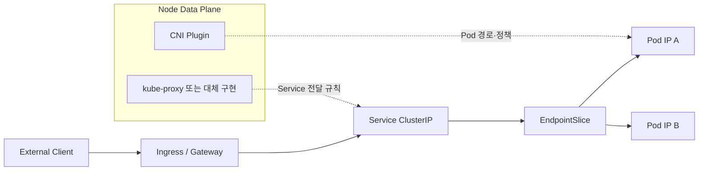

## 1. 네 개의 계층을 분리한다

Kubernetes 네트워크 모델에서 각 Pod는 고유 IP를 가지며, Pod 간 통신은 기본적으로 직접 가능해야 한다. CNI(Container Network Interface)는 Pod 네트워크 연결을 구성하고, Service는 바뀌는 Pod 집합 앞에 안정적인 접근점을 만든다. Ingress 또는 Gateway API는 주로 클러스터 외부의 HTTP 계층 라우팅을 표현한다.



| 구성요소 | 책임 | 책임이 아닌 것 |
|---|---|---|
| CNI 구현 | Pod 인터페이스·IP·라우팅, 구현에 따라 NetworkPolicy | 애플리케이션 L7 라우팅 |
| Service | 안정적인 VIP/DNS와 Backend 집합 추상화 | Pod 자체 생성·Health 로직 구현 |
| kube-proxy | Service/EndpointSlice를 데이터 플레인 규칙으로 반영 | CNI 표준 자체 |
| Ingress/Gateway | 외부 HTTP(S)·L7 라우팅 정책 | 실제 동작 구현체 자동 제공 |

## 2. Service와 EndpointSlice

Service Selector에 맞는 Pod가 변하면 컨트롤러가 EndpointSlice를 갱신한다. 데이터 플레인 구현은 이를 감시하고 ClusterIP 트래픽을 Backend Pod로 전달한다. 구현은 iptables·IPVS 또는 eBPF 기반 등으로 달라질 수 있으므로 장애 분석에서는 제품 이름보다 실제 패킷 경로를 확인한다.

```yaml
apiVersion: v1
kind: Service
metadata:
  name: card-api
spec:
  selector:
    app: card-api
  ports:
    - name: http
      port: 80
      targetPort: 8080
```

> **실무 함정** — NetworkPolicy 리소스를 만들었다고 반드시 차단되는 것은 아니다. 사용하는 네트워크 구현이 NetworkPolicy를 실제로 집행하는지 확인해야 한다.

## 3. 장애 추적 순서

DNS 이름 해석 → Service/EndpointSlice 존재 → Pod Readiness → Node 간 Pod 경로 → NetworkPolicy → Ingress/Gateway 설정 순으로 좁힌다. `curl Service`만 실패하는지, Pod IP 직접 호출도 실패하는지를 비교하면 Service 계층과 CNI 계층을 나눌 수 있다.

> **면접 포인트** — Ingress는 Service 타입이 아니다. API 객체와 실제 Controller·데이터 플레인을 구분하고, 각 계층의 소유자를 말해야 한다.

## 참고

- [Kubernetes Services, Load Balancing, and Networking](https://kubernetes.io/docs/concepts/services-networking/)
- [Kubernetes Service](https://kubernetes.io/docs/concepts/services-networking/service/)
