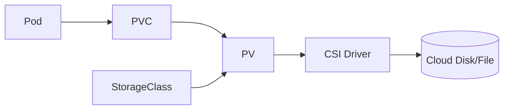

## 1. 요청과 공급을 분리한다

PVC는 애플리케이션의 저장소 요청, PV는 실제 Volume 표현, StorageClass는 동적 공급 정책이다. CSI Driver가 외부 저장 시스템과 생성·연결·Mount 작업을 중개한다.



| 개념 | 책임 | 설계 질문 |
|---|---|---|
| PVC | 용량·접근 모드 요청 | 확장 가능한가 |
| StorageClass | 공급·회수 정책 | Zone·성능 Tier |
| PV | 실제 Volume 연결 | Retain/Delete |
| StatefulSet | 안정 ID·Replica별 PVC | 백업·복구 순서 |

```yaml
volumeClaimTemplates:
  - metadata: { name: data }
    spec:
      accessModes: ["ReadWriteOnce"]
      resources: { requests: { storage: 20Gi } }
```

> **운영 함정** — StatefulSet 삭제가 PVC와 외부 Disk 삭제를 항상 의미하지 않는다. Reclaim Policy와 백업·폐기 절차를 명시한다.

## 2. 스케줄링과 복구

Zone 종속 Disk는 Pod가 같은 Zone 노드에 배치되어야 한다. Volume Binding 시점, Node Affinity, Attach 실패 이벤트를 함께 확인하고 백업은 Crash Consistency 요구까지 정의한다.

> **면접 포인트** — “Pod에 Disk를 붙인다”보다 장애 노드에서 재연결 시간, 데이터 복제 주체, Stateful 애플리케이션 복구 순서를 설명한다.

## 참고

- [Kubernetes Persistent Volumes](https://kubernetes.io/docs/concepts/storage/persistent-volumes/)
