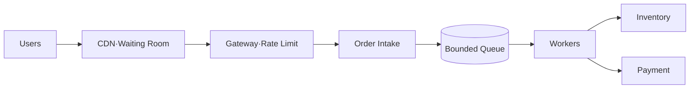

## 1. 가장 약한 의존성을 기준으로 입구를 제한한다

정적 상품 조회는 CDN과 Cache로 분리하고, 구매 경로는 재고 예약·결제의 지속 가능 처리량만 받는다. Queue는 짧은 Burst를 흡수하지만 무한한 용량을 만들지는 않는다.



| 계층 | 보호 수단 | 과부하 신호 |
|---|---|---|
| Edge | Waiting Room·Bot 제한 | 대기 시간·거절률 |
| API | 사용자별 제한·Deadline | 동시 요청·꼬리 지연 |
| Queue | 크기·Age 한도 | Oldest Message Age |
| Worker | 동시성·Retry Budget | 하위 오류·포화도 |

```text
admission_rate <= min(inventory_sustainable_rate, payment_sustainable_rate)
retry_budget is shared across all attempts, not reset per service
```

> **설계 원칙** — 오래된 주문이 약속 시간 안에 처리될 수 없다면 Queue에 계속 쌓기보다 명확히 거절·환불하는 편이 안전하다.

## 2. 사전 확장과 단계적 복구

예고 이벤트는 Warm Capacity, 연결 Pool, DB 한도, Cache를 사전 검증한다. 장애 후 제한을 한 번에 해제하지 않고 Canary 비율로 올리며 Backlog와 하위 시스템 회복을 확인한다.

> **면접 포인트** — 최대 QPS보다 입장 제어, 멱등 주문, 결과 미상 조회, 재시도 감쇠와 고객 경험을 종단으로 설계한다.
