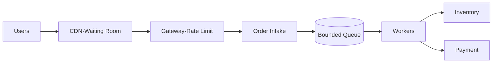

## 1. 가장 약한 의존성을 기준으로 입구를 제한한다

정적 상품 조회는 CDN과 캐시로 분리하고, 구매 경로는 재고 예약·결제의 지속 가능한 처리량을 기준으로 입장시킨다. Queue는 일시적인 burst를 흡수할 뿐 무한한 용량이나 처리량을 만들지 않는다.


```mermaid
flowchart LR
    U[Users] --> E[CDN·Waiting Room]
    E --> G[Gateway·Rate Limit]
    G --> O[Order Intake]
    O --> Q[(Bounded Queue)]
    Q --> W[Workers]
    W --> I[Inventory]
    W --> P[Payment]
```

| 계층 | 보호 수단 | 과부하 신호 |
|---|---|---|
| Edge | Waiting Room·Bot 제한 | 대기 시간·거절률·우회 시도 |
| API | 사용자별 제한·Deadline | 동시 요청·꼬리 지연 |
| Queue | 크기·Age 한도 | Oldest Message Age |
| Worker | 동시성·Retry Budget | 하위 오류·포화도 |

```text
admission_rate <= min(inventory_sustainable_rate, payment_sustainable_rate)
retry_budget is shared across all attempts, not reset per service
```

> **설계 원칙** — 주문이 약속 시간 안에 처리될 수 없으면 Queue에 계속 쌓지 말고, 신규 입장 제한·명확한 거절·취소·환불 정책을 적용한다. 이미 접수된 주문은 상태와 고객 안내를 보존한다.

## 2. 사전 확장과 단계적 복구

예고 이벤트는 Warm Capacity, 연결 Pool, DB 한도, Cache를 사전 검증한다. 장애 후 제한을 한 번에 해제하지 않고 Canary 비율로 올리며 Backlog와 하위 시스템 회복을 확인한다.

> **면접 포인트** — 최대 QPS보다 입장 제어, 멱등 주문, 결과 미상 조회, 재시도 감쇠와 고객 경험을 종단으로 설계한다.

## 3. 실패 흐름과 보호 경계

- Waiting Room·rate limit이 우회되거나 설정 저장소가 지연되면 보호 계층이 무력화될 수 있다. 기본 거절·fail closed 여부, 신뢰할 프록시 헤더, 사용자·IP·기기별 키를 명시한다.
- 주문 접수 응답이 타임아웃되어도 주문이 저장됐을 수 있다. 클라이언트 재시도는 같은 idempotency key로 묶고, 주문·예약·결제의 결과 조회 경로를 제공한다.
- Queue가 가득 차면 오래된 메시지와 새 메시지를 무조건 같은 방식으로 버리지 않는다. 주문 만료 시각, 우선순위, 결제 승인 여부, 고객 보상 정책을 기준으로 보존·거절·DLQ를 결정한다.
- 워커 재시도가 재고·결제를 다시 호출하면 Retry Storm이 된다. 전체 시도 예산, 지수 백오프·jitter, circuit breaker, 하위 시스템 deadline과 멱등 키를 공유한다.
- 재고 예약은 성공했지만 결제가 실패하거나, 결제는 성공했지만 응답이 유실될 수 있다. 예약 만료·결제 결과 조회·보상 해제·수동 대사 상태를 명시하고, 자동 취소가 고객 약속과 충돌하지 않는지 확인한다.
- 단계적 복구에서 backlog와 하위 시스템 포화가 줄어드는지 확인한 뒤 admission rate를 올린다. 큐 길이만 보고 제한을 풀면 지연된 작업이 한꺼번에 downstream을 압박한다.

## 4. 참고 자료

- [AWS Well-Architected Reliability Pillar](https://docs.aws.amazon.com/wellarchitected/latest/reliability-pillar/welcome.html)
- [Amazon SQS visibility timeout](https://docs.aws.amazon.com/AWSSimpleQueueService/latest/SQSDeveloperGuide/sqs-visibility-timeout.html)
- [Amazon SQS dead-letter queues](https://docs.aws.amazon.com/AWSSimpleQueueService/latest/SQSDeveloperGuide/sqs-dead-letter-queues.html)
- [Google SRE: Handling Overload](https://sre.google/sre-book/handling-overload/)
- [RFC 6585: Additional HTTP Status Codes](https://www.rfc-editor.org/rfc/rfc6585)
