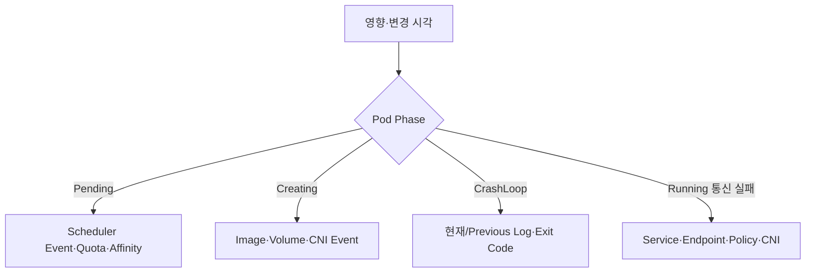

## 1. 상태 전이의 어느 단계가 실패했는지 찾는다

Manifest를 무작정 바꾸기 전에 배포 시각과 영향 범위를 확인한다. Pending은 스케줄링, ContainerCreating은 Image·Volume·Network 준비, Running 뒤 실패는 Process·Probe·자원 문제로 범위를 좁힌다.



| 증상 | 첫 증거 | 흔한 범주 |
|---|---|---|
| Pending | Pod Event | 자원·Taint·Affinity·PVC |
| ImagePull | Event·Registry | 이름·권한·네트워크 |
| CrashLoop | Exit Code·Previous Log | 설정·의존성·OOM |
| Service 실패 | EndpointSlice·직접 Pod 연결 | Selector·Port·Policy |

```text
scope first: one pod, one node, one namespace, one zone, or all replicas
compare desired spec, controller status, pod status, and recent events
```

> **면접 전략** — 명령어 나열보다 가설별로 기대하는 증거를 말한다. Event는 보존 시간이 제한될 수 있어 장애 초기에 수집한다.

## 2. 변경은 하나씩 검증한다

Probe 완화나 Resource 증가는 임시 완화일 수 있지만 원인을 숨길 수도 있다. 안전한 Rollback 가능성을 먼저 확인하고 한 번에 한 변수를 바꿔 지표와 상태 변화를 기록한다.

> **면접 포인트** — Control Plane, Scheduler, Kubelet, Runtime, CNI, CSI 중 어느 책임 경계인지 좁혀 Escalation에 필요한 증거를 남긴다.

## 참고

- [Kubernetes Application Troubleshooting](https://kubernetes.io/docs/tasks/debug/debug-application/)
