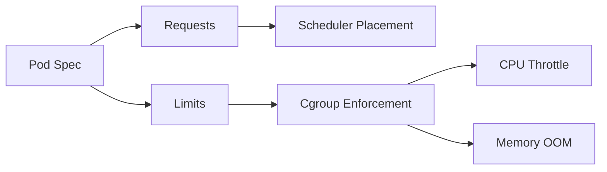

## 1. 예약과 상한을 구분한다

Scheduler는 Requests를 기준으로 Pod를 배치한다. CPU Limit은 Cgroup 실행 시간을 제한해 Throttling을 만들 수 있고, 메모리 Limit 초과는 OOM 종료로 이어질 수 있다. 애플리케이션 Runtime 설정도 컨테이너 상한 안에 둔다.



| 설정 | 주요 사용처 | 잘못 설정한 증상 |
|---|---|---|
| CPU Request | 배치·공유 가중치 | 과소: 경합, 과대: 미배치 |
| CPU Limit | 실행 상한 | 꼬리 지연·Throttling |
| Memory Request | 배치·Eviction 판단 | Node 압박 |
| Memory Limit | 강제 상한 | OOMKilled·재시작 |

```yaml
resources:
  requests: { cpu: "500m", memory: "512Mi" }
  limits: { memory: "768Mi" }
```

> **운영 함정** — JVM Heap을 메모리 Limit과 같게 잡으면 Native Memory와 Thread Stack 공간이 없다. 프로세스 전체 RSS 여유를 둔다.

## 2. 분위수와 실패 비용으로 조정한다

평균보다 시간대별 분위수, Startup Peak, GC, OOM·Throttle 지표를 본다. Vertical 권고를 참고하되 Replica 수와 장애 시 재배치 여유까지 함께 검증한다.

> **면접 포인트** — 모든 Pod에 같은 비율을 적용하지 말고 Burst 허용, 지연 SLO, 종료 비용에 따라 Limit 정책을 설명한다.

## 참고

- [Kubernetes Resource Management](https://kubernetes.io/docs/concepts/configuration/manage-resources-containers/)
