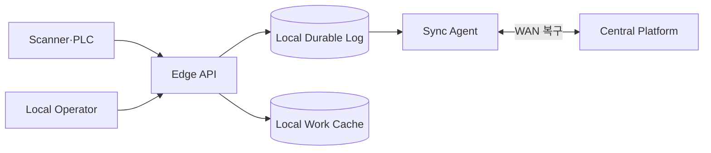

## 1. 단절 모드를 정상 상태로 설계한다

스캔·라벨·작업 지시는 WAN 단절이 발생해도 일정 시간 지속되어야 한다. Edge는 필요한 작업 Snapshot과 로컬 불변 로그를 유지하고 중앙 권한이 필수인 결제·전역 재고 이동은 제한한다.



| 상태 | Edge 동작 | 중앙 복구 후 |
|---|---|---|
| 정상 | 낮은 지연 처리·즉시 동기화 | Offset 확인 |
| WAN 단절 | 허용 명령·로컬 Append | 순서·중복 검증 전송 |
| 중앙 데이터 충돌 | 위험 작업 보류 | 정책 기반 병합·운영 승인 |
| Edge 장애 | 이중화 또는 수동 절차 | 로그 복구·대사 |

```text
event_id = site_id + device_id + durable_sequence
sync resumes from acknowledged sequence with checksum reconciliation
```

> **설계 원칙** — Last-Write-Wins로 재고를 합치면 물리 이동을 잃을 수 있다. 원본 이벤트를 보존하고 충돌을 업무 규칙으로 해결한다.

## 2. Fleet 운영을 포함한다

센터별 버전, 인증서, 디스크 사용량, 동기화 지연을 중앙에서 관측한다. 서명된 Artifact, 단계적 배포, 자동 Rollback과 현장 수동 운영 Runbook을 함께 준비한다.

> **면접 포인트** — 작은 Cloud 복제본이 아니라 단절, 현장 장비, 제한된 운영 인력과 물리 흐름까지 포함한 시스템으로 설명한다.
