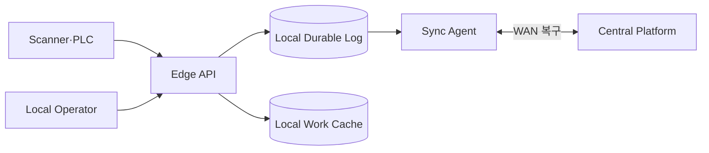

## 1. 단절 모드를 정상 상태로 설계한다

스캔·라벨·작업 지시는 WAN 단절이 발생해도 일정 시간 지속되어야 한다. Edge는 필요한 작업 Snapshot과 로컬 불변 로그를 유지하고 중앙 권한이 필수인 결제·전역 재고 이동은 제한한다.


```mermaid
flowchart LR
    D[Scanner·PLC] --> E[Edge API]
    E --> L[(Local Durable Log)]
    E --> C[(Local Work Cache)]
    L --> S[Sync Agent]
    S <-->|WAN 복구| H[Central Platform]
    O[Local Operator] --> E
```

| 상태 | Edge 동작 | 중앙 복구 후 |
|---|---|---|
| 정상 | 낮은 지연 처리·가능한 경우 즉시 동기화 | 확인된 sequence·checksum 기록 |
| WAN 단절 | 허용 명령·로컬 Append | 순서·중복 검증 전송 |
| 중앙 데이터 충돌 | 위험 작업 보류 | 정책 기반 병합·운영 승인 |
| Edge 장애 | 이중화 또는 수동 절차 | 로그 복구·대사 |

```text
event_id = site_id + device_id + durable_sequence
sync resumes from acknowledged sequence with checksum reconciliation
```

> **설계 원칙** — Last-Write-Wins로 재고를 합치면 물리 이동을 잃을 수 있다. 원본 이벤트를 보존하고 충돌을 업무 규칙으로 해결한다. 로컬 시계나 네트워크 도착 순서를 물리적 사건 순서로 간주하지 않는다.

## 2. Fleet 운영을 포함한다

센터별 버전, 인증서, 디스크 사용량, 동기화 지연을 중앙에서 관측한다. 서명된 Artifact, 단계적 배포, 자동 Rollback과 현장 수동 운영 Runbook을 함께 준비한다.

> **면접 포인트** — 작은 Cloud 복제본이 아니라 단절, 현장 장비, 제한된 운영 인력과 물리 흐름까지 포함한 시스템으로 설명한다.

## 3. 실패 흐름과 안전 경계

- WAN이 끊기면 Edge가 중앙 권한·재고 최신성·가격 정책을 확인할 수 없다. 스캔·포장·작업 완료처럼 로컬에서 안전하게 기록할 작업과 재고 이동 승인·결제·고객 약속 변경처럼 중앙 확인이 필요한 작업을 명령 종류별로 나눈다.
- 로컬 로그가 디스크를 다 쓰거나 손상되면 스캔을 성공으로 표시하고 잃어버릴 수 있다. append 성공 확인, 디스크 임계치, 보존·압축·오프로드, 읽기 전용 전환, 수동 스캔 절차를 설계한다.
- 동기화 재시도 중 응답이 끊기면 중앙에 이벤트가 적용됐는지 알 수 없다. `event_id`와 sequence를 그대로 재전송하고, 중앙의 적용 결과·checksum·누락 범위를 조회한 뒤 다음 offset을 전진시킨다.
- 동일 상품에 대해 중앙과 Edge에서 상충하는 이동이 발생하면 마지막 쓰기 승리로 덮지 않는다. 물리 스캔 증거·작업자·장비·시각·문서 상태를 묶어 충돌 큐로 보내고, 업무 담당자가 대사한다.
- Edge 업그레이드가 중단되면 스캔 업무가 계속되어야 한다. 서명된 artifact, 호환 가능한 데이터 형식, 이전 버전 유지, health check와 자동 rollback, 현장 수동 runbook을 준비하고, 중앙이 새 버전의 상태를 확인하기 전에는 다음 센터로 확대하지 않는다.
- 인증서 만료·중앙 시간 불일치·장비 교체는 단절과 별개로 동기화를 막을 수 있다. 키 회전, 단조 증가 sequence, 시간 보정 허용 범위, 장비 등록·폐기 절차를 함께 관측한다.

## 4. 참고 자료

- [AWS IoT Greengrass developer guide](https://docs.aws.amazon.com/greengrass/v2/developerguide/what-is-gg.html)
- [The Update Framework (TUF)](https://theupdateframework.io/security/)
- [SQLite Atomic Commit](https://sqlite.org/atomiccommit.html)
- [NIST SP 800-82 Rev. 3: Guide to Operational Technology Security](https://csrc.nist.gov/pubs/sp/800/82/r3/final)
