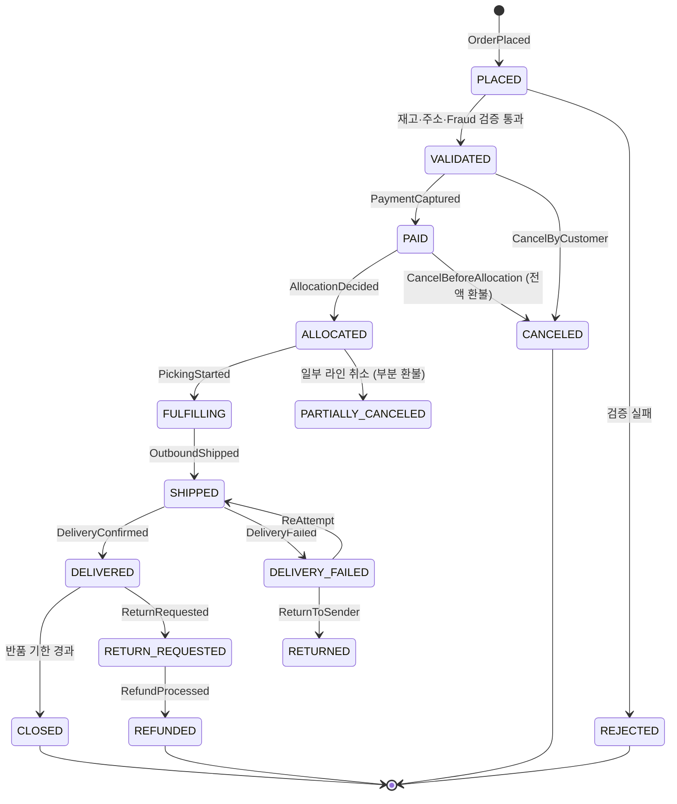
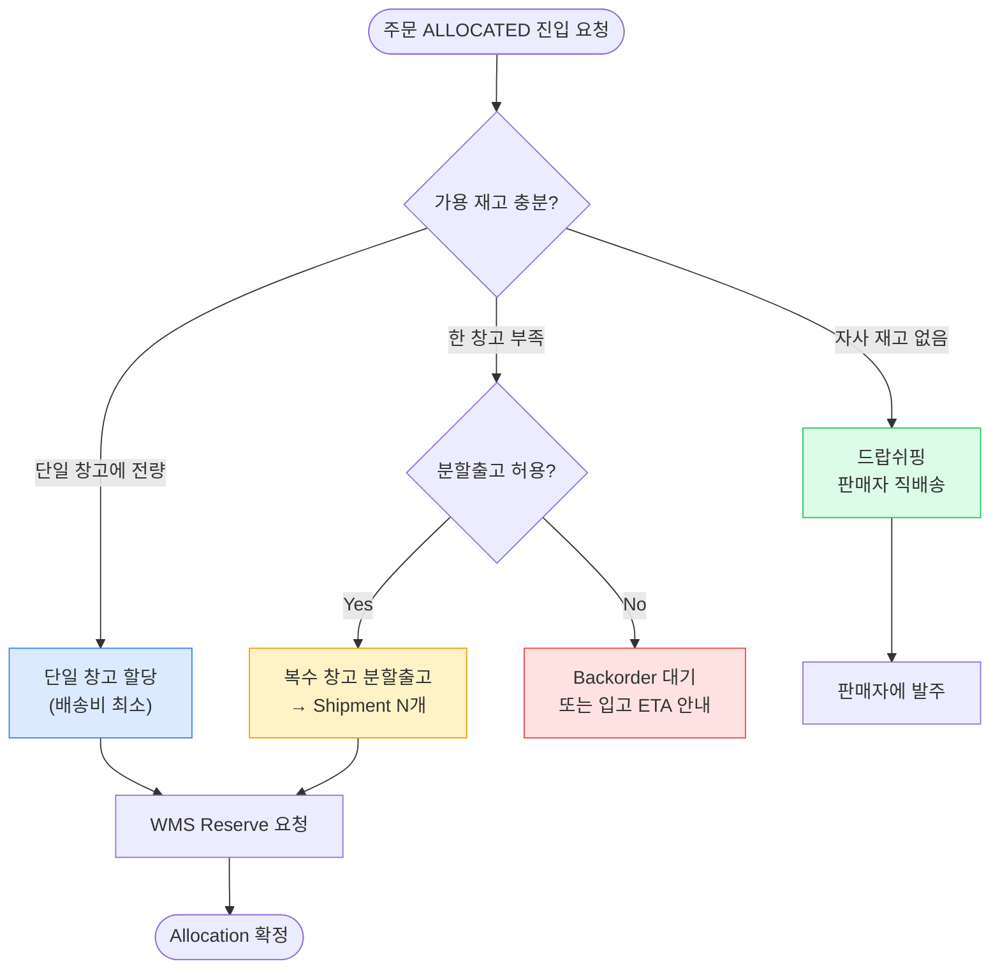
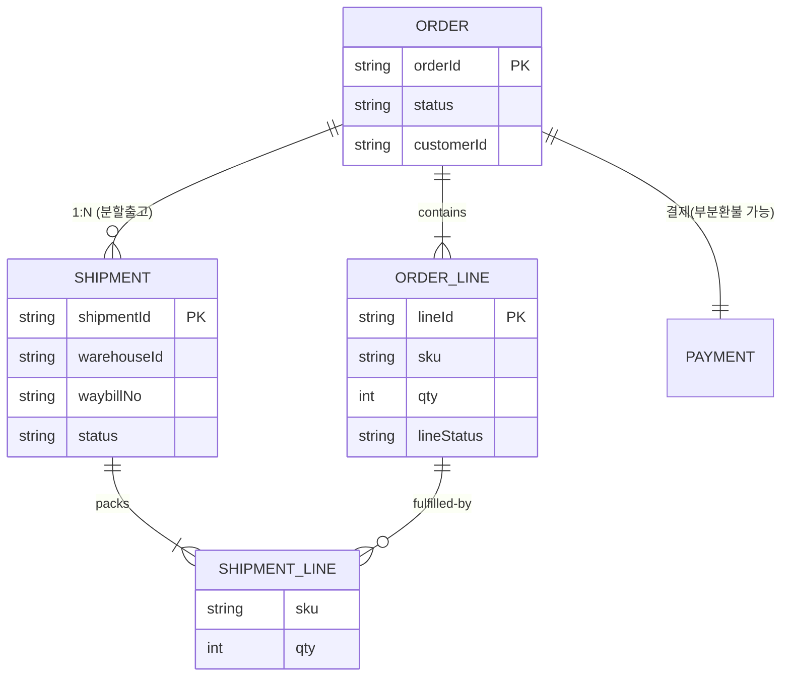
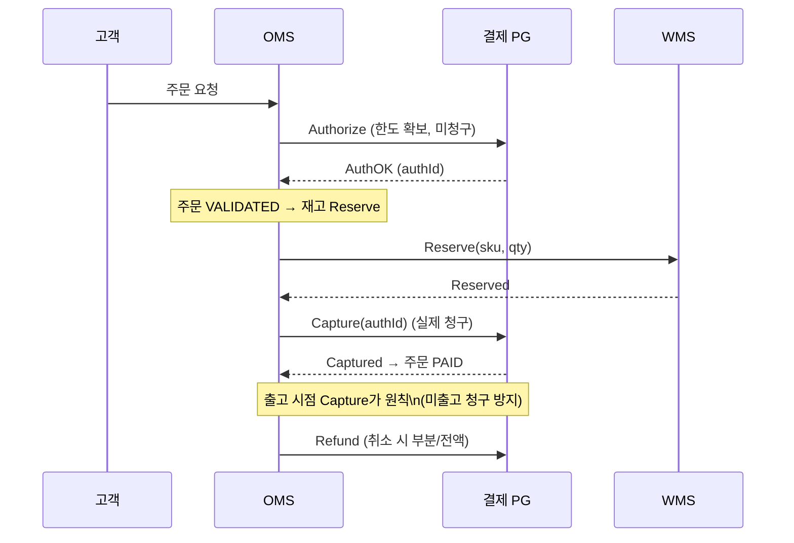

## 1. OMS의 역할 경계 — 주문의 두뇌

> **핵심 책임** — 멀티 채널에서 들어온 주문을 검증·할당·추적하며, *결제·정산·CS의 단일 진실 원천(Source of Truth)*이 된다.

OMS(Order Management System, 주문관리 시스템)는 주문을 받는 곳이 아니라 **주문의 상태를 책임지는 곳**이다. WMS는 실물을, TMS는 운송을 책임지지만, "이 주문이 지금 어디까지 왔는가"의 정답은 항상 OMS가 들고 있어야 한다.

### 왜 분리되는가 — Bounded Context

- **멀티 소스**: 자사 앱·오픈마켓(쿠팡/네이버)·B2B EDI(Electronic Data Interchange, 전자문서교환) 등 채널마다 포맷이 다름. OMS가 정규화 허브 역할.
- **멀티 싱크**: 한 주문이 여러 창고·여러 파트너(3PL)로 갈라짐. 할당 결정의 두뇌가 필요.
- **결제·쿠폰·정산·CS**가 모두 주문에 엮임. WMS/TMS에 섞으면 경계가 무너진다.

| 구분 | OMS | WMS | TMS |
| --- | --- | --- | --- |
| 관리 대상 | 주문(논리) | 재고(실물) | 운송(이동) |
| 핵심 질문 | "이 주문 상태는?" | "이 SKU 어디 있나?" | "언제 도착하나?" |
| 대표 Entity | `Order`, `OrderLine`, `Allocation`, `Payment` | `Inventory`, `Bin`, `PickList` | `Shipment`, `Waybill`, `Route` |
| SLA 책임 | 주문 수락·Cut-off 판정 | 피킹 정확도·출고 리드타임 | OTD(정시배송률) |

## 2. 주문 수명주기 상태 머신 (State Machine)

주문 상태를 Boolean 플래그(`isPaid`, `isShipped` …)로 관리하면 조합 폭발이 일어난다. 반드시 **Enum + 명시적 전이 규칙**으로 강제한다.

*주문 상태 전이 — 각 화살표가 도메인 이벤트. 전이 외의 변경은 코드에서 차단해야 함*

> **⚠️ 실무 함정 — 부분 상태**
>
> 라인 5개 중 2개만 취소되면 주문 전체 상태는? → `PARTIALLY_CANCELED` 같은 별도 상태가 필요하거나, **OrderLine 단위 상태** 를 따로 둬야 한다. 헤더 1개 상태로는 표현 불가.

### 왜 상태 머신을 코드로 강제하나

- **불법 전이 차단**: `DELIVERED → PAID` 같은 역행을 컴파일/런타임에서 막음.
- **감사 추적(Audit)**: 전이마다 이벤트를 남기면 "왜 이 상태가 됐나" 추적 가능.
- **멱등성**: 같은 이벤트가 두 번 와도(네트워크 재시도) 상태가 한 번만 바뀌게.

## 3. Allocation (할당) — 어느 창고에서 보낼까

Allocation(할당)은 "주문의 각 라인을 어느 창고의 어느 재고로 채울지" 결정하는 과정이다. 단순해 보이지만 비용·SLA·재고를 모두 종합하는 최적화 문제다.

*할당 의사결정 트리 — 재고·비용·SLA를 종합한 라우팅*

### 할당 비용 함수의 변수

| 변수 | 설명 | Trade-off |
| --- | --- | --- |
| 배송 거리 | 창고 → 수령지 거리 | 가까울수록 비용↓ 리드타임↓ |
| 재고 보유 | 해당 창고의 가용 재고량 | 편중 출고는 특정 창고 재고 고갈 유발 |
| 분할 페널티 | 여러 박스로 쪼개면 박스·운임 증가 | 리드타임 vs 비용: 분할하면 빨라지나 비쌈 |
| SLA 마감 | Cut-off 내 출고 가능한 창고만 후보 | 새벽배송은 후보 창고가 권역으로 제한됨 |

> **🎯 면접 포인트**
>
> "멀티 창고에서 동시에 같은 SKU를 할당하면?" → **Race condition(경쟁 상태)** . WMS의 Reserve가 원자적이어야 하고, 할당 실패 시 다른 창고로 **재할당(re-allocation)** 하는 보상 흐름이 필요. 🔥(Deep-dive)

## 4. 분할출고 — Order ↔ Shipment는 1:N

"주문 1건 = 배송 1건"은 입문자의 가장 흔한 오해다. 현실에서는 한 주문이 여러 배송으로 갈라진다.

### 분할이 발생하는 시나리오

- **재고 분산**: A 창고에 2개, B 창고에 1개 → 2개 Shipment.
- **부분 출고**: 일부는 즉시 출고, 나머지는 입고 대기(Backorder) → 시간차 분할.
- **상품 특성**: 냉장/상온 분리, 대형/소형 분리 포장.

*Order ↔ Shipment 도메인 모델 — OrderLine과 ShipmentLine이 다대다로 연결됨*

> **⚠️ 실무 함정 — 상태 합산**
>
> 주문 전체 상태는 하위 Shipment 상태의 **집계(aggregation)** 로 결정된다. Shipment 2개 중 1개만 배송완료면 주문은 `PARTIALLY_DELIVERED` . 헤더 상태를 단순 덮어쓰면 정보 손실 발생.

### 분할출고 vs 묶음출고 Trade-off

| 관점 | 분할출고 (Split) | 묶음출고 (Hold & Consolidate) |
| --- | --- | --- |
| 리드타임 | 빠름 (있는 것 먼저) | 느림 (다 모일 때까지 대기) |
| 물류비 | 높음 (박스·운임 N배) | 낮음 (1박스) |
| 고객 경험 | 여러 번 도착(혼란) | 한 번에 도착(깔끔) |
| 대표 정책 | 쿠팡 로켓(속도 우선) | 해외직구·일부 묶음배송 |

## 5. 결제 연동 — Auth / Capture / Refund

주문과 결제는 별도 시스템(PG, Payment Gateway)이지만 상태가 강하게 결합된다. 핵심은 **승인(Authorization)과 매입(Capture)의 분리**다.

*결제 흐름 — Auth로 한도만 잡고, 출고 확정 시 Capture. 부분취소는 부분환불로 연결*

> **🎯 면접 포인트 — 분산 트랜잭션**
>
> "결제 성공 + 재고 차감 실패"는 어떻게? → 2PC(2단계 커밋)는 비현실적. **Saga 패턴** 으로 보상 트랜잭션(Refund)을 발행한다. 그리고 PG 호출에는 반드시 `Idempotency-Key(멱등키)` 를 붙여 중복 청구를 막는다. 🔥(Deep-dive)

## 6. 사례 비교 — 채널·정책별 OMS

| 사례 | OMS 특징 | 핵심 정책 |
| --- | --- | --- |
| **쿠팡 로켓배송** | 자정 Cut-off, 익일 도착 SLA 판정 | 속도 우선 → 분할출고 적극, 자체 FC 할당 |
| **네이버 스마트스토어** | 판매자 위탁 중심, 주문 정보만 중계 | 드랍쉬핑·판매자 직배송 비중 높음 |
| **컬리 샛별배송** | 23시 Cut-off, 냉장/냉동/상온 분리 | 온도대 분할 패킹, 권역 창고 제한 할당 |
| **Amazon** | FBA + 멀티 FC 글로벌 할당 | 비용 최소화 라우팅, Backorder/입고 ETA 정교 |

> **💡 정량 감각**
>
> 대형 이커머스 OMS는 Cut-off 직전 1시간에 **일일 주문의 20~30%** 가 몰린다. 이 피크에서 결제·재고 트랜잭션 경쟁이 폭증하므로, 할당을 동기 처리하면 병목이 된다 → 큐 기반 비동기 할당이 표준.

## 7. 백엔드 시스템 디자인 연결

| OMS 이슈 | 설계 패턴 | 이유 |
| --- | --- | --- |
| 주문-결제-재고 일관성 | **Saga + 보상 트랜잭션** | 분산 환경에서 2PC 회피, 실패 시 Refund/Release |
| 이벤트 발행 신뢰성 | **Transactional Outbox** | DB 커밋과 이벤트 발행의 원자성 보장 |
| 중복 주문·중복 결제 | **Idempotency-Key** | 네트워크 재시도 시 한 번만 처리 |
| Cut-off 피크 주문 폭주 | **Kafka 큐 + 비동기 할당** | 동기 트랜잭션 경쟁 완화, 백프레셔 흡수 |
| 주문 상태 조회 폭주 | **CQRS 읽기 모델** | 쓰기 정규화 모델과 분리된 조회 최적화 뷰 |

> **🎯 면접 정리 — 한 문장**
>
> "OMS는 멀티 채널 주문을 **상태 머신** 으로 관리하고, 할당은 **비용·SLA 최적화** 문제이며, 분할출고로 **Order↔Shipment가 1:N** 이 되고, 결제는 **Auth/Capture 분리 + Saga** 로 일관성을 맞춘다."
