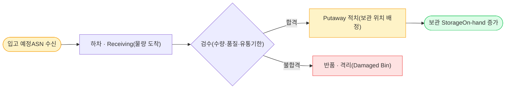
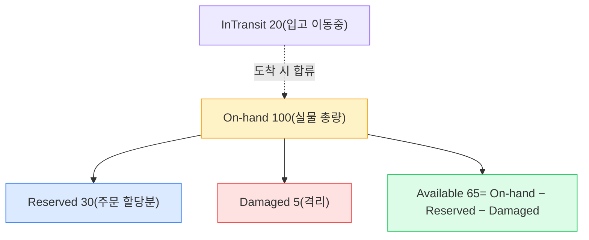
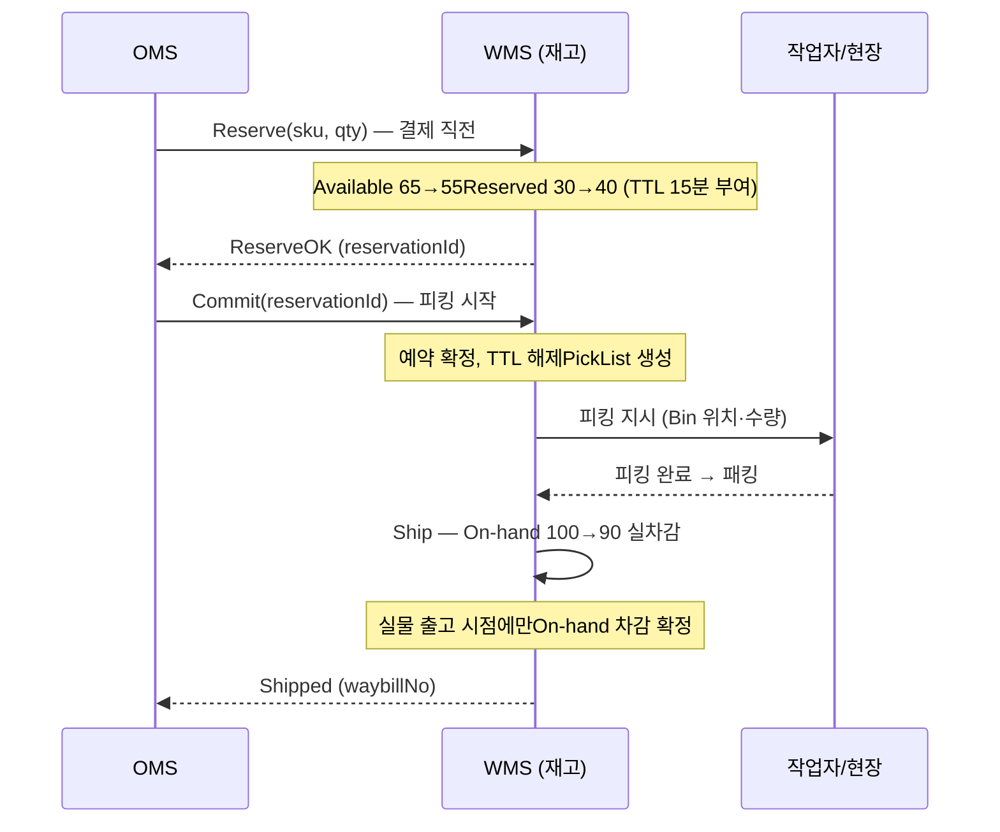

## 1. WMS의 역할 경계 — 실물 재고의 손발

> **핵심 책임** — 창고 내부의 *실물 재고 위치·수량·이동*을 관리하고, OMS의 할당 결정을 물리적 피킹·패킹·출고로 실현하는 *실행 시스템(Execution System)*이다.

WMS(Warehouse Management System, 창고관리 시스템)는 "이 SKU(Stock Keeping Unit, 재고 관리 단위)가 지금 어느 Bin(랙 위치)에 몇 개 있는가"의 단일 진실 원천(Source of Truth)이다. OMS가 주문의 두뇌라면 WMS는 **실물의 손발**이다. OMS는 "이 주문을 보내라"고 명령하지만, 실제로 물건을 집어 박스에 담아 내보내는 건 WMS다.

### OMS / TMS와의 경계 — Bounded Context

- **OMS 경계**: OMS는 논리 재고(주문에 약속한 수량)를 본다. WMS는 물리 재고(실제 선반 위 개수)를 본다. 이 둘이 어긋나면 **Oversell(초과판매)**이 발생한다.
- **TMS 경계**: WMS는 출고(Outbound)까지 책임진다. 운송장(Waybill) 발급 후 트럭에 실리는 순간부터는 TMS(Transportation Management System, 운송관리 시스템)의 영역이다.
- **실행 시스템 특성**: WMS는 작업자·RF 스캐너·컨베이어·AGV(Automated Guided Vehicle, 자동운반로봇)와 결합된 현장 시스템이라 지연(latency)과 정합성(consistency) 요구가 OMS와 다르다.

| 구분 | OMS | WMS | TMS |
| --- | --- | --- | --- |
| 관리 대상 | 주문(논리 재고) | 재고(실물 위치·수량) | 운송(이동) |
| 핵심 질문 | "이 주문 상태는?" | "이 SKU 어느 Bin에 몇 개?" | "언제 도착하나?" |
| 대표 Entity | `Order`, `Allocation` | `Inventory`, `Bin`, `PickList`, `Wave` | `Shipment`, `Waybill`, `Route` |
| 핵심 KPI | 주문 수락률·Cut-off | 피킹 정확도·출고 리드타임·UPH | OTD(정시배송률) |

## 2. 입고(Inbound) → 검수 → 적치 → 보관

재고는 공짜로 선반에 나타나지 않는다. WMS의 절반은 **입고(Inbound) 프로세스**다. 입고 단계의 데이터 정확도가 이후 모든 피킹·출고 정확도의 상한선을 결정한다.

*입고 흐름 — ASN(Advance Shipping Notice, 사전입고통지)로 예고 → 검수 → Putaway(적치) → On-hand 반영*

### 핵심 단계

- **ASN(Advance Shipping Notice, 사전입고통지)**: 공급사가 "무엇이 언제 몇 개 온다"를 미리 전송. 입고 예측·도크 스케줄링의 기반.
- **검수(Inspection)**: 수량·파손·유통기한 확인. 여기서 통과한 수량만 가용 재고가 된다.
- **Putaway(적치)**: 보관 위치 배정. 회전율 높은 SKU는 피킹 동선이 짧은 Golden Zone에, 저회전은 상층/외곽에 배치(Slotting, 적치 최적화).

> **⚠️ 실무 함정 — 입고 정확도가 모든 것의 상한**
>
> 입고 검수에서 100개를 98개로 잘못 등록하면 시스템 재고가 2개 부풀어 곧바로 **Oversell** 로 이어진다. 입고 정확도(Receiving accuracy) 목표는 보통 **99.5% 이상** 이며, 바코드·RFID 스캔으로 수기 입력을 제거하는 것이 1차 방어선이다.

## 3. 재고 상태 분류 — On-hand / Reserved / Available

"재고 100개"라는 단일 숫자는 거짓이다. WMS의 재고는 **여러 상태로 분해**해서 관리해야 한다. 이 분류를 못 하면 동시 주문 환경에서 반드시 Oversell이 난다.

| 상태 | 의미 | 비고 |
| --- | --- | --- |
| **On-hand** (실물) | 창고 선반에 물리적으로 존재하는 총량 | 재고 실사로 검증하는 기준값 |
| **Reserved** (예약) | 특정 주문에 할당되어 묶인 수량 | 아직 출고 전, 다른 주문에 줄 수 없음 |
| **Available** (가용) | `Available = On-hand − Reserved` | 실제 판매 가능한 수량 → 주문 가능 여부 판단 |
| **InTransit** (이동중) | 창고 간 이동·입고 중인 수량 | 도착 전까지 가용에 미포함 |
| **Damaged** (불량) | 파손·유통기한 임박으로 격리된 수량 | 가용에서 제외, 별도 Bin 격리 |

*재고 상태 분해 — 판매 가능 수량(Available)은 On-hand에서 Reserved·Damaged를 뺀 값. 이 값으로 주문을 받아야 Oversell이 안 난다*

> **💡 핵심 통찰**
>
> 주문 수락 판단은 **On-hand가 아니라 Available 기준** 으로 해야 한다. "선반에 100개 있으니 100개 팔자"가 아니라 "이미 30개 예약됐으니 65개만 팔 수 있다"가 정답이다. 이 한 줄이 Oversell 방지의 출발점이다.

## 4. Reserve → Commit → Ship — 재고 점유 3단계

재고를 즉시 차감하면 안 된다. 결제 실패·주문 취소가 빈번하기 때문이다. 그래서 **예약(Reserve) → 확정(Commit) → 출고(Ship)**의 3단계로 점유 강도를 점진적으로 높인다. 각 단계가 OMS 주문 상태와 맞물린다.

*Reserve→Commit→Ship — 예약은 TTL로 자동 만료, 실제 On-hand 차감은 출고 순간에만 일어남*

### 각 단계의 의미

- **Reserve(예약)**: Available을 줄이고 Reserved를 늘린다. On-hand는 그대로. 결제 대기 동안 다른 주문이 같은 재고를 못 가져가게 막는다. **TTL(Time To Live, 만료 시간)**을 둬서 결제 미완료 시 자동 해제.
- **Commit(확정)**: 결제 성공·피킹 시작 시 예약을 확정. TTL을 풀고 PickList를 생성한다.
- **Ship(출고)**: 실물이 창고를 떠나는 순간 On-hand를 실차감. 여기서부터 되돌리려면 반품 프로세스가 필요하다.

> **⚠️ 실무 함정 — TTL 만료 누수**
>
> Reserve에 TTL을 안 걸면, 결제 페이지에서 이탈한 고객들의 "유령 예약"이 쌓여 Available이 0이 되는 **재고 누수(inventory leak)** 가 생긴다. 카트 담기 단계에서 너무 일찍 Reserve를 잡으면 더 심하다. 보통 **결제 진입 시점에 5~15분 TTL** 로 잡고, 만료 시 비동기 잡으로 Reserved를 Available로 되돌린다.

## 5. 피킹 전략 — Batch / Zone / Wave / Cluster

피킹(Picking)은 창고 작업 시간의 **50~60%**를 차지하는 최대 비용 구간이다. "한 주문씩 통로를 다 도는" 단순 피킹(Single-order picking)은 동선이 길어 비효율적이라, 대형 FC(Fulfillment Center, 풀필먼트 센터)는 전략적 피킹을 쓴다.

| 전략 | 방식 | 장점 | 단점 / 적합 상황 |
| --- | --- | --- | --- |
| **Batch picking** (묶음 피킹) | 여러 주문의 같은 SKU를 한 번에 집음 | 이동 거리↓, 동일 품목 반복 방문 제거 | 주문별 분류(Sortation) 작업 추가 필요 |
| **Zone picking** (구역 피킹) | 작업자가 담당 구역만 피킹, 주문은 구역 간 릴레이 | 작업자 동선 최소·전문화 | 구역 간 인계·동기화 부담, 한 주문이 여러 구역 거침 |
| **Wave picking** (파동 피킹) | 출고 시간대·배송권역별로 주문을 묶어 일괄 릴리즈 | 출고 마감·운송 스케줄에 정렬, 처리량↑ | Wave 계획 복잡, 컬리 샛별배송류 정시 출고에 최적 |
| **Cluster picking** (클러스터 피킹) | 카트에 여러 주문함을 싣고 한 번 순회로 동시 피킹 | 이동당 처리 주문 수↑, 분류 동시 수행 | 카트 용량·소형 다품목 주문에 적합 |

### 동선 최적화와 UPH

피킹 성능 핵심 지표는 **UPH(Units Per Hour, 시간당 처리 단위)**다. Single-order picking이 시간당 60~80 UPH라면, Batch+동선 최적화로 **150~250 UPH**까지 끌어올린다. 동선 최적화는 본질적으로 **TSP(Traveling Salesman Problem, 외판원 문제)** 근사 문제로, 통로 순회 순서를 휴리스틱(S-shape, Return 방식)으로 푼다.

> **💡 정량 감각**
>
> Amazon FC의 Kiva/AGV 로봇은 "사람이 선반으로 가는" 대신 "선반이 사람에게 오는(Goods-to-Person)" 방식으로 이동 시간을 거의 0으로 만들어, 작업자 UPH를 **2~3배** 높인다. 피킹 정확도는 RF 스캔 검증으로 **99.9% 이상** 을 목표로 한다.

## 6. Oversell(초과판매) 방지 — 동시성의 핵심

Oversell은 "재고보다 많이 파는" 사고다. 백엔드 면접에서 가장 자주 나오는 **재고 차감 동시성(Concurrency)** 문제의 물류 버전이다. 두 요청이 동시에 "남은 1개"를 보고 둘 다 주문을 받으면 발생한다.

### 방어 기법 비교

| 기법 | 원리 | Trade-off |
| --- | --- | --- |
| **원자적 조건부 UPDATE** | `UPDATE inventory SET available=available-1 WHERE sku=? AND available>=1` → 영향 행 0이면 품절 | 구현 단순·DB 한 번. 단일 RDBMS 행에 경합 집중 시 핫로우(hot row) 병목 |
| **낙관적 락(Optimistic Lock)** | `version` 컬럼 비교, `WHERE version=?` 실패 시 재시도 | 경합 적으면 빠름. 경합 심하면 재시도 폭증으로 처리량↓ |
| **비관적 락(Pessimistic Lock)** | `SELECT ... FOR UPDATE`로 행 잠금 | 정확하지만 락 보유 시간만큼 동시성↓, 데드락 위험 |
| **Redis 원자 감소** | `DECR`/Lua 스크립트로 카운터 차감, 음수면 롤백 | 초고QPS 견딤(수만 QPS). 단 Redis-DB 정합성·내구성 보강 필요 |

> **🎯 면접 포인트 — "남은 1개를 두 명이 동시에 산다면?"**
>
> 핵심은 **"읽고-판단하고-쓰기"를 원자적으로** 묶는 것. 애플리케이션에서 `if(available>0) available--` 로 나누면 그 사이 race condition(경쟁 상태)이 생긴다. **조건을 WHERE 절에 넣은 단일 원자 UPDATE** 가 가장 단순한 정답이고, 초특가 한정수량처럼 핫로우 경합이 극심하면 **Redis 원자 감소 + 비동기 DB 반영** 으로 부하를 흡수한다. 🔥(Deep-dive)

> **⚠️ 실무 함정 — 시스템 재고 ≠ 실물 재고**
>
> 코드로 동시성을 완벽히 막아도, **파손·분실·오피킹** 으로 시스템 재고와 실물이 어긋난다. 그래서 주기적 **Cycle count(재고 실사)** 로 차이(Inventory shrinkage, 재고 손실)를 보정한다. 전수 조사 대신 회전율 높은 SKU를 자주 세는 **ABC 기반 순환 실사** 가 표준이며, 차이율(IRA, Inventory Record Accuracy)을 **99% 이상** 으로 관리한다.

## 7. 사례 비교 — 쿠팡 FC · 컬리 · Amazon FBA

| 사례 | WMS 특징 | 핵심 전략 |
| --- | --- | --- |
| **쿠팡 FC(풀필먼트 센터)** | 로켓배송용 자체 FC, Rocket Wow 재고 직접 보유 | 익일배송 SLA 위해 권역 FC 분산 적치, 고회전 SKU Golden Zone 슬로팅 |
| **컬리(샛별배송)** | 냉장/냉동/상온 온도대 분리 보관, 23시 Cut-off | **Wave picking**으로 새벽 출고 시간대에 일괄 릴리즈, 콜드체인 유지 |
| **Amazon FBA(Fulfillment by Amazon)** | 전 세계 멀티 FC, Kiva/AGV 로봇 Goods-to-Person | Random Stow(무작위 적치) + 시스템 위치 추적, 로봇으로 UPH 2~3배 |

> **💡 통찰 — Random Stow의 역발상**
>
> Amazon은 같은 SKU를 한곳에 모으지 않고 **여기저기 무작위 적치(Random Stow)** 한다. 직관에 반하지만, 어느 위치에서 피킹하든 가까운 재고를 잡을 수 있어 동선이 짧아지고 적치 충돌이 줄어든다. 위치는 전적으로 시스템(WMS)이 추적하므로 사람의 직관적 정리가 불필요하다.

## 8. 백엔드 시스템 디자인 연결

| WMS 이슈 | 설계 패턴 | 이유 |
| --- | --- | --- |
| 재고 차감 동시성·Oversell | **원자적 조건부 UPDATE** | 읽고-판단-쓰기를 단일 WHERE 절로 원자화, 가장 단순한 정답 |
| 경합 낮은 일반 재고 | **낙관적 락(version)** | 락 보유 없이 충돌 시 재시도, 평시 처리량 유지 |
| 한정수량·핫로우 경합 | **Redis 원자 감소 + 비동기 반영** | 수만 QPS 흡수, DB 핫로우 병목 회피 |
| Reserve 후 결제 미완료 | **TTL + 비동기 만료 잡** | 유령 예약 정리, Reserved→Available 자동 환원 |
| 재고 변경 이벤트 전파 | **Transactional Outbox** | 재고 차감 커밋과 OMS 통지 이벤트 발행의 원자성 보장 |

> **🎯 면접 정리 — 한 문장**
>
> "WMS는 재고를 **On-hand/Reserved/Available** 로 분해해 관리하고, **Reserve→Commit→Ship** 3단계로 점유하며(예약엔 TTL), Oversell은 **원자적 조건부 UPDATE** (극한 경합 시 Redis 원자 감소)로 막고, 시스템·실물 차이는 **Cycle count** 로 보정한다."
