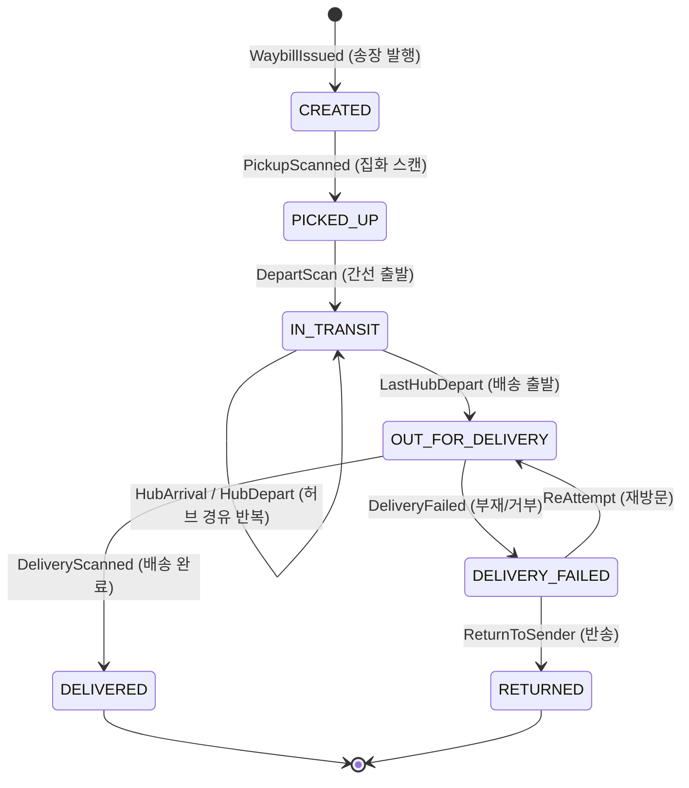
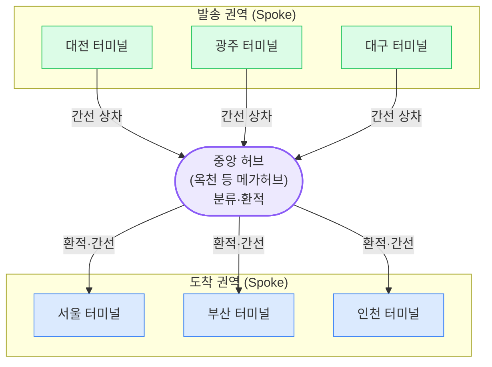
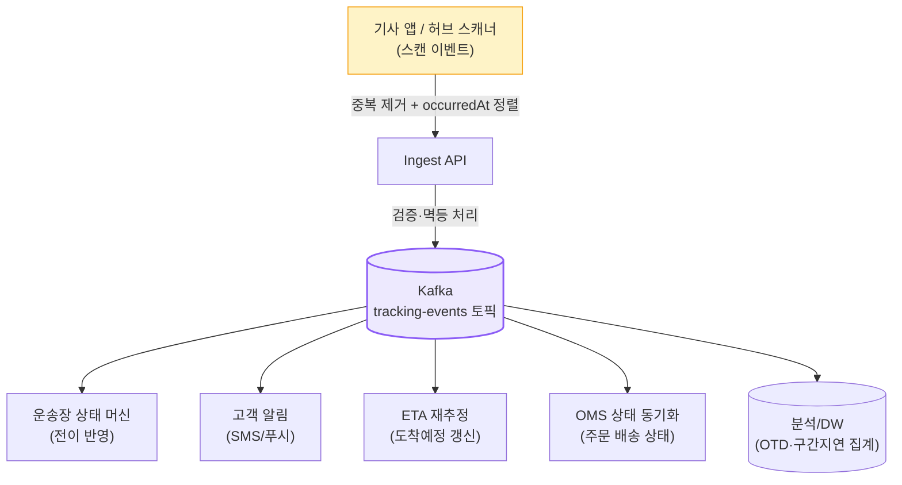

## 1. TMS의 역할 경계 — 운송의 두뇌

> **핵심 책임** — 출고된 화물을 *언제(When)·어떻게(How·어느 경로)·얼마에(Cost)* 운송할지 결정하고, 운송 전 구간의 상태와 추적(Tracking)을 책임진다.

TMS(Transportation Management System, 운송관리 시스템)는 "물건이 창고를 떠난 뒤" 세계의 두뇌다. OMS가 "이 주문 상태는?", WMS가 "이 재고 어디 있나?"를 책임진다면, TMS는 **"이 화물이 지금 어느 구간에 있고 언제 도착하나?"**의 단일 진실 원천(Source of Truth)이다.

### TMS의 핵심 책임 4가지

- **운송 계획(Planning)**: 어느 네트워크 경로(허브 경유 vs 직송)로 보낼지, 어떤 운송수단(택배·간선차량·항공)을 쓸지 결정.
- **배차(Dispatch)**: 화물을 차량·기사에 배정하고 적재율(Load Factor)을 최적화.
- **운임 정산(Freight Audit)**: 구간·중량·부피 기반 운임 계산 및 운송사 정산.
- **추적(Visibility)**: 운송장(Waybill) 단위로 전 구간 위치·상태 이벤트를 수집·노출.

| 구분 | OMS | WMS | TMS |
| --- | --- | --- | --- |
| 관리 대상 | 주문(논리) | 재고(실물) | **운송(이동)** |
| 핵심 질문 | "이 주문 상태는?" | "이 SKU 어디 있나?" | **"언제·어떻게 도착하나?"** |
| 대표 Entity | `Order`, `Allocation` | `Inventory`, `PickList` | `Shipment`, `Waybill`, `Route`, `Vehicle` |
| 경계 시작점 | 주문 접수 | 출고 지시 | **집화(Pickup)/출고 확정** |
| SLA 책임 | Cut-off 판정 | 피킹 정확도·출고 리드타임 | **OTD(On-Time Delivery, 정시배송률)** |

> **⚠️ 실무 함정 — Shipment의 주인은 누구?**
>
> `Shipment` 엔티티는 OMS(주문 단위 출고)와 TMS(운송 단위) 양쪽에서 쓰여 경계가 흐려지기 쉽다. 원칙은 **"출고 확정 시 OMS가 Shipment를 생성하고 TMS에 운송 요청을 넘긴다"** . TMS는 그 위에 `Waybill` · `Route` · `Leg(구간)` 를 얹어 운송 책임을 진다.

## 2. 운송장(Waybill) 상태 머신 (State Machine)

운송장(Waybill, 운송장/송장)은 한 화물의 운송 단위를 식별하는 핵심 객체다. 택배 송장번호 1건이 곧 1 Waybill이라고 보면 된다. 주문 상태와 마찬가지로 **Boolean 플래그가 아닌 Enum + 명시적 전이**로 강제해야 하며, 특히 **허브 경유로 IN_TRANSIT이 여러 번 반복**되는 점이 OMS 상태머신과 다른 부분이다.



*운송장 상태 전이 — 각 화살표가 TrackingEvent. IN_TRANSIT 자가전이는 허브 경유(환적)를 표현*

> **💡 TrackingEvent 발행 시점**
>
> 상태 전이 하나하나가 **스캔(Scan) 이벤트** 로 발생한다. 집화 스캔 → 허브 입고 스캔 → 허브 출고(상차) 스캔 → 배송지 도착 스캔 → 배송완료(인수자 사인/사진) 스캔. 각 스캔이 `TrackingEvent` 로 발행되어 고객 추적 화면을 채운다. 즉 상태 머신의 **전이 = 이벤트 = 고객 노출 노드** 가 1:1로 맞물린다.

### 왜 상태 머신을 코드로 강제하나

- **불법 전이 차단**: `DELIVERED → IN_TRANSIT` 같은 역행을 막는다. 단, 오배송 회수처럼 예외 전이는 별도 보정 플로우로만 허용.
- **허브 경유 반복 표현**: `IN_TRANSIT` 자가 전이로 N개 허브를 거치는 멀티 홉(Multi-hop)을 자연스럽게 표현.
- **멱등성(Idempotency, 멱등성)**: 같은 스캔 이벤트가 재시도로 두 번 와도 상태가 한 번만 진행되게(6장 참고).

> **⚠️ 실무 함정 — 순서 뒤바뀐 스캔**
>
> 네트워크 지연으로 "허브 B 출고 스캔"이 "허브 B 입고 스캔"보다 먼저 도착할 수 있다. 상태 머신이 단순히 도착 순서대로 전이하면 꼬인다. 이벤트에 **스캔 발생 시각(occurredAt)과 시퀀스** 를 실어, *이벤트 시각 기준* 으로 정렬·판정해야 한다.

## 3. 허브앤스포크 vs 포인트투포인트 — 네트워크 토폴로지

운송 네트워크를 어떻게 연결할지가 비용·속도를 가른다. 두 극단이 **허브앤스포크(Hub-and-Spoke, 중심·바큇살)**와 **포인트투포인트(Point-to-Point, P2P, 직송)**다.



*허브앤스포크 — 모든 화물이 중앙 허브에 모여 재분류(환적)된 뒤 목적지 권역으로 재출발*

### 핵심 Trade-off — 링크 수와 적재효율

| 관점 | 허브앤스포크 (Hub-and-Spoke) | 포인트투포인트 (P2P, 직송) |
| --- | --- | --- |
| 노선(링크) 수 | **N개** (각 거점↔허브) | **최대 N(N-1)/2 ≈ N²** (모든 거점 쌍) |
| 적재 효율 | 높음 — 화물 통합으로 차량 만재(滿載) 쉬움 | 낮음 — 쌍별 물량 적어 공차·반적재 빈번 |
| 리드타임(Lead Time) | 김 — 허브 우회 + 환적 대기로 +α | 짧음 — 직송이라 최단 |
| 단위 운송비 | 낮음 — 규모의 경제, 간선 통합 | 높음 — 적재율 낮아 단가↑ |
| 장애 전파 | 허브 장애 시 전체 마비(SPOF) | 한 노선 장애가 국소적 |
| 대표 적용 | 택배(CJ대한통운), 항공 화물(FedEx) | 대량 정기 화물(공장↔물류센터), 새벽배송 권역 직배 |

> **💡 정량 감각 — 왜 허브로 모으나**
>
> 거점이 50개라면 P2P 완전 연결은 **50×49/2 = 1,225개 노선** 이 필요하다. 허브앤스포크는 **거점당 1개씩 50개 노선** 이면 모든 쌍을 연결한다. 노선이 줄면 각 노선의 물량이 통합돼 **차량 적재율을 70%→90%대** 로 끌어올릴 수 있고, 그만큼 단위 운송비가 내려간다. 대신 모든 화물이 허브를 한 번 우회하므로 리드타임이 늘어난다 — 이것이 핵심 Trade-off다.

> **⚠️ 실무 — 순수형은 드물다 (하이브리드)**
>
> 현실은 둘의 혼합이다. 같은 권역(예: 서울 내) 단거리는 허브를 거치지 않는 **P2P 직배** 로, 장거리는 허브 경유로 보낸다. 물량이 충분한 대도시 쌍은 **다중 허브(Multi-hub)** 로 분산해 단일 허브 SPOF를 완화한다.

## 4. 간선 · 지선 · 말단 — 운송 구간의 계층

한 화물의 전체 운송 경로(Route)는 성격이 다른 여러 구간(Leg)으로 쪼개진다. 거리·차량·운영 방식이 다르므로 용어를 정확히 구분해야 한다.

| 구간 | 영문 | 정의 | 운송수단(예) |
| --- | --- | --- | --- |
| 집화 | **Pickup(집화)** | 송하인/판매자 → 발송 터미널까지 화물을 모음 | 집화 차량(소형) |
| 간선 | **Line-haul(간선)** | 터미널/허브 간 장거리 대량 운송 (도시↔도시) | 대형 트럭, 트레일러, 항공 |
| 지선 | **Feeder/지선** | 허브 ↔ 지역 터미널(서브 터미널) 간 중거리 연결 | 중형 트럭 |
| 말단 | **Last-leg/Last-mile(말단·라스트마일)** | 도착 터미널 → 최종 수령지까지 배송 | 택배 기사, 이륜차, 배송 캠프 |


*집화 → 간선 → (허브 환적) → 지선 → 말단. 한 Waybill이 여러 Leg를 차례로 통과*

### 환적(Cross-docking, 교차도킹)

허브의 핵심 작업이 **환적(Cross-docking, 교차도킹)**이다. 입고된 화물을 **창고에 보관하지 않고** 곧바로 목적지별로 재분류해 출고 차량에 옮겨 싣는 방식이다. 보관(Storage) 단계를 생략해 리드타임과 재고 비용을 줄인다.

- **입고(Inbound)**: 각 권역에서 온 간선 차량이 허브에 도착 → 하차 스캔.
- **분류(Sort)**: 송장의 목적지 권역을 읽어 컨베이어/휠소터로 자동 분류.
- **출고(Outbound)**: 목적지별 도크(Dock)에 모인 화물을 출발 차량에 상차 → 상차 스캔(= IN_TRANSIT 자가전이).

> **⚠️ 실무 함정 — 허브 체류시간(Dwell Time)**
>
> 환적은 "보관 안 함"이 원칙이지만, 출발 간선 차량의 출발 시각(Cut-off)을 놓치면 화물이 다음 차수까지 허브에 머문다 → **Dwell Time 급증 → 리드타임 1일 추가** . 분류 처리량(throughput)이 입고 속도를 못 따라가면 허브가 병목이 된다. 시스템 디자인에서 허브는 흔히 **최우선 병목 후보** 다.

## 5. 배차(Dispatch) 기초 — 화물을 차량·기사에 배정

배차(Dispatch, 배차)는 "어떤 화물 묶음을 어떤 차량·기사에 태워, 어떤 순서로 돌게 할지" 결정·집행하는 과정이다. 간선 배차(거점 간 정기 차량)와 말단 배차(택배 기사 권역 배정)는 성격이 다르지만, 공통적으로 **적재율·권역·시간창(Time Window)**을 최적화한다.

```mermaid
sequenceDiagram
    participant TMS as TMS (배차 엔진)
    participant GEO as 권역/지오코딩
    participant OPT as 최적화 엔진
    participant APP as 기사 앱
    participant DRV as 기사

    TMS->>GEO: 배송 물량 권역(Zone) 매핑
    GEO-->>TMS: 권역별 화물 그룹
    TMS->>OPT: 차량 용량·권역·시간창 입력
    Note over OPT: 적재율 최대화 + 경로 최소화\n(VRP, 차량경로문제)
    OPT-->>TMS: 차량별 화물 배정 + 방문 순서
    TMS->>APP: 배차 확정 푸시 (Manifest)
    APP-->>DRV: 오늘의 배송 리스트
    DRV->>APP: 배송 스캔/완료 보고
    APP->>TMS: TrackingEvent 동기화
```

*배차 흐름 — 권역 매핑 → 최적화(VRP) → 기사 앱 배차 확정 → 배송 보고 동기화*

### 배차에서 최적화하는 핵심 변수

| 변수 | 설명 | Trade-off |
| --- | --- | --- |
| 적재율(Load Factor) | 차량 용량 대비 실제 적재량(%) | 꽉 채우면 비용↓이지만 만재 대기로 출발 지연 위험 |
| 권역(Zone) | 기사별 담당 배송 구역 | 권역 좁히면 동선↓이나 물량 편차로 일부 기사 과부하 |
| 시간창(Time Window) | 고객 지정/SLA 도착 가능 시간대 | 새벽·지정시간 배송은 경로 제약↑ → 적재 통합 어려움 |
| 경로(Route) | 방문 순서 (VRP/TSP 해) | 최단 경로 계산 비용 vs 동선 단축 이득 |

> **🎯 면접 포인트 — 배차는 NP-hard**
>
> 배차의 경로 최적화는 **VRP(Vehicle Routing Problem, 차량경로문제)** 로, 본질적으로 **NP-hard** 다. 수천 건을 실시간으로 풀 수 없으므로 실무에선 **휴리스틱(권역 분할 후 권역 내 TSP 근사)** 이나 메타휴리스틱으로 "충분히 좋은 해"를 짧은 시간에 구한다. "최적해 vs 응답시간"의 Trade-off를 명확히 말할 수 있어야 한다. 🔥(Deep-dive)

> **💡 정량 감각**
>
> 적재율을 **75% → 90%** 로 끌어올리면 같은 물량을 운반하는 데 필요한 차량 수가 약 **1/6 줄어든다** (부피 기준 단순 환산). 운송비의 큰 축이 차량·인건비이므로, 배차 최적화 1~2%의 적재율 개선이 곧 수익으로 직결된다.

## 6. TrackingEvent — 멱등성 · 오프라인 동기화 · Fan-out

TMS 백엔드의 심장은 **TrackingEvent 파이프라인**이다. 전국 수만 명의 기사 앱과 허브 스캐너가 초당 대량의 스캔 이벤트를 쏟아낸다. 이 스트림을 **유실 없이, 중복 없이, 순서 보정해** 운송장 상태로 반영하는 것이 핵심 난제다.

### 1) 중복 / 멱등성 (Idempotency)

네트워크 재시도, 더블 스캔으로 동일 이벤트가 여러 번 들어온다. 각 TrackingEvent에 **고유 이벤트 ID(`waybillNo + scanType + occurredAt + deviceId` 해시)**를 부여하고, 이미 처리한 ID는 무시(De-duplication)한다. 상태 전이는 멱등하게 — 같은 이벤트를 두 번 적용해도 결과가 같아야 한다.

### 2) 기사 앱 오프라인 동기화

지하 주차장·산간 지역에서 통신이 끊긴 채 배송이 진행된다. 기사 앱은 스캔을 **로컬 큐에 버퍼링**했다가 통신 복구 시 **일괄 동기화(batch sync)**한다. 그래서 서버는 **"수 시간 지연되어 도착하는 과거 시각 이벤트"**를 정상으로 받아들여야 한다 → 이벤트의 `occurredAt`(발생 시각)과 `receivedAt`(수신 시각)을 분리 관리하고, 상태 판정은 **occurredAt 기준**으로 정렬.

### 3) Fan-out (이벤트 확산)

운송장 상태가 바뀌면 여러 소비자가 동시에 관심을 가진다. 한 이벤트를 다수 소비자에게 뿌리는 **Fan-out(팬아웃, 확산)**이 필요하다.



*TrackingEvent Fan-out — Kafka 토픽 하나를 상태머신·알림·ETA·OMS·DW가 각자 구독*

> **🎯 면접 포인트 — 순서 보장 vs 처리량**
>
> "같은 운송장의 이벤트는 순서가 보장돼야 하는데, 전체 처리량도 높여야 한다." → Kafka에서 **파티션 키를 `waybillNo`** 로 두면 같은 운송장 이벤트는 한 파티션에 모여 순서가 보장되고, 운송장끼리는 병렬 처리된다. 단 파티션 키 편중(핫 운송장)과 리파티셔닝 비용을 함께 설명할 수 있어야 한다. 🔥(Deep-dive)

> **⚠️ 실무 함정 — At-least-once는 기본값**
>
> 메시지 큐는 보통 **At-least-once(최소 1회) 전달** 이다. 즉 중복은 "예외"가 아니라 "정상"이다. 소비자(상태머신·알림)는 반드시 멱등하게 설계해야 한다. 그렇지 않으면 같은 고객에게 "배송완료" 알림이 두 번 가는 사고가 난다.

## 7. 사례 비교 — 네트워크 전략별 물류사

| 사례 | 네트워크 전략 | TMS 특징 |
| --- | --- | --- |
| **CJ대한통운** | 허브앤스포크 표준 (옥천 메가허브) | 전국 화물을 중앙 허브에 집결·환적. 택배 표준 모델, 간선 통합으로 단가 최적화 |
| **쿠팡 (CLS)** | 수직통합 + 권역 집중 (자체 캠프) | FC(풀필먼트센터)→캠프→직고용 기사까지 자체 운영. 새벽/당일배송 위해 권역 직배 비중↑(허브 우회 최소화) |
| **FedEx** | 항공 허브앤스포크 (Memphis 슈퍼허브) | 야간 항공 집결·분류·재출발. 글로벌 익일 특송의 원형. 허브 의존도 극대화 |
| **DHL** | 다중 허브(Multi-hub) 글로벌망 | 지역별 거점 허브 분산으로 단일 허브 SPOF 완화, 국가 간 환적 최적화 |

> **💡 사례가 말하는 핵심**
>
> CJ대한통운/FedEx는 **허브 통합으로 규모의 경제** 를 취하고, 쿠팡 CLS는 **수직통합 + 권역 직배로 리드타임** 을 취한다. 정답은 없다 — **물량 밀도와 SLA 목표** 가 네트워크 형태를 결정한다. 물량이 충분히 두꺼운 권역은 직배(P2P)가, 얇은 권역은 허브 통합이 유리하다.

## 8. 백엔드 시스템 디자인 연결

| TMS 이슈 | 설계 패턴 | 이유 |
| --- | --- | --- |
| TrackingEvent 대량 확산 | **Kafka Fan-out** | 토픽 1개를 상태머신·알림·ETA·OMS·DW가 독립 구독, 소비자 추가가 무중단 |
| 중복 스캔 / At-least-once | **Idempotency(멱등성)** | 이벤트 ID 기반 De-dup, 상태 전이 멱등화로 중복 알림·이중 전이 방지 |
| TMS↔OMS 상태 동기화 | **CDC + 최종 일관성(Eventual Consistency)** | 운송 상태 변경을 이벤트로 흘려 OMS 주문 상태에 비동기 반영, 강결합 회피 |
| 운송장 상태 전이 신뢰성 | **Transactional Outbox** | DB 상태 변경과 이벤트 발행의 원자성 보장 (전이는 됐는데 이벤트 유실 방지) |
| 오프라인 기사 앱 동기화 | **occurredAt 기준 정렬 + 배치 sync** | 지연 도착 이벤트를 발생 시각 기준으로 재정렬해 상태 꼬임 방지 |
| 추적 조회 폭주 | **CQRS 읽기 모델** | 고객 추적 화면용 비정규화 뷰를 쓰기 모델과 분리 |

> **🎯 면접 정리 — 한 문장**
>
> "TMS는 운송장(Waybill)을 **허브 경유로 IN_TRANSIT이 반복되는 상태 머신** 으로 관리하고, 네트워크는 **허브앤스포크(비용·N링크) vs P2P(속도·N²링크)의 Trade-off** 이며, 한 화물은 **집화→간선→환적→지선→말단** Leg를 통과하고, 배차는 **NP-hard VRP의 휴리스틱 최적화** 이며, TrackingEvent는 **Kafka Fan-out + 멱등성 + occurredAt 정렬** 로 처리한다."
