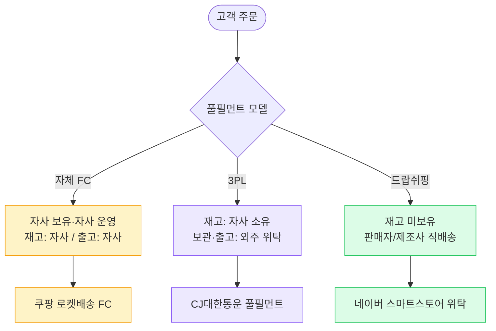
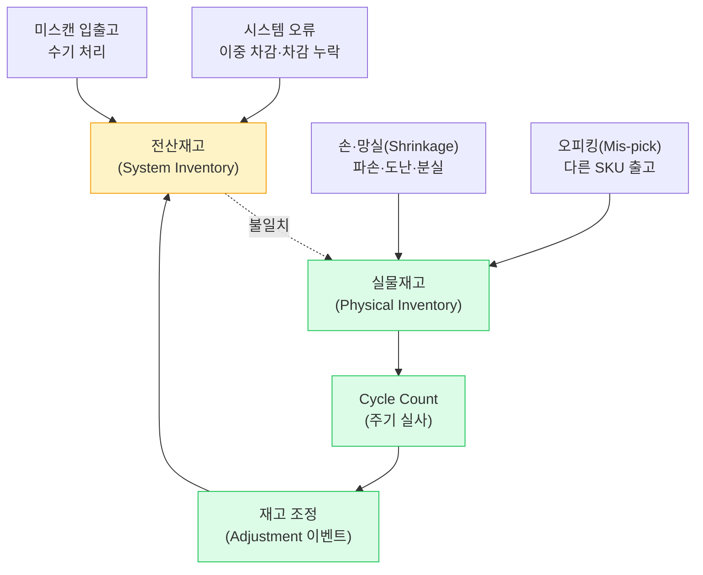
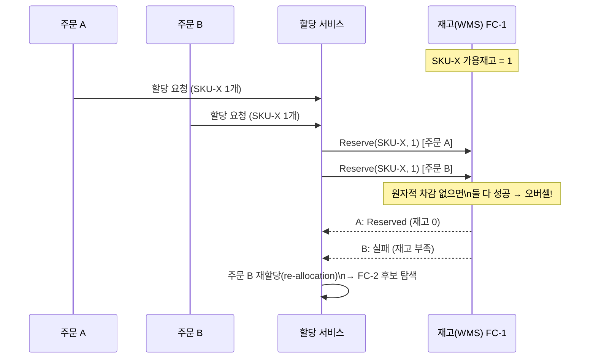

## 1. 풀필먼트(Fulfillment) 개념 — 주문 이후 실물의 전 과정

> **핵심 정의** — Fulfillment(풀필먼트)는 판매자의 상품을 *창고 입고(Inbound)→보관(Storage)→피킹(Picking)→패킹(Packing)→출고(Outbound)*까지 대행하는, 주문 확정 이후 실물을 고객 손에 전달하기 위한 모든 물류 작업의 묶음이다.

OMS(Order Management System, 주문관리 시스템)가 "이 주문이 지금 어디까지 왔는가"라는 논리 상태를 책임진다면, 풀필먼트는 그 주문을 **실물 작업으로 실현**하는 영역이다. 흔히 FBA(Fulfillment by Amazon)처럼 "주문만 받으면 나머지는 우리가 다 한다"는 형태의 위탁 서비스로 상품화된다.

### 풀필먼트의 범위 — 입고에서 출고까지

*풀필먼트 흐름 — 입고~출고는 WMS(주황) 영역, 라스트마일(초록)로 연결*

> **💡 용어 정리**
>
> **FC(Fulfillment Center, 풀필먼트 센터)** 는 단순 보관 창고가 아니라 *주문 단위 출고(B2C)* 에 최적화된 창고다. 대량 입출고 위주의 일반 물류센터(DC, Distribution Center)와 달리, 낱개 피킹·당일/익일 출고 SLA(Service Level Agreement, 서비스 수준 협약)에 맞춰 설계된다.

## 2. 풀필먼트 모델 비교 — 자체 FC vs 3PL vs 드랍쉬핑

같은 "주문을 실물로 전달한다"는 목표라도, 누가 재고를 보유하고 누가 출고 작업을 하느냐에 따라 세 가지 모델로 갈린다.

*세 모델 비교 — 재고 보유 주체와 출고 운영 주체의 조합으로 구분*

### 상세 비교표

| 관점 | 자체 FC(Fulfillment Center) | 3PL(3자 물류, Third-Party Logistics) | 드랍쉬핑(Dropshipping) |
| --- | --- | --- | --- |
| 초기 투자(CapEx) | 매우 높음 (FC 부지·설비 수천억~조 단위) | 중간 (입점비·보관료, 자산 미보유) | 거의 0 (재고·창고 불필요) |
| 단위당 마진 | 규모 달성 시 가장 높음 (변동비↓) | 중간 (수수료 차감) | 가장 낮음 (판매자 마진 종속, 5~15%) |
| 통제력(품질·SLA) | 최강 (피킹·패킹·배송 전 과정 직접 통제) | 중간 (계약 SLA 범위 내) | 약함 (출고·품질을 판매자에 의존) |
| 확장성(Scalability) | 느림 (FC 신설은 수년 리드타임) | 빠름 (창고 빌려 즉시 확장) | 가장 빠름 (SKU만 등록하면 됨) |
| 리드타임(Lead time) | 가장 짧음 (당일·익일, 권역 FC) | 중간 (위탁사 출고 정책 의존) | 가장 김 (판매자 출고 + 가변) |
| 재고 정합성 책임 | 자사 (전 구간 직접 관리) | 공유 (위탁사와 데이터 연동 필요) | 판매자 (실재고 가시성 낮음) |

> **🎯 면접 포인트 — 모델 선택 Trade-off**
>
> "스타트업 커머스가 어떤 풀필먼트 모델로 시작해야 하나?" 정답은 없고 **물동량·마진·통제 요구** 의 함수다. 초기엔 CapEx 0인 **드랍쉬핑/3PL** 로 검증하고, 물동량이 임계점(예: 일 출고 수천 건)을 넘어 *단위 풀필먼트 비용이 3PL 수수료를 역전* 하는 순간 **자체 FC** 로 내재화하는 것이 일반적 경로다. "처음부터 자체 FC"는 대부분 과잉 투자다. 🔥(Deep-dive)

## 3. 재고 정합성 — 전산재고 vs 실물재고

재고 정합성(Inventory Accuracy)이란 시스템에 기록된 **전산재고(Book/System inventory)**와 창고에 실제로 존재하는 **실물재고(Physical inventory)**가 일치하는 정도다. 이 둘이 어긋나면 "팔 수 있다고 약속했는데 물건이 없는" 오버셀(Oversell)이 발생한다.

### 불일치는 왜 생기는가

*정합성 깨짐의 원인과 보정 루프 — Cycle count로 실물을 측정해 전산을 조정*

### 주요 원인

- **손·망실(Shrinkage)**: 파손, 도난, 유통기한 폐기 등 실물이 사라지는 경우.
- **오피킹(Mis-pick)**: 비슷한 SKU(Stock Keeping Unit, 재고 관리 단위)를 잘못 집어 다른 상품 출고 → 두 SKU 모두 정합성 깨짐.
- **시스템 오류**: 동시성 버그로 인한 이중 차감, 이벤트 유실로 인한 차감 누락.
- **미스캔(Unscanned)**: 입·출고 시 바코드 미스캔, 수기 처리 누락.

### Cycle Count(주기 실사)와 KPI

연 1회 전수 실사(Annual physical count)는 창고를 멈춰야 하므로, 실무에서는 **Cycle count(주기 순환 실사)**로 매일 일부 로케이션을 돌아가며 센다. 특히 회전율 높은 SKU(ABC 분석의 A급)는 더 자주 센다.

| KPI | 정의 | 현업 기준 감각 |
| --- | --- | --- |
| 재고 정확도(Inventory Accuracy) | 실사 일치 로케이션 / 전체 로케이션 | 우수 운영 **99.5% 이상**, 글로벌 톱티어 **99.9%+** |
| 오피킹률(Mis-pick rate) | 오피킹 건수 / 총 피킹 건수 | 목표 **0.1% 이하** (1만 건당 10건 미만) |
| Shrinkage율 | 손·망실 금액 / 매출 또는 재고가 | 이커머스 통상 **1~2%**, 관리 우수 시 1% 미만 |

> **⚠️ 실무 함정 — 가용재고 ≠ 보유재고**
>
> 판매 가능한 재고는 `가용재고(ATP, Available To Promise) = 보유재고(On-hand) − 예약재고(Reserved) − 안전재고(Safety stock)` 다. "물리적으로 있다"고 다 팔면 안 된다. 다른 주문에 이미 Reserve된 수량과 완충용 안전재고를 빼고 판매해야 오버셀을 막는다.

## 4. 멀티 창고 할당 — 최적 창고 선택과 동시성

여러 FC에 같은 SKU가 분산 보관될 때, 하나의 주문을 "어느 창고에서 출고할지" 정하는 것이 멀티 창고 할당(Multi-warehouse allocation)이다. 배송비·재고·SLA를 종합하는 최적화 문제이며, 동시에 들어온 주문들 사이에서 **Race condition(경쟁 상태)**을 막아야 한다.

### 최적 창고 선택의 변수

| 변수 | 설명 | Trade-off |
| --- | --- | --- |
| 배송 거리/비용 | 창고 → 수령지 거리, 권역 운임 | 가까운 창고 = 비용↓·리드타임↓ |
| 가용 재고 | 각 창고의 ATP(가용재고) | 가장 가까운 창고에 재고 없으면 차선 창고 |
| SLA 마감(Cut-off) | 당일/익일 출고 가능 창고만 후보 | 새벽배송은 권역 FC로 후보 제한 |
| 분할 페널티 | Split shipment(분할출고) 시 박스·운임 증가 | 속도(분할) vs 비용(묶음) |

### Split shipment(분할출고) 허용 여부

한 창고에 전량 재고가 없으면, **분할출고**로 여러 창고에서 나눠 보낼지(빠르지만 비쌈) 아니면 한 창고로 모일 때까지 기다릴지(느리지만 저렴) 정책으로 결정한다. 쿠팡 로켓처럼 속도 우선이면 분할을 적극 허용한다.

### 동시 예약 Race condition

*동시 예약 경쟁 — Reserve가 원자적이어야 오버셀 방지, 실패 주문은 다른 창고로 재할당*

> **🎯 면접 포인트 — 멀티 창고 재고 차감**
>
> "여러 창고·여러 서버에서 같은 SKU에 동시에 할당 요청이 오면?" → 단일 창고 내 차감은 **DB 원자적 UPDATE(`WHERE qty >= n`)** 또는 **낙관적 락(Optimistic Lock, 버전 컬럼)** 으로 보장한다. 창고 간 분산 재고는 단일 트랜잭션이 불가하므로, **Saga + 보상(Release)** 으로 일부 Reserve 실패 시 이미 잡은 다른 창고 예약을 풀어준다. 핫 SKU는 Redis `DECR` 같은 인메모리 카운터로 DB 경합을 흡수하기도 한다. 🔥(Deep-dive)

## 5. 안전재고(Safety stock) · 재주문점(ROP)

수요와 리드타임은 항상 변동한다. 평균만 보고 재고를 채우면 변동이 큰 날 결품(Stockout)이 난다. 안전재고(Safety stock)는 이 **변동성에 대비한 완충 재고**다.

> **핵심 공식** — `재주문점(ROP, Reorder Point) = (평균 일수요 × 평균 리드타임) + 안전재고` 주문 가능 재고가 ROP 아래로 내려가면 보충 발주를 건다.

### 안전재고 산정 — 변동성 기반

통계적 안전재고는 `SS = Z × σ_LT` 로 산정한다. 여기서 `Z`는 목표 서비스 수준(Service level)에 해당하는 정규분포 계수, `σ_LT`는 리드타임 동안 수요의 표준편차다.

| 목표 서비스 수준 | Z 계수 | 의미 |
| --- | --- | --- |
| 90% | 1.28 | 10번 중 1번 결품 허용 |
| 95% | 1.65 | 일반 소비재 표준 |
| 99% | 2.33 | 핵심 SKU·고마진 상품 |
| 99.9% | 3.09 | 결품 비용이 매우 큰 경우 |

> **💡 정량 예시**
>
> 평균 일수요 100개, 리드타임 4일, 일수요 표준편차 30개라 하자. 서비스 수준 95%(Z=1.65)를 목표하면 리드타임 동안 표준편차 `σ_LT = 30 × √4 = 60` , 안전재고 `SS = 1.65 × 60 ≈ 99개` . 재주문점 `ROP = 100×4 + 99 = 499개` . 즉 재고가 약 500개로 떨어지면 발주를 걸어야 4일 리드타임 동안 95% 확률로 결품을 피한다.

### 결품 vs 과잉재고 Trade-off

| 관점 | 안전재고를 적게(결품 위험) | 안전재고를 많이(과잉재고) |
| --- | --- | --- |
| 비용 | 보관비↓, 자본 회전↑ | 보관비↑, 자본 묶임(재고 보유 비용 연 15~30%) |
| 리스크 | 결품(Stockout) → 매출 손실·고객 이탈 | 진부화(Obsolescence)·폐기, 특히 신선/패션 |
| 적합 SKU | 수요 안정·대체 가능 상품 | 고마진·결품 비용 큰 핵심 SKU |

> **⚠️ 실무 함정 — 결품 비용은 보이지 않는다**
>
> 과잉재고 비용(보관료·폐기)은 장부에 바로 찍히지만, 결품 비용(놓친 매출 + 고객이 경쟁사로 이탈하는 **장기 LTV 손실** )은 측정이 어려워 과소평가되기 쉽다. 그래서 핵심 SKU는 서비스 수준을 보수적으로(99%+) 잡는 것이 합리적이다.

## 6. 사례 비교 — 국내외 풀필먼트 서비스

| 사례 | 모델 | 특징 | 핵심 정책 |
| --- | --- | --- | --- |
| **쿠팡 로켓그로스** | 자체 FC + 판매자 위탁 | 판매자 재고를 쿠팡 FC에 입고, 로켓배송 SLA 적용 | 전국 FC 분산 할당, 분할출고 적극, 익일/당일 |
| **컬리(B2B 풀필먼트)** | 자체 FC(콜드체인) | 냉장/냉동/상온 온도대 분리, 샛별배송 인프라 활용 | 23시 Cut-off, 권역 창고 제한, 온도대 분할 패킹 |
| **Amazon FBA** | 자체 FC(글로벌) | 판매자 위탁의 원조, 멀티 FC 글로벌 재고 분산 | 비용 최소화 라우팅, Backorder/입고 ETA 정교 |
| **네이버 도착보장** | 제휴 3PL 연계 | CJ대한통운 등 제휴 물류사 풀필먼트 연동, 도착일 보장 | 판매자 재고 데이터 연동, SLA 미달 시 보상 |

> **💡 정량 감각**
>
> 쿠팡은 전국 수십 개 FC와 100여 개 이상 물류 거점으로 인구 대다수를 **로켓배송 권역(약 10분 거리)** 안에 두는 분산 배치를 추구한다. 이렇게 재고를 수요지 가까이 분산할수록 리드타임은 짧아지지만, 같은 SKU를 여러 FC에 중복 보유해야 하므로 **총 안전재고와 보관비가 증가** 한다 — 분산 vs 집중의 전형적 Trade-off다.

## 7. 백엔드 시스템 디자인 연결

| 풀필먼트/재고 이슈 | 설계 패턴 | 이유 |
| --- | --- | --- |
| 단일 창고 재고 차감 동시성 | **낙관적 락(Optimistic Lock) / 원자적 UPDATE** | `WHERE qty >= n` 또는 버전 컬럼으로 오버셀 방지, 락 경합 최소화 |
| 멀티 창고 분산 재고 일관성 | **Saga + 보상 트랜잭션(Release)** | 2PC 회피, 일부 Reserve 실패 시 잡은 예약 해제·재할당 |
| 재고 조정·실사 이력 추적 | **Event Sourcing(이벤트 소싱)** | 입고·차감·조정 이벤트의 누적으로 현재 재고 재구성, 감사 추적 |
| 재고 변경 이벤트 신뢰 발행 | **Transactional Outbox** | DB 커밋과 재고 이벤트 발행의 원자성 보장(차감 누락 방지) |
| 재고 조회 폭주(상세/검색) | **CQRS 읽기 모델** | 쓰기(정합성 우선)와 분리된 조회 최적화 뷰, ATP 캐싱 |
| 핫 SKU 차감 경합 | **인메모리 카운터(Redis) + 비동기 정산** | DB 락 경합을 인메모리로 흡수, 사후 DB 동기화 |

> **🎯 면접 정리 — 한 문장**
>
> "풀필먼트는 **자체 FC·3PL·드랍쉬핑** 의 CapEx/마진/통제 Trade-off로 선택되고, 재고 정합성은 **전산-실물 차이를 Cycle count로 보정** 하며, 멀티 창고 할당은 **원자적 Reserve + Saga 보상** 으로 오버셀을 막고, 안전재고는 **변동성 기반 ROP(재주문점)** 로 결품과 과잉재고를 균형 잡는다."
