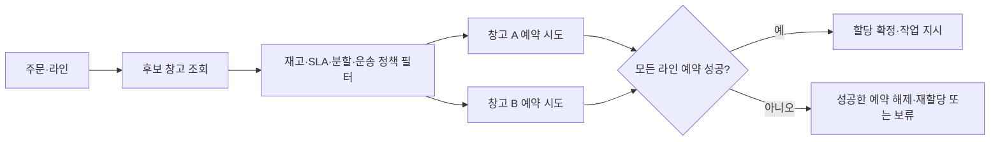

## 1. 풀필먼트는 어떤 책임을 묶는가

풀필먼트는 온라인 주문을 실제 출고로 연결하는 운영 범위다. 일반적으로 입고·검수·보관·피킹·패킹·출고와 반품 처리를 포함하지만, 회사마다 OMS·WMS·운송사 사이의 경계와 계약 범위가 다르다. 따라서 “풀필먼트는 항상 이 시스템이 담당한다”라고 단정하기보다 **재고를 누가 보유하고, 작업을 누가 수행하며, 어느 사건을 어느 시스템이 확정하는지**를 먼저 적어야 한다.

[Amazon FBA의 공식 설명](https://sell.amazon.com/fulfill.html)은 판매자가 상품을 풀필먼트 센터로 보내면 Amazon이 보관·피킹·패킹·배송·고객 서비스·반품을 수행하는 한 가지 운영 예를 보여준다. 이 사례는 풀필먼트의 가능한 범위를 설명하지만, 모든 사업자의 조직 경계를 정의하지는 않는다.


```mermaid
flowchart LR
    Supplier(["판매자·공급사"]) --> Inbound["입고·검수"]
    Inbound --> Storage["보관·재고 원장"]
    Storage --> Pick["피킹"]
    Pick --> Pack["패킹·출고 검증"]
    Pack --> Handover["운송사 인계"]
    Handover --> Customer(["고객·반품"])

    style Inbound fill:#fef3c7,stroke:#f59e0b
    style Storage fill:#fef3c7,stroke:#f59e0b
    style Pick fill:#fef3c7,stroke:#f59e0b
    style Pack fill:#fef3c7,stroke:#f59e0b
    style Handover fill:#dbeafe,stroke:#3b82f6
    style Customer fill:#dcfce7,stroke:#22c55e
```

| 질문 | 먼저 정할 계약 |
| --- | --- |
| 재고 소유권 | 판매자 재고인지, 사업자가 매입한 재고인지 |
| 수량의 권위 | WMS 원장인지, 3PL의 재고 보고서인지, 별도 동기화 원장인지 |
| 작업 완료의 증거 | 스캔·패킹 확정·운송사 인수 중 어느 사건인지 |
| 예외 책임 | 파손·분실·오피킹·지연을 누가 조사하고 보상하는지 |

## 2. 자체 FC·3PL·드랍쉬핑 비교

세 모델은 우열 순서가 아니라 책임과 고정비의 배치가 다르다.

| 관점 | 자체 FC | 3PL | 드랍쉬핑 |
| --- | --- | --- | --- |
| 재고·작업 | 사업자가 재고와 시설·인력을 직접 운영 | 사업자가 재고를 보유하거나 계약 조건에 따라 위탁하고, 3PL이 작업 | 공급사가 재고를 보유하고 고객에게 직접 발송 |
| 고정비 | 시설·설비·인력의 고정비가 커질 수 있음 | 사용량·보관·작업·운송 계약으로 나뉨 | 재고·시설 고정비는 낮지만 공급사 의존 비용이 생김 |
| 통제 | 프로세스·데이터를 직접 정할 여지가 큼 | 계약 SLA·연동 품질·예외 처리에 의존 | 재고 가시성·포장·출고 품질을 통제하기 어려울 수 있음 |
| 확장 | 수요에 앞서 공간·인력을 준비해야 함 | 계약 가능한 공간·처리량만큼 확장 | 공급사의 품목·처리량·정책에 제약 |
| 리드타임 | 위치와 공정 설계에 따라 달라짐 | 3PL의 위치·컷오프·처리능력에 따라 달라짐 | 공급사의 재고·출고·운송 정책에 따라 달라짐 |

[Shopify의 드랍쉬핑 정의](https://help.shopify.com/en/manual/products/dropshipping/what-is-dropshipping)처럼 드랍쉬핑은 판매자가 재고를 보관하거나 직접 배송하지 않고 공급사가 고객에게 보내는 방식이다. 이것만으로 마진, 배송 속도, 품질이 정해지는 것은 아니다.

전환 시점은 “일 출고량이 몇 건이면 자체 FC” 같은 보편 임계값으로 정할 수 없다. 다음의 월별 데이터를 같은 단위로 비교한다.

```text
자체 운영 예상비용 = 시설·인력 고정비 + 작업·운송 변동비 + 품질·재고 리스크 비용
외부 위탁 예상비용 = 보관료 + 입출고 작업료 + 운송료 + 연동·예외 처리 비용
전환 판단 = 비용 차이 + SLA 위반 비용 + 필요한 통제 수준
```

물동량이 증가해도 SKU 수, 계절성, 반품률, 권역, 냉장·위험물 제약에 따라 결과가 달라진다. 그러므로 먼저 작은 권역·SKU 집합으로 실제 피킹 시간, 재고 오차, 지연, 반품 처리 비용을 측정하고 계약 또는 내재화의 가정을 갱신한다.

## 3. 전산재고·실물재고·가용재고

재고를 하나의 숫자로만 저장하면 예약, 품질 보류, 입고 예정, 창고 차원을 구분할 수 없다. [Microsoft Dynamics 365의 on-hand 문서](https://learn.microsoft.com/en-us/dynamics365/supply-chain/inventory/inventory-on-hand-list)는 Physical inventory, Physical reserved, Available physical을 별도 값으로 보고하며, Available physical을 물리 재고에서 물리 예약을 뺀 값으로 설명한다. 실제 제품의 명칭·예약 계층·차원은 구현마다 다를 수 있다.

```text
PhysicalOnHand(w, sku, lot, status)
Reserved(w, sku, reservationId)
AvailablePhysical = PhysicalOnHand - Reserved
```

판매 화면의 ATP(Available To Promise)는 위 값과 같다고 단정하지 않는다. 채널별 안전 버퍼, 품질 보류, 유통기한, 확정 입고, 다른 주문의 우선순위가 추가될 수 있다.

```text
SellableATP
  = policy(AvailablePhysical,
           confirmedInbound,
           safetyBuffer,
           quality·expiry constraints,
           channel allocation)
```

따라서 “물리적으로 100개가 있으니 100개 판매”가 아니라, 예를 들어 물리 재고 100개 중 30개가 예약되고 5개가 품질 보류라면 판매 정책이 허용하는 최대치는 65개보다 작거나 같을 수 있다. Safety Stock은 계획·보충 정책의 완충 목표이지 모든 WMS에서 물리 재고 원장에 별도 차감되는 상태는 아니다.

### 불일치 원인과 보정

- **현장 사건 누락**: 입고·이동·피킹·반품 스캔이 늦거나 누락됨.
- **식별 오류**: 비슷한 SKU, 로트, 시리얼, 단위 환산을 잘못 처리함.
- **실물 손실**: 파손·분실·폐기·오피킹으로 장부와 실물이 갈라짐.
- **동시성·재처리 오류**: 같은 예약이나 이벤트를 두 번 적용하거나, 외부 연동의 결과를 확인하지 못한 채 재시도함.

Cycle count는 전수 실사를 완전히 대체하는 규칙이 아니라, 위치·품목·임계값·계획에 따라 작은 범위를 반복 점검하는 통제다. [Microsoft의 cycle-counting 절차](https://learn.microsoft.com/en-us/dynamics365/supply-chain/warehousing/cycle-counting)는 작업 생성→현장 계수→차이 검토의 단계를 구분하고, 차이가 난 작업을 Pending review로 남긴다. 이처럼 조정에는 원인·승인·원장 이력이 필요하다.

```text
countedQty != systemQty
  -> 차이 기록
  -> 원인·승인 확인
  -> adjustment transaction
  -> 재고 투영과 감사 로그 갱신
```

정확도 목표, 오피킹률, 손실률의 숫자는 상품·단위·기간·분모를 밝히지 않으면 비교할 수 없다. 99.5%, 99.9%, 1~2% 같은 업계 일반값을 이 카드의 기준으로 사용하지 않는다.

## 4. 멀티 창고 할당과 Race condition

멀티 창고 할당은 거리만 최소화하는 문제가 아니다. 후보 창고마다 가용 수량·품질·온도·출고 마감·운송 약속·분할 출고 비용을 평가하고, 여러 라인을 한 창고에 묶을지까지 결정한다. 목적 함수는 사업 정책에 따라 달라진다.


```mermaid
flowchart LR
    Order["주문·라인"] --> Candidates["후보 창고 조회"]
    Candidates --> Policy["재고·SLA·분할·운송 정책 필터"]
    Policy --> ReserveA["창고 A 예약 시도"]
    Policy --> ReserveB["창고 B 예약 시도"]
    ReserveA --> Result{"모든 라인 예약 성공?"}
    ReserveB --> Result
    Result -->|예| Commit["할당 확정·작업 지시"]
    Result -->|아니오| Release["성공한 예약 해제·재할당 또는 보류"]
```

같은 창고의 남은 수량이 1개일 때 애플리케이션이 SELECT와 UPDATE를 나누면 두 요청이 모두 1개를 읽고 성공할 수 있다. 한 행의 조건부 갱신은 판단과 차감을 한 데이터베이스 쓰기로 묶는 기본 예다.

```sql
UPDATE inventory
SET available = available - :qty,
    reserved = reserved + :qty,
    version = version + 1
WHERE warehouse_id = :warehouse
  AND sku_id = :sku
  AND available >= :qty;
```

영향 행이 1이면 예약 성공, 0이면 재시도·다른 창고·품절 중 정책을 선택한다. 낙관적 락은 version이 예상값과 같은지 검사하고 충돌이면 다시 판단한다. 둘 다 예약의 고유 키, 트랜잭션 범위, 만료·해제 처리를 별도로 설계해야 한다.

창고 A와 B의 예약을 하나의 로컬 트랜잭션으로 묶을 수 없다면, 다음과 같은 분산 흐름을 사용할 수 있다.

1. 각 창고에 reservationId와 주문 라인 키를 포함한 예약 명령을 보낸다.
2. 모든 필요한 예약이 확정되면 할당을 COMMITTED로 바꾼다.
3. 하나가 실패하거나 제한 시간이 지나면 성공한 예약에 RELEASE를 보낸다.
4. 응답이 불명확하면 재시도만 하지 말고 조회·대사로 실제 예약 상태를 확인한다.

이것은 Saga 형태의 **업무 보상 흐름**이지 여러 창고의 원자 커밋을 만들어 주는 기능이 아니다. 보상 실패, 중복 명령, 창고 장애, 늦은 성공을 PENDING_RECONCILIATION 같은 상태로 관찰할 수 있어야 한다.

## 5. 안전재고와 재주문점

안전재고는 수요 또는 보충 리드타임의 변동 때문에 품절 위험을 낮추기 위해 보유하려는 계획상의 완충량이다. [Microsoft의 safety-stock 문서](https://learn.microsoft.com/en-us/dynamics365/supply-chain/master-planning/safety-stock-replenishment)는 최소 재고 수준 아래로 내려갈 때 계획 주문을 만들어 보충하는 한 가지 정책을 설명한다.

단순한 통계 예에서는 다음을 사용한다.

```text
ROP = 평균 리드타임 수요 + Safety Stock
SS  = Z × σ(리드타임 동안의 수요)
```

Z는 목표 서비스 수준에 따른 선택값이지 모든 상품에 적용되는 표준 상수가 아니다. 수요와 리드타임이 독립이고 변동성이 안정적이라는 가정이 깨지면, 리드타임 변동·계절성·프로모션·공급 제약을 포함한 모델이나 시뮬레이션을 검토해야 한다.

예를 들어 평균 일수요 100개, 4일의 고정 리드타임, 일수요 표준편차 30개라는 **가정**에서만 σ_LT = 30 × √4 = 60이다. 목표 계수 1.65를 선택하면 SS ≈ 99, ROP ≈ 499가 된다. 이 계산은 정책을 설명하는 예시이며 실제 서비스 수준을 보장하는 측정 결과가 아니다.

| 안전재고를 낮게 잡을 때 | 안전재고를 높게 잡을 때 |
| --- | --- |
| 보관·폐기 부담은 줄지만 수요 급증과 공급 지연에 취약 | 결품 위험은 낮출 수 있지만 자본·공간·진부화 부담 증가 |
| 대체 가능하고 수요가 안정적인 SKU에 적합할 수 있음 | 결품 손실이 크거나 보충이 느린 SKU에 적합할 수 있음 |

결품 비용은 놓친 주문, 재배송, 고객 이탈처럼 여러 기간에 분산되어 관측된다. 그래서 목표 서비스 수준은 “99%가 항상 정답”이 아니라 품목별 마진·대체 가능성·폐기 비용·고객 약속을 함께 비교해 정한다.

## 6. 백엔드 설계 연결

| 문제 | 설계 선택 | 반드시 기록할 것 |
| --- | --- | --- |
| 단일 창고의 동시 예약 | 조건부 UPDATE 또는 버전 검사 | 영향 행, reservationId, 만료·해제 |
| 여러 창고의 부분 성공 | 단계별 예약 + 명시적 보상 | 창고별 결과, 보상 실패, 대사 상태 |
| 재고 변경 이벤트 | 트랜잭션 안의 원장·outbox | 원장 커밋과 eventId, 재처리 결과 |
| 조회 폭주 | 캐시·읽기 모델 | 기준 시각, 허용 지연, 원장 재조회 경로 |
| 실물과 장부 차이 | cycle count와 승인된 조정 | 계수자, 차이 원인, adjustment 전표 |
| 보충 판단 | ROP·안전재고 계산 | 수요 기간, 리드타임, 서비스 목표, 가정 버전 |

```json
{
  "reservationId": "res-2026-04-0007",
  "orderLineId": "line-42",
  "warehouseId": "fc-seoul-1",
  "sku": "SKU-X",
  "quantity": 1,
  "status": "RESERVED",
  "expiresAt": "2026-09-27T12:15:00Z"
}
```

### 면접에서 답할 때

먼저 세 모델의 재고 소유권·작업 책임·SLA 계약을 분리한다. 다음으로 PhysicalOnHand, Reserved, AvailablePhysical, 판매 정책상 ATP를 같은 숫자로 취급하지 않는다. 멀티 창고에서는 각 창고의 원자 예약과 전체 할당의 보상·대사를 구분하고, 안전재고 공식에는 수요·리드타임 분포와 서비스 목표라는 가정을 붙인다.

> **검수 경계** — 재고 계산과 할당 예제의 수치는 가상 입력이다. 실제 가용 재고와 출고 가능 시점은 원장 기준 시각, 예약·격리 상태, 창고별 계약을 확인해 판단한다.

## 참고 자료

- [Amazon FBA — Fulfillment by Amazon](https://sell.amazon.com/fulfill.html)
- [Shopify Help — What is dropshipping?](https://help.shopify.com/en/manual/products/dropshipping/what-is-dropshipping)
- [Microsoft Learn — Inventory on-hand list](https://learn.microsoft.com/en-us/dynamics365/supply-chain/inventory/inventory-on-hand-list)
- [Microsoft Learn — Reserve inventory quantities](https://learn.microsoft.com/en-us/dynamics365/supply-chain/inventory/reserve-inventory-quantities)
- [Microsoft Learn — Cycle counting](https://learn.microsoft.com/en-us/dynamics365/supply-chain/warehousing/cycle-counting)
- [Microsoft Learn — Safety stock fulfillment](https://learn.microsoft.com/en-us/dynamics365/supply-chain/master-planning/safety-stock-replenishment)
