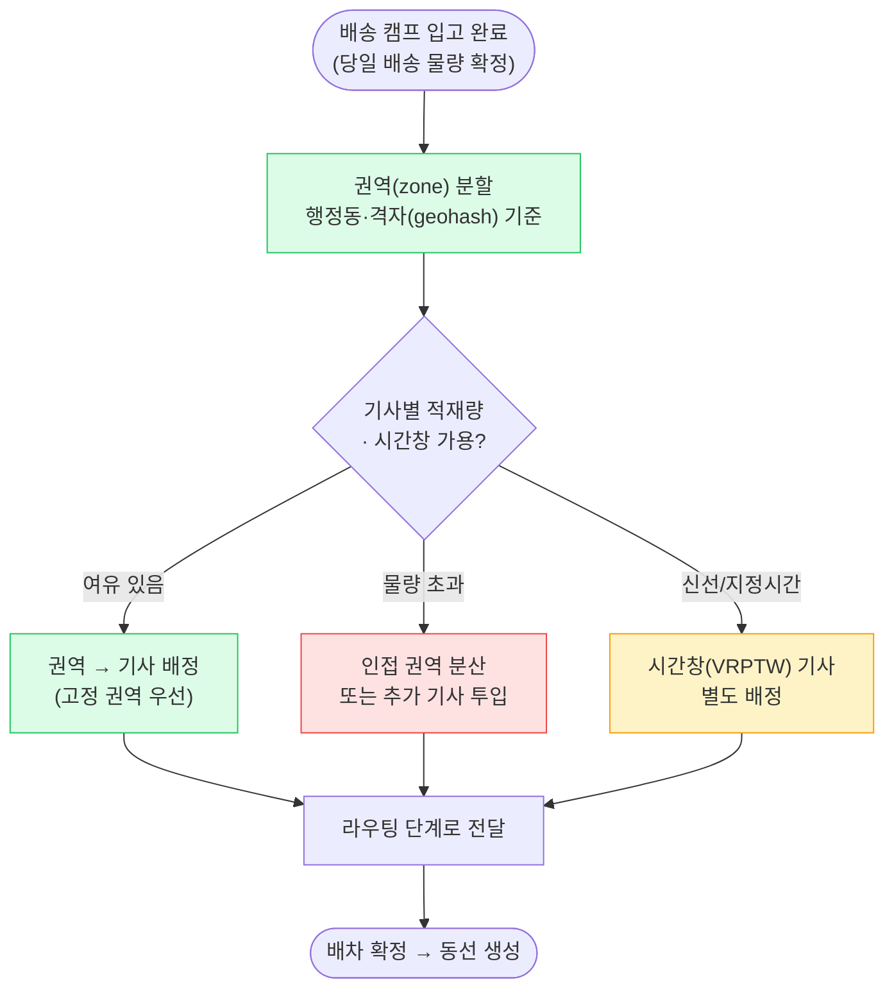
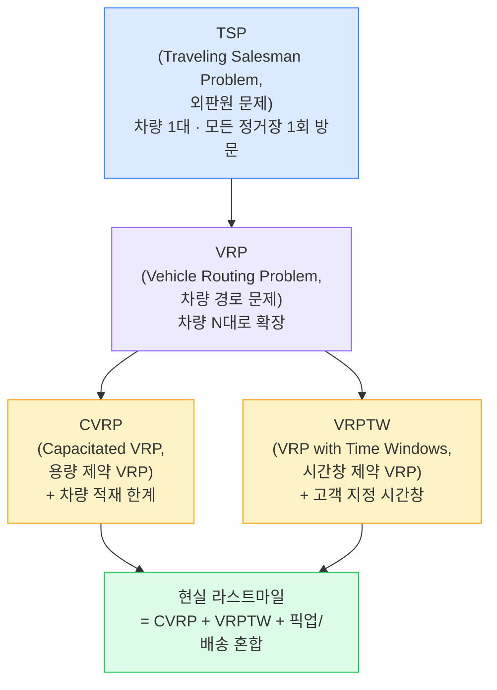
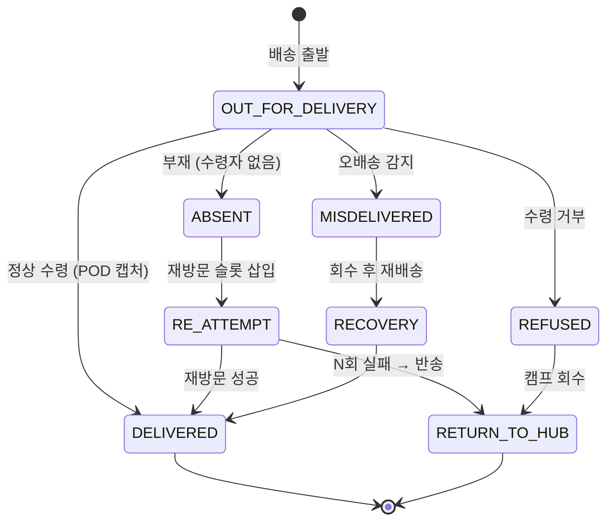

## 1. 라스트마일(Last-mile)이란 — 가장 비싸고 가장 눈에 띄는 구간

> **정의** — 라스트마일(Last-mile, 최종 배송 구간)은 *물류 허브·배송 캠프에서 최종 수령자(문 앞)까지*의 마지막 구간이다. 거리는 짧지만 전체 물류비의 *40~60%*를 차지하며, 고객 만족을 좌우하는 결정적 단계다.

장거리 간선(Line-haul)은 트럭 한 대에 수천 개 박스를 실어 규모의 경제가 나오지만, 라스트마일은 **한 정거장(stop)당 1~2개 화물**을 사람이 직접 배달해야 한다. 분모가 작아 단가가 폭증하는 구조다.

### 왜 라스트마일이 비싼가 — 정량 감각

- **비용 집중**: 전체 배송 원가의 **40~60%**가 마지막 구간에 몰린다. 거리는 전체의 1%인데 비용은 절반.
- **저밀도·고노동**: 도심 외곽·농어촌은 정거장 간 거리가 멀어 스톱당 주행 거리(km/stop)가 커지고, 정거장당 처리 시간(분/stop)도 길다.
- **최초 배송 성공률(First-Attempt Delivery Rate)**: 부재·주소 오류로 1회차 배송이 실패하면 재방문 비용이 발생한다. 업계 미흡 지역은 1차 성공률이 **80~90%** 수준이며, 5%p 개선이 곧 비용 절감으로 직결된다.

> **💡 정량 감각 — 밀도가 전부**
>
> 라스트마일의 효율은 **배송 밀도(stops/km²)** 에 좌우된다. 한 권역에 정거장이 촘촘하면 차량 1대가 하루 150~250 스톱을 처리하지만, 농어촌은 50~80 스톱에 그친다. 그래서 라스트마일 최적화의 본질은 "어떻게 밀도를 높이고 동선을 줄이느냐"다.

### 라스트마일의 4대 의사결정

| 단계 | 질문 | 핵심 기법 |
| --- | --- | --- |
| 배차(Dispatch) | "누가 이 화물을 맡나?" | 권역(zone) 배정, 적재량·시간창 매칭 |
| 라우팅(Routing) | "어떤 순서로 도나?" | VRP/TSP 최적화 (휴리스틱) |
| 재최적화(Re-opt) | "상황이 바뀌면?" | 증분 삽입, 동적 재계산 |
| 증빙(POD) | "진짜 전달됐나?" | 서명·사진·OTP, 시나리오 분기 |

## 2. 배차 (Dispatch) — 화물과 기사를 잇기

배차(Dispatch, 배송 기사 배정)는 "어떤 화물 묶음을 어떤 기사·차량에 할당할지" 결정하는 단계다. 라우팅(순서 최적화)의 앞단으로, 여기서 권역·적재량·시간창이 잘못 잡히면 아무리 좋은 라우팅도 무의미하다.



*배차 흐름 — 권역 분할 → 용량·시간창 검사 → 기사 배정. 라우팅의 전제 조건*

### 배차의 제약 변수

| 변수 | 설명 | Trade-off |
| --- | --- | --- |
| 권역(Zone) | 기사에게 할당되는 지리적 구역 | 고정 권역은 숙련도↑(주소 학습)지만 물량 변동 흡수 어려움 |
| 적재량(Capacity) | 차량 적재 부피·무게 한계 | 꽉 채우면 효율↑이나 추가 주문 삽입 여지↓ |
| 시간창(Time Window) | 고객 지정 시간·신선 SLA | 시간창 좁히면 만족↑이나 동선 자유도↓ → 비용↑ |
| 기사 가용성 | 근무 시간·휴식·숙련도 | 긱(gig) 기사는 유연하나 이탈·노쇼 리스크 |

> **🎯 면접 포인트 — 고정 권역 vs 동적 배차**
>
> "권역을 기사에게 고정할까, 매일 동적으로 배차할까?" → **고정 권역** 은 기사가 골목·수령자를 학습해 1차 성공률·속도가 오른다(CJ대한통운 택배기사 모델). **동적 배차** 는 물량 변동·피크에 유연하나 매번 낯선 동선이라 효율이 떨어진다. 실무는 **고정 권역을 베이스로 하되 피크에 동적 분산** 하는 하이브리드가 표준. 🔥(Deep-dive)

## 3. 라우팅 — TSP · VRP 그리고 NP-hard

라우팅(Routing, 경로 최적화)은 배차된 정거장들을 **어떤 순서로 방문해 총 비용(거리·시간)을 최소화**하는 문제다. 이 문제는 학문적으로 잘 정의된 최적화 문제 계층 위에 있다.



*라우팅 문제 계층 — TSP(차량 1대)에서 출발해 현실은 CVRP+VRPTW 복합*

### 왜 정답을 못 구하나 — NP-hard

TSP·VRP는 모두 **NP-hard** 문제다. 정거장 n개의 가능한 순서는 `(n-1)!/2`로 폭증해, 20개만 돼도 완전 탐색(brute-force)으로는 우주의 수명 안에 못 푼다. 따라서 현실은 **최적해 대신 "충분히 좋은 해"를 빠르게** 찾는다.

| 접근 | 방법 | 특징 · 도구 |
| --- | --- | --- |
| 정확해(Exact) | 분기한정(B&B), 정수계획법(MILP) | 최적 보장. 수십 노드까지만 현실적. `CPLEX`, `Gurobi` |
| 휴리스틱(Heuristic) | 최근접 이웃(Nearest Neighbor), Savings, 삽입법 | 빠르고 단순. 해 품질은 중간. 초기해 생성에 활용 |
| 메타휴리스틱(Metaheuristic) | 지역탐색(2-opt/Or-opt), 타부서치, 유전알고리즘, 담금질 | 품질↑ 시간↑. `OR-Tools`(구글), `LKH`(TSP 최강) |

> **⚠️ 실무 함정 — 직선거리 ≠ 실제 거리**
>
> 두 정거장 사이 비용을 **유클리드 직선거리** 로 계산하면 일방통행·강·고가도로를 무시해 엉뚱한 동선이 나온다. 반드시 **도로망 기반 거리/시간 행렬(distance/time matrix)** 을 OSRM·구글 Distance Matrix 등으로 미리 계산해 넣어야 한다. n개 정거장이면 `n²` 행렬이라 캐싱이 필수.

> **🎯 면접 포인트 — 목적함수가 비용을 정한다**
>
> "라우팅의 목적함수를 무엇으로 둘 것인가?" → 총 주행거리 최소화, 총 소요시간 최소화, 차량 수 최소화, 시간창 위반 페널티 최소화는 서로 충돌한다. 신선/새벽배송은 **시간창 준수** 가 우선이고, 일반 택배는 **총거리/차량수** 가 우선이다. 단일 목적이 아니라 **가중 다목적(weighted multi-objective)** 으로 푸는 게 현실. 🔥(Deep-dive)

## 4. 실시간 재최적화 (Dynamic Re-optimization)

배차·라우팅이 끝났다고 동선이 고정되지 않는다. 라스트마일은 **실행 중에 상황이 끊임없이 변한다**. 신규 주문이 들어오고, 교통·기상이 바뀌고, 기사가 이탈한다. 이를 반영해 동선을 다시 푸는 것이 실시간 재최적화다.

### 재최적화 트리거

- **신규 주문 삽입**: 즉시배송·퀵커머스는 배달 중에도 새 주문이 붙는다(주문 삽입, dynamic insertion).
- **교통·기상 변화**: 사고·정체·폭우로 ETA(Estimated Time of Arrival, 도착 예정 시각)가 흔들린다.
- **기사 이탈·지연**: 노쇼·차량 고장 → 남은 정거장을 인접 기사에게 재배차.
- **배송 실패**: 부재로 스킵 → 재방문 슬롯을 동선 뒤에 삽입.

```mermaid
sequenceDiagram
    participant C as 고객/주문
    participant DS as 배차 서비스
    participant OPT as 최적화 엔진
    participant R as 기사 앱
    participant ETA as ETA 서비스

    Note over R,ETA: 기사 위치 10초마다 스트리밍
    R->>ETA: GPS 위치 업데이트
    ETA-->>C: ETA 갱신 (실시간 트래킹)
    C->>DS: 신규 즉시배송 주문
    DS->>OPT: 현재 동선에 삽입 요청
    OPT->>OPT: 증분 삽입(cheapest insertion)\n+ 국소 2-opt
    OPT-->>DS: 갱신된 동선
    DS->>R: 다음 정거장 재지시(push)
    Note over OPT: 전체 재계산은 비용 큼 →\n증분 우선, 임계 초과 시 전체 재계산
```

*실시간 재최적화 흐름 — 위치 스트리밍 + 신규 주문 증분 삽입 + 기사 앱 푸시*

### 전체 재계산 vs 증분 재최적화 Trade-off

| 관점 | 전체 재계산 (Full re-solve) | 증분 재최적화 (Incremental) |
| --- | --- | --- |
| 해 품질 | 높음 (전역 최적에 근접) | 중간 (국소 개선 위주) |
| 응답 지연 | 큼 (수백 ms~초, 정거장 많을수록↑) | 작음 (수~수십 ms, 즉시 반영) |
| 안정성(동선 흔들림) | 낮음 — 기사 동선이 매번 출렁여 혼란 | 높음 — 기존 동선 유지 + 끼워넣기 |
| 적합 상황 | 일배치 사전 계획, 대량 변경 | 운행 중 실시간 주문 삽입 |

> **💡 실무 팁 — 안정성도 목적함수다**
>
> 매번 전체 재계산하면 이론상 최적이지만 **기사 동선이 계속 바뀌어** 현장 혼란과 신뢰 하락을 부른다. 그래서 "기존 동선과의 변경 최소화(solution stability)"를 페널티로 목적함수에 넣는다. 증분 삽입을 기본으로 하고, 누적 열화가 임계치를 넘으면 그때 전체 재계산하는 하이브리드가 표준.

## 5. POD(배송 증빙) · 배송 시나리오 처리

POD(Proof of Delivery, 배송 증빙)는 "이 화물이 정말 수령자에게 전달됐다"를 증명하는 데이터다. 분쟁·정산·CS의 근거가 되며, 비대면 시대에는 **문 앞 사진 + 위치 좌표**가 사실상 표준이 됐다.

### POD 증빙 수단

| 수단 | 설명 | 적합 상황 |
| --- | --- | --- |
| 전자서명 | 수령자 서명 캡처 | 대면 수령, B2B 인수 |
| 배송 사진 | 문 앞 놓고 위치 포함 촬영 | 비대면 문 앞 배송(쿠팡친구 표준) |
| OTP/인증번호 | 수령자 본인 확인 | 고가품·주류·본인인증 필수 품목 |
| GPS 좌표·타임스탬프 | 완료 시점 위치·시각 기록 | 모든 배송 공통 메타데이터 |

### 배송 시나리오 상태 전이



*배송 시나리오 상태 머신 — 정상/부재/수령거부/오배송 분기와 보상 흐름*

> **⚠️ 실무 함정 — 시나리오별 후속 처리**
>
> **부재(ABSENT)** 는 재방문 또는 무인보관함(택배함)·경비실 위탁으로 분기되고, **수령 거부(REFUSED)** 는 즉시 반품(Returns) 프로세스로 넘어가며, **오배송(MISDELIVERED)** 은 회수+재배송 보상 트랜잭션과 CS 보상이 따른다. "DELIVERED 하나로 끝"이라고 모델링하면 분쟁·정산이 무너진다. POD는 단순 플래그가 아니라 **각 시나리오의 증거 패키지** 다.

> **🎯 면접 포인트 — POD의 신뢰성**
>
> "문 앞 배송 사진을 POD로 쓸 때 위변조·분쟁은?" → 사진에 **서버 타임스탬프 + GPS 좌표 + 주문ID 워터마크** 를 박고, 원본은 변경 불가 저장소(WORM, append-only)에 보관한다. 기사 앱에서 임의 갤러리 업로드를 막고 **인앱 카메라만 허용** 해야 신뢰성이 선다. 🔥(Deep-dive)

## 6. 사례 비교 — 라스트마일 운영 모델

| 사례 | 운영 모델 | 라스트마일 특징 |
| --- | --- | --- |
| **쿠팡 쿠팡친구** | 직고용 배송기사 + 자체 캠프 | 실시간 위치 트래킹·ETA 노출, 문 앞 배송 사진 POD 표준, 고정 권역 기반 고밀도 배송 |
| **배민 B마트** | 긱(gig) 라이더 + 도심 MFC(마이크로 풀필먼트) | 즉시배송(30분~1시간), 주문 즉시 동적 배차·실시간 삽입, 시간창이 매우 좁음 |
| **Amazon** | DSP(배송 파트너) + Amazon Flex 긱 | 라우팅 SW로 사전 동선 최적화, Rufus/지도 앱 연동, 사진 POD + 배송 위치 안내 |
| **CJ대한통운** | 택배기사 위탁 + 서브터미널 | 고정 권역·구역 책임제, 기사 주소 학습으로 1차 성공률↑, 무인택배함 연계 |

> **💡 정량 감각 — 모델별 밀도/속도**
>
> 쿠팡친구·CJ 택배 같은 **고밀도 일배송** 은 차량 1대가 하루 150~250 스톱을 도는 반면, 배민 B마트 같은 **즉시배송** 은 라이더 1명이 동시에 1~3건만 묶어(번들) 30분 내 완료를 목표로 한다. 전자는 *총거리 최소화* , 후자는 *건당 시간(시간창) 최소화* 가 목적함수다.

## 7. 백엔드 시스템 디자인 연결

라스트마일은 **수천만 건/일의 위치·상태 이벤트**가 발생하는 고처리량 도메인이다. 기사 위치를 10초마다 받으면 **10만 명 × (86,400초 / 10초) ≈ 8.6억 건/일**, 초당으로는 **약 1만 QPS(Queries Per Second, 초당 쿼리 수)** 수준의 쓰기가 상시 발생한다. 여기에 배송 상태(TrackingEvent) 이벤트가 더해져 팬아웃(fan-out)이 폭증한다.

| 라스트마일 이슈 | 설계 패턴 | 이유 · 정량 |
| --- | --- | --- |
| 위치·상태 이벤트 수천만/일 | **Kafka 이벤트 스트림 + Fan-out** | 트래킹·ETA·정산 컨슈머로 분배. ~1만 QPS 쓰기 흡수, 백프레셔 완충 |
| DB 변경의 이벤트 발행 신뢰성 | **CDC(Change Data Capture) / Outbox** | 배송 상태 커밋과 이벤트 발행의 원자성, 유실 방지 |
| 실시간 위치 트래킹 노출 | **위치 스트리밍(WebSocket/SSE) + 인메모리 캐시** | 10초 위치 업데이트를 Redis/지리 인덱스에 적재, 조회는 캐시에서 |
| 트래킹 화면 조회 폭주 | **최종 일관성(Eventual Consistency) 읽기 모델** | 위치/ETA는 강한 일관성 불필요 → 약간의 지연 허용으로 처리량 확보 |
| ETA 예측 정확도 | **ETA ML 모델 (교통·과거 배송 기반)** | 직선거리 ETA 대신 학습 기반 예측으로 정확도↑, 1차 성공률 개선 |
| 운행 중 동적 재배차 | **비동기 최적화 워커 + 증분 재계산** | 전체 재계산은 무거움 → 증분 우선, 동선 안정성 페널티 포함 |

> **🎯 면접 정리 — 한 문장**
>
> "라스트마일은 **배차(권역·용량·시간창)** 로 화물을 기사에 잇고, **NP-hard 라우팅을 휴리스틱(OR-Tools/LKH)** 으로 풀며, **증분 재최적화** 로 실시간 변화를 흡수하고, **POD(사진+GPS)** 로 증빙하는데, 백엔드는 약 **1만 QPS의 위치 이벤트를 Kafka·CDC·최종 일관성 읽기 모델** 로 처리한다."
