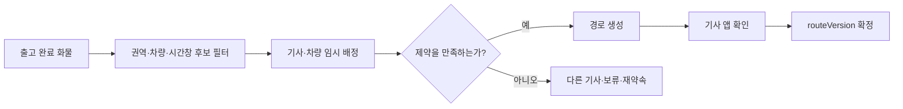
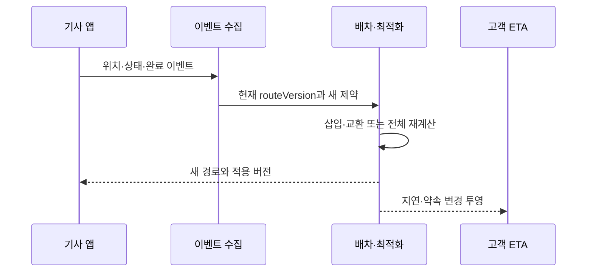
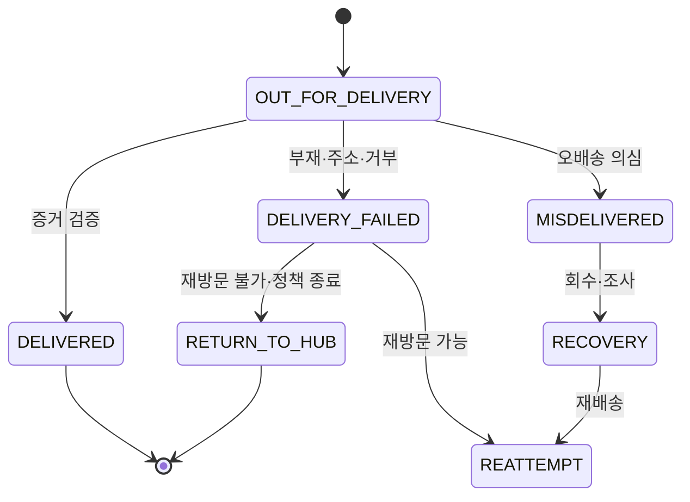

## 1. 라스트마일의 비용 구조를 어떻게 설명할까

라스트마일은 허브·배송 캠프·지역 터미널에서 최종 수령지까지 화물을 전달하는 구간이다. 거리만으로 비용을 설명하면 부족하다. 배송지의 밀도, 정차마다 걸리는 서비스 시간, 차량·기사의 근무 제약, 시간창, 실패 재방문, 반품 회수와 같은 요소가 함께 비용을 만든다.

“전체 물류비의 40~60%” 같은 비율은 국가·상품·운송 범위·비용 분모에 따라 달라지는 업계 주장이다. 출처와 분모가 없는 상태에서 이 카드를 일반 상수로 사용하지 않는다. 대신 다음 지표의 정의와 측정 기간을 먼저 고정한다.

| 지표 | 의미 | 주의할 점 |
| --- | --- | --- |
| 배송 밀도 | 일정 권역의 배송 정차 수를 면적·주행 거리·근무 시간 중 하나로 나눈 값 | 분모가 stops/km²인지 stops/route-hour인지 구분 |
| 정차 서비스 시간 | 주차·출입·인수·사진·실패 처리에 쓰는 시간 | 이동 시간과 섞으면 병목을 숨김 |
| 1차 배송 성공률 | 첫 방문에서 성공한 배송 건수 / 첫 방문 시도 건수 | 취소·주소 오류·수령 거부를 분모에서 임의로 빼지 않음 |
| 경로당 원가 | 기사·차량·운송·재방문·CS 비용 / 완료된 배송 단위 | 주문·화물·배송 라인의 단위를 고정 |

밀도가 높아지면 같은 이동으로 더 많은 정차를 처리할 가능성이 커지지만, 주차·엘리베이터·수령 확인 때문에 정차 수가 늘어도 시간이 선형으로 줄지는 않는다. 최적화 목표는 총거리 하나가 아니라 약속 준수, 안전, 기사 근무, 재방문 비용을 포함한 정책 함수다.

## 2. 배차 — 화물과 기사·차량을 연결하기

배차는 화물 또는 배송 라인을 기사·차량·출발지에 연결하는 결정이다. 라우팅은 연결된 정차의 순서를 정하는 단계이므로 먼저 다음 제약을 확정한다.

| 제약 | 확인할 값 |
| --- | --- |
| 차량 | 중량·부피·온도대·위험물·적재 순서 |
| 기사 | 근무 시작·종료, 휴게, 출발·복귀 위치, 자격 |
| 고객 | 배송 시간창, 부재 정책, 인수 방식 |
| 네트워크 | 통행 제한, 캠프 마감, 운송사 계약, 재방문 |
| 업무 | 픽업 선행, 배송 우선순위, 교환·회수 동시 처리 |

고정 권역은 주소와 건물 접근 지식을 쌓기 쉽지만 물량 변동을 흡수하기 어렵다. 동적 배차는 잔여 용량을 유연하게 사용할 수 있지만, 재배정 비용과 기사 앱의 변경 수용 절차가 필요하다. 어느 방식이 “표준”이라고 단정하지 말고, 재배정 빈도·성공률·근무시간 위반·현장 확인 시간을 비교한다.


```mermaid
flowchart LR
    Orders["출고 완료 화물"] --> Filter["권역·차량·시간창 후보 필터"]
    Filter --> Assign["기사·차량 임시 배정"]
    Assign --> Feasible{"제약을 만족하는가?"}
    Feasible -->|예| Route["경로 생성"]
    Feasible -->|아니오| Fallback["다른 기사·보류·재약속"]
    Route --> Ack["기사 앱 확인"]
    Ack --> Version["routeVersion 확정"]
```

임시 배정과 확정을 분리하면 최적화 결과를 계산하는 동안 차량이 다른 주문에 배정되는 경합을 다룰 수 있다. 기사 앱이 이전 routeVersion을 확인한 뒤 늦게 도착한 결과는 덮어쓰지 않고 재계산 또는 운영자 확인으로 보낸다.

## 3. TSP·VRP·CVRP·VRPTW

TSP는 한 차량이 출발지로 돌아오거나 정해진 종점에 도착하면서 여러 정차를 방문하는 순서를 찾는 모델이다. VRP는 여러 차량과 출발지를 다루는 일반화이며, CVRP는 차량 용량을, VRPTW는 정차별 방문 시간창을 추가한다. 실제 배송은 픽업·배송 선행, 여러 상품 단위, 휴게·운전자격, 다중 온도대까지 더할 수 있다.

[Google OR-Tools의 공식 Vehicle Routing 문서](https://developers.google.com/optimization/routing)는 TSP, 용량 제약 VRP, 시간창 VRP와 자원 제약을 각각 설명한다. 정차 수와 제약이 커지면 가능한 경로를 모두 비교하는 방식은 현실적인 시간 안에 최적해를 찾기 어렵다. OR-Tools 문서도 큰 VRP에서 최적해가 아니라 시간 제한 안의 좋은 해를 반환할 수 있다고 명시한다.

| 접근 | 쓰임 | 검증할 것 |
| --- | --- | --- |
| 정확해·정수계획 | 작은 문제, 기준선, 비용 민감한 배치 | 계산 시간과 최적성 증명 범위 |
| 휴리스틱 | 삽입·절약·최근접 등 빠른 초기해 | 제약 위반 여부와 해 품질 |
| 국소·메타휴리스틱 | 2-opt, 교환, 재배치로 초기해 개선 | 시간 예산, 재현성, 안정성 |
| 제한 시간 최적화 | 운행 중 재계산 | 현재 경로 유지와 변경 범위 |

거리 행렬은 위도·경도 직선거리로 대체하면 안 된다. 도로 방향, 통행 제한, 교통, 차량 종류에 따라 시간이 달라지기 때문이다. [Google Routes API의 Compute Route Matrix](https://developers.google.com/maps/documentation/routes/compute_route_matrix)는 여러 출발지·도착지 조합의 거리와 시간을 계산하는 공식 API 예다. 이 API의 요소 수 제한과 과금·쿼터는 시스템 규모와 비용 계획에 포함해야 하며, 무료·자체 운영을 목표로 한다면 사전 계산된 도로망이나 다른 공급자를 비교한다.

## 4. 운행 중 재최적화

운행 중에는 신규 주문, 교통 변화, 기사 이탈, 배송 실패, 회수 추가가 발생한다. 전체 경로를 다시 풀면 전역 품질을 회복할 여지가 있지만 이미 기사에게 전달한 순서가 크게 바뀐다. 증분 삽입은 현재 경로를 보존하면서 일부 정차를 추가하지만 누적된 비효율을 놓칠 수 있다.


```mermaid
sequenceDiagram
    participant App as 기사 앱
    participant Ingest as 이벤트 수집
    participant Planner as 배차·최적화
    participant Read as 고객 ETA

    App->>Ingest: 위치·상태·완료 이벤트
    Ingest->>Planner: 현재 routeVersion과 새 제약
    Planner->>Planner: 삽입·교환 또는 전체 재계산
    Planner-->>App: 새 경로와 적용 버전
    Planner-->>Read: 지연·약속 변경 투영
```

| 상황 | 먼저 시도할 방법 | 실패 시 처리 |
| --- | --- | --- |
| 한 건의 신규 주문 | 가능한 위치에 삽입하고 시간창 재검증 | 불가능하면 다른 기사·다음 슬롯·거절 |
| 교통 지연 | 남은 정차의 ETA만 갱신 | 약속 위반 예상 시 재배차·고객 알림 |
| 기사 이탈 | 미완료 정차를 후보 기사에 재할당 | 용량 부족이면 보류·운영자 결정 |
| 경로 열화 누적 | 전체 재계산을 별도 워커에서 시도 | 제한 시간 초과 시 기존 경로 유지 |

응답 시간의 “수십 ms”나 “수백 ms”를 일반값으로 쓰지 않는다. 정차 수, 거리 행렬 캐시, 최적화 시간 제한, 네트워크 왕복, 결과 승인 절차를 실제 데이터로 측정한다. 동선 변경 최소화도 목적 함수의 한 항으로 넣고, 재계산 결과에는 적용 전 routeVersion과 새 routeVersion을 기록한다.

## 5. POD와 배송 실패 상태

POD(Proof of Delivery)는 배송 완료를 주장할 때 조회할 수 있는 증거 묶음이다. 상품·계약·배송 방식에 따라 서명, 수령자 또는 대리 수령자, 배송 시각·위치, 사진, OTP, 운송장과 같은 필드가 달라진다. 모든 배송에 사진·GPS·서명이 존재한다고 가정하지 않는다.

[USPS의 공식 POD 설명](https://faq.usps.com/articles/Knowledge/What-is-Proof-of-Delivery)은 적용 가능한 서비스에서 배송 정보, 수령자 이름, 운송장, 서명 이미지와 배송 위치 정보를 제공할 수 있다고 설명한다. [DHL의 공식 Tracking API 문서](https://developer.dhl.com/tracking?language_content_entity=de)는 디지털 서명이 캡처된 경우 전자 POD에서 배송 상세와 서명 이미지를 조회할 수 있다고 설명한다. 이 자료들은 POD의 가능한 필드를 보여주며, 사업자별 보존 기간·수집 의무를 정하지 않는다.


```mermaid
stateDiagram-v2
    [*] --> OUT_FOR_DELIVERY
    OUT_FOR_DELIVERY --> DELIVERED : 증거 검증
    OUT_FOR_DELIVERY --> DELIVERY_FAILED : 부재·주소·거부
    OUT_FOR_DELIVERY --> MISDELIVERED : 오배송 의심
    DELIVERY_FAILED --> REATTEMPT : 재방문 가능
    DELIVERY_FAILED --> RETURN_TO_HUB : 재방문 불가·정책 종료
    MISDELIVERED --> RECOVERY : 회수·조사
    RECOVERY --> REATTEMPT : 재배송
    DELIVERED --> [*]
    RETURN_TO_HUB --> [*]
```

POD는 단일 boolean보다 다음처럼 원본과 판정 결과를 나누는 편이 안전하다.

| 데이터 | 역할 |
| --- | --- |
| 원본 이벤트 | 기사 앱·스캐너가 보낸 사건과 발생 시각 |
| 증거 객체 | 서명·사진·OTP·위치 등 실제 첨부와 접근 권한 |
| 판정 | 배송 완료·실패·오배송 조사 상태 |
| 감사 정보 | 누가 언제 어떤 근거로 상태를 바꿨는지 |

사진을 WORM 저장소에 보관하거나 앱 카메라만 허용하는 것은 가능한 통제안이다. 법적 증거 효력을 자동으로 보장하는 규칙은 아니므로 보존기간, 개인정보 접근, 위변조 탐지, 삭제 요청 정책을 별도로 정한다.

## 6. 위치 이벤트와 백엔드

위치 이벤트 처리량은 운영 숫자를 먼저 정하지 말고 기사 수와 수집 주기로 계산한다.

```text
초당 입력량 = 활성 기사 수 × 기사당 위치 이벤트 빈도(초당)
일일 입력량 = 초당 입력량 × 운영 초
```

예를 들어 100명의 기사가 10초마다 한 번씩 위치를 보낸다는 **가정**은 초당 10건이다. 1만 QPS가 필요하다는 질문의 수치는 기사 수·주기·상태 이벤트·재전송을 구체화한 뒤 검증할 부하 목표이지 라스트마일의 보편 사실이 아니다.

[Apache Kafka의 메시지 전달 의미 문서](https://kafka.apache.org/40/design/design/)는 at-most-once, at-least-once, exactly-once를 producer와 consumer의 서로 다른 문제로 나눈다. Kafka producer idempotence는 producer 재시도로 인한 로그 중복을 줄이지만, 외부 데이터베이스에 쓰는 부작용의 멱등성을 대신하지 않는다.

| 이슈 | 설계 예 | 경계 |
| --- | --- | --- |
| 최신 위치 조회 | 짧은 TTL 캐시·지리 인덱스·최신 상태 투영 | 원본 이벤트 보존과 분리 |
| 배송 상태 이력 | 불변 eventId 원장 + 멱등 consumer | 늦은 이벤트와 정정 규칙 필요 |
| 고객 ETA | 지연을 허용하는 읽기 모델 | 약속 변경 알림과 원본 계산 분리 |
| 재계산 요청 | 비동기 worker + routeVersion | 취소·중복·오래된 결과 폐기 |
| 외부 운송사 연동 | outbox·재시도·대사 | 전송 성공과 실제 인수는 다름 |

```json
{
  "eventId": "pos-2026-09-27-0001",
  "driverId": "D-17",
  "routeVersion": 31,
  "latitude": 37.5665,
  "longitude": 126.9780,
  "occurredAt": "2026-09-27T04:10:11Z",
  "receivedAt": "2026-09-27T04:10:12Z"
}
```

### 면접에서 답할 때

먼저 배차가 기사·차량·화물을 연결하고, 라우팅이 방문 순서를 정한다는 경계를 말한다. 다음으로 TSP·VRP·용량·시간창 제약을 구분하고, 최적화 결과의 시간 제한과 fallback을 설명한다. 운행 중에는 routeVersion과 기사 확인을 두어 오래된 계산 결과가 현재 경로를 덮지 않게 한다. 마지막으로 위치 이벤트의 입력량을 파라미터로 계산하고, Kafka·캐시·외부 DB의 전달 보장을 각각 설명한다.

> **검수 경계** — 경로 최적화의 목적 함수와 위치 이벤트 입력량은 운영 데이터·계약에 따라 달라진다. 제시한 수치가 측정 결과인지 가상 요구인지 밝히고, 시간창 위반과 배송 실패를 비용 절감보다 먼저 검증한다.

## 참고 자료

- [Google OR-Tools — Vehicle Routing](https://developers.google.com/optimization/routing)
- [Google OR-Tools — VRP with Time Windows](https://developers.google.com/optimization/routing/vrptw)
- [Google Maps Routes API — Compute Route Matrix](https://developers.google.com/maps/documentation/routes/compute_route_matrix)
- [Apache Kafka — Message Delivery Semantics](https://kafka.apache.org/40/design/design/)
- [USPS — What is Proof of Delivery?](https://faq.usps.com/articles/Knowledge/What-is-Proof-of-Delivery)
- [DHL — Shipment Tracking and Electronic Proof of Delivery](https://developer.dhl.com/tracking?language_content_entity=de)
