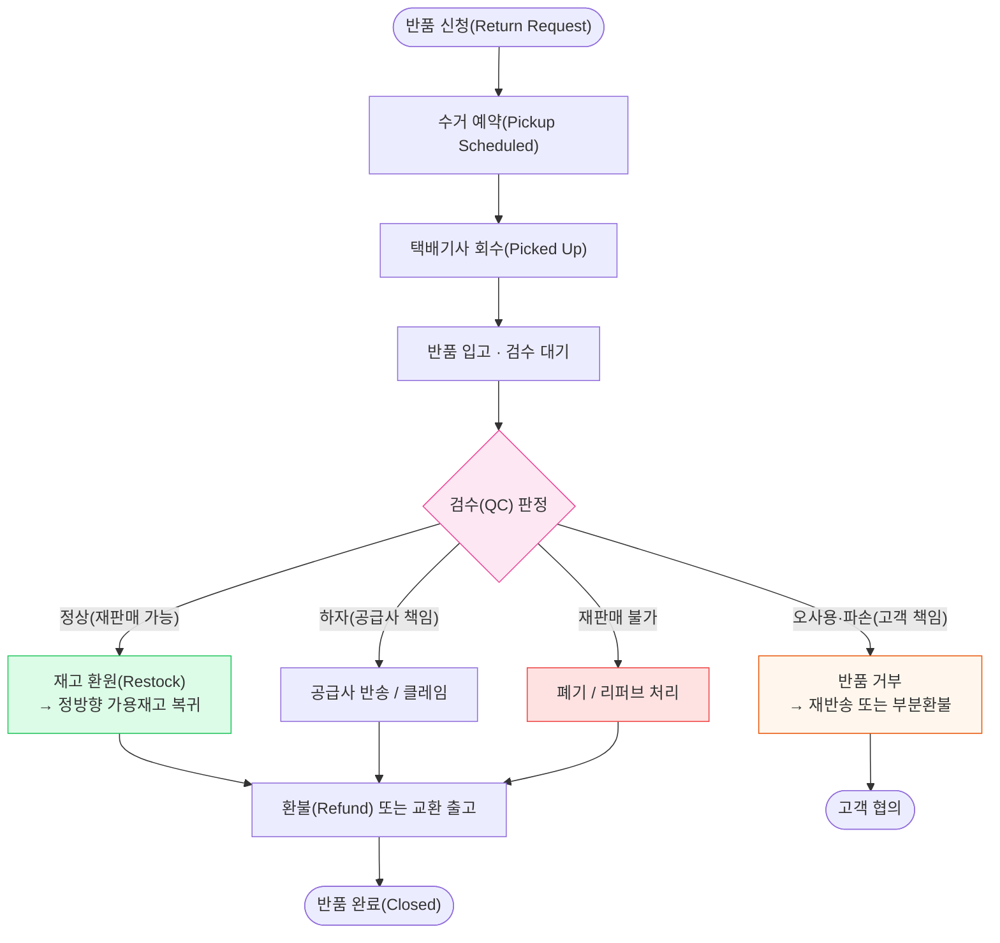
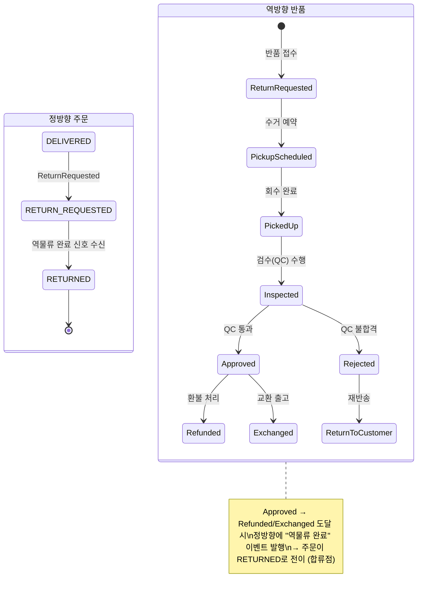
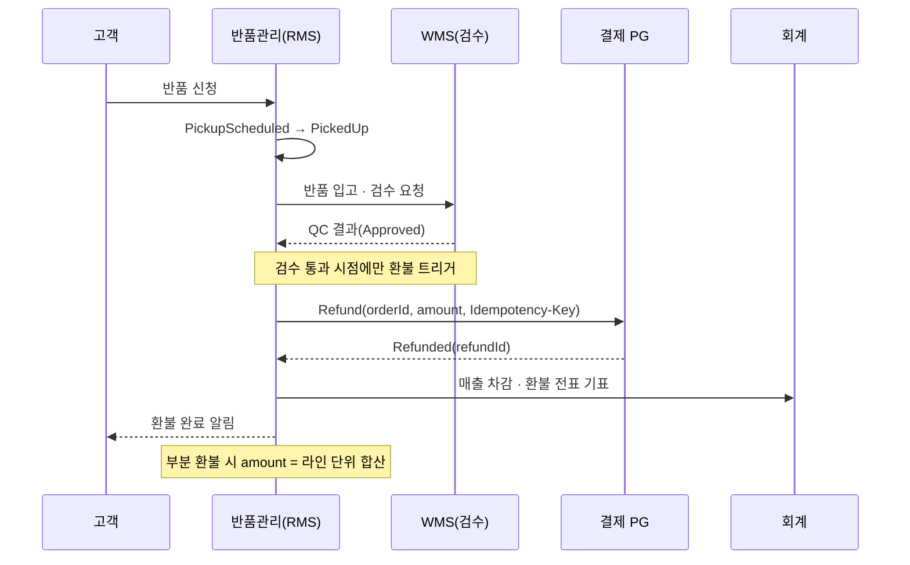

## 1. 역물류(Reverse Logistics) 개념과 반품률 KPI

> **핵심 책임** — 고객이 받은 상품을 *거꾸로 회수·검수·재처리*하는 흐름. 정방향(Forward)과 별도의 비용·상태·재고 모델이 필요하다.

Reverse Logistics(역물류)는 정방향 물류(창고 → 고객)와 반대로 **고객 → 창고로 상품이 거꾸로 흐르는 모든 과정**을 말한다. 크게 세 갈래다.

- **반품(Return)**: 단순 변심·하자로 상품을 돌려받고 환불.
- **교환(Exchange)**: 다른 옵션(사이즈/색상)·신품으로 맞교환. 회수 + 신규 출고가 합쳐짐.
- **회수(Recall/Pickup)**: 리콜·오배송 등으로 능동적으로 거둬들임.

### 왜 정방향과 별도 최적화가 필요한가

| 관점 | 정방향(Forward) | 역방향(Reverse) |
| --- | --- | --- |
| 흐름 방향 | 창고 → 고객 (예측 가능) | 고객 → 창고 (산발적·예측 난해) |
| 상품 상태 | 신품 단일 상태 | 정상/하자/오사용 등 **품질 불확실** |
| 핵심 작업 | 피킹·패킹·출고 | **검수(QC)**·등급 분류·재처리 판정 |
| 재고 처리 | 차감(Deduct) | 조건부 환원(Restock) 또는 폐기 |
| 비용 구조 | 건당 표준화 | 건별 편차 큼(검수 인건비·재포장) |

> **💡 정량 감각 — 반품률 KPI**
>
> 반품률(Return Rate)은 업종별 편차가 크다. 일반 이커머스 **5~10%** , **의류·패션은 20~30%** (사이즈 미스). 반대로 식품(컬리 등)은 신선·소비재 특성상 **1~3%** 로 낮다. 핵심 보조 지표: 재판매 가능률(Restock Rate, 검수 통과 비율), 역물류 처리 리드타임(반품 신청 → 환불 완료까지 일수).

## 2. 반품 전체 흐름 — 신청부터 재처리까지

반품 신청(Return Request)에서 시작해 수거(Pickup) → 검수(QC) → 분기(환불/교환/재판매/폐기)로 갈라진다. 검수 결과가 모든 후속 분기의 **관문(Gate)**이다.

*반품 흐름 분기 — 검수(QC) 판정이 재고 환원·환불·폐기를 가르는 단일 관문*

> **💡 핵심 — 검수가 게이트**
>
> 정방향에서 "출고"가 비가역적이듯, 역방향에서는 **검수 통과 여부** 가 재고 환원·환불·재판매의 모든 분기를 결정한다. 검수 전에 재고를 가용 상태로 올리거나 환불을 확정하면 손실·정합성 오류로 직결된다.

## 3. 반품 상태 머신 — 정·역방향 상태 합류 지점

반품도 주문과 마찬가지로 **Enum + 명시적 전이**로 상태를 강제한다. 중요한 것은 정방향 주문의 `RETURNED` 상태와 역방향 반품 상태 머신이 **어디서 합류(Join)하는가**이다.

*정방향 주문 상태와 역방향 반품 상태 머신 — 역방향이 Approved→Refunded에 도달하면 정방향 RETURNED로 합류*

> **🎯 면접 포인트 — 상태 합류(Join)**
>
> "주문 상태와 반품 상태를 한 Enum에 다 넣어도 되나?" → No. 정방향 라이프사이클과 역방향 라이프사이클은 **별도 Aggregate(집합체)** 로 분리하고, 역방향이 종결될 때 **도메인 이벤트(`ReturnCompleted`)** 를 발행해 정방향 주문을 `RETURNED` 로 전이시킨다. 두 머신을 이벤트로 느슨하게 연결하는 것이 합류 지점이다. 🔥(Deep-dive)

### 왜 별도 상태 머신으로 분리하나

- **생명주기 차이**: 한 주문에 반품이 여러 번(라인별·부분) 걸릴 수 있어 1:N. 주문 헤더 상태로는 표현 불가.
- **합류 시점 명시**: `Approved → Refunded` 도달이라는 단일 지점에서만 정방향을 건드림 → 상태 꼬임 방지.
- **멱등성**: `ReturnCompleted` 이벤트가 재전송돼도 주문은 한 번만 `RETURNED`로 전이.

## 4. 검수(QC, Quality Check) — 상태 분류와 재고 환원

QC(Quality Check, 품질 검수)는 회수된 상품을 등급으로 분류하고, **재판매(Restock) 가능 여부와 재고 환원 시점**을 결정하는 핵심 단계다.

| QC 분류 | 판정 기준 | 재판매 가능? | 재고 환원(Restock) 처리 | 환불 방향 |
| --- | --- | --- | --- | --- |
| **정상(Good)** | 미개봉·신품 동등 | 가능 | 가용재고로 즉시 환원 | 전액 환불 |
| **경미 하자(Minor)** | 개봉·전시급 | 리퍼브 채널 한정 | 별도 리퍼브 재고로 환원 | 전액 환불 |
| **공급사 하자(Defective)** | 제조 결함 | 불가(공급사 반송) | 환원 안 함, 공급사 클레임 | 전액 환불 |
| **고객 오사용(Damaged)** | 사용 흔적·파손 | 불가 | 환원 안 함, 폐기 | 부분 환불 또는 거부 |

> **⚠️ 실무 함정 — 재고 환원 시점**
>
> 재고를 **"반품 입고 시점"이 아니라 "QC 통과 시점"** 에 가용재고로 올려야 한다. 입고 즉시 환원하면, 검수에서 하자로 걸러질 상품이 정방향 판매재고에 섞여 **불량품 재출고** 가 발생한다. 환원 전까지는 `RETURN_INSPECTING` 같은 별도 보류 재고 상태로 격리한다.

> **💡 정량 감각 — 재판매율**
>
> QC 통과 후 정상 등급으로 가용재고에 복귀하는 비율(Restock Rate)은 단순 변심 반품 위주면 **70~85%** , 의류 패션은 포장 훼손 탓에 **60% 안팎** 까지 떨어진다. 재판매율 1%p 차이가 마진에 직결되므로 검수 정확도와 재포장 품질이 핵심 KPI다.

## 5. 환불 흐름 — 타이밍 Trade-off와 회계 처리

환불(Refund)은 결제 PG(Payment Gateway)와 회계 시스템에 동시에 영향을 준다. 핵심 설계 결정은 **"언제 환불할 것인가"** — 회수 즉시(선환불) vs 검수 통과 후(검수후환불)이다.

*검수후환불 시퀀스 — QC Approved 이후에만 PG Refund 호출, 멱등키로 중복 환불 차단*

### 선환불 vs 검수후환불 Trade-off

| 관점 | 선환불 (회수 즉시) | 검수후환불 (QC 통과 후) |
| --- | --- | --- |
| 고객 경험(CX) | 빠른 환불 → 만족도↑ | 지연(2~5일) → 불만 가능 |
| 손실 리스크 | 하자·오사용도 선환불 → 환수 어려움 | QC로 걸러내 손실 최소화 |
| 회계 처리 | 환불 후 검수 → 충당금·역분개 복잡 | 확정 후 1회 기표 → 단순 |
| 적합 상황 | 저가·신뢰고객·단순변심 위주(쿠팡 즉시환불) | 고가·하자 빈번·B2B |

> **🎯 면접 포인트 — 부분 환불 & 회계 시점**
>
> "라인 3개 중 1개만 반품 승인"이면 환불액은 라인 단위로 합산하고, 쿠폰·배송비 안분(按分)까지 계산해야 한다. 회계상 **매출 인식 시점과 환불 인식 시점의 정합** 이 중요 — 환불 전표가 원주문과 1:N로 연결돼야 정산·세금계산서 정정이 맞는다. 🔥(Deep-dive)

## 6. 엣지 케이스 — 역물류 특유의 함정

> **⚠️ 회수 중 분실 · 파손**
>
> 택배기사 회수 후 입고 전 상품이 **분실·파손** 되면 책임 귀속이 모호하다. `PickedUp` 상태에서 일정 SLA 내 입고 스캔이 없으면 **"운송 중 분실" 보상 흐름** 으로 자동 전이시켜야 한다. 고객에겐 책임 없음 → 선환불 처리, 손실은 운송사 클레임으로 회수.

> **⚠️ 교환 시 신규 출고와의 합류**
>
> 교환(Exchange)은 **역방향 회수 + 정방향 신규 출고** 가 한 트랜잭션에 묶인다. "신상품을 먼저 보낼까(선출고), 회수 후 보낼까(후출고)?"가 핵심. 선출고는 CX는 좋지만 회수 미반환 시 이중 손실. 두 흐름을 **별도 Shipment로 추적하되 하나의 ExchangeCase로 묶어** 상태를 동기화해야 한다.

> **⚠️ 재고 환원 타이밍 오류**
>
> QC 통과 전 재고를 환원하면 불량 재출고, 너무 늦게 환원하면 가용재고 누락으로 판매 기회 손실. **"보류 재고(RETURN_INSPECTING) → QC 통과 시 가용 전환"** 의 2단계 상태를 두고, 환원 이벤트를 **멱등(Idempotent)** 하게 처리해 중복 가산을 막아야 한다.

## 7. 사례 비교 — 정책별 역물류

| 사례 | 역물류 특징 | 핵심 정책 |
| --- | --- | --- |
| **쿠팡** | 배송 기사가 출고와 동시에 반품을 **같은 동선에서 수거** | 회수-입고 동선 통합으로 역물류 리드타임 단축, 단순변심 즉시환불로 CX 우선 |
| **컬리(샛별배송)** | 신선식품 → 반품률 자체가 낮음(1~3%) | 품질 이슈는 재판매 불가 → 폐기·전액환불, 재고 환원보다 즉시 보상 중심 |
| **일반 이커머스(의류)** | 반품률 높음(20~30%), 검수 부하 큼 | 검수후환불 + 등급 분류 + 리퍼브 채널 운영, 재판매율 관리가 마진 핵심 |

> **💡 쿠팡의 동선 통합 효과**
>
> "배송 나간 기사가 그 권역의 반품을 같이 거둬온다"는 구조는 별도 회수 차량을 띄우지 않아 **역물류 운송비를 사실상 한계비용 0에 수렴** 시키고, 회수 → 입고 리드타임을 1~2일 단축한다. 정방향 라우팅 인프라를 역방향에 재사용하는 전형적 시너지.

## 8. 백엔드 시스템 디자인 연결

| 역물류 이슈 | 설계 패턴 | 이유 |
| --- | --- | --- |
| 정·역 상태 머신 합류 | **별도 Aggregate + 도메인 이벤트** | 역방향 종결 시 `ReturnCompleted` 발행 → 정방향 `RETURNED` 전이, 느슨한 결합 |
| 상태 전이 이력 추적 | **이벤트 소싱(부분 적용)** | "왜 거부됐나" 감사 추적, 분쟁 시 회수~검수~환불 전 과정 재현 |
| 회수-검수-환불 분산 일관성 | **Saga + 보상 트랜잭션** | 환불 실패 시 재고 환원 롤백, 검수 실패 시 환불 미발행 보상 |
| 중복 환불 · 중복 환원 | **Idempotency-Key(멱등키)** | PG Refund·재고 환원 이벤트 재전송 시 한 번만 반영 |
| 재고 환원 타이밍 | **보류 재고 상태 분리** | `RETURN_INSPECTING` → QC 통과 시 가용 전환, 2단계 격리 |

> **🎯 면접 정리 — 한 문장**
>
> "역물류는 정방향과 **별도 상태 머신** 으로 모델링하되 `ReturnCompleted` 이벤트로 정방향에 합류시키고, **검수(QC)를 모든 분기의 게이트** 로 두며, 환불·재고 환원은 **Saga + 멱등키 + 보류 재고 격리** 로 일관성을 맞춘다."
