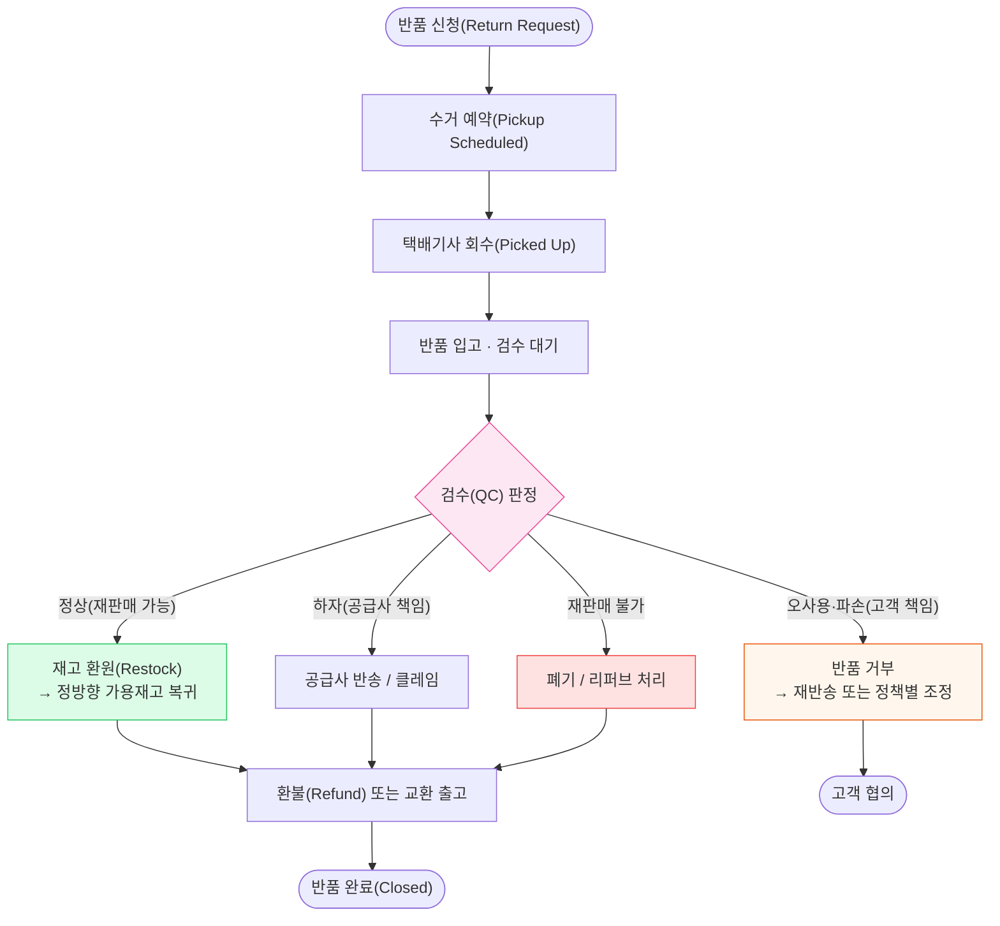
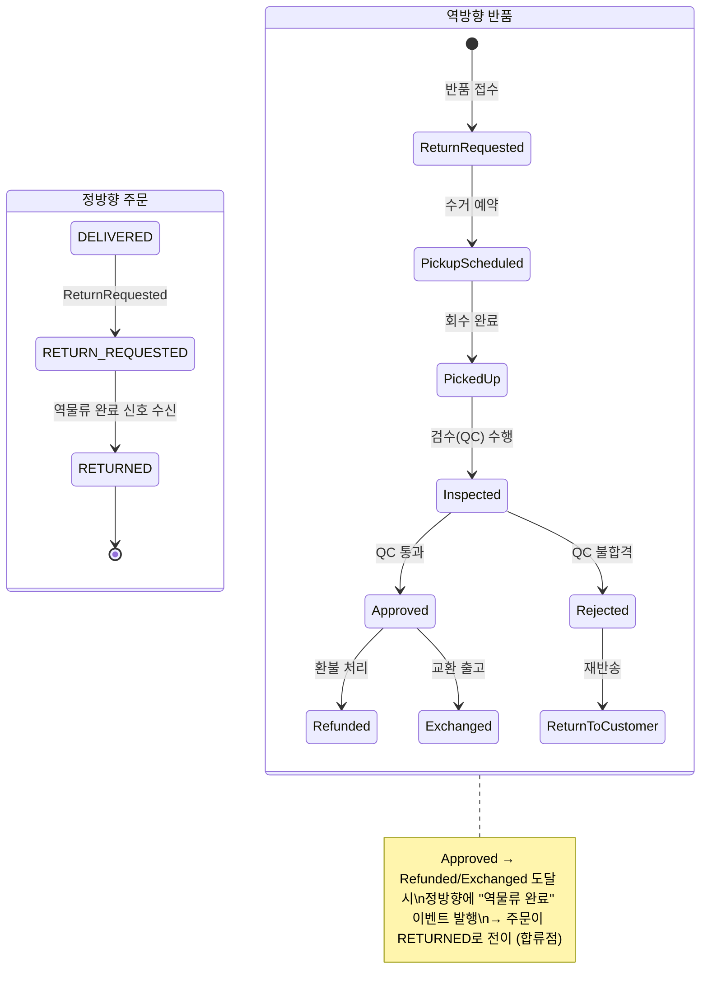
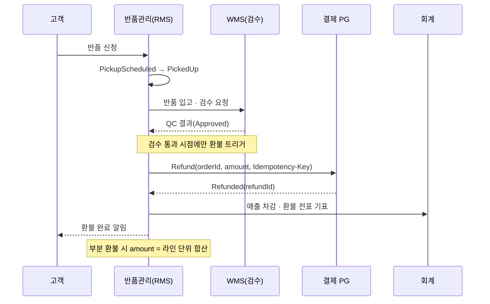

## 1. 역물류(Reverse Logistics) 개념과 측정 기준

> **핵심 책임** — 고객이 받은 상품을 *회수·검수·재처리*하는 흐름. 정방향 출고와 같은 주문에 매달린 부속 작업으로 취급하면 반품 상태, 품질, 재고, 결제의 경계가 흐려진다.

Reverse Logistics(역물류)는 고객 또는 판매 지점에서 물류 거점으로 상품을 되돌리고, 검수 결과에 따라 재판매·수리·공급사 반송·폐기·환불을 처리하는 흐름이다. 단순 반품 외에도 교환, 리콜, 오배송 회수처럼 회수 사유와 후속 처리가 다른 사례를 포함한다.

| 관점 | 정방향(Forward) | 역방향(Reverse) |
| --- | --- | --- |
| 흐름 방향 | 주문 이행을 위해 창고에서 고객으로 이동 | 반품 사유와 회수 경로에 따라 거점으로 이동 |
| 상품 상태 | 출고 전 품질 기준을 통과한 재고 | 사용·개봉·파손 여부를 입고 후 판정 |
| 핵심 작업 | 피킹·패킹·출고 | **접수·회수·검수·등급 분류·재처리 판정** |
| 재고 처리 | 판매 가능 재고에서 차감 | QC 결과에 따라 격리, 가용, 리퍼브, 폐기 등으로 이동 |
| 결제 처리 | 결제 승인과 매출 기록 | 승인된 반품 라인과 결제 수단에 연결한 환불·조정 |

반품률 하나만으로 운영 품질을 판단하지 않는다. 사유별 접수 건수, 회수 성공률, 입고 후 검수 대기시간, QC 판정별 수량, 가용 재고 전환률, 환불 요청·성공·조정 건수처럼 **정의와 집계 시점을 고정한 지표**를 함께 둔다. 각 지표의 분모와 취소·중복 이벤트 처리 규칙을 먼저 정하지 않으면 기간별 비교가 왜곡된다.

## 2. 반품 전체 흐름 — 신청부터 재처리까지

반품 접수에서 수거·입고·검수·결제 조정·재고 처리가 이어진다. QC는 중요한 관문이지만 환불 정책이 반드시 QC 완료를 기다려야 한다는 뜻은 아니다. 선환불 정책에서는 환불 승인과 물류 검수의 상태를 분리하고, 사후 조정 경로를 명시해야 한다.


```mermaid
flowchart TB
    Start(["반품 신청(Return Request)"]) --> Schedule["수거 예약(Pickup Scheduled)"]
    Schedule --> Pickup["택배기사 회수(Picked Up)"]
    Pickup --> Inbound["반품 입고 · 검수 대기"]
    Inbound --> QC{"검수(QC) 판정"}
    QC -->|"정상(재판매 가능)"| Restock["재고 환원(Restock)\n→ 정방향 가용재고 복귀"]
    QC -->|"하자(공급사 책임)"| Vendor["공급사 반송 / 클레임"]
    QC -->|"오사용·파손(고객 책임)"| Reject["반품 거부\n→ 재반송 또는 정책별 조정"]
    QC -->|"재판매 불가"| Dispose["폐기 / 리퍼브 처리"]
    Restock --> Refund["환불(Refund) 또는 교환 출고"]
    Vendor --> Refund
    Dispose --> Refund
    Reject --> End2(["고객 협의"])
    Refund --> End(["반품 완료(Closed)"])

    style Restock fill:#dcfce7,stroke:#22c55e
    style QC fill:#fce7f3,stroke:#ec4899
    style Reject fill:#fff7ed,stroke:#ea580c
    style Dispose fill:#fee2e2,stroke:#ef4444
```

*반품 흐름 분기 — 검수(QC) 판정이 재고 환원·환불·폐기를 가르는 단일 관문*

> **💡 핵심 — 검수와 결제의 경계를 분리**
>
> 검수 전에 상품을 가용 재고로 올리면 불량품이 재출고될 수 있다. 반대로 결제 정책상 선환불을 허용할 수 있으므로 `RefundApproved`와 `QCApproved`를 같은 상태로 합치지 않는다. 환불 정책, QC 판정, 재고 전환은 서로의 결과를 참조하되 각각 재시도·보상·감사 이력을 갖는다.

## 3. 반품 상태 머신 — 정·역방향 상태 합류 지점

반품도 주문과 마찬가지로 **Enum + 명시적 전이**로 상태를 강제한다. 중요한 것은 정방향 주문의 `RETURNED` 상태와 역방향 반품 상태 머신이 **어디서 합류(Join)하는가**이다.


```mermaid
stateDiagram-v2
    state "정방향 주문" as FWD {
        DELIVERED --> RETURN_REQUESTED : ReturnRequested
        RETURN_REQUESTED --> RETURNED : 역물류 완료 신호 수신
        RETURNED --> [*]
    }
    state "역방향 반품" as REV {
        [*] --> ReturnRequested : 반품 접수
        ReturnRequested --> PickupScheduled : 수거 예약
        PickupScheduled --> PickedUp : 회수 완료
        PickedUp --> Inspected : 검수(QC) 수행
        Inspected --> Approved : QC 통과
        Inspected --> Rejected : QC 불합격
        Approved --> Refunded : 환불 처리
        Approved --> Exchanged : 교환 출고
        Rejected --> ReturnToCustomer : 재반송
    }
    note right of REV : Approved → Refunded/Exchanged 도달 시\n정방향에 "역물류 완료" 이벤트 발행\n→ 주문이 RETURNED로 전이 (합류점)
```

*정방향 주문 상태와 역방향 반품 상태 머신 — 역방향이 Approved→Refunded에 도달하면 정방향 RETURNED로 합류*

> **🎯 면접 포인트 — 상태 합류(Join)**
>
> 주문 상태와 반품 상태를 한 Enum에 넣으면 부분 반품, 여러 반품 요청, 재검수, 환불 결과 불명확 상태를 표현하기 어렵다. 정방향 주문과 역방향 반품을 **별도 Aggregate(집합체)** 로 두고, 반품이 정책상 종결될 때 `ReturnCompleted` 같은 도메인 이벤트를 발행한다. 주문 서비스는 이벤트의 `returnId`, 대상 라인, 버전 또는 멱등키를 검증한 뒤 주문 라인 상태를 갱신한다. 이벤트를 받았다고 주문 전체를 무조건 `RETURNED`로 바꾸면 부분 반품에서 오류가 난다.

### 왜 별도 상태 머신으로 분리하나

- **생명주기 차이**: 한 주문에 반품이 여러 번(라인별·부분) 걸릴 수 있어 1:N. 주문 헤더 상태로는 표현 불가.
- **합류 시점 명시**: `Approved → Refunded` 도달이라는 단일 지점에서만 정방향을 건드림 → 상태 꼬임 방지.
- **멱등성**: `ReturnCompleted` 이벤트가 재전송돼도 주문은 한 번만 `RETURNED`로 전이.

### 상태 합류 실패 흐름

이벤트 소비자가 이미 처리한 `ReturnCompleted`를 다시 받으면 `returnId`와 이벤트 ID를 중복 기록으로 판정하고 같은 결과를 반환한다. 대상 주문 버전이 현재 버전과 다르면 즉시 덮어쓰지 않고 `JOIN_REVIEW_REQUIRED` 또는 재처리 큐로 보낸다. 반품이 주문에 속하지 않거나 이미 취소된 라인을 가리키면 주문 상태를 변경하지 않고 불일치 사건을 기록한다. 이벤트 발행은 로컬 트랜잭션의 outbox에 먼저 저장하고, 소비 성공 시 inbox 또는 처리 이력을 남기면 DB 커밋과 메시지 발행 사이의 유실을 재처리할 수 있다.

## 4. 검수(QC, Quality Check) — 상태 분류와 재고 환원

QC(Quality Check, 품질 검수)는 회수된 상품을 등급으로 분류하고, **재판매(Restock) 가능 여부와 재고 환원 시점**을 결정하는 핵심 단계다.

| QC 분류 | 판정 기준 | 재판매 가능? | 재고 환원(Restock) 처리 | 환불 방향 |
| --- | --- | --- | --- | --- |
| **정상(Good)** | 미개봉·신품 동등 | 가능 | 가용재고로 즉시 환원 | 전액 환불 |
| **경미 하자(Minor)** | 개봉·전시급 | 리퍼브 채널 한정 | 별도 리퍼브 재고로 환원 | 전액 환불 |
| **공급사 하자(Defective)** | 제조 결함 또는 리콜 기준 해당 | 불가(공급사 정책에 따름) | 가용재고로 환원하지 않음 | 계약·정책에 따른 환불 또는 조정 |
| **고객 오사용(Damaged)** | 사용 흔적·파손 등 정책상 재판매 불가 | 불가 | 가용재고로 환원하지 않음 | 근거와 정책에 따른 부분 환불 또는 거부 |

> **⚠️ 실무 함정 — 재고 환원 시점**
>
> 재고를 **"반품 입고 시점"이 아니라 "QC 통과 시점"** 에 가용재고로 올린다. 입고 즉시 환원하면 검수에서 하자로 판정될 상품이 판매 가능 재고에 섞일 수 있다. QC 전에는 `RETURN_INSPECTING` 같은 별도 보류 상태로 격리하고, 상품·수량·등급·창고·판정 근거를 함께 기록한다.

### QC 격리·환원 실패 흐름

입고 스캔은 `RETURN_RECEIVED`와 격리 재고 이동을 만든다. 이 이동이 재시도될 수 있으므로 `returnId + lineId + inspectionVersion` 같은 업무 키를 사용해 같은 입고를 두 번 가산하지 않는다. QC가 승인되면 가용재고 전환 명령을 한 번 발행하고, 재고 서비스가 이미 적용한 업무 키를 다시 받으면 현재 결과를 반환한다. 전환 결과를 알 수 없는 타임아웃에서는 재고를 다시 더하지 말고 조회 또는 조정 큐로 확인한다.

QC가 재검수되면 이전 판정과 새 판정을 연결하고, 이전 판정의 재고 이동을 상쇄한 뒤 새 판정을 적용한다. 한 번 가용재고로 전환된 상품이 별도 주문에 할당된 뒤 판정이 바뀌는 경우에는 재고를 음수로 덮어쓰지 말고 보류·회수·운영자 검토 정책을 적용한다. `RETURN_INSPECTING`, `AVAILABLE`, `REFURBISH`, `DISPOSED`는 상호 배타적인 수량 상태로 모델링해 동일 수량이 두 상태에 동시에 보이지 않게 한다.

## 5. 환불 흐름 — 타이밍 Trade-off와 회계 처리

환불(Refund)은 결제 PG(Payment Gateway)와 회계 시스템에 동시에 영향을 준다. 핵심 설계 결정은 **"언제 환불할 것인가"** — 회수 즉시(선환불) vs 검수 통과 후(검수후환불)이다.


```mermaid
sequenceDiagram
    participant C as 고객
    participant RMS as 반품관리(RMS)
    participant WMS as WMS(검수)
    participant PG as 결제 PG
    participant ACC as 회계

    C->>RMS: 반품 신청
    RMS->>RMS: PickupScheduled → PickedUp
    RMS->>WMS: 반품 입고 · 검수 요청
    WMS-->>RMS: QC 결과(Approved)
    Note over RMS,WMS: 검수 통과 시점에만 환불 트리거
    RMS->>PG: Refund(orderId, amount, Idempotency-Key)
    PG-->>RMS: Refunded(refundId)
    RMS->>ACC: 매출 차감 · 환불 전표 기표
    RMS-->>C: 환불 완료 알림
    Note over RMS: 부분 환불 시 amount = 라인 단위 합산
```

*검수후환불 시퀀스 — QC Approved 이후에만 PG Refund 호출, 멱등키로 중복 환불 차단*

### 선환불 vs 검수후환불 Trade-off

| 관점 | 선환불 (회수 즉시) | 검수후환불 (QC 통과 후) |
| --- | --- | --- |
| 고객 경험(CX) | 검수 완료를 기다리지 않아 정책상 빠른 처리가 가능 | 검수 완료 뒤 승인하므로 고객이 기다릴 수 있음 |
| 손실 리스크 | 하자·오사용도 선환불 → 환수 어려움 | QC로 걸러내 손실 최소화 |
| 회계 처리 | 환불 후 검수 → 충당금·역분개 복잡 | 확정 후 1회 기표 → 단순 |
| 적합 상황 | 회수·고객·상품 조건을 사전에 평가하고 사후 조정이 가능한 정책 | 검수 결과가 환불 금액·자격을 결정하는 정책 |

> **🎯 면접 포인트 — 부분 환불 & 회계 시점**
>
> "라인 3개 중 1개만 반품 승인"이면 환불액은 승인된 라인과 할인·배송비 배분 규칙으로 계산한다. 계산 결과와 원주문·반품·결제 환불 ID를 연결해야 재시도와 대사에서 같은 금액을 중복 반영하지 않는다. 회계 전표의 세부 세법·증빙 규칙은 관할과 사업 정책을 확인해 별도로 구현한다.

### 환불 결과가 불명확한 경우

PG 호출이 타임아웃되면 애플리케이션은 `FAILED`로 단정하지 않는다. 네트워크 응답을 잃었어도 PG에 요청이 접수됐을 수 있기 때문이다. 반품 라인에는 `REFUND_REQUESTED`와 요청 멱등키를 저장하고, PG의 환불 조회 API 또는 웹훅으로 `SUCCEEDED`, `FAILED`, `PENDING`을 확인한다. 조회 전 재호출이 필요하면 같은 멱등키와 같은 금액을 사용하고, 키를 바꾸어 중복 환불을 만들지 않는다.

환불 성공 웹훅은 중복 수신을 전제로 처리한다. 이미 성공한 환불 ID가 같은 반품에 연결되어 있으면 상태를 그대로 반환하고, 다른 반품·다른 금액을 가리키면 자동 병합하지 않고 대사 큐로 보낸다. 일정 시간 동안 결과가 확정되지 않는 `PENDING` 건은 고객에게 확정 완료라고 알리지 않고 운영 대시보드와 재조회 작업에 남긴다. 환불 실패 뒤 재시도할 수 있는 오류와 결제 수단·잔액·정책 확인이 필요한 오류를 구분한다.

## 6. 엣지 케이스 — 역물류 특유의 함정

> **⚠️ 회수 중 분실 · 파손**
>
> 회수 후 입고 전 상품이 분실·파손되면 `PickedUp` 상태에서 바로 환불이나 폐기로 확정하지 않는다. 운송장 스캔, 운송사 사건 번호, 마지막 확인 시각을 근거로 `IN_TRANSIT_EXCEPTION` 사건을 만들고, 고객 보상·운송사 클레임·재고 조정의 책임 주체를 정책에 따라 결정한다. SLA는 상품과 계약별 설정값으로 취급하고 본문에 고정된 기간을 두지 않는다.

> **⚠️ 교환 시 신규 출고와의 합류**
>
> 교환은 **역방향 회수 + 정방향 신규 출고**가 묶이지만 한 DB 상태로 합치지 않는다. 두 Shipment를 별도로 추적하고 하나의 `ExchangeCase`에 연결한다. 선출고·후출고 정책, 회수 미완료 시 보류·취소·추가 청구 규칙을 명시하고, 어느 한쪽만 성공했을 때 보상 또는 운영자 검토 경로를 둔다.

> **⚠️ 재고 환원 타이밍 오류**
>
> QC 통과 전 재고를 환원하면 불량 재출고가 발생할 수 있다. **"보류 재고(RETURN_INSPECTING) → QC 통과 시 가용 전환"**의 2단계 상태를 두고, 환원 이벤트를 멱등하게 처리한다. 이미 전환된 수량을 다시 더하는 대신 업무 키별 처리 결과를 조회하고, 결과 불명확 시 대사 큐에서 확인한다.

## 7. 정책 비교 — 운영 조건별 역물류

| 조건 | 설계 선택 | 확인할 근거 |
| --- | --- | --- |
| 회수 경로가 기존 배송망과 겹침 | 회수 지점·운송장·입고 스캔을 하나의 사건 흐름으로 연결 | 운송사 계약, 스캔 이벤트, 분실·파손 책임 |
| 신선·개봉·위험 상품 | 반품 자격과 폐기·격리 기준을 접수 전에 명시 | 상품 규정, 안전·위생 기준, 사진·검수 증거 |
| 고가 또는 재판매 영향이 큰 상품 | QC 완료 후 환불하거나 선환불 후 사후 조정 | 고객·상품 위험 평가, 결제 정책, 대사 절차 |
| 교환 | 반품 Shipment와 신규 출고 Shipment를 `ExchangeCase`로 연결 | 선출고 조건, 회수 미완료 처리, 두 흐름의 보상 규칙 |

운영 사례를 인용할 때는 공개된 정책 문서와 실제 계약·상품 규칙을 확인한다. 특정 업체의 내부 반품률, 기사 동선, 환불 SLA를 일반 설계의 사실처럼 사용하지 않는다.

## 8. 백엔드 시스템 디자인 연결

| 역물류 이슈 | 설계 패턴 | 이유 |
| --- | --- | --- |
| 정·역 상태 머신 합류 | **별도 Aggregate + 도메인 이벤트** | 역방향 종결 시 `ReturnCompleted` 발행 → 정방향 `RETURNED` 전이, 느슨한 결합 |
| 상태 전이 이력 추적 | **이벤트 소싱(부분 적용)** | "왜 거부됐나" 감사 추적, 분쟁 시 회수~검수~환불 전 과정 재현 |
| 회수-검수-환불 분산 일관성 | **Saga + 보상 트랜잭션** | 각 단계의 확정 상태와 보상·수동 대사 경로를 분리 |
| 중복 환불 · 중복 환원 | **Idempotency-Key(멱등키)** | PG Refund·재고 환원 이벤트 재전송 시 한 번만 반영 |
| 재고 환원 타이밍 | **보류 재고 상태 분리** | `RETURN_INSPECTING` → QC 통과 시 가용 전환, 2단계 격리 |

> **🎯 면접 정리 — 한 문장**
>
> "역물류는 정방향과 **별도 상태 머신** 으로 모델링하되 `ReturnCompleted` 이벤트로 정방향에 합류시키고, **검수(QC)를 모든 분기의 게이트** 로 두며, 환불·재고 환원은 **Saga + 멱등키 + 보류 재고 격리** 로 일관성을 맞춘다."

```text
REQUESTED -> COLLECTED -> RECEIVED -> INSPECTED
                                      ├─ RESTOCKABLE -> RESTOCKED
                                      ├─ REPAIRABLE  -> REPAIR
                                      └─ DISPOSAL    -> DISPOSED
```

## 9. 설계 체크리스트

- 반품 요청이 주문 전체인지 특정 라인·수량인지 식별하는가?
- 주문 상태와 반품 상태를 별도 Aggregate로 저장하고, 합류 이벤트에 `returnId`, 대상 라인, 이벤트 ID를 포함하는가?
- `RETURN_INSPECTING` 수량이 가용·리퍼브·폐기 수량에 중복 집계되지 않는가?
- QC 재시도와 재검수에서 이전 재고 이동을 추적하고 상쇄할 수 있는가?
- 환불 요청의 멱등키, PG 환불 ID, 금액, 통화, 원주문을 저장하는가?
- PG 응답 타임아웃을 실패로 단정하지 않고 조회·웹훅·대사 큐로 결과를 확정하는가?
- 선환불 정책이라면 QC 불합격 후 추가 청구·환수·분쟁 처리의 책임과 상태가 있는가?
- 이벤트·스캔·검수 판정·환불 결과를 감사 추적할 수 있고, 개인정보와 결제정보를 최소화하는가?

## 10. 참고 자료

- [GS1 EPCIS 2.0 Standard](https://ref.gs1.org/standards/epcis/2.0.0/) — 물류 객체의 상태·변화·이벤트를 추적할 때 사용할 수 있는 이벤트 모델.
- [Stripe Refunds](https://docs.stripe.com/refunds) — 환불 객체와 결제 환불의 상태·실패 가능성을 확인하는 참고 자료.
- [Stripe Idempotent requests](https://docs.stripe.com/api/idempotent_requests) — 네트워크 재시도에서 같은 요청을 한 번만 처리하기 위한 멱등키 설계 참고 자료.
- [AWS Prescriptive Guidance: Saga pattern](https://docs.aws.amazon.com/prescriptive-guidance/latest/cloud-design-patterns/saga.html) — 여러 서비스에 걸친 작업의 단계·보상·실패 처리를 설계할 때의 참고 자료.
