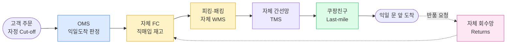
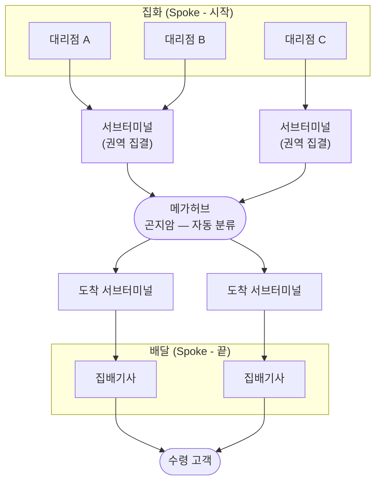
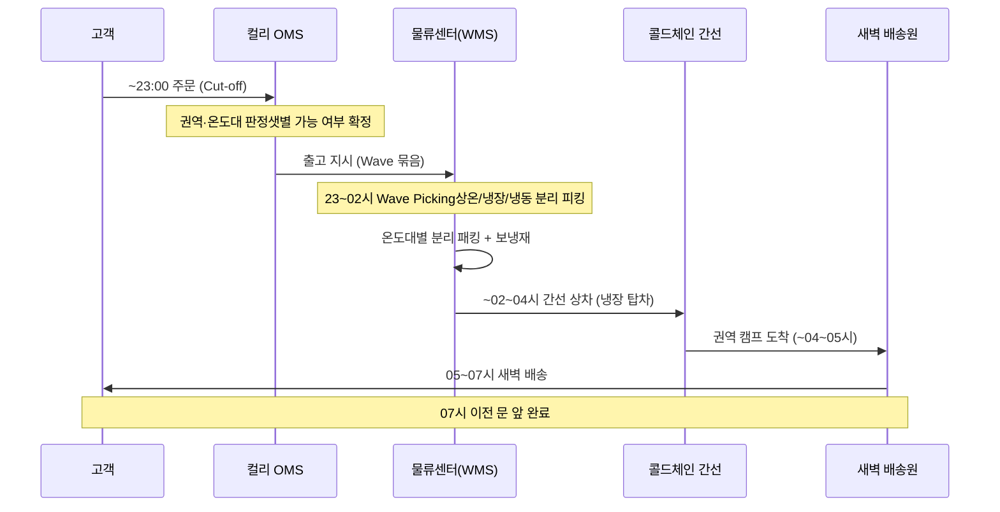
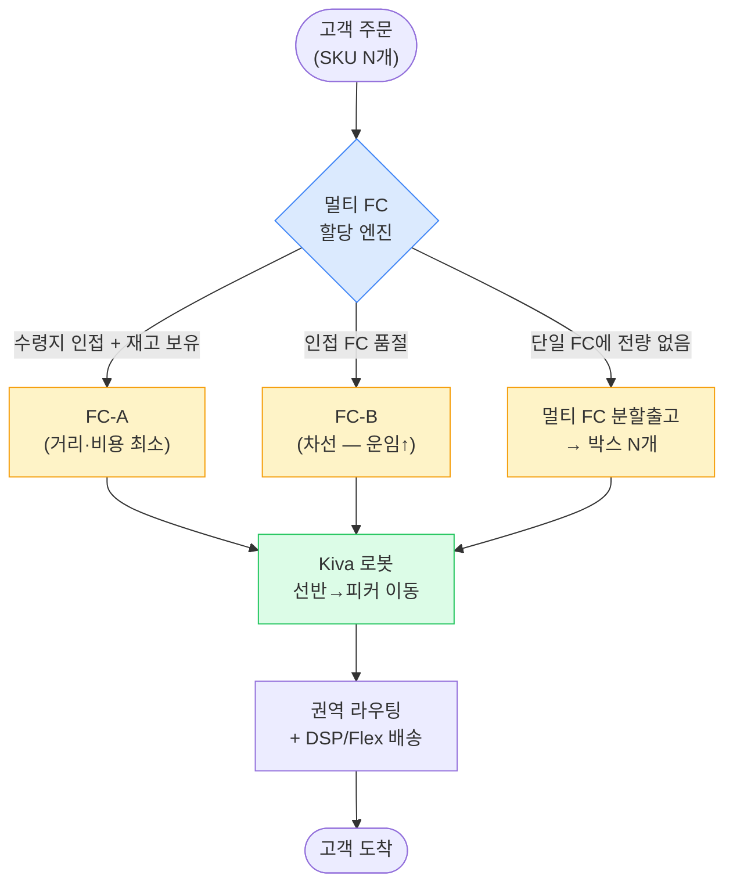

## 1. 4개사 한눈에 비교 — 비즈니스 모델

물류 사업 모델은 크게 세 갈래다. 어디까지 직접 소유·통제하느냐가 핵심 축이다.

> **수직 통합 (Vertical Integration)** — 쿠팡 — 직매입·자체 FC(Fulfillment Center, 풀필먼트 센터)·자체 배송망(CLS)까지 한 회사가 소유. 통제력·데이터 일관성 최대, 초기 투자 최대.

> **3PL / 택배 네트워크 (3rd-Party Logistics)** — CJ대한통운 — 화주(Shipper)의 물량을 위탁받아 허브앤스포크(Hub-and-Spoke) 네트워크로 운송. 자산은 공유, 다수 화주에 규모의 경제.

> **풀필먼트 + 콜드체인 특화** — 컬리 — 신선식품 풀필먼트에 Cold-chain(콜드체인)을 결합한 권역 한정 새벽배송. 좁은 권역에 깊게.

> **플랫폼형 풀필먼트 (FBA)** — Amazon — FBA(Fulfillment by Amazon)로 입점 판매자 재고를 자사 FC에 위탁받아 글로벌 멀티 FC에서 비용 최적 할당.

### 레이어별 큰 비교표 (OMS / WMS / TMS / Last-mile / Returns)

| 레이어 | 쿠팡 로켓배송 | CJ대한통운 | 컬리 샛별배송 | Amazon |
| --- | --- | --- | --- | --- |
| **OMS** (주문) | 자정 Cut-off, 익일도착 판정 자체 통제 | 화주 OMS와 EDI/API 연동, 운송장 발급 중심 | 23시 Cut-off, 권역·온도대 판정 | 멀티 마켓플레이스 주문 통합, 글로벌 SLA |
| **WMS** (창고) | 전국 100+ 물류센터, 직매입 재고 보관 | 화주 위탁 보관(2PL/3PL), 메가허브 중심 | 물류센터(상온·냉장·냉동 3존), Wave picking | 글로벌 FC 네트워크, Kiva 로봇 자동화 |
| **TMS** (간선·운송) | 자체 간선망 + 자체 라우팅 | 허브앤스포크 표준, 곤지암 메가허브 | 권역 한정 콜드체인 간선 | 멀티 FC→권역 라우팅, 일부 자체 운송 |
| **Last-mile** (라스트마일) | 쿠팡친구(자체 배송 직원) | 택배 대리점·집배기사 위탁 | 자체/위탁 새벽 배송 권역망 | DSP·Amazon Flex(긱 노동) 혼합 |
| **Returns** (반품) | 자체 회수망, 앱 내 즉시 처리 | 택배 회수 네트워크 재활용 | 회수 후 콜드체인 폐기·재판매 판정 | FBA 반품 자동화, Returnless Refund |
| **통제 모델** | 수직 통합 | 3PL 네트워크 | 풀필먼트+콜드체인 | 플랫폼 FBA |

> **💡 핵심 관점**
>
> 네 회사는 같은 문제를 다른 "소유 경계(ownership boundary)"로 푼다. 백엔드 관점에서 이 경계가 곧 **시스템 경계(Bounded Context)와 데이터 일관성 모델** 을 결정한다. 한 회사가 다 소유하면 단일 이벤트 파이프라인(강한 일관성)이, 여러 파트너가 끼면 비동기 연동(최종 일관성)이 강제된다.

## 2. 쿠팡 로켓배송 — 수직 통합의 끝판

> **모델** — 직매입(자체 재고 소유) → 자체 FC 보관 → 자체 간선·자체 라스트마일(쿠팡친구)까지 *End-to-End 수직 통합*. "주문~문 앞"의 모든 단계를 한 회사가 통제한다.

쿠팡 로켓배송의 약속은 단순하다. **자정(24:00) 전 주문 → 익일 도착**. 이 SLA(Service Level Agreement, 서비스 수준 협약)를 지키려면 Cut-off 판정·재고 할당·간선·라스트마일이 모두 한 회사의 통제 아래 있어야 한다. 파트너 한 곳이라도 끼면 SLA 책임 소재가 흐려진다.

### 밸류체인 매핑 (수직 통합)

*쿠팡 로켓 밸류체인 — 모든 단계가 사내 시스템. 점선은 반품 역물류(Reverse Logistics)*

### 핵심 차별점 (정량)

- **Cut-off & SLA**: 자정 주문 → 익일 도착. 일부 지역은 당일/새벽까지 확장.
- **FC 밀도**: 전국 100개 이상 물류센터로 "수령지 근처에 재고가 이미 있는" 구조 → 라스트마일 거리 단축.
- **CLS(Coupang Logistics Services)**: 자체 배송 자회사. 쿠팡친구가 직고용/위탁 형태로 라스트마일 수행 → 배송 품질·데이터를 직접 통제.
- **분할출고 적극**: "있는 것 먼저" 속도 우선 정책. Order↔Shipment 1:N을 적극 허용.

> **🎯 면접 포인트 — 수직 통합의 시스템적 이점**
>
> "왜 쿠팡은 SLA를 지킬 수 있나?" → 단순히 돈을 많이 써서가 아니라, **주문·재고·배송 이벤트가 단일 파이프라인** 에 있어 상태 추적과 보상 흐름이 강한 일관성으로 가능하기 때문. 3PL이면 배송 상태를 파트너 API 폴링/웹훅으로 받아야 해 최종 일관성·지연이 끼어든다. 🔥(Deep-dive)

### 수직 통합 Trade-off

| 관점 | 수직 통합의 득 | 수직 통합의 실 |
| --- | --- | --- |
| 통제력 | SLA·품질·데이터 전 구간 통제 | 모든 책임을 떠안음(장애도 자체 부담) |
| 초기 투자(CapEx) | 장기 단위경제 개선 가능 | FC·간선·인력에 막대한 선투자, 장기 적자 감내 |
| 데이터 일관성 | 단일 이벤트 파이프라인 → 강한 일관성 | 모든 시스템을 직접 운영하는 복잡도 |
| 확장성 | 신규 권역도 같은 표준 복제 | 물리 자산 증설이 병목(소프트웨어처럼 즉시 확장 불가) |

> **⚠️ 실무 함정 — "통제 = 무한 확장"이 아니다**
>
> 수직 통합은 데이터 일관성엔 유리하지만, 새 권역에 로켓배송을 깔려면 물리 FC와 배송 인력이 선행돼야 한다. 소프트웨어는 오토스케일되지만 **물류 자산은 그렇지 않다** . 면접에서 "수직 통합이 무조건 좋다"고 답하면 감점.

## 3. CJ대한통운 — 허브앤스포크 3PL 표준

> **모델** — 다수 화주(Shipper)의 물량을 위탁받아 *허브앤스포크(Hub-and-Spoke)* 네트워크로 분류·운송하는 3PL/택배 사업자. 자사 재고가 아니라 "남의 화물을 효율적으로 흐르게" 한다.

쿠팡이 "내 재고를 내 망으로"라면, CJ대한통운은 "여러 화주의 화물을 공용 망으로". 핵심 자산은 **분류 허브와 간선 네트워크**다. 대표 자산이 곤지암 **메가허브**로, 일 처리 능력이 수백만 박스급에 이르는 대형 자동 분류 거점이다.

### 허브앤스포크 네트워크

*허브앤스포크 — 모든 화물이 허브를 경유해 분류. 노선 수를 N×N → N으로 줄여 규모의 경제 달성*

### 왜 허브앤스포크인가 (정량 직관)

- **노선 폭발 방지**: 거점이 N개일 때 점대점(Point-to-Point)은 최대 N×(N-1)/2 노선이 필요하지만, 허브 경유는 N개 노선이면 충분. 거점이 늘수록 격차가 폭증.
- **분류 집중**: 분류·스캔을 메가허브에 집중해 자동화 투자 회수율↑.
- **2PL/3PL 유연성**: 화주는 보관만(2PL) 또는 보관+배송+부가서비스(3PL)를 선택적으로 위탁. CJ는 화주별 SLA·운송장 규격을 시스템으로 수용.

> **⚠️ 실무 함정 — 허브 단일 장애점(SPOF)**
>
> 허브앤스포크의 효율성은 곧 **허브가 막히면 전체가 막힌다** 는 위험과 동전의 양면이다. 메가허브 분류 라인 장애, 폭설, 명절 물량 폭주는 전국 지연으로 전파된다. 백엔드 비유로는 단일 라우팅 노드 병목 — 다중 허브·우회 경로 설계가 회복탄력성의 핵심.

> **💡 백엔드 비유**
>
> 허브앤스포크 = **메시지 브로커(Message Broker) 토폴로지** . 모든 프로듀서·컨슈머가 직접 연결(메시 = 점대점)하는 대신 브로커(허브)를 경유시켜 연결 수를 줄이는 것과 동형. 트레이드오프도 같다: 결합도↓·확장성↑ vs 브로커가 SPOF·지연 한 홉 추가.

## 4. 컬리 샛별배송 — 콜드체인 타임 윈도우 풀필먼트

> **모델** — *23시 주문 → 다음 날 오전 7시 도착*이라는 좁은 타임 윈도우를, 상온·냉장·냉동 *풀콜드체인(Full Cold-chain)*으로 권역 한정 수행. "넓게"가 아니라 "좁은 권역에 깊게".

컬리 샛별배송의 본질은 **약 8시간 안에 신선도를 유지한 채** 풀필먼트 전 과정을 끝내는 것이다. 일반 택배가 "박스를 옮긴다"면, 컬리는 "온도를 유지하며 옮긴다". 그래서 Cut-off도 빡빡하고, 배송 권역도 콜드체인 간선이 닿는 곳으로 제한된다.

### 23시 → 07시, 8시간 타임라인

*샛별배송 8시간 파이프라인 — 콜드체인이 끊기지 않게 온도대별 분리가 전 구간 유지됨*

### 핵심 차별점

- **Cut-off / SLA**: 23시 마감 → 익일 07시 도착. 8시간 내 피킹·패킹·간선·라스트마일을 모두 끝내야 함.
- **Cold-chain(콜드체인)**: 상온/냉장/냉동 3존 분리 보관·분리 피킹·분리 패킹. 보냉 패키징과 냉장 탑차로 온도 끊김(Cold-chain break) 방지.
- **Wave picking(웨이브 피킹)**: Cut-off 직후 주문을 시간대 묶음(Wave)으로 일괄 피킹해 8시간 마감 안에 처리량 극대화.
- **권역 제한**: 콜드체인 간선이 닿는 수도권 등으로 서비스 권역 한정 → 할당 후보 창고가 권역으로 좁혀짐.

> **🎯 면접 포인트 — 시간 제약이 시스템 설계를 지배**
>
> "샛별배송 백엔드의 가장 큰 제약은?" → **고정된 데드라인(07시)에서 역산하는 배치 스케줄** . Cut-off 직후 Wave를 어떻게 묶고, 온도대별 피킹 동선을 어떻게 최적화하느냐가 처리량을 결정. 실시간 단건 처리가 아니라 **마감 역산 배치 최적화 문제** 로 봐야 한다. 🔥(Deep-dive)

> **⚠️ 실무 함정 — 콜드체인 단절 시 폐기 비용**
>
> 온도가 한 번 끊기면(Cold-chain break) 식품은 재판매 불가 → 폐기·환불 비용이 즉시 발생. 일반 택배의 "재배송"과 달리 **되돌릴 수 없는 손실** 이다. 그래서 온도 모니터링·예외 알람이 관측성(Observability)의 1순위가 된다.

## 5. Amazon — FBA와 글로벌 멀티 FC 비용 최적 할당

> **모델** — *FBA(Fulfillment by Amazon)*로 입점 판매자의 재고를 Amazon FC에 위탁받아 보관·피킹·배송·CS·반품까지 대행. 글로벌 *멀티 FC 네트워크*에서 비용·SLA를 종합해 최적 창고를 할당한다.

쿠팡이 "내 재고"라면 Amazon FBA는 "남(판매자)의 재고를 내 창고에서 내 망으로 처리". 입점 판매자는 Amazon FC에 재고를 보내두기만 하면, 주문이 들어왔을 때 어느 FC에서 어떻게 보낼지는 Amazon이 결정한다. 핵심 역량은 **멀티 FC 비용 최적 할당**과 **창고 내부 자동화(Kiva 로봇)**다.

### 멀티 FC 비용 최적 할당

*멀티 FC 할당 — 거리·재고·운임·분할 페널티를 종합한 비용 최소화 라우팅*

### 핵심 차별점 (비교 관점)

- **FBA**: 판매자 재고를 FC에 위탁 → 보관·피킹·배송·반품·CS 일괄 대행. 판매자는 물류를 신경 쓰지 않고, Amazon은 물량 집중으로 규모의 경제.
- **멀티 FC 할당**: 같은 SKU가 여러 FC에 분산 보관 → 주문 시 수령지·재고·운임·분할 페널티를 종합해 **비용 최적 FC**를 동적 선택. 쿠팡의 권역 FC 선할당과 결이 비슷하나 글로벌 규모.
- **Kiva 로봇**: 창고 내부에서 선반(pod)을 피커에게 이동시키는 AGV(Automated Guided Vehicle, 무인운반차) 자동화로 피킹 동선·인건비 절감.
- **Returnless Refund**: 회수 운임이 상품가보다 비싸면 회수 없이 환불 → 역물류 비용 최적화.

> **💡 비교 관점**
>
> Amazon FBA와 쿠팡 로켓은 둘 다 "FC에 재고를 미리 깔고 가까운 데서 보낸다"는 점이 같다. 차이는 **재고 소유** 다. 쿠팡 로켓은 직매입(자기 재고), FBA는 판매자 위탁(남의 재고를 대행). 그래서 FBA는 **판매자별 재고 정합성·정산** 이라는 추가 복잡도를 짊어진다.

## 6. 종합 비교 — 리드타임 · 통제력 · 투자 · 확장성 · 일관성

| 축 | 쿠팡 로켓 (수직 통합) | CJ대한통운 (3PL) | 컬리 샛별 (콜드체인 풀필먼트) | Amazon (FBA) |
| --- | --- | --- | --- | --- |
| **리드타임** | 익일 (최단) | 1~2일 (표준 택배) | 익일 새벽 (최단, 권역 한정) | 지역별 1~2일(프라임) |
| **통제력** | 최고 (E2E 소유) | 중 (화주·기사 위탁 의존) | 높음 (콜드체인 직접 통제) | 높음 (FC 소유, 라스트마일 일부 위탁) |
| **초기 투자** | 최대 (FC·간선·인력) | 대 (허브·간선, 다화주 분산) | 대 (콜드체인 설비) | 최대 (글로벌 FC·로봇) |
| **확장성** | 물리 자산 제약(권역 증설 필요) | 높음 (다화주 규모의 경제) | 낮음 (권역 한정) | 최고 (글로벌 표준 복제) |
| **데이터 일관성** | 강한 일관성(단일 파이프라인) | 최종 일관성(파트너 연동) | 강한 일관성(자체 운영) | 강한 일관성(자체) + 판매자 정합성 부담 |
| **대표 강점** | 속도·품질 통제 | 네트워크 효율·범용성 | 신선도·정시성 | 비용 최적화·글로벌 규모 |

### 어떤 조건에서 어떤 모델이 유리한가 (Trade-off)

- **속도·품질이 핵심 차별점이고 자본이 충분** → **수직 통합(쿠팡)**. SLA·데이터를 직접 통제. 단, 권역 확장은 물리 투자 선행.
- **다수 화주의 범용 택배, 자산을 분산·공유** → **3PL 허브앤스포크(CJ)**. 규모의 경제 최강, 단 허브 SPOF·성수기 지연 리스크.
- **신선/냉장 등 온도 민감 + 정시성** → **콜드체인 풀필먼트(컬리)**. 좁은 권역에 깊게. 권역 밖 확장이 한계.
- **글로벌 멀티 권역 + 입점 판매자 생태계** → **플랫폼 FBA(Amazon)**. 비용 최적 할당·규모, 단 판매자 재고 정합성·정산 복잡도.

> **🎯 면접 포인트 — "정답은 없고 조건이 있다"**
>
> "어느 모델이 제일 좋나?"는 함정 질문. 옳은 답은 **"비즈니스의 차별점(속도/비용/신선도/규모)과 자본 여력에 따라 다르다"** 를 축으로 잡고, 각 모델의 통제력↔투자↔일관성 Trade-off를 정량으로 비교하는 것. 한 모델을 단정하면 시니어 기준 감점.

## 7. 백엔드 시스템 디자인 시사점

물류 사업 모델의 "소유 경계"는 곧 백엔드의 **데이터 일관성 모델과 통합 패턴**을 결정한다. 수직 통합은 단일 이벤트 파이프라인으로 강한 일관성을, 3PL은 파트너 연동으로 최종 일관성·보상 흐름을 강제한다.

| 모델 | 일관성 모델 | 통합 패턴 | 핵심 백엔드 과제 |
| --- | --- | --- | --- |
| **수직 통합 (쿠팡)** | 강한 일관성 — 단일 이벤트 파이프라인 | 사내 이벤트 버스(Kafka) + Outbox | 주문·재고·배송 상태를 한 트랜잭션 컨텍스트에서 추적, 장애도 자체 보상 |
| **3PL (CJ)** | 최종 일관성 — 파트너 비동기 연동 | EDI/API + Webhook/폴링, 멱등 수신 | 운송장 상태가 파트너로부터 지연·중복 도착 → Idempotency·재동기화 |
| **콜드체인 (컬리)** | 강한 일관성 + 마감 역산 배치 | Wave 배치 스케줄러 + 온도 텔레메트리 | 고정 데드라인 역산 스케줄, 온도 이상 실시간 알람(관측성) |
| **FBA (Amazon)** | 강한 일관성(자체) + 판매자 정합성 | 멀티 FC 할당 엔진 + 정산 원장(Ledger) | 판매자별 재고 정합성·정산, 멀티 FC 분산 재고 동시성 |

> **⚠️ 실무 함정 — 3PL 연동의 최종 일관성**
>
> 3PL과 연동하면 배송 상태를 **내가 소유하지 못한다** . 파트너 Webhook이 늦거나 중복으로 오고, 순서가 뒤바뀔 수 있다(예: "배송완료" 다음에 "배송중"이 도착). 그래서 수신 측은 **이벤트 버전·타임스탬프 기반 멱등 병합** 과 주기적 재동기화(Reconciliation)가 필수다. 수직 통합에선 덜 겪는 문제.

> **🎯 면접 정리 — 한 문장**
>
> "물류 비즈니스 모델의 **소유 경계가 곧 시스템 경계와 일관성 모델** 을 결정한다 — 수직 통합(쿠팡)은 단일 파이프라인의 강한 일관성을, 3PL(CJ)은 파트너 연동의 최종 일관성·멱등 수신을, 콜드체인(컬리)은 마감 역산 배치를, FBA(Amazon)는 멀티 FC 할당과 판매자 정합성을 핵심 과제로 갖는다."
