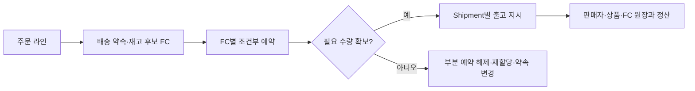

## 1. 공개 서비스와 설계 가설의 경계

이 카드는 네 회사의 서비스 설명을 출발점으로 OMS·WMS·TMS·라스트마일의 책임을 비교한다. 회사가 공개한 서비스 범위와 실제 내부 DB, 이벤트 버스, 재고 소유권, 배차 목적 함수는 서로 다른 정보다. 다음 표의 **공개 범위**만 회사 사례로 다루고, 아래 시스템 흐름은 면접용 가상 설계로 사용한다.

| 사례 | 공개 자료에서 확인할 수 있는 범위 | 여기서 검토할 설계 질문 |
| --- | --- | --- |
| 쿠팡 Rocket Delivery | 회사는 커머스·물류·라스트마일을 통합한 인프라와 빠른 배송을 설명한다. | 여러 서비스가 주문 약속·재고·운송 상태를 어떻게 조정할까? |
| CJ대한통운 | 회사는 택배·풀필먼트·운송 서비스를 설명한다. | 화주와 운송사 사이의 상태 계약과 중복 이벤트를 어떻게 다룰까? |
| 컬리 샛별배송 | 컬리는 밤 11시 주문 마감과 다음 날 아침 7시 배송을 기술 블로그에서 설명한다. | 마감 역산·온도 이탈·품질 판정을 어떻게 분리할까? |
| Amazon FBA | 판매자가 보낸 재고를 Amazon이 보관하고 주문 이행을 맡는 서비스다. | 판매자·SKU·창고별 원장과 분할 출고·정산을 어떻게 나눌까? |

[쿠팡 회사 소개](https://www.aboutcoupang.com/aboutus/)는 통합 물류 인프라와 배송 서비스를 설명한다. [CJ대한통운의 사업 소개](https://www.cjlogistics.com/ko/business/parcel)는 택배와 풀필먼트 사업을 구분한다. [컬리 기술 블로그](https://helloworld.kurly.com/blog/2023-delivery-system/)는 샛별배송의 마감·배송 약속을 설명한다. [Amazon FBA 소개](https://sellingpartners.aboutamazon.com/fulfillment-by-amazon)는 판매자 재고를 Amazon 네트워크로 보내는 절차를 설명한다. 이 자료만으로 회사별 내부 시스템의 일관성 수준은 알 수 없다.

## 2. 소유 경계와 데이터 일관성

수직 통합은 한 사업자가 여러 운영 단계를 조정할 여지를 넓히지만 **단일 트랜잭션이나 강한 일관성을 자동으로 만들지 않는다**. 3PL 연동도 모든 데이터가 반드시 최종 일관성이어야 한다는 뜻은 아니다. 동기 API로 확정하는 명령, 비동기 Webhook으로 받는 운송 사실, 주기적으로 대사하는 고객용 투영을 필드별로 구분해야 한다.

| 사실 | 가능한 원본 | 수신 측의 확인 |
| --- | --- | --- |
| 주문 약속과 취소 | OMS | 약속 버전·취소 가능 시점 |
| 창고의 실물·예약 수량 | WMS 또는 계약된 3PL 원장 | SKU·창고·상태·기준 시각 |
| 운송사 인수·배송 완료 | 운송사·기사 앱·스캐너 | 원본 이벤트 ID·발생 시각·증거 |
| 고객용 배송 상태 | OMS/TMS 읽기 모델 | 지연·정정·알림 정책 |
| 판매자 정산 | 계약별 원장 | 판매자·주문 라인·Shipment 연결 |

예를 들어 창고가 `SHIPPED`를 확정한 뒤 운송장 발급 응답을 잃었다고 하자. 새 운송장을 무조건 만들면 같은 화물에 운송장이 둘 생길 수 있다. `shipmentId`와 외부 요청 키를 기록하고 운송사에 기존 결과를 조회한 뒤, 결과가 없을 때만 재시도한다. 운송사 Webhook은 `providerEventId`로 멱등 수신하고 원본 이벤트와 고객용 현재 상태를 분리한다. 늦게 도착한 `IN_TRANSIT`가 이미 확인된 `DELIVERED`를 되돌리지 않도록 정정 절차를 둔다.

## 3. 배송 약속과 마감 역산: 컬리 사례를 가상 요구로 풀기

질문에 주어진 `23시 Cut-off → 다음 날 07시 도착`은 이 설계 문제의 입력이다. 실제 적용 상품·권역·날짜의 최신 조건은 별도로 확인해야 한다. 고정 마감이 있다면 주문 마감부터 배송 완료까지 8시간을 그대로 작업 시간으로 사용할 수 없다. 결제 확정, 주문 검증, Wave 구성, 피킹, 패킹, 상차, 간선, 최종 배송, 예외 여유를 역산한다.

```text
고객 약속 시각
  - 최종 배송 여유
  - 간선·터미널 여유
  - 상차·패킹·피킹 예상 시간
  = 해당 Wave의 최종 시작 시각
```

Wave picking은 같은 권역·온도대·출발 차수를 묶을 때 도움이 될 수 있지만 마감 직전 주문이 모두 같은 Wave에 들어가야 한다는 뜻은 아니다. 실시간 단건 처리와 배치 작업의 경계를 정하고, Wave가 늦어지면 약속을 조용히 유지하지 말고 대체 차수·지연 안내·취소 또는 환불 정책으로 분기한다.

콜드체인에서 온도 이탈이 관측되면 즉시 재판매 불가라고 단정하지 않는다. 기록의 신뢰도, 노출 온도·시간, 상품별 품질 기준을 확인하고 격리·검수·재배송·환불·폐기를 결정한다. 이 판정과 고객 보상을 별도 상태로 남겨야 나중에 원인을 설명할 수 있다.

## 4. 판매자 재고와 멀티 FC: FBA 사례를 가상 설계로 풀기

FBA처럼 판매자 재고를 사업자가 보관·이행하는 모델에서는 판매자, SKU, FC, 로트, 품질 상태를 한 숫자로 합치지 않는다. 실제 창고 선택 알고리즘은 공개 서비스 설명만으로 알 수 없으므로 아래 흐름은 설계 예다.


```mermaid
flowchart LR
    Order[주문 라인] --> Candidate[배송 약속·재고 후보 FC]
    Candidate --> Reserve[FC별 조건부 예약]
    Reserve --> Decision{필요 수량 확보?}
    Decision -->|예| Shipment[Shipment별 출고 지시]
    Decision -->|아니오| Recovery[부분 예약 해제·재할당·약속 변경]
    Shipment --> Ledger[판매자·상품·FC 원장과 정산]
```

같은 주문 라인이 여러 FC에서 나뉘면 `OrderLine → Shipment`가 1:N이 될 수 있다. FC별 예약 성공과 주문 전체 약속 확정은 별도 사건이다. 일부 FC만 성공했거나 응답이 유실되면 예약 ID로 결과를 조회하고, 재할당·분할 출고·보상 중 정책을 선택한다. 판매자 재고와 사업자가 매입한 재고가 한 플랫폼에 함께 있을 수 있으므로 회사 이름만으로 모든 상품의 소유권을 단정하지 않는다.

## 5. 네 사례에서 공통으로 확인할 실패 흐름

| 실패 입력 | 판단할 사실 | 복구 경로 |
| --- | --- | --- |
| 운송사 이벤트 중복·역순 도착 | 원본 이벤트 ID와 현재 투영 버전 | 멱등 저장 후 허용 전이·정정 큐 |
| 외부 발번 성공 뒤 응답 유실 | 외부 요청 키·기존 운송장 조회 결과 | 중복 발번 없이 재조회·대사 |
| 냉장 상품의 온도 이탈 | 센서 기록·상품별 품질 규정 | 격리·검수 후 재배송·보상 판정 |
| 여러 FC 중 일부 예약만 성공 | FC별 예약 ID와 만료 시각 | 분할·재할당·보상 및 고객 약속 갱신 |
| 장부와 실물 수량 불일치 | 실사 기준 시각·재고 상태 | 승인된 조정 이벤트와 원장 대사 |

면접에서는 먼저 공개 자료로 확인된 서비스 범위를 말한다. 다음으로 각 사실의 소유자와 상태 전파 계약을 정하고, 위 실패 흐름에서 응답 유실·중복·부분 성공이 일어났을 때 고객 약속과 원장이 어떻게 수렴하는지 설명한다. 특정 회사의 실제 DB, 이벤트 버스, cut-off 구현, FC 할당 목적 함수는 확인되지 않은 가설로 표시한다.

> **사례 해석 경계** — 표의 설계 질문과 복구 경로는 공개 서비스 설명을 바탕으로 만든 학습용 가설이다. 특정 회사의 내부 구현이나 실제 장애 대응 절차로 단정하지 않는다.

## 참고 자료

- [Coupang About Us](https://www.aboutcoupang.com/aboutus/)
- [CJ대한통운 택배·풀필먼트 사업](https://www.cjlogistics.com/ko/business/parcel)
- [컬리 기술 블로그 — 배송 시스템](https://helloworld.kurly.com/blog/2023-delivery-system/)
- [Amazon Fulfillment by Amazon](https://sellingpartners.aboutamazon.com/fulfillment-by-amazon)
