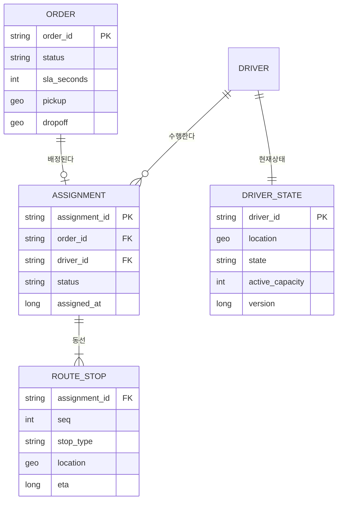
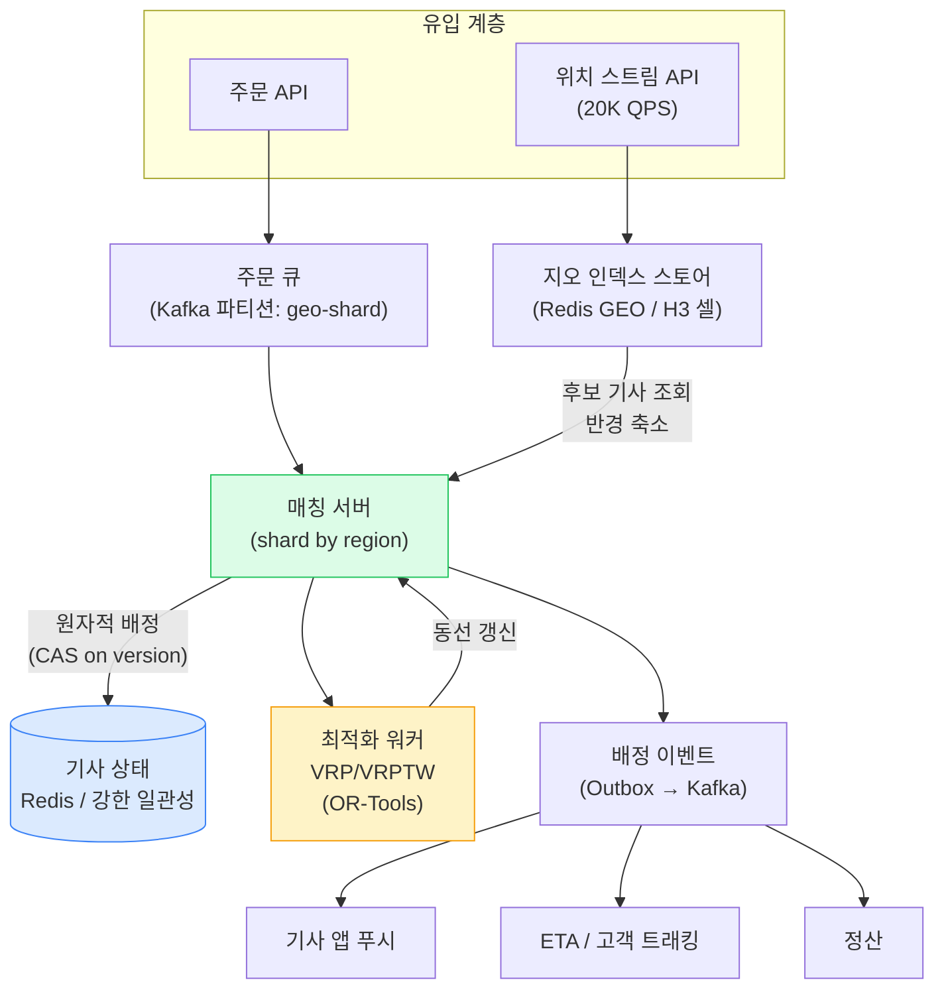
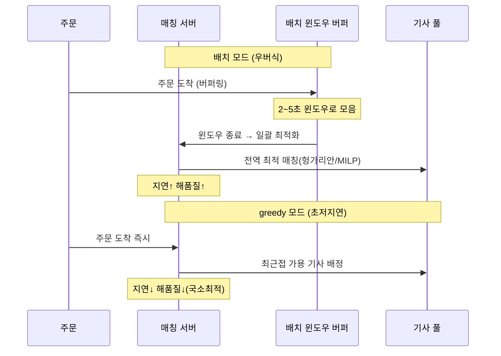
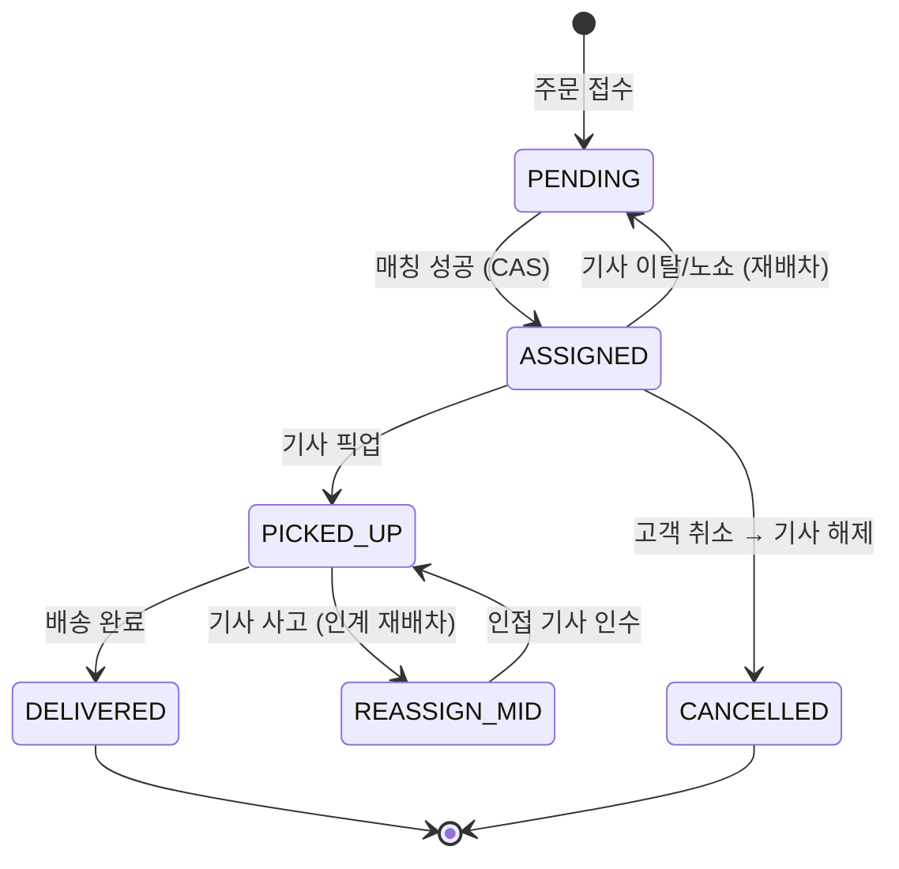

## 1. 요구사항 명확화 (Functional / Non-functional)

배차 최적화 시스템(Dispatch Optimization System)은 "발생한 주문·화물"과 "가용한 기사·차량"을 잇고, 각 기사의 방문 순서(경로)를 최소 비용으로 배열하는 엔진이다. 즉시배송(퀵커머스)과 계획배송(당일·익일)이 한 플랫폼에 공존한다고 가정한다.

### Functional Requirements

| 구분 | 요구사항 |
| --- | --- |
| 매칭(Matching) | 신규 주문을 후보 기사 집합에서 최적 기사에게 배정 |
| 라우팅(Routing) | 배정된 기사의 다중 정거장 방문 순서 최적화 (VRP/VRPTW) |
| 재배차(Re-dispatch) | 기사 이탈·노쇼·주문 취소 시 남은 화물 재배정 |
| 실시간 삽입(Dynamic insertion) | 운행 중 기사 동선에 신규 주문 끼워넣기 |
| 상태 관리 | 기사 상태(대기/배정/픽업/운행/오프라인) 원자적 전이 |

### Non-functional Requirements

- **매칭 지연 SLA(Service Level Agreement)**: 즉시배송은 주문 접수 → 배정까지 **P99 3초** 이내. 계획배송은 배치 수 분 허용.
- **정합성(Consistency)**: 이중 배차 절대 금지 — 한 기사, 한 시점, 한 활성 배정.
- **가용성(Availability)**: 최적화 엔진 장애 시에도 greedy fallback으로 배차는 계속.
- **확장성(Scalability)**: 피크 시간당 100만 주문(≈초당 300건 평균, 스파이크 수천 건), 활성 기사 10만.

> **🎯 면접 포인트 — "무엇을 최소화하나"를 먼저 못 박아라**
>
> 요구사항 단계에서 목적함수(objective)를 확정하지 않으면 설계가 산으로 간다. 즉시배송은 **고객 대기시간(pickup ETA)** 최소화가 1순위, 계획배송은 **총 주행거리·차량 수** 최소화가 1순위다. 여기에 기사 수입 형평성(fairness)·취소율까지 얹히면 **다목적 가중합(weighted multi-objective)** 이 된다. "그냥 가까운 기사요"라고 답하면 시니어 탈락. 🔥

## 2. 용량 추정 (Back-of-the-envelope)

정량 감각을 숫자로 못 박는다.

- **주문 유입**: 피크 시간당 **100만 건** → 평균 **약 280 QPS(Queries Per Second, 초당 쿼리 수)**, 점심·저녁 스파이크 **수천 QPS**.
- **활성 기사**: **10만 명**. 위치를 5초마다 갱신 → `100,000 / 5 = 20,000 QPS` 위치 쓰기.
- **후보 축소 없이** 매 주문마다 10만 기사를 전부 스캔하면: `280 × 100,000 = 2,800만 거리계산/초` → 비현실적. **지오 인덱스로 후보를 수십~수백으로 줄이는 것이 설계의 핵심**.
- **거리/시간 행렬**: n개 정거장이면 `n²` 셀. 기사당 20 스톱이면 400 셀, 캐싱 필수.
- **매칭 상태 저장**: 활성 배정 10만 × (주문ID·기사ID·상태·TTL) ≈ 수십 MB → 인메모리(Redis) 충분.

> **💡 팁 — 후보 축소가 90%의 승부처**
>
> 배차의 계산량은 "후보 기사 수 × 주문 수"에 지배된다. 후보를 10만 → 50으로 줄이면 계산량이 **2,000배** 감소한다. 지오 인덱스(H3/S2) 기반 반경 후보 조회가 사실상 전체 시스템의 처리량 상한을 결정한다.

## 3. API / 데이터 모델

### API

```kotlin
// 신규 주문 배차 요청 (즉시배송)
POST /v1/dispatch
{
  "orderId": "ORD-9F2A",
  "pickup":   { "lat": 37.4979, "lng": 127.0276 },  // 판교
  "dropoff":  { "lat": 37.5013, "lng": 127.0396 },
  "slaSeconds": 1800,          // 시간창(VRPTW) — 30분 내 완료
  "capacity":  1               // 적재 단위
}
// 202 Accepted → 비동기 배정. 결과는 이벤트/웹훅으로 통지

// 기사 위치 스트리밍 (5초 주기, 대량)
POST /v1/drivers/{driverId}/location
{ "lat": 37.499, "lng": 127.031, "ts": 1751846400, "state": "IDLE" }

// 재배차 트리거 (기사 이탈·취소)
POST /v1/dispatch/{orderId}/reassign
{ "reason": "DRIVER_OFFLINE" }
```

### 데이터 모델 (Aggregate 경계)



> **⚠️ 실무 함정 — 기사 상태는 강한 일관성, 위치는 최종 일관성**
>
> `DRIVER_STATE.state`(IDLE→ASSIGNED)는 이중 배차를 막는 **정합성의 핵심**이라 강한 일관성이 필요하다. 반면 `DRIVER_STATE.location`(GPS)은 5초 지연이 문제 없으므로 최종 일관성(Eventual Consistency)으로 처리량을 확보한다. 이 둘을 같은 저장소·같은 일관성 레벨로 뭉뚱그리면, 위치 쓰기 20,000 QPS가 배정 트랜잭션을 잠근다.

## 4. High-level 아키텍처



*배차 엔진 아키텍처 — 지역 샤딩된 매칭 서버 + 지오 인덱스 후보 축소 + 원자적 상태 전이 + 비동기 VRP 워커*

핵심은 **매칭 서버를 지역(region)으로 샤딩**해 한 지역의 주문·기사·상태를 한 파티션에서 처리하는 것이다. 그래야 이중 배차를 로컬에서 직렬화할 수 있고, 크로스 리전 분산 락을 피한다.

## 5. Deep-dive

### 5-1. VRP의 NP-hard와 실무 근사

VRP(Vehicle Routing Problem, 차량 경로 문제)와 그 파생인 VRPTW(VRP with Time Windows, 시간창 제약)·CVRP(Capacitated VRP, 용량 제약)는 모두 **NP-hard**다. 정거장 n개의 경로 조합은 계승(factorial)으로 폭증해 20개만 돼도 완전 탐색이 불가능하다. 따라서 최적해 대신 **"충분히 좋은 해를 수십 ms~수 초에"** 찾는다.

| 접근 | 방법 | 특징 · 도구 |
| --- | --- | --- |
| 정확해(Exact) | 정수계획법(MILP), 분기한정(B&B) | 최적 보장, 수십 노드 한계. `Gurobi`, `CPLEX` |
| 휴리스틱(Heuristic) | 최근접 이웃, Savings, cheapest insertion | 빠르고 단순, 초기해·실시간 삽입용 |
| 메타휴리스틱(Metaheuristic) | 2-opt/Or-opt, 타부서치, ALNS, 담금질 | 품질↑ 시간↑. `OR-Tools`(구글), `LKH` |

실시간 매칭에서는 **cheapest insertion(최소 비용 삽입)** 으로 즉시 배정하고, 백그라운드 워커가 **국소 2-opt/ALNS**로 동선을 다듬는 2단계 구조가 표준이다.

### 5-2. 배치 매칭 vs 실시간 greedy 매칭



| 관점 | 배치 매칭 (Batch) | 실시간 greedy |
| --- | --- | --- |
| 매칭 지연 | 큼 (윈도우 2~5초) | 작음 (수십~수백 ms) |
| 해 품질 | 높음 (전역 최적, 픽업거리↓) | 중간 (국소 최적) |
| 기사 활용 | 높음 (동시 다건 번들링 유리) | 낮음 (먼저 온 주문이 먼저 먹음) |
| 취소·이탈 민감도 | 낮음 (윈도우 내 재계산) | 높음 (즉시 재배차 필요) |
| 대표 사례 | 우버 마켓플레이스, DoorDash | 초기 배민, 단순 콜 배차 |

> **🎯 면접 포인트 — 우버는 왜 "잠깐 기다렸다" 매칭하나**
>
> 직관과 달리 **즉시 배정이 항상 최선이 아니다**. 우버는 수 초 윈도우로 주문·기사를 모아 **전역 최적(batch)** 으로 풀면, 개별로는 조금 늦지만 전체 평균 픽업거리·대기시간이 줄어든다(픽업 ETA 20~30% 개선 사례). 이를 "1초를 참아 10초를 번다"고 설명하면 시니어 시그널이다. 반대로 콜 수가 적은 새벽·외곽은 greedy가 낫다 — **밀도에 따라 모드를 바꾸는 하이브리드**가 정답. 🔥

### 5-3. 지오 인덱스로 후보 축소 (H3 / S2 / geohash)

10만 기사를 매 주문마다 스캔하는 대신, 픽업 지점 주변 셀의 기사만 후보로 삼는다.

| 인덱스 | 셀 모양 | 특징 |
| --- | --- | --- |
| **H3** (Uber) | 육각형(hexagon) | 이웃 거리 균일, 링(ring) 확장 조회 쉬움 → 배차에 최적 |
| **S2** (Google) | 사각형(구면 힐베르트) | 계층·범위 스캔 강함, 지리 검색 범용 |
| **geohash** | 사각형(문자열) | 단순·prefix 검색, 경계 왜곡·경계 문제 큼 |

> **⚠️ 실무 함정 — 셀 경계(boundary) 문제**
>
> 픽업 지점이 셀 가장자리에 있으면, 실제로 더 가까운 기사가 **옆 셀**에 있어 후보에서 누락된다. 반드시 픽업 셀 + **인접 셀(H3 k-ring, geohash 8-neighbor)** 까지 포함해 조회해야 한다. 강남역 같은 hotspot은 한 셀에 기사가 수천 명 몰려 후보가 폭증하므로, **해상도(resolution)를 동적으로 낮추거나 상위 K명만 샘플링**한다. 후보 축소는 해 품질을 희생시키지만(전역 최적 대비 통상 2~5% 열화), 처리량을 위해 감수하는 실무 트레이드오프다.

### 5-4. 이중 배차 방지 — 원자적 할당

가장 위험한 정합성 문제. 두 주문 스레드가 같은 IDLE 기사를 동시에 집으면 **한 기사에 두 배정**이 생긴다.

```kotlin
// Redis Lua — CAS(Compare-And-Swap) 원자적 배정
// KEYS[1] = driver:{id}:state, ARGV[1] = orderId
val script = """
  if redis.call('HGET', KEYS[1], 'state') == 'IDLE' then
    redis.call('HSET', KEYS[1], 'state', 'ASSIGNED', 'order', ARGV[1])
    return 1            -- 배정 성공
  else
    return 0            -- 이미 다른 주문이 선점 → 다음 후보로
  end
"""
```

| 기법 | 지연 | 처리량 | 정합성 | 적합성 |
| --- | --- | --- | --- | --- |
| 낙관적 락 (version CAS) | 낮음 | 높음 | 강함 | 충돌 드문 저밀도 |
| 분산 락 (Redis/etcd) | 중간 | 중간 | 강함 | 크로스 리소스 배정 |
| 원자적 CAS (Lua/CAS) | 매우 낮음 | 매우 높음 | 강함 | **단일 기사 상태 전이** ✅ |
| 단일 파티션 직렬화 | 낮음 | 높음 | 강함 | 지역 샤드 내 순차 처리 ✅ |

실무는 **지역 샤딩(단일 파티션 직렬화) + Redis CAS**를 겸한다. 매칭 서버가 지역별로 샤딩돼 있으면 한 지역 배정이 한 스레드에서 순차 처리돼 경합 자체가 줄고, 남은 경합은 CAS로 막는다.

### 5-5. 실시간 재배차



*배차 상태 머신 — 이탈·취소·중도 사고를 재배차/해제로 흡수. 각 전이는 도메인 이벤트로 발행*

- **기사 이탈·노쇼**: `ASSIGNED → PENDING` 으로 되돌려 재매칭 큐에 재투입. 이때 기사 상태는 CAS로 IDLE 복귀.
- **고객 취소**: 배정 해제 + 기사 즉시 IDLE → 다음 후보로. 취소가 픽업 후면 반품 흐름.
- **멱등성(Idempotency)**: 재배차 트리거·기사 스캔은 중복 수신되므로 `assignment_id` 기준 멱등 처리. 안 그러면 한 주문이 두 번 재배차된다.

### 5-6. 시뮬레이션과 A/B

배차 알고리즘은 프로덕션에서 바로 실험하면 위험하다(잘못된 매칭 = 실제 지각·손실). 그래서 **과거 주문·기사 로그를 리플레이하는 시뮬레이터**로 오프라인 평가 후, **셰도우 트래픽(shadow) → 소규모 지역 A/B → 전면 롤아웃** 순으로 검증한다. 지표는 픽업 ETA·완료율·기사 유휴율·취소율.

> **💡 팁 — 배차는 마켓플레이스다, "매칭"만 보지 마라**
>
> 배차 최적화의 궁극 목표는 개별 매칭이 아니라 **공급(기사)-수요(주문) 균형**이다. 특정 지역에 주문이 몰리면 인접 지역 기사를 미리 유도(surge/reposition)하는 것까지가 배차의 영역이다. 우버 surge pricing, 배민 프로모션이 사실상 배차 최적화의 일부다.

## 6. Trade-off 정리

| 결정 | 선택지 A | 선택지 B | 언제 A / 언제 B |
| --- | --- | --- | --- |
| 매칭 방식 | 배치(전역 최적) | greedy(즉시) | 고밀도 피크 → A / 저밀도 새벽 → B |
| 최적화 위치 | 동기(요청 경로) | 비동기 워커 | SLA 여유 → A / 초저지연 → B(삽입만 동기) |
| 이중배차 방지 | 분산 락 | 지역 샤딩+CAS | 크로스 리소스 → A / 단일 상태 → B |
| 후보 축소 | 큰 반경(품질↑) | 작은 반경(속도↑) | 저밀도 → A / hotspot → B |
| 재배차 | 즉시 전체 재계산 | 증분 삽입 | 대량 이탈 → A / 단건 → B |

> **🎯 면접 정리 — 한 문장**
>
> "배차 최적화는 **지오 인덱스(H3)로 후보를 수십으로 줄이고**, **밀도에 따라 배치/greedy를 오가며**, **NP-hard VRP를 OR-Tools 휴리스틱으로 근사**하고, **지역 샤딩+CAS로 이중 배차를 원자적으로 막으며**, **증분 재배차와 멱등 이벤트로 이탈·취소를 흡수**하는, 초당 수천 매칭과 20K QPS 위치 쓰기를 견디는 마켓플레이스 엔진이다."
