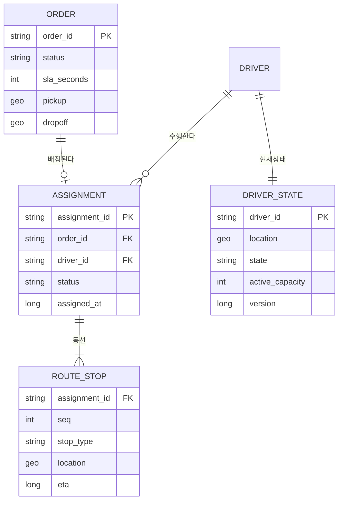
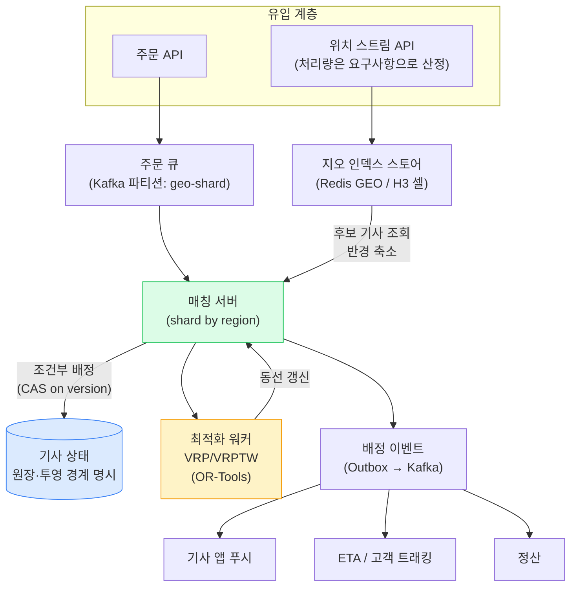
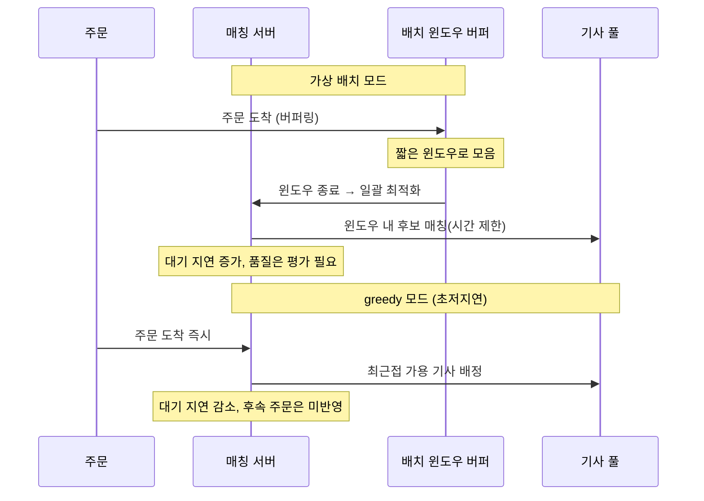
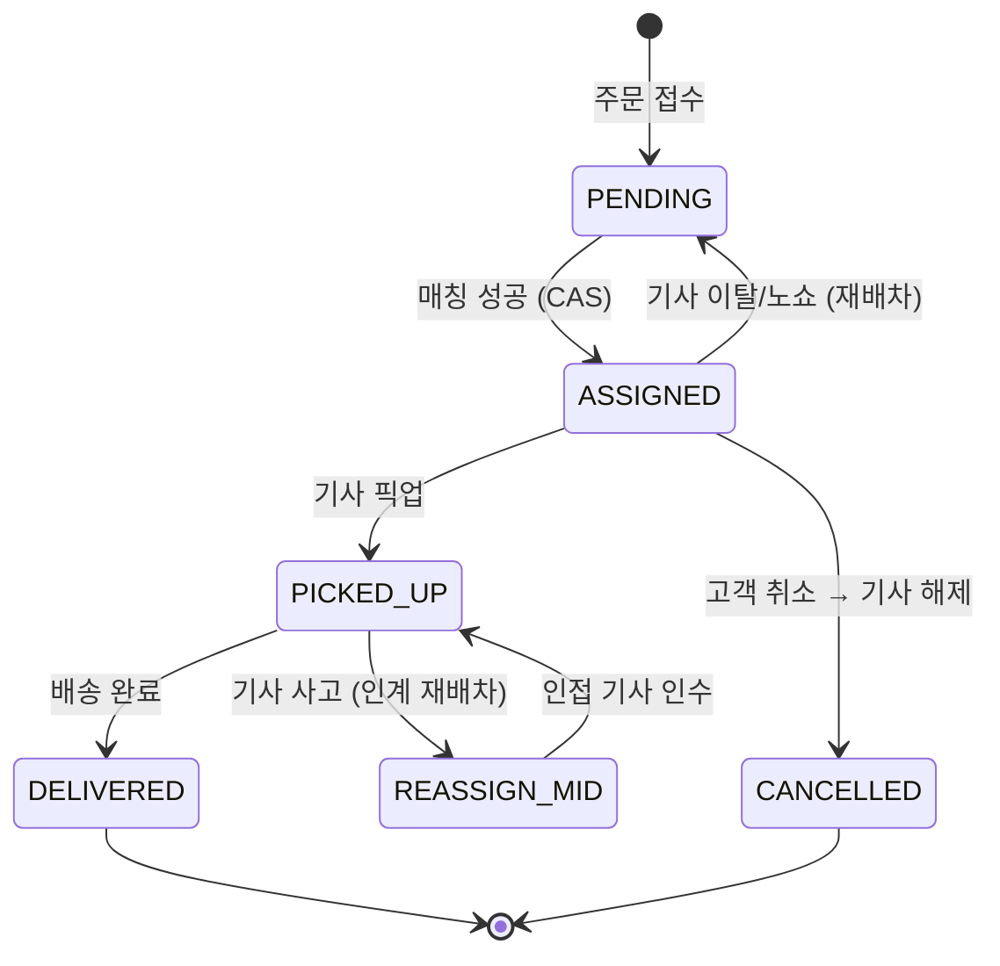

> **검수 경계 — 공개 알고리즘과 예시 설계를 구분한다**
>
> H3·OR-Tools·Redis의 문서가 보장하는 기능과, 특정 배달 회사의 실제 운영 알고리즘은 서로 다른 주장이다. 이 카드의 수치·윈도우·처리량은 제품 요구사항으로 주어진 값이 아니라 예시 변수로 다룬다. Uber·배민·쿠팡의 내부 매칭 정책이나 품질 개선 폭은 공개 자료가 확인하는 범위에서만 언급하고, 나머지는 가상 설계로 표시한다.

## 1. 요구사항 명확화 (Functional / Non-functional)

배차 최적화 시스템(Dispatch Optimization System)은 "발생한 주문·화물"과 "가용한 기사·차량"을 잇고, 각 기사의 방문 순서(경로)를 최소 비용으로 배열하는 엔진이다. 즉시배송(퀵커머스)과 계획배송(당일·익일)이 한 플랫폼에 공존한다고 가정한다.

### Functional Requirements

| 구분 | 요구사항 |
| --- | --- |
| 매칭(Matching) | 신규 주문을 후보 기사 집합에서 최적 기사에게 배정 |
| 라우팅(Routing) | 배정된 기사의 다중 정거장 방문 순서 최적화 (VRP/VRPTW) |
| 재배차(Re-dispatch) | 기사 이탈·노쇼·주문 취소 시 남은 화물 재배정 |
| 실시간 삽입(Dynamic insertion) | 운행 중 기사 동선에 신규 주문 끼워넣기 |
| 상태 관리 | 기사 상태(대기/배정/픽업/운행/오프라인) 원자적 전이 |

### Non-functional Requirements

- **매칭 지연 SLA(Service Level Agreement)**: 즉시배송은 주문 접수 → 배정까지 **P99 3초** 이내. 계획배송은 배치 수 분 허용.
- **정합성(Consistency)**: 이중 배차 절대 금지 — 한 기사, 한 시점, 한 활성 배정.
- **가용성(Availability)**: 최적화 엔진 장애 시에도 greedy fallback으로 배차는 계속.
- **확장성(Scalability, 예시 입력)**: 피크 시간당 100만 주문(평균 약 280건/초), 활성 기사 10만. 실제 목표는 제품 SLA와 관측 데이터로 정한다.

> **🎯 면접 포인트 — "무엇을 최소화하나"를 먼저 못 박아라**
>
> 요구사항 단계에서 목적함수(objective)를 확정하지 않으면 설계가 산으로 간다. 즉시배송은 **고객 대기시간(pickup ETA)** 최소화가 1순위, 계획배송은 **총 주행거리·차량 수** 최소화가 1순위다. 여기에 기사 수입 형평성(fairness)·취소율까지 얹히면 **다목적 가중합(weighted multi-objective)** 이 된다. "그냥 가까운 기사요"라고 답하면 시니어 탈락. 🔥

## 2. 용량 추정 (Back-of-the-envelope)

정량 감각은 제품 요구사항으로 주어진 예시 입력을 사용한다. 아래 값은 특정 회사의 공개 처리량이 아니다.

- **주문 유입 예시**: 피크 시간당 **100만 건** → 평균 **약 280 QPS(Queries Per Second, 초당 쿼리 수)**. 실제 피크와 허용 지연은 제품 요구사항으로 다시 산정한다.
- **활성 기사 예시**: **10만 명**이 5초마다 위치를 갱신한다고 가정하면 위치 업데이트량은 20,000건/초다. 이 값은 설계 입력이며 특정 회사의 공개 처리량이 아니다.
- **거리/시간 행렬**: n개 정거장이면 `n²` 셀. 기사당 20 스톱이면 400 셀, 캐싱 필수.
- **매칭 상태 저장**: 활성 배정 10만 × (주문ID·기사ID·상태·TTL) ≈ 수십 MB → 인메모리(Redis) 충분.

> **💡 팁 — 후보 축소가 90%의 승부처**
>
> 배차의 계산량은 "후보 기사 수 × 주문 수"에 지배된다. 후보를 10만 → 50으로 줄이면 계산량이 **2,000배** 감소한다. 지오 인덱스(H3/S2) 기반 반경 후보 조회가 사실상 전체 시스템의 처리량 상한을 결정한다.

## 3. API / 데이터 모델

### API

```kotlin
// 신규 주문 배차 요청 (즉시배송)
POST /v1/dispatch
{
  "orderId": "ORD-9F2A",
  "pickup":   { "lat": 37.4979, "lng": 127.0276 },  // 판교
  "dropoff":  { "lat": 37.5013, "lng": 127.0396 },
  "slaSeconds": 1800,          // 시간창(VRPTW) — 30분 내 완료
  "capacity":  1               // 적재 단위
}
// 202 Accepted → 비동기 배정. 결과는 이벤트/웹훅으로 통지

// 기사 위치 스트리밍 (5초 주기, 대량)
POST /v1/drivers/{driverId}/location
{ "lat": 37.499, "lng": 127.031, "ts": 1751846400, "state": "IDLE" }

// 재배차 트리거 (기사 이탈·취소)
POST /v1/dispatch/{orderId}/reassign
{ "reason": "DRIVER_OFFLINE" }
```

### 데이터 모델 (Aggregate 경계)


```mermaid
erDiagram
    ORDER ||--o| ASSIGNMENT : "배정된다"
    DRIVER ||--o{ ASSIGNMENT : "수행한다"
    DRIVER ||--|| DRIVER_STATE : "현재상태"
    ASSIGNMENT ||--|{ ROUTE_STOP : "동선"
    ORDER {
        string order_id PK
        string status
        int sla_seconds
        geo pickup
        geo dropoff
    }
    DRIVER_STATE {
        string driver_id PK
        geo location
        string state
        int active_capacity
        long version
    }
    ASSIGNMENT {
        string assignment_id PK
        string order_id FK
        string driver_id FK
        string status
        long assigned_at
    }
    ROUTE_STOP {
        string assignment_id FK
        int seq
        string stop_type
        geo location
        long eta
    }
```

> **⚠️ 실무 함정 — 기사 상태는 강한 일관성, 위치는 최종 일관성**
>
> `DRIVER_STATE.state`(IDLE→ASSIGNED)의 조건부 전이는 이중 배차를 막는 **정합성의 핵심**이다. 위치는 관측 시각과 허용 지연을 가진 별도 투영으로 다룰 수 있다. 위치 갱신과 배정 원장을 한 핫 레코드에 묶으면 경합이 커질 수 있으므로 저장·갱신 경계를 측정해 정한다. Redis 안의 원자 전이가 다른 DB의 배정 원장까지 원자화하지는 않는다.

## 4. High-level 아키텍처


```mermaid
flowchart TB
    subgraph Ingest["유입 계층"]
        ORD["주문 API"]
        LOC["위치 스트림 API\n(처리량은 요구사항으로 산정)"]
    end
    ORD --> MQ["주문 큐\n(Kafka 파티션: geo-shard)"]
    LOC --> GEO["지오 인덱스 스토어\n(Redis GEO / H3 셀)"]

    MQ --> MATCH["매칭 서버\n(shard by region)"]
    GEO -->|"후보 기사 조회\n반경 축소"| MATCH
    MATCH -->|"조건부 배정\n(CAS on version)"| STATE[("기사 상태\n원장·투영 경계 명시")]
    MATCH --> OPT["최적화 워커\nVRP/VRPTW\n(OR-Tools)"]
    OPT -->|"동선 갱신"| MATCH
    MATCH --> EVT["배정 이벤트\n(Outbox → Kafka)"]
    EVT --> PUSH["기사 앱 푸시"]
    EVT --> ETA["ETA / 고객 트래킹"]
    EVT --> SETTLE["정산"]

    style MATCH fill:#dcfce7,stroke:#22c55e
    style OPT fill:#fef3c7,stroke:#f59e0b
    style STATE fill:#dbeafe,stroke:#3b82f6
```

*배차 엔진 아키텍처 — 지역 샤딩된 매칭 서버 + 지오 인덱스 후보 축소 + 원자적 상태 전이 + 비동기 VRP 워커*

핵심은 **매칭 서버를 지역(region)으로 샤딩**해 한 지역의 주문·기사·상태를 한 파티션에서 처리하는 것이다. 그래야 이중 배차를 로컬에서 직렬화할 수 있고, 크로스 리전 분산 락을 피한다.

## 5. Deep-dive

### 5-1. VRP의 NP-hard와 실무 근사

VRP(Vehicle Routing Problem, 차량 경로 문제)와 그 파생인 VRPTW(VRP with Time Windows, 시간창 제약)·CVRP(Capacitated VRP, 용량 제약)는 모두 **NP-hard**다. 정거장 n개의 경로 조합은 계승(factorial)으로 폭증해 20개만 돼도 완전 탐색이 불가능하다. 따라서 최적해 대신 **"충분히 좋은 해를 수십 ms~수 초에"** 찾는다.

| 접근 | 방법 | 특징 · 도구 |
| --- | --- | --- |
| 정확해(Exact) | 정수계획법(MILP), 분기한정(B&B) | 최적 보장, 수십 노드 한계. `Gurobi`, `CPLEX` |
| 휴리스틱(Heuristic) | 최근접 이웃, Savings, cheapest insertion | 빠르고 단순, 초기해·실시간 삽입용 |
| 메타휴리스틱(Metaheuristic) | 2-opt/Or-opt, 타부서치, ALNS, 담금질 | 품질↑ 시간↑. `OR-Tools`(구글), `LKH` |

실시간 매칭에서는 **cheapest insertion(최소 비용 삽입)** 으로 즉시 배정하고, 백그라운드 워커가 **국소 2-opt/ALNS**로 동선을 다듬는 2단계 구조를 선택할 수 있다. SLA와 목적 함수에 맞춰 검증한다.

### 5-2. 배치 매칭 vs 실시간 greedy 매칭


```mermaid
sequenceDiagram
    participant O as 주문
    participant M as 매칭 서버
    participant W as 배치 윈도우 버퍼
    participant D as 기사 풀

    Note over M,W: 가상 배치 모드
    O->>W: 주문 도착 (버퍼링)
    Note over W: 짧은 윈도우로 모음
    W->>M: 윈도우 종료 → 일괄 최적화
    M->>D: 윈도우 내 후보 매칭(시간 제한)
    Note over M: 대기 지연 증가, 품질은 평가 필요

    Note over M,D: greedy 모드 (초저지연)
    O->>M: 주문 도착 즉시
    M->>D: 최근접 가용 기사 배정
    Note over M: 대기 지연 감소, 후속 주문은 미반영
```

| 관점 | 배치 매칭 (Batch) | 실시간 greedy |
| --- | --- | --- |
| 매칭 지연 | 큼 (윈도우 정책에 따름) | 작음 (서비스 SLA에 따름) |
| 해 품질 | 윈도우 안의 후보를 함께 비교할 수 있음 | 현재 후보에서 빠르게 선택하나 후속 주문을 보지 못함 |
| 기사 활용 | 묶음 배정 기회가 생기지만 대기 비용 발생 | 즉시 배정하되 후속 주문과 묶을 기회 감소 |
| 취소·이탈 민감도 | 윈도우 안에서는 재계산 가능, 확정 후에는 재배차 필요 | 확정 직후부터 재배차 정책 필요 |
| 적용 예 | 공개 자료와 제품 요구사항으로 검증 | 단순 콜 배차 설계 예 |

> **🎯 면접 포인트 — 우버는 왜 "잠깐 기다렸다" 매칭하나**
>
> 직관과 달리 **즉시 배정이 항상 최선은 아니다**. [Uber의 승차 매칭 설명](https://www.uber.com/ca/en/marketplace/matching/)은 가까운 기사·승객 요청을 몇 초 모아 한 배치에서 평가한다고 밝힌다. 이는 Uber 승차 서비스의 공개 사례이며 배민·쿠팡의 내부 알고리즘이나 모든 배달 서비스의 표준을 뜻하지 않는다. 이 카드의 가상 설계에서는 배치와 greedy를 지연·밀도·재배차 비용으로 비교하고, 개선 폭을 동일한 데이터셋과 목적 함수로 측정한다.

### 5-3. 지오 인덱스로 후보 축소 (H3 / S2 / geohash)


| 인덱스 | 셀 모양 | 특징 |
| --- | --- | --- |
| **H3** | 육각형(hexagon) | 이웃 셀 조회와 링 확장을 제공하며 후보 검색에 사용할 수 있음 |
| **S2** (Google) | 사각형(구면 힐베르트) | 계층·범위 스캔 강함, 지리 검색 범용 |
| **geohash** | 사각형(문자열) | 단순·prefix 검색, 경계 왜곡·경계 문제 큼 |

> **⚠️ 실무 함정 — 셀 경계(boundary) 문제**
>
> 픽업 지점이 셀 가장자리에 있으면 더 가까운 기사가 옆 셀에 있어 후보에서 누락될 수 있다. 픽업 셀과 인접 셀을 함께 조회하고, H3에서는 gridDisk 같은 이웃 셀 조회를 사용한 뒤 실제 거리·ETA로 재필터링한다. hotspot에서는 한 셀의 후보 수가 급증할 수 있으므로 해상도·조회 반경·상위 후보 수를 운영 변수로 둔다. 후보 축소로 해 품질이 얼마나 떨어지는지는 동일한 로그와 목적 함수로 측정한다.

### 5-4. 이중 배차 방지 — 원자적 할당

가장 위험한 정합성 문제. 두 주문 스레드가 같은 IDLE 기사를 동시에 집으면 **한 기사에 두 배정**이 생긴다.

```kotlin
// Redis Lua — CAS(Compare-And-Swap) 원자적 배정
// KEYS[1] = driver:{id}:state, ARGV[1] = orderId
val script = """
  if redis.call('HGET', KEYS[1], 'state') == 'IDLE' then
    redis.call('HSET', KEYS[1], 'state', 'ASSIGNED', 'order', ARGV[1])
    return 1            -- 배정 성공
  else
    return 0            -- 이미 다른 주문이 선점 → 다음 후보로
  end
"""
```

| 기법 | 지연 | 처리량 | 정합성 | 적합성 |
| --- | --- | --- | --- | --- |
| 낙관적 락 (version CAS) | 충돌·재시도에 좌우 | 핫 행 경합에 좌우 | DB의 조건부 갱신 범위 | 충돌 드문 상태 전이 |
| 분산 락 (Redis/etcd) | lease 획득·갱신 비용 | 락 키 경합에 좌우 | 보호 대상 쓰기와 fencing을 별도로 설계 | 여러 작업자 조정 |
| 원자적 CAS (Lua/CAS) | 저장소 내부 왕복·경합에 좌우 | 핫 키 분포에 좌우 | 해당 저장소의 한 상태 전이를 원자화 | **단일 기사 상태 전이** |
| 단일 파티션 직렬화 | 큐 적체에 좌우 | 파티션 수·핫 지역에 좌우 | 파티션 소유 경계의 순서 보장 | 지역 샤드 내 순차 처리 |

지역 샤딩, DB 낙관적 락, Redis CAS, 단일 파티션 직렬화 중 하나 또는 조합을 선택하되, 각 선택의 소유 경계와 복구 경로를 명시한다. 매칭 서버가 지역별로 샤딩돼 있으면 한 지역 배정이 한 스레드에서 순차 처리돼 경합 자체가 줄고, 남은 경합은 CAS로 막는다.

### 5-5. 실시간 재배차


```mermaid
stateDiagram-v2
    [*] --> PENDING : 주문 접수
    PENDING --> ASSIGNED : 매칭 성공 (CAS)
    ASSIGNED --> PICKED_UP : 기사 픽업
    PICKED_UP --> DELIVERED : 배송 완료
    ASSIGNED --> PENDING : 기사 이탈/노쇼 (재배차)
    ASSIGNED --> CANCELLED : 고객 취소 → 기사 해제
    PICKED_UP --> REASSIGN_MID : 기사 사고 (인계 재배차)
    REASSIGN_MID --> PICKED_UP : 인접 기사 인수
    DELIVERED --> [*]
    CANCELLED --> [*]
```

*배차 상태 머신 — 이탈·취소·중도 사고를 재배차/해제로 흡수. 각 전이는 도메인 이벤트로 발행*

- **기사 이탈·노쇼**: `ASSIGNED → PENDING` 으로 되돌려 재매칭 큐에 재투입. 이때 기사 상태는 CAS로 IDLE 복귀.
- **고객 취소**: 배정 해제 + 기사 즉시 IDLE → 다음 후보로. 취소가 픽업 후면 반품 흐름.
- **멱등성(Idempotency)**: 재배차 트리거·기사 스캔은 중복 수신되므로 `assignment_id` 기준 멱등 처리. 안 그러면 한 주문이 두 번 재배차된다.

### 5-6. 시뮬레이션과 A/B

배차 알고리즘은 프로덕션에서 바로 실험하면 위험하다(잘못된 매칭 = 실제 지각·손실). 그래서 **과거 주문·기사 로그를 리플레이하는 시뮬레이터**로 오프라인 평가 후, **셰도우 트래픽(shadow) → 소규모 지역 A/B → 전면 롤아웃** 순으로 검증한다. 지표는 픽업 ETA·완료율·기사 유휴율·취소율.

> **💡 팁 — 배차는 마켓플레이스다, "매칭"만 보지 마라**
>
> 배차 최적화의 궁극 목표는 개별 매칭이 아니라 **공급(기사)-수요(주문) 균형**이다. 특정 지역에 주문이 몰리면 인접 지역 기사를 미리 유도(surge/reposition)하는 것까지가 배차의 영역이다. 가격·인센티브·재배치가 배차 공급에 영향을 줄 수 있다는 가설은 별도의 비즈니스 정책으로 검증해야 한다.

## 6. Trade-off 정리

| 결정 | 선택지 A | 선택지 B | 언제 A / 언제 B |
| --- | --- | --- | --- |
| 매칭 방식 | 짧은 윈도우의 배치 | greedy(즉시) | 밀도·지연 예산·이탈률을 측정해 선택 |
| 최적화 위치 | 동기(요청 경로) | 비동기 워커 | SLA 여유 → A / 초저지연 → B(삽입만 동기) |
| 이중배차 방지 | 분산 락 | 지역 샤딩+CAS | 크로스 리소스 → A / 단일 상태 → B |
| 후보 축소 | 큰 반경(품질↑) | 작은 반경(속도↑) | 저밀도 → A / hotspot → B |
| 재배차 | 즉시 전체 재계산 | 증분 삽입 | 대량 이탈 → A / 단건 → B |

> **🎯 면접 정리 — 한 문장**
>
> "배차 최적화는 **지오 인덱스로 후보를 줄이고**, **밀도와 SLA에 따라 배치/greedy를 선택**하며, **VRP의 제약과 시간 제한을 둔 근사 해법**을 사용한다. 배정 상태는 조건부 갱신으로 이중 배차를 막고, 위치 지연·기사 이탈·최적화 시간 초과는 멱등 이벤트와 fallback으로 흡수한다."

## 7. 실패 흐름과 검증 경계

배차는 점수 계산만으로 끝나지 않는다. 다음 상태를 함께 설계해야 한다.

- **후보 셀 경계 누락**: 픽업 셀 하나만 조회하지 말고 H3의 인접 셀 조회 범위를 정책으로 정한다. 조회 범위를 넓힌 뒤 거리·ETA로 재필터링한다.
- **동시 배정**: 후보를 읽은 뒤 상태를 다시 조건부 갱신한다. Redis 스크립트가 원자적이어도 Redis와 관계형 DB의 원자성이 자동으로 합쳐지는 것은 아니므로 최종 원장, outbox, 재대사 작업을 둔다.
- **기사 이탈·노쇼**: assignment_id 기준으로 한 번만 재배차 큐에 넣고, 이전 배정의 해제와 새 배정의 소유자를 기록한다.
- **위치 데이터 지연**: 마지막 위치의 시각과 정확도를 함께 보관하고, 오래된 위치를 현재 위치처럼 사용하지 않는다.
- **최적화 시간 초과**: 무응답으로 두지 말고 제한 시간 내 최선의 해, greedy fallback, 수동 운영 큐 중 하나를 명시한다.
- **실험 중 품질 저하**: 과거 로그 리플레이와 shadow 평가로 지표를 비교한 뒤 작은 권역부터 rollout한다. 개선 폭은 반드시 동일 데이터셋과 동일 목적 함수로 보고한다.

## 8. 공식 출처

- [Google OR-Tools — Vehicle Routing](https://developers.google.com/optimization/routing)
- [Google OR-Tools — Routing Options](https://developers.google.com/optimization/routing/routing_options)
- [H3 — gridDisk traversal](https://h3geo.org/docs/api/traversal/)
- [Uber — Marketplace Matching](https://www.uber.com/ca/en/marketplace/matching/)
- [Redis — Lua scripting atomic execution](https://redis.io/docs/latest/develop/programmability/eval-intro/)
- [Redis — Functions](https://redis.io/docs/latest/develop/programmability/functions-intro/)

OR-Tools 문서는 VRP의 제약·탐색 제한·최적해 보장의 한계를 설명하고, H3 문서는 인접 셀 조회 API를 설명한다. Uber 자료는 자사 승차 매칭의 공개 설명이며 배달 회사의 내부 구현을 증명하지 않는다. Redis 원자성은 Redis 실행 단위에 한정되며 다른 DB와의 분산 트랜잭션을 보장하지 않는다.
