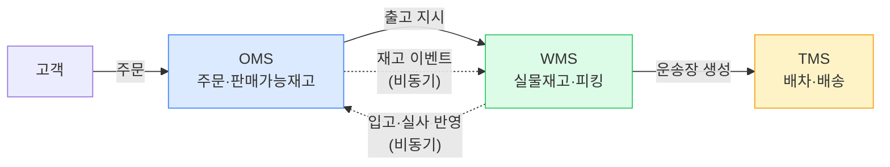
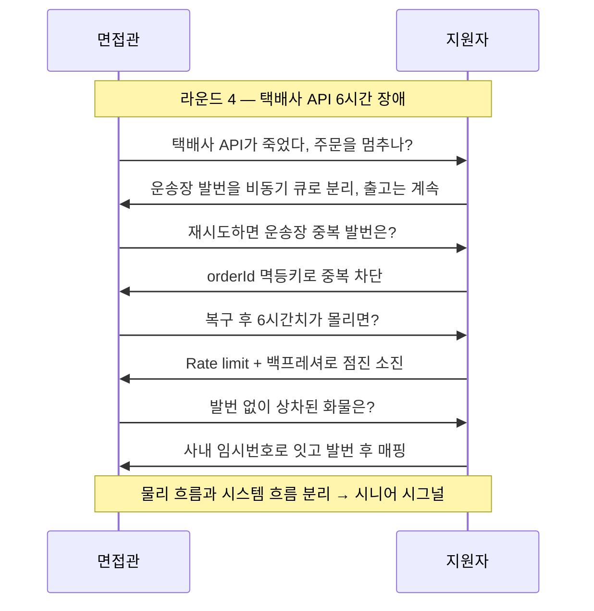

## 1. 면접 시나리오 개요

이 카드는 **물류 도메인 지식 면접**을 시뮬레이션한다. 면접관은 "쿠팡·컬리급 커머스의 재고·주문 정합성"을 주제로, 표면적 답변이 나오면 **실무 엣지 케이스로 파고든다**. 각 라운드는 `메인 질문 → 모범 답변 포인트 → 압박 후속 질문` 구조다. 답을 먼저 스스로 말해보고 포인트와 대조하라.

전제 시스템: **OMS**(Order Management System, 주문관리) — 주문 수집·검증·상태, **WMS**(Warehouse Management System, 창고관리) — 입고·보관·피킹·출고, **TMS**(Transportation Management System, 운송관리) — 배차·운송. 세 시스템은 **별도 서비스·별도 DB**로 분리돼 있다(현실적 가정).



*세 시스템 경계 — OMS는 판매가능재고, WMS는 실물재고를 본다. 이 둘의 간극이 모든 면접 질문의 씨앗*

> **💡 팁 — "재고는 하나의 숫자가 아니다"부터 깔고 들어가라**
>
> 초보는 재고를 `stock: 100` 단일 값으로 본다. 실무는 **On-hand(실물)·Available(가용)·Reserved(예약)·In-transit(이동중)·Damaged(손망실)** 를 구분한다. 이 구분을 첫 문장에 깔면 이후 모든 압박 질문에 방어선이 생긴다.

## 2. 라운드별 압박 시나리오

### 라운드 1 — 주문↔재고 정합성을 어떻게 보장하나

**메인 질문**: "고객이 주문하면 재고를 차감해야 한다. OMS와 WMS가 별도 DB인데, 어떻게 정합성을 맞추나?"

**모범 답변 포인트**
- 주문 시점엔 실물을 빼지 않고 **예약(Reserve)** 만 한다: `Available -= 1, Reserved += 1`. 실제 차감(On-hand↓)은 **출고(Ship)** 시점.
- 3단계 라이프사이클: **Reserve(예약) → Commit(확정) → Ship(출고)**, 미결제·이탈은 **예약 만료(TTL)** 로 자동 환원.
- 서비스 간 원자성이 불가하므로 **Saga(보상 트랜잭션)** + **Outbox(아웃박스로 이벤트 발행 보장)** 로 최종 일관성.

**압박 후속 질문**
1. "예약만 하고 결제가 20분간 안 오면? 그 재고는 죽어 있나?" → 예약 TTL(만료)로 자동 해제, 만료 이벤트로 Available 환원. TTL을 너무 길게 잡으면 재고가 잠겨 **판매 기회 손실**, 너무 짧으면 결제 중 만료로 **결제 후 품절** 사고.
2. "Outbox 없이 그냥 커밋 후 이벤트 발행하면?" → 커밋 성공·발행 실패 시 **재고 이벤트 유실** → WMS가 모르는 유령 예약. Outbox는 커밋과 이벤트를 한 트랜잭션에 묶어 유실을 막는다.

> **⚠️ 실무 함정 — "재고를 그냥 빼면 되지"는 즉시 탈락**
>
> 주문 즉시 `On-hand -= 1`을 하면, 결제 실패·이탈·취소 때 환원 타이밍이 꼬이고, 동시에 여러 주문이 같은 재고를 빼려는 경합에서 오버셀이 난다. 예약(reservation) 단계 없이 답하면 도메인 이해 부족으로 본다.

### 라운드 2 — 오버셀이 났다, 어떻게 복구하나

**메인 질문**: "프로모션 트래픽에 동시성 제어가 뚫려 재고 10개인데 13건이 결제됐다. 어떻게 복구하나?"

**모범 답변 포인트**
- 먼저 **재발 방지**와 **기발생 복구**를 분리. 재발은 원자적 차감(DB `UPDATE ... WHERE available > 0`, 조건부 감소)·분산 락으로.
- 복구는 **자동 vs 수동 경계**를 정한다: 소액·재입고 임박은 자동 지연 배송 안내, 고가·긴급은 수동 CS 개입.
- 보상 우선순위: ① 고객(가장 먼저 알림·대안 제시·보상쿠폰) ② 재고(초과분 취소 처리, 재입고 예약) ③ 정산(취소분 결제 취소·PG 환불, 정산 마감 전 반영).

**압박 후속 질문**
1. "13명 중 누구를 취소시키나? 순서는?" → 정책 문제. 결제 완료 시각 순(선착순), 또는 등급·귀책. 아무 기준 없이 랜덤 취소하면 **CS 폭발**. 면접에선 "비즈니스 정책으로 명시적 규칙을 둔다"가 정답.
2. "이미 출고 지시가 WMS로 넘어간 3건은?" → 출고 취소 가능 상태면 회수, 이미 피킹·상차됐으면 **되돌릴 수 없어** 다른 창고 재고로 대체하거나 사과·보상. 상태에 따라 복구 경로가 갈린다.

```kotlin
// 재발 방지 — 조건부 원자적 차감 (오버셀 방지의 1차 방어선)
// 영향 행수 0이면 재고 부족 → 예약 실패로 처리
val affected = jdbc.update(
    """
    UPDATE inventory
       SET available = available - :qty,
           reserved  = reserved  + :qty
     WHERE sku = :sku
       AND available >= :qty
    """.trimIndent(),
    mapOf("qty" to qty, "sku" to sku),
)
if (affected == 0) throw OutOfStockException(sku)  // 오버셀 차단
```

> **🎯 면접 포인트 — "복구"를 기술로만 답하면 반쪽**
>
> 오버셀 복구는 순수 기술 문제가 아니라 **고객 경험·정산·법무가 얽힌 운영 문제**다. 시니어는 "누구를 취소할지, 어떻게 통지할지, 정산 마감과 어떻게 정렬할지"라는 **정책·프로세스**까지 답한다. 기술적 롤백만 말하면 미들 수준. 🔥

### 라운드 3 — WMS와 OMS의 재고가 다르다, 어디가 진실인가

**메인 질문**: "WMS는 실물 98개, OMS는 판매가능 90개라고 한다. 어느 쪽이 맞나?"

**모범 답변 포인트**
- **둘 다 맞다** — 서로 다른 것을 세기 때문. 단순히 "한쪽이 진실"이라 답하면 안 된다.
- 차이의 정상적 원인: ① **예약(Reserved)** — OMS가 판 것을 뺐지만 아직 실물은 있음 ② **이동중(In-transit)** — 창고 간 이동 재고 ③ **미반영 입고** — 입고됐으나 OMS 미동기화 ④ **실사 차이(손망실·오피킹)** — 전산≠실물.
- **진실의 원천(Source of Truth)** 은 관점별로 다르다: **실물 수량의 진실은 WMS**, **판매 가능 수량의 진실은 OMS**. 정기 **재고 실사(Cycle count)** 로 격차를 좁히고 원인을 분류한다.

**압박 후속 질문**
1. "그럼 고객에게 보여줄 '재고 있음/없음'은 누구 기준인가?" → **OMS의 Available** 기준(팔 수 있는가). 단, 안전재고(safety stock) 버퍼로 실사 오차·동시성 리스크를 흡수.
2. "실사에서 실물이 전산보다 계속 적게 나오면?" → 손망실·오피킹·도난 신호. 원인 분류 후 **재고 조정(adjustment)** 을 감사 로그와 함께 기록. 조용히 숫자만 맞추면 근본 원인을 못 잡는다.

| 항목 | 나쁜 답변 | 좋은 답변 |
| --- | --- | --- |
| 재고 모델 | "stock 하나로 관리" | On-hand/Available/Reserved/In-transit 구분 |
| 정합성 | "트랜잭션으로 묶으면 됨" | 서비스 분리 → 예약+Saga+Outbox+TTL |
| 진실 원천 | "무조건 WMS가 진실" | 실물=WMS, 판매가능=OMS, 실사로 수렴 |
| 불일치 | "버그니까 맞추면 됨" | 정상 원인 분류 + 손망실은 감사·조정 |

### 라운드 4 — 택배사 API가 6시간 죽었다

**메인 질문**: "운송장 발번·배송 조회를 위탁하는 택배사 API가 6시간 장애다. 어떻게 버티나?"

**모범 답변 포인트**
- **주문·출고는 멈추면 안 된다** — 운송장 발번을 **비동기·큐잉**으로 분리. API 복구 후 재시도(retry with backoff)로 발번.
- **멱등성(Idempotency)** 필수 — 재시도로 같은 주문에 운송장 두 번 발번되면 안 됨. `orderId` 기준 멱등키.
- **Circuit Breaker(회로 차단기)** 로 죽은 API를 계속 때리지 않게 차단, **Fallback**(임시 사내 번호·대체 택배사)로 우회.
- 고객 배송 조회는 **캐시된 마지막 상태 + "조회 지연 안내"** 로 노출.

**압박 후속 질문**
1. "복구 후 6시간치 밀린 요청이 한꺼번에 몰리면?" → **큐 + Rate limit(속도 제한)** 으로 점진 소진(백프레셔). 한 번에 쏟으면 복구된 API를 또 죽인다.
2. "그 6시간에 발번 없이 상차·간선 출발한 화물은?" → 사내 임시 추적번호로 흐름을 잇고, 발번 후 **매핑**. 물리 흐름(상차)과 시스템 흐름(발번)을 분리해 설계한 게 핵심.



*라운드 4 문답 흐름 — 압박이 3단계 이어질 때 방어선(비동기→멱등→백프레셔→흐름분리)이 무너지지 않아야 한다*

> **⚠️ 실무 함정 — 외부 API를 동기 강결합하면 전체가 같이 죽는다**
>
> 택배사·PG·지도 API 같은 외부 의존을 주문 처리 경로에 **동기 호출**로 박으면, 그 API 장애가 곧 주문 불능이 된다. 실무는 **비동기 분리 + Circuit Breaker + Fallback + 멱등 재시도**로 외부 장애를 흡수한다. "재시도하면 되죠"만 답하면 중복·폭주 함정에 빠진다.

## 3. 좋은 답변 vs 나쁜 답변 (종합)

| 주제 | 나쁜 답변 (탈락) | 좋은 답변 (합격) |
| --- | --- | --- |
| 재고 차감 | 주문 즉시 On-hand 차감 | 예약→확정→출고 3단계 + TTL 만료 |
| 서비스 정합성 | 분산 트랜잭션(2PC)으로 묶기 | Saga + Outbox + 최종 일관성 |
| 오버셀 | "동시성 버그니까 락 걸면 끝" | 재발 방지 + 정책 기반 복구 + 보상 |
| 진실 원천 | "WMS가 무조건 맞다" | 관점별 진실 + 실사로 수렴 |
| 외부 API 장애 | "재시도하면 됨" | 비동기+CB+Fallback+멱등+백프레셔 |
| 불일치 처리 | 숫자만 맞춤 | 원인 분류 + 감사 로그 + 조정 |

> **💡 팁 — 압박에 답이 막히면 "정책으로 정한다"로 빠져나오라**
>
> "누구를 취소하나", "TTL 몇 분이 맞나" 같은 질문은 **정답이 없는 비즈니스 정책**이다. 임의 숫자를 우기지 말고 "이건 손실률·CS 비용·전환율을 저울질하는 비즈니스 정책 결정이고, 저라면 A/B로 튜닝하겠다"고 답하면 오히려 성숙도로 읽힌다.

## 4. 평가 루브릭 (자기 진단)

| 레벨 | 재고 모델 | 정합성 | 장애·엣지 | 종합 시그널 |
| --- | --- | --- | --- | --- |
| **주니어** | stock 단일 값 인식 | 트랜잭션으로 묶으려 함 | 재시도만 언급 | 정상 흐름만 답, 엣지 취약 |
| **미들** | On-hand/Available 구분 | 예약+최종 일관성 이해 | CB·멱등 언급 | 기술 해법은 알되 정책·운영 약함 |
| **시니어** | 5종 재고 상태 + 실사 | Saga+Outbox+TTL, 진실원천 관점화 | 백프레셔·흐름분리·정책 결정 | 기술+운영+비즈니스 균형, 압박 3단계 방어 |

> **🎯 면접 정리 — 한 문장**
>
> "물류 도메인 면접의 핵심은 **재고를 다차원 상태로 보고**(On-hand·Available·Reserved·In-transit), **분산 정합성을 예약+Saga+Outbox+TTL로 풀며**, **오버셀·불일치·외부장애를 정책과 보상 트랜잭션으로 복구**하고, **어느 쪽이 진실이냐에 '관점별 진실 + 실사 수렴'으로 답하는** 것 — 정상 흐름이 아니라 엣지 케이스에서 레벨이 갈린다."
