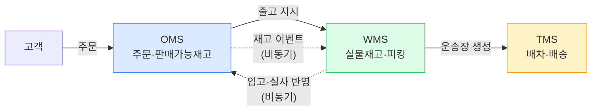
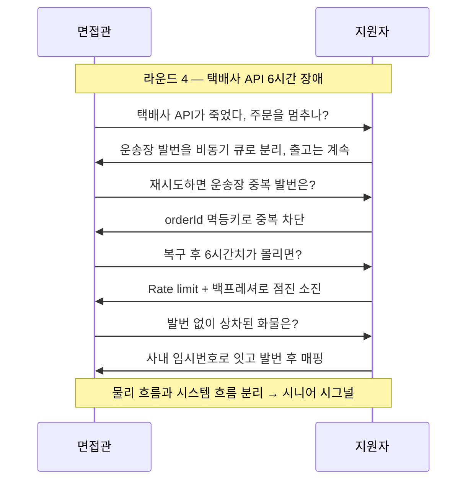

> **검수 경계 — 면접 시나리오는 가상 장애다**
>
> 이 카드의 “택배사 API가 6시간 죽었다”는 문장은 실제 특정 회사의 장애 기록이 아니라 면접용 가상 입력이다. 회사별 SLA, 재고 원장, 결제·운송 계약은 공개 자료와 계약에 따라 다르므로 숫자나 복구 시간을 보편 규칙처럼 답하지 않는다. 답변은 상태 소유자, 재시도·멱등성, 보상, 고객 안내, 대사와 운영 개입의 경계를 설명해야 한다.

## 1. 면접 시나리오 개요

이 카드는 **물류 도메인 지식 면접**을 시뮬레이션한다. 면접관은 대규모 커머스의 재고·주문 정합성을 가상 시나리오로, 표면적 답변이 나오면 **실무 엣지 케이스로 파고든다**. 각 라운드는 `메인 질문 → 모범 답변 포인트 → 압박 후속 질문` 구조다. 답을 먼저 스스로 말해보고 포인트와 대조하라.

전제 시스템: **OMS**(Order Management System, 주문관리) — 주문 수집·검증·상태, **WMS**(Warehouse Management System, 창고관리) — 입고·보관·피킹·출고, **TMS**(Transportation Management System, 운송관리) — 배차·운송. 이 카드는 세 시스템이 별도 서비스·별도 DB인 가상 전제를 사용한다. 실제 제품의 경계는 요구사항과 운영 계약으로 확인해야 한다.


```mermaid
flowchart LR
    C["고객"] -->|"주문"| OMS["OMS\n주문·판매가능재고"]
    OMS -->|"출고 지시"| WMS["WMS\n실물재고·피킹"]
    WMS -->|"운송장 생성"| TMS["TMS\n배차·배송"]
    OMS -.->|"재고 이벤트\n(비동기)"| WMS
    WMS -.->|"입고·실사 반영\n(비동기)"| OMS
    style OMS fill:#dbeafe,stroke:#3b82f6
    style WMS fill:#dcfce7,stroke:#22c55e
    style TMS fill:#fef3c7,stroke:#f59e0b
```

*세 시스템 경계 — OMS는 판매가능재고, WMS는 실물재고를 본다. 이 둘의 간극이 모든 면접 질문의 씨앗*

> **💡 팁 — "재고는 하나의 숫자가 아니다"부터 깔고 들어가라**
>
> 초보는 재고를 `stock: 100` 단일 값으로 본다. 실무는 **On-hand(실물)·Available(가용)·Reserved(예약)·In-transit(이동중)·Damaged(손망실)** 를 구분한다. 이 구분을 첫 문장에 깔면 이후 모든 압박 질문에 방어선이 생긴다.

## 2. 라운드별 압박 시나리오

### 라운드 1 — 주문↔재고 정합성을 어떻게 보장하나

**메인 질문**: "고객이 주문하면 재고를 차감해야 한다. OMS와 WMS가 별도 DB인데, 어떻게 정합성을 맞추나?"

**모범 답변 포인트**
- 주문 시점에 가용 수량을 예약하고 실물 원장의 감소 시점을 별도 정책으로 둔다. 예시로 Available과 Reserved를 예약 시 갱신하고, On-hand는 피킹·출고 확정·재고 원장 정책 중 하나에서 갱신할 수 있다. 동일 수량을 두 번 차감하지 않도록 원장 이벤트로 추적한다.
- 이 카드의 3단계 라이프사이클인 Reserve(예약) → Commit(확정) → Ship(출고)는 하나의 설계 예시다, 미결제·이탈은 **예약 만료(TTL)** 로 자동 환원.
- 서비스 간 원자성이 불가하므로 **Saga(보상 트랜잭션)** + **Outbox(아웃박스로 이벤트 발행 보장)** 로 최종 일관성.

**압박 후속 질문**
1. "예약만 하고 결제가 20분간 안 오면? 그 재고는 죽어 있나?" → 예약 TTL(만료)로 자동 해제, 만료 이벤트로 Available 환원. TTL을 너무 길게 잡으면 재고가 잠겨 **판매 기회 손실**, 너무 짧으면 결제 중 만료로 **결제 후 품절** 사고.
2. "Outbox 없이 그냥 커밋 후 이벤트 발행하면?" → 커밋 성공·발행 실패 시 **재고 이벤트 유실** → WMS가 모르는 유령 예약. Outbox는 커밋과 이벤트를 한 트랜잭션에 묶어 유실을 막는다.

> **⚠️ 실무 함정 — "재고를 그냥 빼면 되지"는 즉시 탈락**
>
> 주문 즉시 실물 원장을 차감하면 결제 실패·이탈·취소 시 환원 타이밍이 꼬일 수 있다. 예약·확정·출고 시점을 분리하고, 동시성 조건부 갱신과 보상 이벤트를 둔다.

### 라운드 2 — 오버셀이 났다, 어떻게 복구하나

**메인 질문**: "프로모션 트래픽에 동시성 제어가 뚫려 재고 10개인데 13건이 결제됐다. 어떻게 복구하나?"

**모범 답변 포인트**
- 먼저 **재발 방지**와 **기발생 복구**를 분리. 재발은 원자적 차감(DB `UPDATE ... WHERE available > 0`, 조건부 감소)·분산 락으로.
- 복구는 **자동 vs 수동 경계**를 정한다: 소액·재입고 임박은 자동 지연 배송 안내, 고가·긴급은 수동 CS 개입.
- 보상 우선순위: ① 고객(가장 먼저 알림·대안 제시·보상쿠폰) ② 재고(초과분 취소 처리, 재입고 예약) ③ 정산(취소분 결제 취소·PG 환불, 정산 마감 전 반영).

**압박 후속 질문**
1. "13명 중 누구를 취소시키나? 순서는?" → 정책 문제. 결제 완료 시각 순(선착순), 또는 등급·귀책. 아무 기준 없이 랜덤 취소하면 **CS 폭발**. 면접에선 "비즈니스 정책으로 명시적 규칙을 둔다"가 정답.
2. "이미 출고 지시가 WMS로 넘어간 3건은?" → 출고 취소 가능 상태면 회수, 이미 피킹·상차됐으면 **되돌릴 수 없어** 다른 창고 재고로 대체하거나 사과·보상. 상태에 따라 복구 경로가 갈린다.

```kotlin
// 재발 방지 — 조건부 원자적 차감 (오버셀 방지의 1차 방어선)
// 영향 행수 0이면 재고 부족 → 예약 실패로 처리
val affected = jdbc.update(
    """
    UPDATE inventory
       SET available = available - :qty,
           reserved  = reserved  + :qty
     WHERE sku = :sku
       AND available >= :qty
    """.trimIndent(),
    mapOf("qty" to qty, "sku" to sku),
)
if (affected == 0) throw OutOfStockException(sku)  // 오버셀 차단
```

> **🎯 면접 포인트 — "복구"를 기술로만 답하면 반쪽**
>
> 오버셀 복구는 순수 기술 문제가 아니라 **고객 경험·정산·법무가 얽힌 운영 문제**다. 시니어는 "누구를 취소할지, 어떻게 통지할지, 정산 마감과 어떻게 정렬할지"라는 **정책·프로세스**까지 답한다. 기술적 롤백만 말하면 미들 수준. 🔥

### 라운드 3 — WMS와 OMS의 재고가 다르다, 어디가 진실인가

**메인 질문**: "WMS는 실물 98개, OMS는 판매가능 90개라고 한다. 어느 쪽이 맞나?"

**모범 답변 포인트**
- **둘 다 일부 필드에서는 맞을 수 있다** — 서로 다른 시점·상태·책임 범위를 세기 때문이다. 단순히 "한쪽이 진실"이라 답하면 안 된다.
- 차이의 정상적 원인: ① **예약(Reserved)** — OMS가 판 것을 뺐지만 아직 실물은 있음 ② **이동중(In-transit)** — 창고 간 이동 재고 ③ **미반영 입고** — 입고됐으나 OMS 미동기화 ④ **실사 차이(손망실·오피킹)** — 전산≠실물.
- **진실의 원천**은 필드와 시점별로 계약한다. 물리 입고·피킹·실사 원장은 WMS가 담당할 수 있고, 고객에게 노출하는 판매 가능 수량은 예약·안전재고를 반영한 OMS 투영이 담당할 수 있다. 이 구성이 모든 제품에 자동으로 적용되는 것은 아니다. 정기 **재고 실사(Cycle count)** 로 격차를 좁히고 원인을 분류한다.

**압박 후속 질문**
1. "그럼 고객에게 보여줄 '재고 있음/없음'은 누구 기준인가?" → **OMS의 Available** 기준(팔 수 있는가). 단, 안전재고(safety stock) 버퍼로 실사 오차·동시성 리스크를 흡수.
2. "실사에서 실물이 전산보다 계속 적게 나오면?" → 손망실·오피킹·도난 신호. 원인 분류 후 **재고 조정(adjustment)** 을 감사 로그와 함께 기록. 조용히 숫자만 맞추면 근본 원인을 못 잡는다.

| 항목 | 나쁜 답변 | 좋은 답변 |
| --- | --- | --- |
| 재고 모델 | "stock 하나로 관리" | On-hand/Available/Reserved/In-transit 구분 |
| 정합성 | "트랜잭션으로 묶으면 됨" | 서비스 분리 → 예약+Saga+Outbox+TTL |
| 진실 원천 | "무조건 한 시스템이 진실" | 필드별 원천을 계약하고 실사·대사로 수렴 |
| 불일치 | "버그니까 맞추면 됨" | 정상 원인 분류 + 손망실은 감사·조정 |

### 라운드 4 — 택배사 API가 6시간 죽었다

**메인 질문**: "가상 상황: 운송장 발번·배송 조회를 위탁하는 택배사 API가 일정 시간 장애다. 어떻게 버티나?"

**모범 답변 포인트**
- 주문과 출고를 무조건 멈추거나 무조건 계속하지 말고, 운송장 없이 물리 출고가 가능한지와 고객 약속을 확인한 뒤 비동기 큐·보류·대체 경로로 나눈다.
- **멱등성(Idempotency)** 필수 — 재시도로 같은 주문에 운송장 두 번 발번되면 안 됨. `orderId` 기준 멱등키.
- Circuit Breaker로 죽은 API를 계속 호출하지 않게 하고, 계약상 허용된 임시 shipment_id·대체 택배사·보류 큐 중 하나로 우회한다.
- 고객 배송 조회는 **캐시된 마지막 상태 + "조회 지연 안내"** 로 노출.

**압박 후속 질문**
1. "복구 후 6시간치 밀린 요청이 한꺼번에 몰리면?" → **큐 + Rate limit(속도 제한)** 으로 점진 소진(백프레셔). 한 번에 쏟으면 복구된 API를 또 죽인다.
2. "그 6시간에 발번 없이 상차·간선 출발한 화물은?" → 계약상 허용된 내부 shipment_id로 흐름을 잇고, 발번 후 외부 운송장과 매핑한다. 물리 흐름(상차)과 시스템 흐름(발번)을 분리해 설계한 게 핵심.


```mermaid
sequenceDiagram
    participant I as 면접관
    participant U as 지원자
    Note over I,U: 라운드 4 — 택배사 API 6시간 장애
    I->>U: 택배사 API가 죽었다, 주문을 멈추나?
    U->>I: 운송장 발번을 비동기 큐로 분리, 출고는 계속
    I->>U: 재시도하면 운송장 중복 발번은?
    U->>I: orderId 멱등키로 중복 차단
    I->>U: 복구 후 6시간치가 몰리면?
    U->>I: Rate limit + 백프레셔로 점진 소진
    I->>U: 발번 없이 상차된 화물은?
    U->>I: 사내 임시번호로 잇고 발번 후 매핑
    Note over I,U: 물리 흐름과 시스템 흐름 분리 → 시니어 시그널
```

*라운드 4 문답 흐름 — 압박이 3단계 이어질 때 방어선(비동기→멱등→백프레셔→흐름분리)이 무너지지 않아야 한다*

> **⚠️ 실무 함정 — 외부 API를 동기 강결합하면 전체가 같이 죽는다**
>
> 택배사·PG·지도 API 같은 외부 의존을 주문 처리 경로에 **동기 호출**로 박으면, 그 API 장애가 곧 주문 불능이 된다. 실무는 **비동기 분리 + Circuit Breaker + Fallback + 멱등 재시도**로 외부 장애를 흡수한다. "재시도하면 되죠"만 답하면 중복·폭주 함정에 빠진다.

## 3. 좋은 답변 vs 나쁜 답변 (종합)

| 주제 | 나쁜 답변 (탈락) | 좋은 답변 (합격) |
| --- | --- | --- |
| 재고 차감 | 주문 즉시 실물 원장 차감 | 예약·확정·출고의 시점과 TTL을 정책으로 명시 |
| 서비스 정합성 | 분산 트랜잭션(2PC)으로 묶기 | Saga + Outbox + 최종 일관성 |
| 오버셀 | "동시성 버그니까 락 걸면 끝" | 재발 방지 + 정책 기반 복구 + 보상 |
| 진실 원천 | "WMS가 무조건 맞다" | 관점별 진실 + 실사로 수렴 |
| 외부 API 장애 | "재시도하면 됨" | 비동기+CB+Fallback+멱등+백프레셔 |
| 불일치 처리 | 숫자만 맞춤 | 원인 분류 + 감사 로그 + 조정 |

> **💡 팁 — 압박에 답이 막히면 "정책으로 정한다"로 빠져나오라**
>
> "누구를 취소하나", "TTL 몇 분이 맞나" 같은 질문은 **정답이 없는 비즈니스 정책**이다. 임의 숫자를 우기지 말고 "이건 손실률·CS 비용·전환율을 저울질하는 비즈니스 정책 결정이고, 저라면 A/B로 튜닝하겠다"고 답하면 오히려 성숙도로 읽힌다.

## 4. 평가 루브릭 (자기 진단)

| 레벨 | 재고 모델 | 정합성 | 장애·엣지 | 종합 시그널 |
| --- | --- | --- | --- | --- |
| **주니어** | stock 단일 값 인식 | 트랜잭션으로 묶으려 함 | 재시도만 언급 | 정상 흐름만 답, 엣지 취약 |
| **미들** | On-hand/Available 구분 | 예약+최종 일관성 이해 | CB·멱등 언급 | 기술 해법은 알되 정책·운영 약함 |
| **시니어** | 5종 재고 상태 + 실사 | Saga+Outbox+TTL, 진실원천 관점화 | 백프레셔·흐름분리·정책 결정 | 기술+운영+비즈니스 균형, 압박 3단계 방어 |

> **🎯 면접 정리 — 한 문장**
>
> "물류 도메인 면접의 핵심은 **재고를 다차원 상태로 보고**(On-hand·Available·Reserved·In-transit), **분산 정합성을 예약+Saga+Outbox+TTL로 풀며**, **오버셀·불일치·외부장애를 정책과 보상 트랜잭션으로 복구**하고, **어느 쪽이 진실이냐에 '관점별 진실 + 실사 수렴'으로 답하는** 것 — 정상 흐름이 아니라 엣지 케이스에서 레벨이 갈린다."

## 5. 결과 불명과 보상 흐름을 반드시 말하기

분산 시스템에서 가장 위험한 상태는 실패가 확정된 상태만이 아니라, 요청이 처리됐는지 응답만 잃은 상태다.

- 재고 예약 요청의 응답이 유실되면 같은 명령을 재전송하되 command_id를 멱등 키로 사용하고, 원장 조회로 이미 처리됐는지 확인한다.
- 결제·운송·재고 중 하나가 결과 불명이면 즉시 취소로 덮지 말고 PENDING_RECONCILIATION 상태와 재조회 작업을 남긴다.
- 보상은 “롤백”이 아니라 이미 외부 세계에 반영된 작업을 되돌리는 별도 업무다. 예약 해제, 승인 취소, 환불, 배송 취소는 각각 성공·실패·결과 불명으로 기록한다.
- Outbox는 서비스 DB 변경과 이벤트 기록의 이중 쓰기 누락을 줄이지만, 소비자 중복과 외부 시스템의 멱등성까지 자동으로 해결하지 않는다.
- Saga는 여러 로컬 트랜잭션과 보상 흐름을 조정하는 패턴이며, 참가자는 반복 실행에 안전해야 한다. 참여자가 늘수록 상태 추적·관측성·운영 개입이 필요하다.

## 6. 공식 출처

- [AWS Prescriptive Guidance — Saga patterns](https://docs.aws.amazon.com/prescriptive-guidance/latest/cloud-design-patterns/saga-patterns.html)
- [AWS Prescriptive Guidance — Saga orchestration](https://docs.aws.amazon.com/prescriptive-guidance/latest/cloud-design-patterns/saga-orchestration.html)
- [Microservices.io — Transactional outbox pattern](https://microservices.io/patterns/data/transactional-outbox)
- [Redis — Lua scripting and atomic execution](https://redis.io/docs/latest/develop/programmability/eval-intro/)
- [Microsoft Learn — Inventory on-hand and reserved physical](https://learn.microsoft.com/en-us/dynamics365/supply-chain/inventory/inventory-on-hand-list)
- [Microsoft Learn — Cycle counting](https://learn.microsoft.com/en-us/dynamics365/supply-chain/warehousing/cycle-counting)

AWS 자료는 Saga가 로컬 트랜잭션과 보상 트랜잭션으로 구성되고, 반복 실행·결과 불명·최종 일관성을 고려해야 함을 설명한다. Outbox 문서는 DB 기록과 이벤트 발행의 이중 쓰기 문제를 다룬다. 이 출처들이 특정 OMS/WMS 제품의 필드 소유권을 결정해 주는 것은 아니므로, 면접에서는 제품 요구사항과 계약을 먼저 제시한다.
