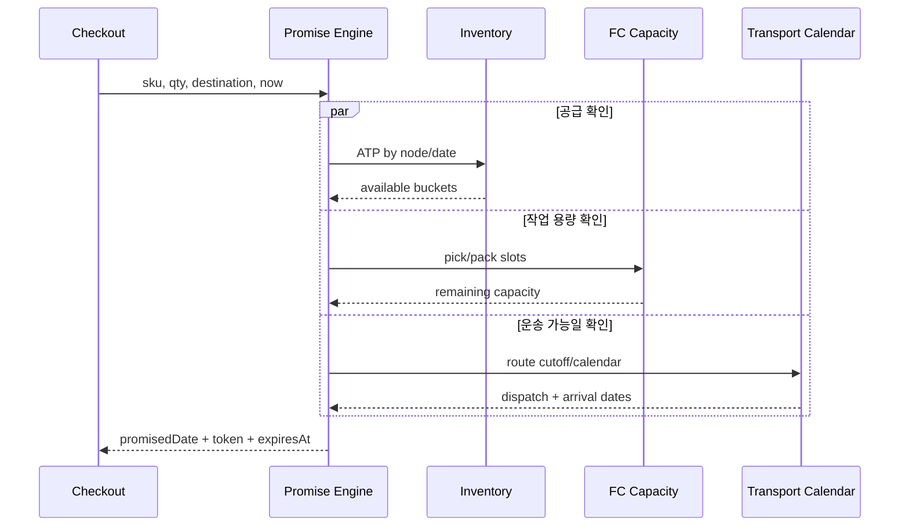

## 1. 약속 가능한 수량과 생산 가능한 수량

`ATP(Available-to-Promise, 약속 가능 재고)`는 특정 시점까지 고객에게 아직 약속하지 않은 공급량이다. 단순화하면 다음처럼 계산한다.

```text
ATP(t) = 현재 가용 재고
       + t까지 확정된 입고
       - 기존 주문 할당·예약
       - 안전재고
```

`CTP(Capable-to-Promise, 약속 이행 가능량)`는 여기에 피킹·패킹·생산·도크·운송 용량을 더한다. 재고가 100개여도 당일 피킹 잔여가 20건이면 오늘 약속 가능한 수량은 20개일 수 있다.

| 입력 | 대표 질문 | 실패 시 증상 |
|---|---|---|
| 재고·입고 | 어느 노드에 언제 가용해지는가? | Oversell, 불필요한 분할 출고 |
| FC 작업 용량 | 컷오프 전 피킹·패킹 가능한가? | 재고는 있는데 출고 지연 |
| 운송 캘린더 | 공휴일·노선·집하 마감은 언제인가? | 약속일 체계적 오차 |
| 주문 정책 | 합배송, 부분 출고, 우선 고객 규칙은? | 비용 증가, 일관되지 않은 UX |



## 2. 계산은 날짜가 아니라 시간대가 있는 구간이다

컷오프가 “오늘 14시”라면 창고 현지 시간대, 주문 접수 시각, 결제 완료 시각을 구분해야 한다. 운송 리드타임도 단순 `+1일`이 아니라 집하 가능일→간선 출발→도착 권역 배송 가능일의 캘린더 연산이다.

```kotlin
data class PromiseToken(
    val orderDraftId: String,
    val nodeId: String,
    val inventoryVersion: Long,
    val capacityBucket: String,
    val promisedAt: java.time.Instant,
    val expiresAt: java.time.Instant,
)
```

조회 단계에서 만든 약속은 짧은 TTL의 Promise Token으로 고정한다. 주문 확정 시 재고 버전과 용량 버킷을 원자적으로 재검증하고, 실패하면 더 늦은 날짜를 조용히 확정하지 말고 고객에게 변경을 알린다.

> **실무 함정** — ATP 조회와 주문 예약 사이의 시간차를 무시하면 여러 고객에게 같은 마지막 재고를 약속한다. “조회 결과 캐시”와 “재고 예약”은 같은 보장이 아니다.

## 3. 정확도 운영

약속 엔진의 핵심 지표는 빠른 응답뿐 아니라 `Promise Accuracy(약속 정확도)`다. 약속일 이내 배송률, 약속 변경률, 노드 재할당률, 컷오프 직전 오차를 권역·창고·운송사별로 분해한다. 보수적인 버퍼는 정확도를 높이지만 전환율을 낮추므로, 변동성이 큰 구간에만 동적으로 적용한다.

> **면접 포인트** — Promise는 조회 API가 아니라 제한된 재고·작업·운송 용량을 시간 버킷별로 예약하는 분산 의사결정이다. 계산 일관성과 고객에게 보여준 약속의 추적 가능성을 함께 설계해야 한다.
