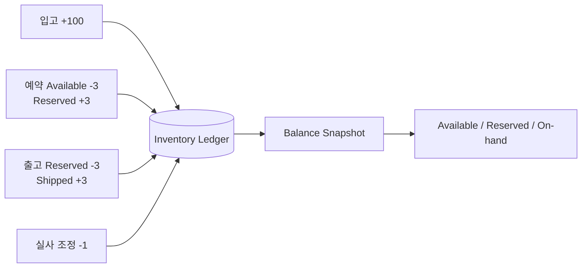

## 1. 잔액보다 변화를 먼저 저장한다

`inventory.quantity = 42`만 저장하면 왜 42가 됐는지 복원하기 어렵다. 재고 원장은 입고, 예약, 출고, 이동, 조정이라는 변화의 원인을 불변 Entry로 남기고 현재 잔액을 그 결과로 계산한다.



| 모델 | 장점 | 위험·보완 |
|---|---|---|
| 잔액 직접 갱신 | 조회·구현 단순 | 원인 추적과 복구 어려움 |
| 단일 Entry 원장 | 변화 이력 보존 | 상대 계정 누락 가능 |
| 이중기입 원장 | 이동의 합계 불변식 검증 | Entry 수와 모델 복잡도 증가 |
| 원장+Snapshot | 빠른 조회와 감사성 결합 | Snapshot 기준점 관리 필요 |

## 2. 이동은 합계가 0이어야 한다

창고 간 이동이나 상태 간 전환은 같은 Transaction ID 아래 Debit/Credit Entry로 기록한다. 수량 단위의 부호 합계가 0이라는 불변식을 커밋 전에 검사하면 한쪽만 반영되는 오류를 차단할 수 있다.

```sql
CREATE TABLE inventory_ledger (
    entry_id UUID PRIMARY KEY,
    transaction_id UUID NOT NULL,
    sku_id UUID NOT NULL,
    location_id UUID NOT NULL,
    bucket VARCHAR(30) NOT NULL,
    quantity_delta NUMERIC(18, 3) NOT NULL,
    reason VARCHAR(40) NOT NULL,
    idempotency_key VARCHAR(120) NOT NULL UNIQUE,
    occurred_at TIMESTAMPTZ NOT NULL
);
```

예약은 `AVAILABLE -N`, `RESERVED +N`, 출고는 `RESERVED -N`, `SHIPPED +N`처럼 상태 버킷 사이의 이동으로 표현한다. 실제 총 On-hand가 줄어드는 폐기·손실도 명시적인 조정 상대 계정을 둔다.

> **실무 함정** — 과거 Entry를 UPDATE/DELETE하면 이미 생성한 정산·감사 결과와 불일치한다. 오류는 원 Entry를 참조하는 반대 Entry와 올바른 재기입으로 수정한다.

## 3. Snapshot과 대사

Snapshot에는 `(sku, location, bucket)` 잔액과 마지막 반영 순서 또는 Entry ID를 함께 저장한다. 조회는 Snapshot 이후 Entry만 합산한다. 주기적 대사는 원장 합계, Snapshot, 운영 Projection, 실물 실사를 비교하고 차이는 원인 코드가 있는 조정 Entry로 남긴다.

> **면접 포인트** — Event Sourcing 전체를 도입하지 않아도 재고처럼 감사성이 중요한 수량에는 불변 원장과 Projection을 분리할 수 있다. 핵심은 멱등 키와 합계 불변식이다.
