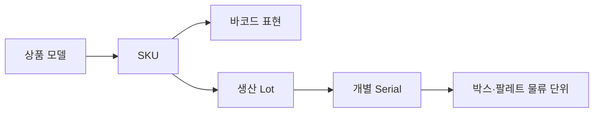

## 1. 식별자는 질문에 답한다

SKU는 판매 가능한 품목 구분, 바코드는 스캔 가능한 표현, 로트는 함께 생산된 묶음, 시리얼은 개체 하나를 식별한다. 박스와 팔레트에는 별도의 물류 단위 ID를 부여하고 포함 관계를 이력으로 남긴다.



| 식별자 | 범위 | 대표 용도 |
|---|---|---|
| SKU | 상품 옵션 | 가격·재고 정책 |
| 바코드 | 스캔 표현 | 현장 입력·외부 표준 연결 |
| Lot | 생산 묶음 | 유통기한·회수 |
| Serial | 개별 제품 | 보증·위변조·정밀 추적 |

```text
scan -> barcode_mapping(at event_time) -> sku
handling_unit -> contains(child_unit_or_serial, valid_from, valid_to)
```

> **실무 함정** — 바코드를 SKU의 영구 기본 키로 쓰면 공급사 변경, 재포장, 코드 재사용 때 과거 스캔의 의미가 바뀐다. 유효 기간을 가진 매핑을 둔다.

## 2. 추적성과 비용

정밀도가 높을수록 모든 이동에서 더 많은 스캔과 예외 처리가 필요하다. 규제·회수·고가품 요구에 따라 Lot 또는 Serial 수준을 선택하고 누락 스캔 보정도 감사 이력으로 남긴다.

> **면접 포인트** — 식별 체계는 코드 형식 문제가 아니라 과거 시점의 “무엇이 어디에 있었나”를 재구성하는 계보 문제다.
