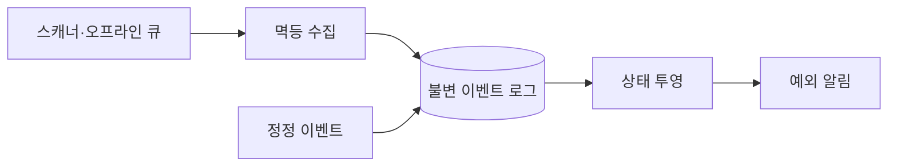

## 1. 원본과 현재 상태를 분리한다

단말은 안정적인 Event ID, 장치 시각, 수집 시각, 작업자와 위치를 보낸다. 원본 이벤트는 추가만 하고 현재 배송 상태는 규칙에 따라 다시 만들 수 있는 투영으로 관리한다.



| 이상 | 판별 단서 | 처리 |
|---|---|---|
| 중복 | 동일 Event ID | 한 번만 반영 |
| 역전 | 업무 단계·장치/수집 시각 | 보류 후 재정렬 |
| 누락 | 허용 상태 전이 위반 | 보정 작업 생성 |
| 오스캔 | 관리자 승인 | 취소·대체 이벤트 추가 |

```json
{"eventId":"device-7:8841","shipmentId":"S1","type":"LOADED","deviceAt":"...","ingestedAt":"..."}
```

> **운영 원칙** — 장치 시각만 신뢰하지 않는다. 시간대 오류와 시계 보정이 있으므로 업무 순서, 시설 이동 가능 시간, 수집 시각을 함께 사용한다.

## 2. 재처리 안전성

투영은 Event ID와 버전을 기록해 멱등하게 갱신한다. 규칙 변경 시 특정 화물 범위만 Shadow 투영으로 재생하고 결과 차이를 확인한 뒤 교체한다.

> **면접 포인트** — 이상 이벤트를 억지로 정상 순서에 끼워 넣기보다 원본 보존, 예외 큐, 승인, 재투영의 감사 가능한 흐름을 설계한다.
