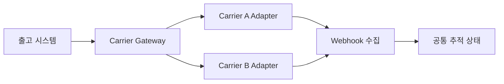

## 1. 내부 계약을 안정시킨다

주문 시스템은 운송사별 필드와 상태를 직접 알지 않는다. Gateway가 주소, 서비스 등급, 라벨, 취소, 추적을 공통 명령으로 받고 Adapter가 외부 계약으로 변환한다.



| 경계 | 핵심 장치 | 목적 |
|---|---|---|
| 라벨 요청 | 내부 멱등 키·외부 참조 | 중복 송장 방지 |
| 상태 변환 | 원본+공통 상태 동시 저장 | 정보 손실 추적 |
| Webhook | 서명·중복 제거·Inbox | 위조·재전송 대응 |
| 정산 | 청구서와 예상 운임 대사 | 과금 오류 탐지 |

```text
internal_status = map(carrier, carrier_status)
store carrier_payload, mapping_version, occurred_at, received_at
```

> **실무 함정** — Timeout 직후 새 요청 번호로 재시도하면 송장이 둘 생길 수 있다. 동일 참조로 조회하거나 결과 미상 상태를 운영 큐로 보낸다.

## 2. 격리와 전환

운송사별 Rate Limit, Circuit Breaker, 자격 증명과 지표를 분리한다. 장애 시 서비스 가능 지역과 마감 시간까지 고려해 대체 운송사를 고르며 이미 발급한 라벨의 취소 가능성을 확인한다.

> **면접 포인트** — Adapter 패턴에서 멈추지 말고 결과 미상, 상태 대사, 계약 버전, 운임 정산까지 수명주기를 닫는다.
