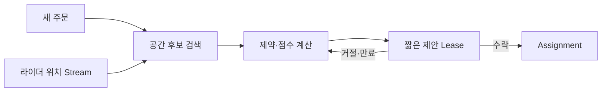

## 1. 빠른 후보와 정교한 점수를 분리한다

실제 기업 구현을 단정하지 않고 실시간 배차 문제를 모델링한다. 위치 Cell로 가까운 후보를 빠르게 줄인 뒤 도착 예상, 적재 여유, 약속 위반 위험, 이동 방향을 점수화한다.



| 단계 | 지연 목표 | 정확성 요구 |
|---|---|---|
| 후보 검색 | 매우 짧음 | 일부 여유 있는 Recall |
| ETA·점수 | 짧음 | 최신 도로·준비 시간 반영 |
| 제안 | 제한 시간 | 한 주문의 단일 확정 |
| 재배차 | 이벤트 기반 | 취소 비용·공정성 고려 |

```text
score = pickup_eta + delivery_lateness_penalty + detour_cost + fairness_penalty
assignment succeeds only if order_version and rider_capacity still match
```

> **실무 함정** — 위치 업데이트마다 전역 최적화를 다시 하면 계산과 배차 흔들림이 커진다. 의미 있는 이벤트와 재최적화 최소 간격을 둔다.

## 2. 실패 처리와 지표

제안은 만료되는 Lease로 만들고 확정은 주문·라이더 버전 조건부 갱신으로 처리한다. 배차 시간뿐 아니라 약속 위반, 취소, 공차 거리, 라이더별 기회 편차를 함께 본다.

> **면접 포인트** — 지리 검색, 최적화 알고리즘, 동시성 제어, 사람에게 미치는 품질 지표를 한 흐름으로 연결한다.
