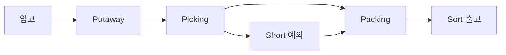

## 1. 흐름과 대기열을 그린다

처리량은 가장 느린 공정에 제한되고, 병목 앞 WIP가 증가한다. 평균 생산성만 보지 말고 주문 유형과 시간대별 도착률, 처리율, 대기 시간, 재작업률을 함께 본다.



| 관찰 | 가능한 원인 | 첫 대응 |
|---|---|---|
| Pick 앞 WIP 증가 | Replenishment·동선 병목 | 재고 보충·Zone 균형 |
| Pack 재작업 증가 | 상품·라벨 오류 | 원인 코드 분리 |
| 출차 Miss | Wave 종료와 Cutoff 불일치 | 우선순위·Buffer 조정 |
| Short 증가 | 장부·실물 불일치 | 예외 격리·Cycle Count |

```text
WIP ≈ throughput × flow_time
capacity_by_hour = workers × units_per_worker_hour × availability
```

> **면접 전략** — 인력을 늘리기 전에 도착률과 처리율을 같은 시간축으로 비교한다. 병목이 아닌 공정 증원은 WIP만 옮길 수 있다.

## 2. 예외를 제품으로 본다

Short, 파손, 라벨 실패는 수작업으로 숨기지 말고 사유·소유자·SLA가 있는 큐로 만든다. 정상 주문의 흐름을 보호하면서 복구 후 어느 단계로 합류할지 정의한다.

> **면접 포인트** — 알고리즘뿐 아니라 현장 Scan, 작업자 화면, Cutoff, 장애 때의 수동 운영까지 답변에 포함한다.
