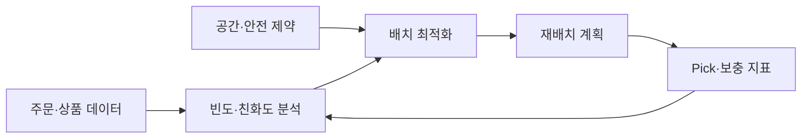

## 1. 이동 거리만 줄이는 문제가 아니다

ABC 분석은 출고 빈도를 빠르게 분류하지만 크기, 중량, 위험물, 온도대와 작업 인체공학 제약을 함께 지켜야 한다. Fast Mover 집중은 짧은 동선 대신 통로 혼잡을 만들 수 있다.



| 입력 | 목적 | 놓치기 쉬운 비용 |
|---|---|---|
| 출고 빈도 | Pick 이동 감소 | Hot Aisle 혼잡 |
| 동시 주문 | 함께 Pick | 주문 Mix 변화 |
| Case 크기·중량 | 공간·안전 | 취급 장비 제약 |
| 보충 단위 | Pick Face 유지 | 보충 인력·충돌 |

```text
net_gain = pick_travel_saved - replenishment_cost - relocation_cost - congestion_penalty
```

> **운영 함정** — 과거 평균만으로 위치를 바꾸면 행사 직후 다시 옮길 수 있다. 예측 신뢰도와 최소 유지 기간을 둔다.

## 2. 작은 구역부터 실험한다

Zone 단위로 후보 배치를 적용하고 주문당 이동 거리, Pick 시간, 보충 횟수, 혼잡과 오류율을 전후 비교한다. 시스템 추천과 현장 예외 사유도 함께 수집한다.

> **면접 포인트** — 최적해보다 제약, 재배치 비용, 수요 변화에 대한 주기적 재계산을 설명한다.
