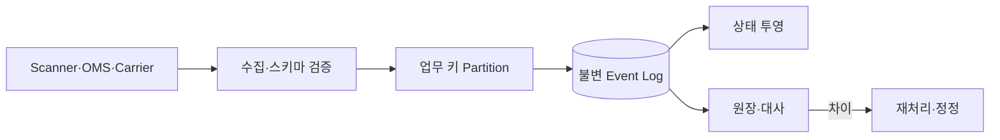

## 1. 업무 단위별 질서를 만든다

전역 순서는 불필요하고 비싸다. Shipment, Inventory Item, Order처럼 상태 전이가 직렬화되어야 하는 키를 정하고 같은 키를 같은 Partition으로 보낸다. Producer Sequence와 Event ID로 재전송을 판별한다.



| 압박 질문 | 답변의 핵심 | 위험한 답변 |
|---|---|---|
| 중복이면 | Inbox·업무 멱등 키 | Broker가 제거한다 |
| 순서가 바뀌면 | 전이 검증·보류·Version | Timestamp 정렬만 한다 |
| 소비가 실패하면 | Retry Budget·격리·재처리 | 무한 재시도 |
| 투영이 틀리면 | 원본 재생·대사 | 수동 UPDATE |

```text
partition_key = business_entity_id
apply only when event.version == projection.version + 1
```

> **면접 전략** — 전달 보장 이름보다 중복·누락·역순 예시 하나를 끝까지 추적해 어느 저장소가 진실의 원본인지 밝힌다.

## 2. 현장 단절을 포함한다

오프라인 단말은 안정적인 로컬 ID와 큐를 사용하고 복구 후 Batch 전송한다. 지연 허용 시간을 넘은 이벤트는 자동 적용보다 예외 큐와 대사로 보낸다.

> **면접 포인트** — 파이프라인 처리량뿐 아니라 실제 배송 상태의 정확성과 감사 가능성을 함께 설계한다.
