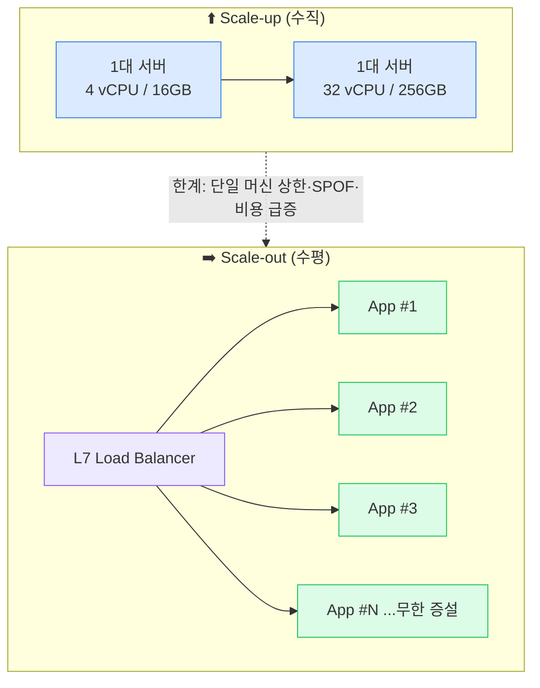
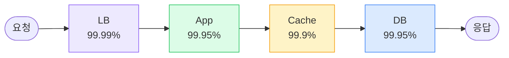
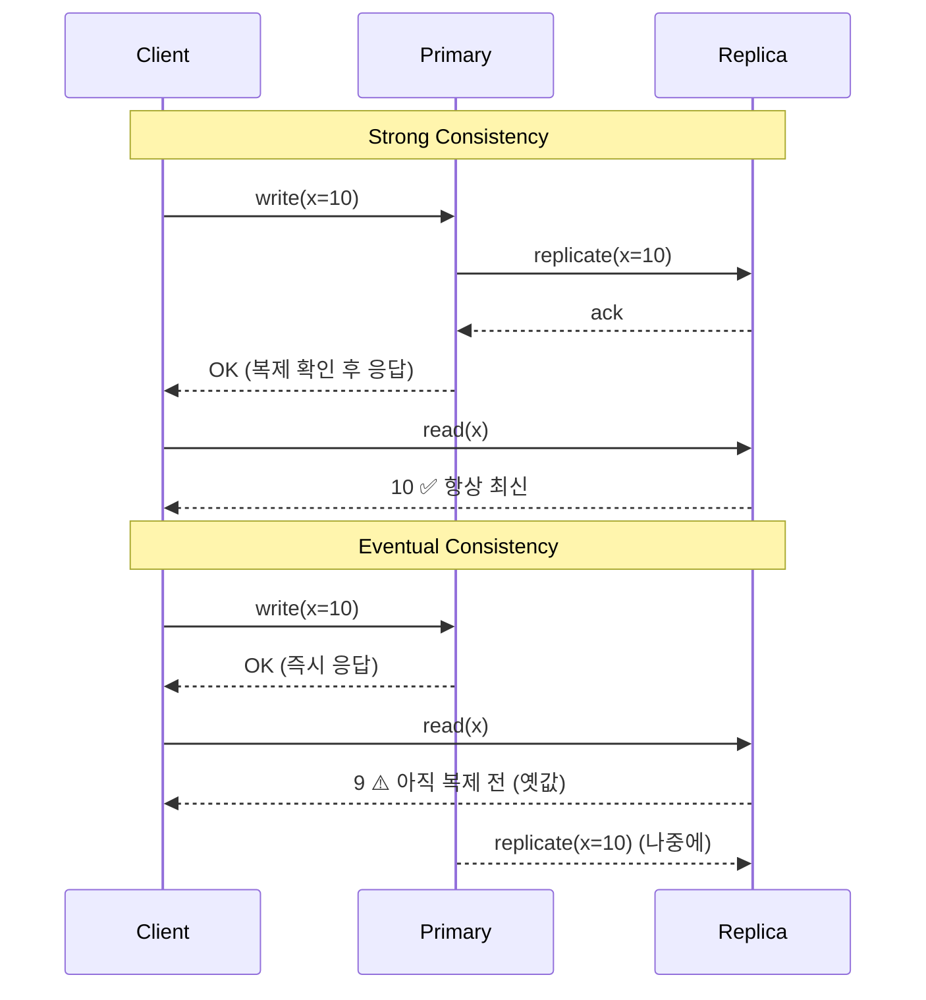
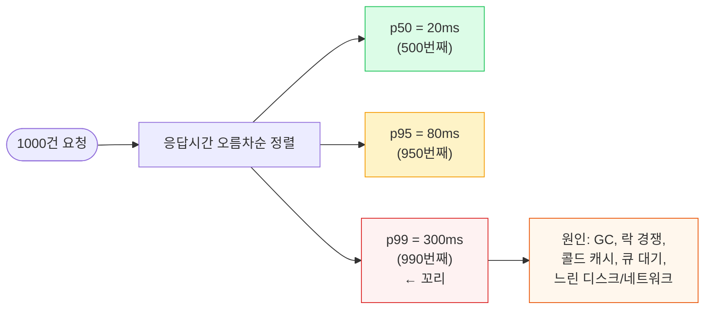
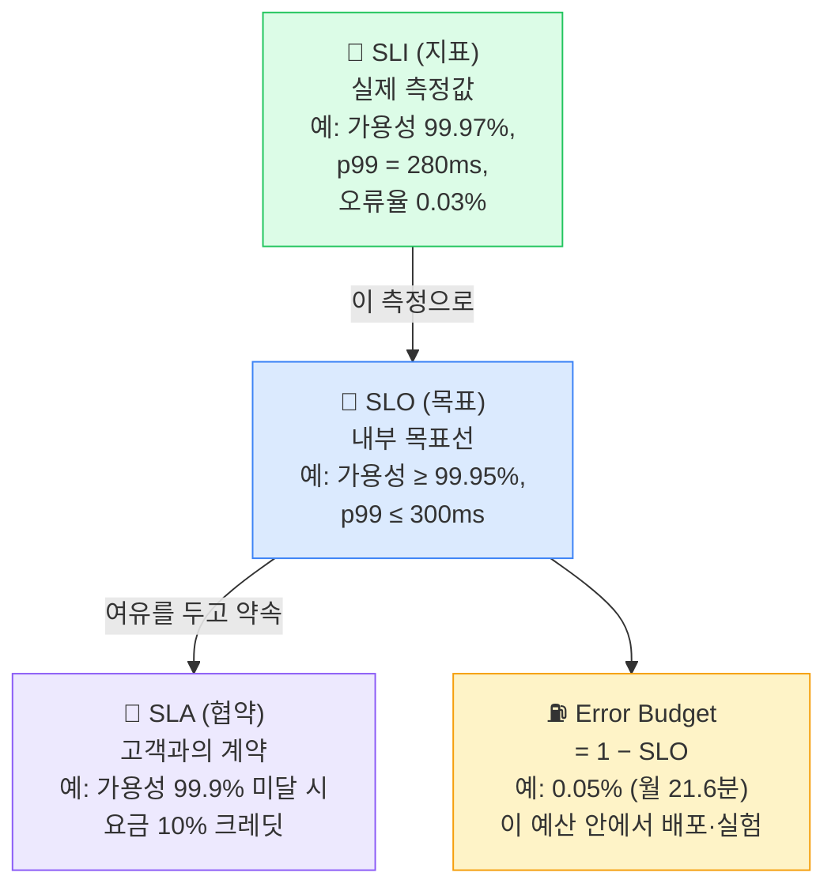

## 1. Scalability (확장성) — 수직 vs 수평

> **정의** — 트래픽·데이터가 늘어날 때, *비례하는 자원 추가만으로* 성능을 유지할 수 있는 능력

**Scale-up(수직 확장, Vertical Scaling)**은 한 대의 머신을 더 강하게(CPU·RAM·디스크 증설) 만드는 것이고, **Scale-out(수평 확장, Horizontal Scaling)**은 같은 역할의 머신 대수를 늘리는 것이다. 대규모 시스템 설계의 기본 전제는 "수평 확장 가능하게 설계한다"이며, 그 핵심 조건이 **Stateless(무상태) 설계**다.

*수직 확장은 빠르지만 천장이 낮고 SPOF(Single Point of Failure, 단일 장애점)가 된다. 수평 확장은 Stateless가 전제.*

### 왜 Stateless 가 수평 확장의 핵심인가

세션·장바구니 같은 상태를 **App 서버의 메모리에 들고 있으면**, Load Balancer가 다음 요청을 다른 서버로 보냈을 때 상태가 사라진다(Sticky session으로 막으면 특정 서버에 트래픽이 쏠려 확장성이 깨짐). 그래서 상태는 외부(Redis 세션 스토어, DB)로 빼고 App은 "들어온 요청을 어느 서버가 처리해도 동일한 결과"가 나오도록 만든다. Netflix·쿠팡 같은 곳의 API 서버 계층이 전형적인 Stateless tier다.

| 관점 | Scale-up (수직) | Scale-out (수평) |
| --- | --- | --- |
| 한계 | 단일 머신 최대 사양(천장 존재) | 이론상 무제한(조율 복잡도만 증가) |
| 가용성 | 그 머신이 죽으면 전체 다운(SPOF) | 일부 노드 죽어도 나머지가 서비스 |
| 비용 곡선 | 고사양일수록 비선형 급증 | 상용 머신 다수 → 선형에 가까움 |
| 적합 | RDBMS 마스터, 강한 정합성 필요한 단일 노드 | Stateless API, 캐시, 큐 컨슈머 |
| 난점 | 다운타임 동반 증설 | 데이터 일관성·분산 트랜잭션·샤딩 |

> **💡 팁 — 현실은 하이브리드**
>
> App 계층은 수평, DB는 마스터를 한 번 수직으로 키운 뒤(읽기는 Read Replica로 수평) 한계가 오면 샤딩으로 수평 전환하는 게 일반적 순서다. "처음부터 샤딩"은 과설계(Over-engineering).

> **🎯 면접 포인트**
>
> "트래픽 10배를 어떻게 감당하죠?" → **"서버를 키우면 됩니다"** 는 약하다. *"App은 Stateless라 LB 뒤에서 오토스케일, 상태는 Redis로 분리, DB는 Read Replica로 읽기 분산하다 한계 시 샤딩"* 까지 한 문장으로 나와야 시니어 눈높이. 🔥(Deep-dive)

## 2. Availability · Reliability · Durability 구분

이 셋은 면접에서 가장 자주 **혼용**되는 단어다. 정확히 분리해야 한다.

| 개념 | 질문 | 측정 | 예시 |
| --- | --- | --- | --- |
| **Availability(가용성)** | "지금 요청하면 응답하나?" | Uptime 비율 (%, 9의 개수) | 결제 API가 99.99% 시간 동안 정상 응답 |
| **Reliability(신뢰성)** | "오랜 기간 올바르게, 고장 없이 동작하나?" | MTBF(Mean Time Between Failures), 오류율 | 한 달간 데이터 손상·오작동 없이 정확한 결과 |
| **Durability(내구성)** | "한 번 저장한 데이터가 안 사라지나?" | 데이터 손실 확률 (예: 11 nines) | S3 객체 내구성 99.999999999%(11 nines) |

### 한 줄 직관

- **Availability**: 문을 열어 두고 있는가 (응답 가능성)
- **Reliability**: 문을 열어 두되 *매번 제대로* 동작하는가 (정확성·무고장)
- **Durability**: 맡긴 물건을 *절대 잃어버리지 않는가* (영속성)

가용한데 신뢰성이 낮을 수 있다(서버는 200을 주는데 잘못된 잔액을 반환). 신뢰성 높은 단일 서버라도 가용성은 낮을 수 있다(한 대뿐이라 죽으면 끝). Amazon S3는 가용성(99.9% SLA)과 내구성(11 nines)을 **분리해서** 명시하는 대표 사례 — 잠깐 못 읽을 수는 있어도(가용성) 데이터 자체는 거의 절대 안 잃는다(내구성).

> **🎯 면접 함정 #1 — 가용성과 신뢰성 혼동**
>
> "가용성 5 nines로 만들겠습니다"라고만 하고 **왜·어떻게(Multi-AZ, Failover, Health check, Circuit breaker)** 가 없으면 감점. 또 "가용성 높으면 데이터 안전하죠?"는 **틀린 등치** — 그건 Durability의 영역. 🔥(Deep-dive)

## 3. 가용성 "9의 개수"와 다운타임

가용성은 보통 "나인(nines)"으로 말한다. 면접에서 이 표의 핵심 줄(특히 99.9%와 99.99%)은 **외워 두는 게 정석**이다. 계산식은 단순하다: `연간 다운타임 = 365.25일 × (1 − 가용성)`.

| 가용성 | 호칭 | 연간 다운타임 | 월간 다운타임 | 주간 다운타임 |
| --- | --- | --- | --- | --- |
| **90%** | one nine | 36.5 일 | 72 시간 | 16.8 시간 |
| **99%** | two nines | 3.65 일 | 7.2 시간 | 1.68 시간 |
| **99.9%** | three nines | 8.76 시간 | 43.8 분 | 10.1 분 |
| **99.99%** | four nines | 52.6 분 | 4.38 분 | 1.01 분 |
| **99.999%** | five nines | 5.26 분 | 26.3 초 | 6.05 초 |

> **💡 암산 트릭**
>
> "3 nines = 약 9시간/년, 4 nines = 약 1시간/년(정확히 52.6분), 5 nines = 약 5분/년." 9를 하나 더 붙일 때마다 다운타임은 **1/10** 로 준다. 99.999%(5분/년)는 사람이 알아채고 수동 대응하기엔 너무 짧아 **완전 자동 Failover** 가 필수다.

### 컴포넌트 직렬 연결: 가용성은 곱해진다

여러 컴포넌트를 **직렬(series)**로 의존하면 전체 가용성은 각 가용성의 *곱*이다. 의존 컴포넌트가 많을수록 전체 가용성은 떨어진다.

*직렬 의존 전체 가용성 = 0.9999 × 0.9995 × 0.999 × 0.9995 ≈ **0.9979 (99.79%)** → 연 약 18.4시간 다운. 각자는 3~4 nines인데 합치면 떨어진다.*

그래서 가용성을 높이려면 **중요 컴포넌트를 병렬(redundant)로 이중화**한다. 병렬 두 대(각 99.9%)의 가용성은 `1 − (1 − 0.999)² = 99.9999%`로 급상승한다. 이것이 Multi-AZ·Active-Active 구성의 수학적 근거다.

> **⚠️ 실무 함정**
>
> "각 서비스 99.99%니까 전체도 99.99%"는 틀림 — 직렬이면 곱해져 **더 낮아진다** . 마이크로서비스가 호출 체인을 길게 만들수록 이 효과가 누적된다. 그래서 **Circuit Breaker(회로 차단기)** · **Graceful degradation(우아한 성능 저하)** 으로 한 컴포넌트 장애가 전체를 끌어내리지 않게 격리한다.

## 4. Consistency (일관성) — Strong vs Eventual

**Strong Consistency(강한 일관성)**는 "쓰기가 끝난 직후 모든 읽기가 그 최신 값을 본다". **Eventual Consistency(최종 일관성)**는 "쓰기 직후엔 노드마다 다를 수 있지만, 충분한 시간이 지나면 모두 같아진다". 분산 시스템에선 `CAP(Consistency, Availability, Partition tolerance) 정리`상 네트워크 분할 시 일관성과 가용성 중 하나를 양보해야 하므로, 많은 대규모 시스템이 가용성을 위해 최종 일관성을 택한다.

*Strong은 복제 확인 후 응답(지연↑·정합성↑), Eventual은 즉시 응답(지연↓·일시적 stale 허용).*

### 어디에 무엇을 쓰나 — Trade-off

- **강한 일관성이 필수**: 결제 잔액, 재고 차감(Oversell 방지), 좌석/쿠폰 발급. 토스·쿠팡의 결제·재고 코어는 여기에 속한다.
- **최종 일관성 허용**: 좋아요 수, 조회수, 라스트마일 `TrackingEvent` 전파, 타임라인 피드. "배송 상태가 2~3초 늦게 갱신"되어도 비즈니스적으로 괜찮다.
- **읽기 의미 보장**: `Read-your-writes(자기 쓰기 읽기)`(내가 쓴 건 내가 즉시 본다), `Monotonic read(단조 읽기)`(한 번 본 최신값보다 과거로 안 돌아간다) — 최종 일관성 위에서도 UX를 지키는 절충안.

> **💡 물류 맥락**
>
> 라스트마일 추적 API는 **최종 일관성** 이 합리적이다. 기사 스캔이 Kafka로 Fan-out(팬아웃)되어 읽기 모델에 반영되기까지 수백 ms~수 초 지연은 허용. 반대로 같은 시스템의 **재고 예약(Reserve)** 은 강한 일관성(조건부 UPDATE/락)으로 Oversell을 막아야 한다 — *한 도메인 안에서도 데이터별로 일관성 수준이 다르다.*

## 5. Latency vs Throughput · Tail Latency

| 개념 | 정의 | 단위 | 비유 |
| --- | --- | --- | --- |
| **Latency(지연)** | 요청 1건이 응답까지 걸린 시간 | ms | 한 대의 차가 톨게이트 통과하는 시간 |
| **Throughput(처리량)** | 단위 시간당 처리한 요청 수 | QPS / RPS | 1분에 톨게이트 통과한 차량 대수 |

둘은 독립적이다. 배치를 키우면 처리량은 오르지만 개별 지연은 늘 수 있다(Trade-off). **QPS(Queries Per Second, 초당 쿼리 수)**가 시스템 용량의 척도라면, 지연은 사용자 체감의 척도다.

### 왜 평균(p50)이 아니라 p99를 봐야 하나

지연은 분포다. `p50(중앙값)`·`p95`·`p99`는 "요청의 50%/95%/99%가 이 시간 안에 끝난다"는 분위수(percentile)다. **Tail latency(꼬리 지연)** = p99/p99.9 같은 꼬리 구간이 사용자 경험과 SLO를 좌우한다.

*평균만 보면 p99의 300ms를 놓친다. 한 페이지가 100개 마이크로서비스를 호출하면 그중 하나가 p99에 걸릴 확률이 커져 **전체 응답이 꼬리에 끌려간다(Tail amplification)**.*

> **🎯 면접 함정 #2 — 평균 지연만 보고 p99 무시**
>
> "평균 응답 30ms입니다"는 거의 의미 없다. 면접관은 **"p99는요? Tail latency 원인과 대응은?"** 을 노린다. 답: 원인은 GC·락 경쟁·콜드 캐시·큐잉·느린 노드. 대응은 *Timeout + Retry(주의: Retry storm), Hedged request(여분 요청), 캐시 워밍, 백프레셔(Back-pressure), Load shedding* . 🔥(Deep-dive)

> **💡 실제 사례 — Amazon**
>
> Amazon은 100ms 지연 증가가 매출 1% 감소와 연결된다고 밝힌 바 있고, 내부적으로 평균이 아닌 **p99.9** 기준으로 서비스 목표를 잡는다(Dynamo 논문). "평균은 거짓말한다"가 업계 상식.

## 6. SLA / SLO / SLI 구분

세 단어는 계층 관계다. **SLI(Service Level Indicator, 서비스 수준 지표)**로 측정하고 → **SLO(Service Level Objective, 서비스 수준 목표)**로 내부 목표를 세우고 → **SLA(Service Level Agreement, 서비스 수준 협약)**로 고객과 계약(위반 시 보상)한다.

*SLI로 재고 → SLO로 목표 → SLA로 약속. SLA는 보통 SLO보다 **느슨하게** 잡는다(버퍼).*

| 항목 | 의미 | 대상 | 위반 결과 | 예 |
| --- | --- | --- | --- | --- |
| **SLI** | 측정 지표(사실) | 모니터링/관측성 | — | 이번 달 결제 성공률 99.97% |
| **SLO** | 내부 목표 | 엔지니어링 팀 | Error Budget 소진 → 배포 동결 | 결제 API 가용성 ≥ 99.95%, p99 ≤ 300ms |
| **SLA** | 고객 계약 | 법무/영업/고객 | 요금 크레딧·배상 | 월 가용성 99.9% 미달 시 사용료 10% 환급 |

### 실제 예시

- **AWS**: EC2 인스턴스 SLA 99.99%, S3 가용성 SLA 99.9%(미달 시 service credit). 이건 *고객 계약(SLA)*이며, 내부 SLO는 더 빡빡하다.
- **토스/쿠팡 결제** 같은 코어는 *SLO를 5 nines에 근접*하게 잡고(결제 실패는 곧 매출·신뢰 손실), 가맹점·셀러 대상 *SLA*는 그보다 느슨한 99.9~99.95%로 약속하는 식의 구조가 일반적이다. 핵심은 **SLO > SLA** 버퍼를 둬서 SLA 위반을 미리 방지하는 것.

> **💡 물류 맥락 — 라스트마일 추적 API의 SLO 예시**
>
> **SLI** : 추적 조회 성공률, 조회 p99 지연, *이벤트 전파 지연(스캔→조회 반영까지)* . **SLO** : 조회 가용성 ≥ 99.95%, 조회 p99 ≤ 200ms, 전파 지연 p95 ≤ 3초. **Error Budget** : 0.05%(월 약 21.6분). 이 예산이 남아 있으면 신규 배포·실험을 허용하고, 다 쓰면 안정화에 집중 — 이것이 SRE(Site Reliability Engineering)의 의사결정 방식.

> **🎯 면접 포인트 — Error Budget**
>
> "SLO를 100%로 잡으면 되지 않나요?"는 함정 답. 100%는 **혁신 속도 0** (배포 자체가 위험)을 뜻한다. **Error Budget = 1 − SLO** 를 "허용된 실패 예산"으로 쓰는 사고가 핵심. 신뢰성과 배포 속도의 Trade-off를 수치로 관리한다고 말하면 시니어 인상. 🔥(Deep-dive)
